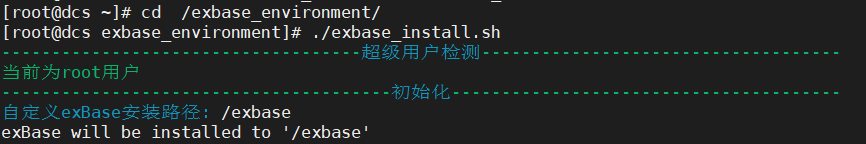
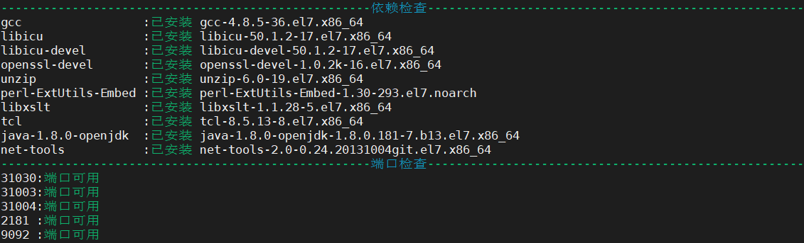
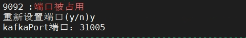
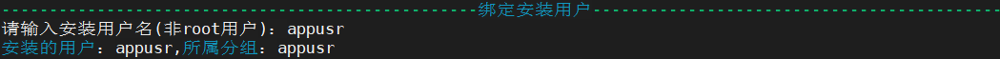
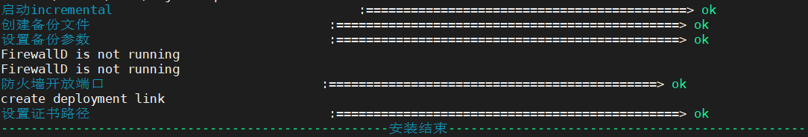
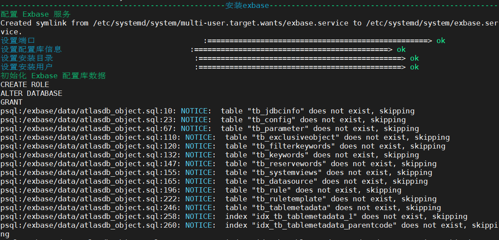
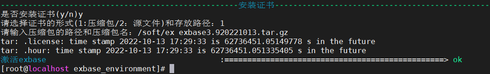
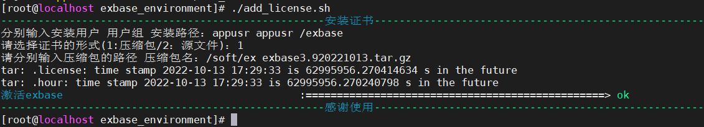
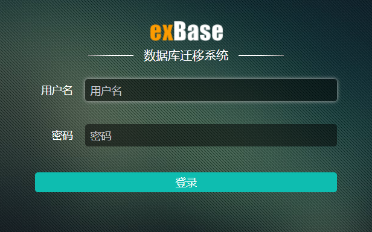

# 安装过程

## 前提条件

- 依赖包一定要安装完成，如漏装依赖包openssl-devel会导致exbase启动失败。
- 安装exBase必须使用root用户。

## 操作步骤

1、上传并解压安装包。

exBase安装包大小约400MB。将安装包上传，并解压到根目录下的/exbase_environment目录下。此处以exbase-3.11安装包为例。

```
unzip exbase-3.11_centos-7.x86_64.2022101312.zip -d /exbase_environment
```

2、授权。

为安装脚本文件授予可执行权限。

```
chmod +x /exbase_environment/exbase_install.sh
```

3、运行安装脚本。


切换到解压后的目录，并运行安装脚本。
```
cd  /exbase_environment/
./exbase_install.sh
```

运行安装脚本后，用户需指定安装目录的绝对路径，如图：

<div align="center"></div>

指定路径后会进行依赖检查和端口检测。

<div align="center"></div>

若是默认端口被占用，则需重新指定端口。

<div align="center"></div>


指定安装的用户，可以使用现有的非超级管理员用户(非root用户)，也可以创建用户和所属用户组。

<div align="center"></div>

4、安装完成，查看安装日志。

等待安装脚本运行结束，安装成功后显示如下信息。

<div align="center"></div>

查看安装日志的指令为：

```
cat /exbase_environment/exBase_install.log
```

安装成功的部分日志样例如图：

<div align="center"></div>

5、安装许可。

提供内存大小、线程数与网卡信息。把这些信息反馈给支持人员，制作licence。

证书的安装有两种方式。

- 已申请过证书。

安装结束后，若是已经申请使用证书，可以继续安装证书。

证书的形式可以是：1）压缩包 2）源文件。

<div align="left"></div>

安装证书后即可使用exBase。

- 也可在安装包所在目录下通过如下命令安装证书。

```
./add_license.sh
```

执行效果如图：

<div align="left"></div>

6、启动进程。

用户可以使用以下指令启动exBase进程。

```
systemctl start atlasdb	#启动配置库
systemctl start incremental	#启动incremental线程
systemctl start exbase	#启动exbase线程
```

更多关于exBase的启停、状态查询等指令，请参见[exBase的启停与状态查看](exBase的启停与状态查看.md)章节。

7、登录系统。

exBase数据库迁移系统网址为：https://<服务器ip>:31030。其中，31030为exBase默认端口号，请根据实际端口使用情况填写。

进入网址后显示界面如图：

<div align="center"></div>

支持的浏览器及版本：

- Chrome79及以上版本，64bit
-  Firefox53及以上3版本，64bit
-  QQ浏览器及10以上版本
-  其他主流浏览器的较新版本

 
