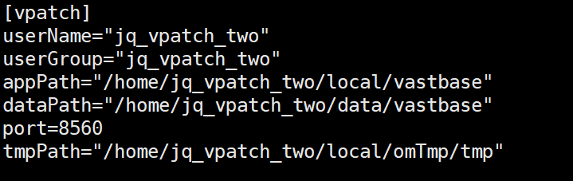
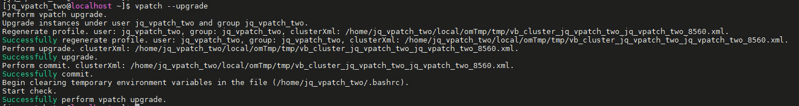
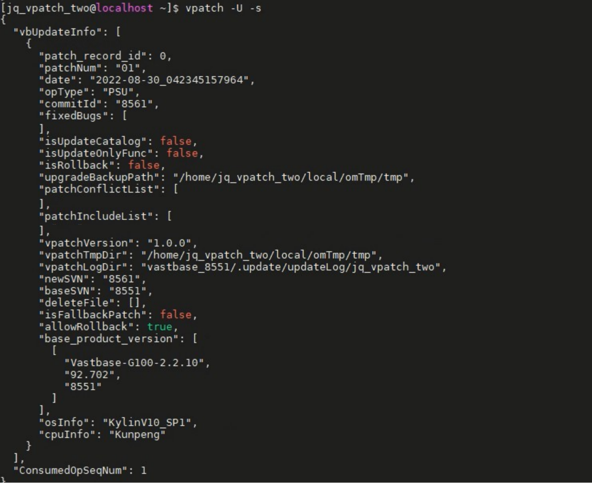
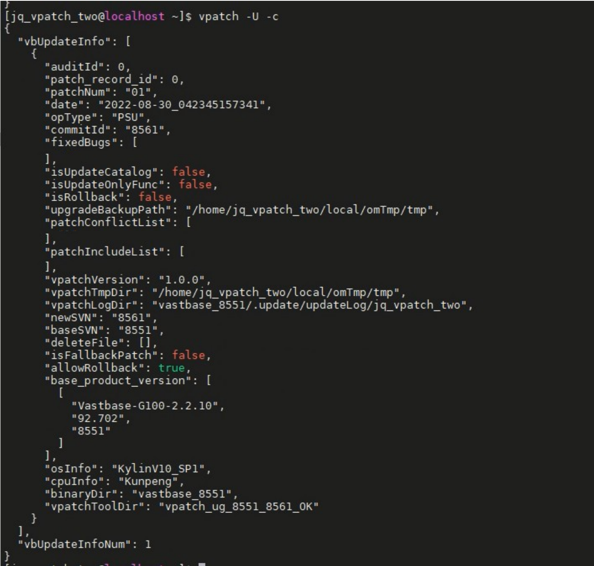
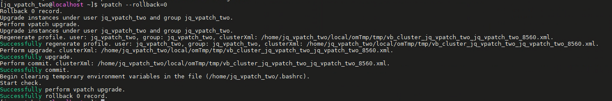
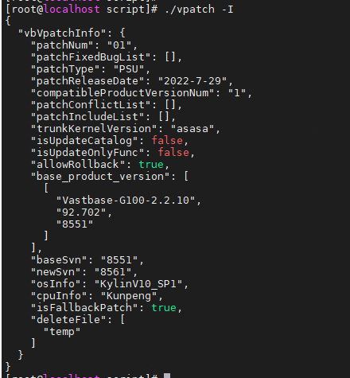

# 使用VPatch升级

**功能描述**

VPatch是用于Vastbase版本控制的工具可以实现在单机环境下的升级和回退操作，具体功能如下：

- 升级环境检查，补丁冲突检查等。
- PSU、PSR补丁的升级、回退及升级或回退失败时的还原。
- 升级过程中记录相关日志，步骤文件。
- 升级过程中管理备份文件。

**语法格式**

- 配置文件如下(ini格式)：

```
[vpatch]
userName=用户名user1
userGroup=用户组group1
appPath=产品软件目录
dataPath=集簇的绝对路径
port=端口
tmpPath=升级过程临时文件目录
```

- 执行升级。

```
vpatch --upgrade
```

- 执行回退，即回退掉升级记录中对应操作记录号（patch_record_id)所升级的补丁，操作记录号被记录在升级历史信息中。

```
vpatch --rollback=patch_record_id
```

- 执行连续回退。倒叙遍历升级历史信息，逐个回退升级补丁，直到回退了指定操作记录号的补丁为止。注意此处指定的升级操作记录号（patch_record_id)也在回退范围内。

```
vpatch --rollbackTo=patch_record_id
```

- 查看vpatch版本信息。

```
vpatch -V | --version
```

- 查看vpatch帮助信息。

```
vpatch -? | --help
```

- -I|--information：显示vpatch同目录下升级补丁的信息，在rollback时显示回退的升级补丁的信息，在rollback to时显示最后一个被回退的升级补丁的信息。

```
vpatch -I | --information
```

- -U|--upgradeInformation：显示升级历史信息，若补丁已被回退，则相关信息不在此处显示。此信息在用户需要指定回退时尤为重要。需要回退时可以参考升级历史信息中提供的升级操作号(patch_record_id)，及升级补丁的相关信息。

```
vpatch -U [-s] | --upgradeInformation [--simple]
```

​		完整显示升级历史信息。

```
vpatch -U [-s] | --upgradeInformation --complete
```

- 为vpatch工具设定参数(root用户执行)。

1、命令行直接指定参数。

```
vpatch --setparam -u 用户名 -g 用户组 -a 产品目录 -d 集簇目录 -p 端口号 -t 临时目录
```

2、给定ini配置文件。

```
vpatch --setparam -f ini配置文件绝对路径
```

- 对升级或回退补丁做基本检查(root用户执行)。

```
vpatch -C | --check [ --rollbackId=patch_record_id | --rollbacktoId=patch_record_id]
```

- 为升级或回退做准备工作(root用户执行)。

```
vpatch -P | --prepare [ --rollbackId=patch_record_id]|--rollbackToId=patch_record_id]
```

- 连续回退。

```
vpatch --rollbackTo=patch_record_id
```

**注意事项**

- 对于集群升级，需还原为单机模式进行升级，升级后重新部署集群。
- 升级时指定的端口号应避开日常使用的服务端口号，防止升级过程被外部干扰。
- 在升级前应关闭数据库服务。
- 不支持修改用户数据（vb_initdb初始化后并未包含的由用户操作产生的表）升级的场景。
- 不支持rollback 和rollback to命令回滚修改过数据字典的情况。
- 不支持多实例场景，多实例即为单一产品对应多个数据库集簇的情况。

**历史信息参数说明** <a id='历史信息'>

| **参数**                    | **说明**                                        |
| --------------------------- | ----------------------------------------------- |
| auditId                     |                                                 |
| vbVpatchInfo                | 供vpatch使用的信息列表。                        |
| patchNum                    | 补丁编号。                                      |
| patchFixedBugList           | 修补bug列表。                                   |
| patchType                   | 补丁类型。                                      |
| patchReleaseDate            | 补丁发布日期。                                  |
| compatibleProductVersionNum | 保留参数。                                      |
| patchConflicList            | 保留参数。                                      |
| patchIncludeList            | 保留参数。                                      |
| trunkKernelVersion          | 保留参数。                                      |
| isUpdateCatalog             | 是否修改系统表。                                |
| isUpdateOnlyFunc            | 修改系统表，但仅限于函数。                      |
| allowRollback               | 补丁是否允许回退，true可以回退，false不可回退。 |
| base_product_version        | 适配的基础版本。                                |
| baseSvn                     | 原始版本的SVN提交号                             |
| newSvn                      | 新版本的SVN提交号。                             |
| isFallbackPatch             | 用于升级还是回退的补丁，true升级，false回退。   |
| osInfo                      | 适用的操作系统信息。                            |
| cpuInfo                     | 适用的cpu信息。                                 |
| deleteFile                  | 此次升级删除的文件，包括数据库和om工具          |

**示例**

**示例1：**升级操作

1、解压升级包并进入目录。

```
cd /home/数据库用户/解压的升级包/VPatch/script
```

2、指定配置文件。

```
vpatch --setparam -f  /home/jq_vpatch_two/xxx.ini
```

配置文件参考如下：

<div align="left">    

3、root执行命令进行检查。

```
./vpatch -C
```

4、root执行命令进行用户权限检查。

```
./vpatch -P
```

5、数据库用户执行命令进行升级。

```
vpatch --upgrade
```

结果返回如下：

<div align="left">    

6、升级完成后信息检查。

- 简略显示升级历史信息，信息包括操作序列号、补丁编号、升级操作的日期和时间、操作类型、修复的bug列表、升级是否修改数据字典、是否已被回退、升级备份的目录。参数说明参考[表1 历史信息参数说明](#历史信息)

```
vpatch -U 或 vpatch -U -s
```

  结果反馈如下：

<div align="left">    

- 完整信息升级记录信息，信息包括操作序列号、补丁编号、升级操作的日期和时间、操作类型、修复的bug列表、升级是否修改数据字典、是否已被回退、升级备份的目录。

```
vpatch -U -c
```

<div align="left">    

- 显示升级过程，信息包含停止服务，启动服务操作，执行的每个脚本文件，操作数据库的相关命令，变更的设置参数，查看数据库升级日志。

```
cat $GAUSSHOME/.update/updatelog/jq_vpatch_two/gs_upgradectlxxx.log
```

**示例2：**回滚操作

1、root用户执行进行检查。

```
./vpatch -C --rollbackToId=0
```

2、停止数据库服务

3、root执行命令进行用户权限检查。

```
./vpatch -P --rollbackToId=0
```

4、切换数据库用户，指定配置文件。

```
vpatch --setparam -f  /home/jq_vpatch_two/xxx.ini
```

5、执行回滚。

```
vpatch --rollbackTo=0
```

结果返回如下：

<div align="left">    

**示例3：**显示vpatch同目录下升级补丁的信息。

```
./vpatch - I
```

<div align="left">    