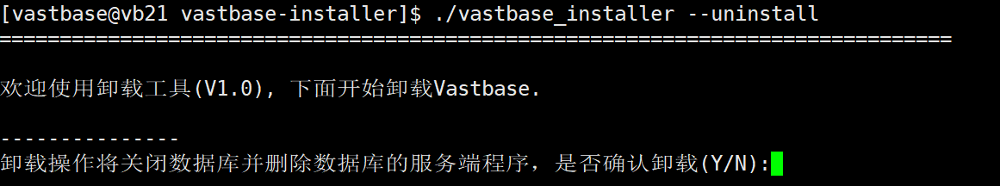

# 卸载数据库

**功能描述**

卸载Vastbase的过程包含卸载Vastbase和对Vastbase服务器的环境清理。

**注意事项**

需要使用数据库的操作系统用户，其他操作系统用户不允许执行卸载操作

**操作步骤**

1、以操作系统用户vastbase登录数据库节点。

```
su - vastbase
```

2、进入安装程序所在目录。

```
cd /soft/vb/vastbase-installer/
```

3、执行卸载命令。

```
./vastbase_installer --uninstall
```

4、如数据库正在运行会出现以下提示，选择Y即可停止数据库继续执行卸载

<div align="left">

> <div align="left">
>
> 卸载完成后，已安装的Vastbase程序（即$GAUSSHOME对应目录）和Vastbase相关环境变量将被删除，仅保留数据库实例。