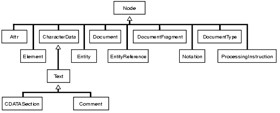

[TOC]

# 数据库安全

## 设置密码有效期

**功能描述**

参数password_effect_time用于设置帐户密码的有效时间。

**设置方法**

```
alter system set password_effect_time = n;
```

**参数说明**

n：账户密码的有效时间，临近或超过有效期系统会提示用户修改密码。

参数类型：浮点型。

取值范围：30~100*365，单位为天。

默认值：90。

**示例**

1、查看当前账户密码的有效期。

```
show password_effect_time;
```

返回结果为：

```
 password_effect_time
----------------------
 90
(1 row)
```

2、更改密码有效期为100天并查询结果。

```
alter system set password_effect_time = 100;
show password_effect_time;
```

返回结果为：

```
 password_effect_time
----------------------
 100
(1 row)
```


# SQL语法参考

## 普通表和分区表在线重建索引
**功能描述**

支持在线rebuild普通行存表索引和行存一级分区表索引，其中行存一级分区表索引包括本地分区索引和全局索引。

**语法格式**

```
ALTER INDEX index_name
REBUILD [ PARTITION partition_name ] CONCURRENTLY;

REINDEX INDEX CONCURRENTLY
index_name [ PARTITION partiotion_name ];
```

**参数说明**

- index_name：自定义的索引名称。
- CONCURRENTLY：并行的含义是不会阻塞DML和DQL语句。

**注意事项**

- 目前仅支持并行重建普通行存表和行存一级分区表。
- 支持行级一级分区表上local和global类型的主表索引重建。
- 支持行级一级分区表上local类型索引在某一特定分区上的分区索引的重建。
- 不支持行级一级分区表上global类型索引在某一特定分区上的重建。

**示例**

1、创建测试表和索引，并插入数据。

```
CREATE TABLE t_rebuild_row(id int,name varchar(20));
INSERT INTO t_rebuild_row values(1,'liuyi');
INSERT INTO t_rebuild_row values(2,'chener');
INSERT INTO t_rebuild_row values(3,'zhangsan');
INSERT INTO t_rebuild_row values(4,'lisi');
INSERT INTO t_rebuild_row values(5,'wangwu');
INSERT INTO t_rebuild_row values(6,'zhaoliu');
INSERT INTO t_rebuild_row values(7,'sunqi');
INSERT INTO t_rebuild_row values(8,'zhouba');
INSERT INTO t_rebuild_row values(9,'wujiu');
CREATE INDEX idx_row ON t_rebuild_row (id);
```
2、查看索引是否创建成功。
```
\d t_rebuild_row 
```
返回结果如下，则表示索引创建成功：
```
   Table "public.t_rebuild_row"
 Column |    Type     | Modifiers
--------+-------------+-----------
 id     | integer     |
 name   | varchar(20) |
Indexes:
    "idx_row" btree (id) TABLESPACE pg_default
```
3、设置扫描开关。
```
set enable_seqscan =off;
```
4、检查执行计划是否为索引扫描。
```
explain select /*+tablescan(t_rebuild_row) */ count(*) from t_rebuild_row where id <6;
explain select /*+indexonlyscan(t_rebuild_row idx_row )*/ count(*) from t_rebuild_row where id <6;
```
两个执行计划分别为顺序扫描及索引扫描,返回结果为：
```
                                       QUERY PLAN
-----------------------------------------------------------------------------------------
 Aggregate  (cost=1000000000111.26..1000000000111.27 rows=1 width=8)
   ->  Seq Scan on t_rebuild_row  (cost=10000000000.00..1000000000111.25 rows=3 width=0)
         Filter: (id < 6)
(3 rows)

                                       QUERY PLAN
----------------------------------------------------------------------------------------
 Aggregate  (cost=8.31..8.32 rows=1 width=8)
   ->  Index Only Scan using idx_row on t_rebuild_row  (cost=0.00..8.30 rows=3 width=0)
         Index Cond: (id < 6)
(3 rows)

```
5、打开两个会话，会话1不断执行DML和DQL操作。
```
do language plpgsql $$    
declare    
begin    
  for i in 5..100000 loop    
    INSERT INTO t_rebuild_row values(10,'zhengshi');
     DELETE FROM t_rebuild_row WHERE id=10;
     perform name FROM t_rebuild_row WHERE id<6 order by name;
    commit;    
  end loop;    
end;    
$$;   
```
6、切换至会话2，重建索引。
```
ALTER  INDEX idx_row REBUILD concurrently;
```

或

```
REINDEX INDEX CONCURRENTLY idx_row;
```

7、会话2中执行如下命令，检查索引是否创建成功(会话1执行过程中，会话2重建索引成功，且会话1不报错)。

```
explain select /*+tablescan(t_rebuild_row) */ count(*) from t_rebuild_row where id <6;
explain select /*+indexonlyscan(t_rebuild_row idx_row )*/ count(*) from t_rebuild_row where id <6;
```
两个执行计划分别为顺序扫描及索引扫描,返回结果如下则表示索引创建成功：
```
                                QUERY PLAN
--------------------------------------------------------------------------
 Aggregate  (cost=1390.03..1390.04 rows=1 width=8)
   ->  Seq Scan on t_rebuild_row  (cost=0.00..1332.40 rows=23051 width=0)
         Filter: (id < 6)
(3 rows)


                                          QUERY PLAN
-----------------------------------------------------------------------------------------------
 Aggregate  (cost=2637.27..2637.28 rows=1 width=8)
   ->  Index Only Scan using idx_row on t_rebuild_row  (cost=0.00..2579.64 rows=23051 width=0)
         Index Cond: (id < 6)
(3 rows)

```
8、在会话2中执行如下命令，检查两者的结果是否相同。
```
select /*+tablescan(t_rebuild_row) */ count(*) from t_rebuild_row where id <6;
select /*+indexonlyscan(t_rebuild_row idx_row )*/ count(*) from t_rebuild_row where id <6;
```
返回结果相同，均为：
```
 count
-------
     5
(1 row)
```
9、还原扫描开关。
```
reset enable_seqscan ;
```


##  ANALYZE和ANALYSE

**功能描述**

ANALYZE和ANALYSE用于收集与数据库中普通表内容相关的统计信息，统计结果存储在系统表PG_STATISTIC下。执行计划生成器会使用这些统计数据，以确定最有效的执行计划。

如果没有指定参数，ANALYZE会分析当前数据库中的每个表和分区表。同时也可以通过指定table_name、column和partition_name参数把分析限定在特定的表、列或分区表中。

ANALYZE VERIFY和ANALYSE VERIFY用于检测数据库中普通表（行存表、列存表）的数据文件是否损坏。

**注意事项**

- ANALYZE非临时表不能在一个匿名块、事务块、函数或存储过程内被执行。支持存储过程中ANALYZE临时表，不支持统计信息回滚操作。

- ANALYZE VERIFY 操作处理的大多为异常场景检测需要使用RELEASE版本。

- ANALYZE VERIFY 场景不触发远程读，因此远程读参数不生效。对于关键系统表出现错误被系统检测出页面损坏时，将直接报错不再继续检测。

**语法格式**

- 收集表的统计信息。

```
{ ANALYZE | ANALYSE } [ VERBOSE ] 
  [ table_name [ ( column_name [, ...] ) ] ];
```

- 收集分区表的统计信息。

```
{ ANALYZE | ANALYSE } [ VERBOSE ] 
[ table_name [ ( column_name [, ...] ) ] ] 
PARTITION ( patrition_name ) ;
```

> <div align="left">
>
> 普通分区表目前支持针对某个分区的统计信息的语法，在功能上不支持针对某个分区的统计信息收集。

- 收集多列统计信息。 

```
{ANALYZE | ANALYSE} [ VERBOSE ] 
  table_name (( column_1_name, column_2_name [, ...] ));
```

> <div align="left">
>
> （1）收集多列统计信息时，请设置GUC参数default_statistics_target为负数，  以使用百分比采样方式。	
>
> （2）每组多列统计信息最多支持32列。
>
> （3）不支持收集多列统计信息的表：系统表。 
>

- 检测当前库的数据文件。

```
{ANALYZE | ANALYSE} VERIFY {FAST|COMPLETE};
```

> <div align="left">
>
> （1）Fast模式校验时，需要对校验的表有并发的DML操作，会导致校验过程中有误报的问题，因为当前Fast模式是直接从磁盘上读取，并发有其他线程修改文件时，会导致获取的数据不准确，建议离线操作。
>
> （2）支持对全库进行操作，由于涉及的表较多，建议以重定向保存结果，命令如下所示：
>
> ```
> vsql -d database -p port -f "verify.sql"> verify_warning.txt  2>&1
> ```
>
> （3）对外提示NOTICE只核对外可见的表，内部表的检测会包含在它所依赖的外部表，不对外显示和呈现。
>
> （4）此命令的处理可容错ERROR级别的处理。由于debug版本的Assert可能会导致core无法继续执行命令，建议在release模式下操作。
>
> （5）对于全库操作时，当关键系统表出现损坏则直接报错，不再继续执行。
>
> （6）不支持临时表和unlog表。
>

- 检测表和索引的数据文件。

```
{ANALYZE | ANALYSE} VERIFY {FAST|COMPLETE} table_name|index_name [CASCADE];
```

> <div align="left">
>
> （1）支持对普通表的操作和索引表的操作，但不支持对索引表index使用CASCADE操作。原因是由于CASCADE模式用于处理主表的所有索引表，当单独对索引表进行检测时，无需使用CASCADE模式。
>
> （2）不支持临时表和unlog表。
>
> （3）对于主表的检测会同步检测主表的内部表，例如toast表、cudesc表等。
>
> （4）当提示索引表损坏时，建议使用reindex命令进行重建索引操作。
>

- 检测表分区的数据文件。

```
{ANALYZE | ANALYSE} VERIFY {FAST|COMPLETE} table_name PARTITION {(patrition_name)}[CASCADE];
```

> <div align="left">
>
> （1）支持对表的单独分区进行检测操作，但不支持对索引表index使用CASCADE操作。
>
> （2）不支持临时表和unlog表。
>
> （3） 全局分区索引适配支持ANALYZE VERIFY FAST。
>

**参数说明**

- VERBOSE：启用显示进度信息，如果指定了VERBOSE，ANALYZE发出进度信息，表明目前正在处理的表。各种有关表的统计信息也会打印出来。

- FAST|COMPLETE：对于行存表，FAST模式下主要对于行存表的CRC和page header进行校验，如果校验失败则会告警; 而COMPLETE模式下，则主要对行存表的指针、tuple进行解析校验。 对于列存表，FAST模式下主要对于列存表的CRC和magic进行校验，如果校验失败则会告警; 而COMPLETE模式下，则主要对列存表的CU进行解析校验。

- table_name：需要分析的特定表的表名（可能会带模式名），如果省略，将对数据库中的所有表（非外部表）进行分析。对于ANALYZE收集统计信息，目前仅支持行存表、列存表。

  取值范围：已有的表名。

- index_name需要分析的特定索引表的表名（可能会带模式名）。

  取值范围：已有的表名。

- CASCADE：CASCADE模式下会对当前表的所有索引进行检测处理。

- partition_name：如果table为分区表，在关键字PARTITION后面指定分区名partition_name表示分析该分区表的统计信息。目前语法上支持分区表做ANALYZE，但功能实现上暂不支持对指定分区统计信息的分析。

  取值范围：表的某一个分区名。

**示例**

1、创建测试表。

```
CREATE TABLE customer_info 
( 
WR_RETURNED_DATE_SK    INTEGER            , 
WR_RETURNED_TIME_SK    INTEGER            , 
WR_ITEM_SK         INTEGER        NOT NULL, 
WR_REFUNDED_CUSTOMER_SK  INTEGER 
) ;
```

2、创建分区表。

```
CREATE TABLE customer_par 
( 
WR_RETURNED_DATE_SK    INTEGER            , 
WR_RETURNED_TIME_SK    INTEGER            , 
WR_ITEM_SK         INTEGER        NOT NULL, 
WR_REFUNDED_CUSTOMER_SK  INTEGER 
) 
PARTITION BY RANGE(WR_RETURNED_DATE_SK) 
( 
PARTITION P1 VALUES LESS THAN(2452275), 
PARTITION P2 VALUES LESS THAN(2452640), 
PARTITION P3 VALUES LESS THAN(2453000), 
PARTITION P4 VALUES LESS THAN(MAXVALUE) 
) 
ENABLE ROW MOVEMENT;
```

3、使用ANALYZE语句更新统计信息。

```
ANALYZE customer_info;
```

4、使用ANALYZE VERBOSE语句更新统计信息，并输出表的相关信息。

```
ANALYZE VERBOSE customer_info; 
```

返回结果为：

```
INFO:  analyzing "public.customer_info"(node1 pid=336454)
INFO:  ANALYZE INFO : "customer_info": scanned 0 of 0 pages, containing 0 live rows and 0 dead rows; 0 rows in sample, 0 estimated total rows(node1 pid=336454)
ANALYZE
```

5、删除表。

```
DROP TABLE customer_info; 
DROP TABLE customer_par;
```

## SQL并行查询

**功能描述**

一条查询语句在所涉及的表中的数据量达到阈值时，由规划器生成的计划去执行扫描时性能会比较差。因此需要使用多个worker线程并行各自去执行扫描表操作，在Vastbase G100 V2.2版本中支持[并行顺序扫描](#并行顺序扫描)、[并行嵌套查询](#并行嵌套查询)、[并行哈希连接](#并行哈希连接)、[并行索引扫描](#并行索引扫描)。


### 并行顺序扫描<a id="并行顺序扫描"></a>
**功能描述**

并行顺序扫描就是利用多核CPU的并行处理能力，将一个表的顺序查询语句由多个并行worker线程去执行查询操作。

**注意事项**

- 不支持临时表、外表、分区表、非行存表的并行查询。
- 不支持CET查询，并行join，并行子查询等。

**示例**

1、创建测试表test并插入数据。

```
create table test(id int,name text,age int);
insert into test values(generate_series(1,1000000),'vastbase',34);
```

2、指定分析表test。

```
analyze test;
```

3、设置并行度。

```
set query_dop=5;
```

4、打印并行查询计划。

```
explain select count(*) from test where id<100;
```
返回结果如下，则表示支持该功能：
```
                                      QUERY PLAN                                 
     
---------------------------------------------------------------------------------
-----
 Aggregate  (cost=8100.25..8100.26 rows=1 width=8)
   ->  Streaming(type: LOCAL GATHER dop: 1/5)  (cost=8100.25..8100.26 rows=1 widt
h=8)
         ->  Aggregate  (cost=8100.25..8100.26 rows=1 width=8)
               ->  Seq Scan on test  (cost=0.00..8100.00 rows=100 width=0)
                     Filter: (id < 100)
(5 rows)
```
### 并行索引扫描<a id="并行索引扫描"></a>

**功能描述**

并行索引扫描就是利用多核CPU的并行处理能力，索引查询可以由多个并行worker线程执行。

当一条sql语句的条件子句中涉及的属性是索引时，查询编译器就会生成并行索引扫描路径，根据代价估算得到并行索引扫描计划，执行器在选择扫描计划时，会将索引扫描计划分给多个worker来执行。

**注意事项**

- 不支持临时表、外表、分区表、非行存表的并行查询。
- 不支持CET查询。
- 只支持并行btree索引扫描，bitmap，gin，gist等索引查询不支持。

**示例**

1、创建测试表并插入数据。

```
create table parallel_t2(a int,b int);
insert into parallel_t2 values(generate_series(1,100000), generate_series(1,100000));
```

2、创建btree索引。

```
create index t2_idx on parallel_t2 using btree(a);
```

3、设置扫描开关和并行代价。

```
set enable_seqscan to off;
set enable_bitmapscan to off;
```
4、.打印并行执行计划。
```
explain (costs off) select count(b) from parallel_t2 where a > 5000;
```
返回结果为：
```
                  QUERY PLAN
----------------------------------------------
 Aggregate
   ->  Index Scan using t2_idx on parallel_t2
         Index Cond: (a > 5000)
(3 rows)
```
```
explain (costs off) select count(b) from parallel_t2 where a < 5000;
```
返回结果为：
```
                  QUERY PLAN
----------------------------------------------
 Aggregate
   ->  Index Scan using t2_idx on parallel_t2
         Index Cond: (a < 5000)
(3 rows)
```
5、执行查询。
```
select count(b) from parallel_t2 where a > 5000;
```
返回结果为：
```
 count
-------
 95000
(1 row)
```
```
select count(b) from parallel_t2 where a < 5000;
```
返回结果为：
```
 count
-------
  4999
(1 row)
```
### 并行嵌套查询<a id="并行嵌套查询"></a>

**功能描述**

并行嵌套查询就是利用多核CPU的并行处理能力，将一个多表连接查询语句由多个并行worker线程执行。

**注意事项**
- 不支持临时表、外表、分区表、非行存表的并行查询。
- 不支持CET查询，并行子查询等。

**示例**

1、创建测试表并插入数据。

```
create table test_a (id int, col varchar(20));
create table test_b (id int, col int);
create table t3(id int, id2 int, id3 int);
insert into test_a  values(generate_series(1,200000), 'xiaohong');
insert into test_b  values(generate_series(100,200000), 20);
insert into t3 values(generate_series(1, 200000), generate_series(1, 100), generate_series(1, 10));
```
2、设置并行开关。

```
set enable_nestloop=on;
set enable_mergejoin=off;
set enable_hashjoin=off;
set query_dop=2;
```
3、打印嵌套循环并行查询计划。

```
explain (costs off) 
select col from test_a where id in (select id from test_b where id in (select id from t3));
```
返回结果为：
```
                                    QUERY PLAN
----------------------------------------------------------------------------------
 Streaming(type: LOCAL GATHER dop: 1/2)
   ->  Nested Loop Semi Join
         Join Filter: (test_a.id = test_b.id)
         ->  Streaming(type: LOCAL REDISTRIBUTE dop: 2/2)
               ->  Seq Scan on test_a
         ->  Materialize
               ->  Streaming(type: LOCAL REDISTRIBUTE dop: 2/2)
                     ->  Nested Loop Semi Join
                           Join Filter: (test_b.id = t3.id)
                           ->  Streaming(type: LOCAL REDISTRIBUTE dop: 2/2)
                                 ->  Seq Scan on test_b
                           ->  Materialize
                                 ->  Streaming(type: LOCAL REDISTRIBUTE dop: 2/2)
                                       ->  Seq Scan on t3
(14 rows)
```

### 并行哈希连接<a id="并行哈希连接"></a>

**功能描述**

并行哈希连接是利用多核CPU的并行处理能力，将一个生成哈希连接的执行计划由多个Worker执行。一个表连接语句规划器会生成哈希连接计划，并行哈希连接功能是执行器在执行时，将哈希连接的操作由多个Worker并行执行完成。

**注意事项**

- 不支持临时表、外表、分区表、非行存表的并行查询。
- 不支持CET查询，并行子查询等。

**示例**

1、创建两张表。

```
create table parallel_hashjoin_test_a (id int);
create table parallel_hashjoin_test_b (id int);
```

2、插入数据。

```
insert into parallel_hashjoin_test_a select n from generate_series(1,1000) n;
insert into parallel_hashjoin_test_b select n from generate_series(1,10) n;
```

3、收集两张表的统计信息。

```
analyse parallel_hashjoin_test_a;
analyse parallel_hashjoin_test_b;
```

4、打印两张表连接查询的查询计划。

```
explain (costs off) select * from parallel_hashjoin_test_a left outer join parallel_hashjoin_test_b on parallel_hashjoin_test_a.id = parallel_hashjoin_test_b.id where parallel_hashjoin_test_a.id < 10 order by parallel_hashjoin_test_a.id;
```
返回结果如下，则表示支持该功能：
```
                                   QUERY PLAN
--------------------------------------------------------------------------------
 Sort
   Sort Key: parallel_hashjoin_test_a.id
   ->  Hash Left Join
         Hash Cond: (parallel_hashjoin_test_a.id = parallel_hashjoin_test_b.id)
         ->  Seq Scan on parallel_hashjoin_test_a
               Filter: (id < 10)
         ->  Hash
               ->  Seq Scan on parallel_hashjoin_test_b
(8 rows)
```

5、执行两张表连接查询。

```
select * from parallel_hashjoin_test_a left outer join parallel_hashjoin_test_b on parallel_hashjoin_test_a.id = parallel_hashjoin_test_b.id where parallel_hashjoin_test_a.id < 10 order by parallel_hashjoin_test_a.id;
```

返回结果为:

```
 id | id
----+----
  1 |  1
  2 |  2
  3 |  3
  4 |  4
  5 |  5
  6 |  6
  7 |  7
  8 |  8
  9 |  9
(9 rows)
```

## 聚合函数嵌套

**功能描述**

Vastbase支持聚合函数嵌套使用。其中内层聚合函数用于计算通过group by子句定义的分组的聚合结果，再将内层聚合函数返回的结果集使用外层聚合函数再进行一次聚合计算，从而返回整体的结果。

**语法格式**

```
aggregate_name1(aggregate_name2(expression[,…][order_by_clause]))
aggregate_name1(aggregate_name2(ALL expression [,…][order_by_clause]))
aggregate_name1(aggregate_name2(DISTINCT expression[,…][order_by_clause]))
aggregate_name1(aggregate_name2(*))
aggregate_name1(aggregate_name2([expression[,…]]))
```
**参数说明**

- aggregate_name1：预定义的聚合函数名称1，内层函数。
- aggregate_name2：预定义的聚合函数名称2，外层函数。
- expression：自身不包含聚合函数表达式的任意值表达式。

**注意事项**

聚合函数嵌套的用法约束有如下限制：
- 必须含有group by子句，否则报错。例如：
```
select avg(max(salary)) from empsalary;
```
- 查询列中同时包括嵌套聚合函数和非嵌套聚合函数时报错。例如：
```
select avg(max(salary)),max(salary) from empsalary group by department_id;
```
- 查询列中同时包括嵌套聚合函数和一般列时报错。例如：
```
select avg(max(salary)),salary from empsalary group by department_id;
```

**示例**

1、创建测试表empsalary。

```
create table empsalary (
depname  varchar,
empno  int,
salary int
);
```
2、插入数据。

```
insert into empsalary values('develop',10,5200);
insert into empsalary values('develop',10,5200);
insert into empsalary values('saleseeee',10,5000);
insert into empsalary values('personnel11',5,500);
insert into empsalary values('personnel11',5,500);
insert into empsalary values('personnel11',5,500);
insert into empsalary values('personnel1',5,500);
insert into empsalary values('sales',1,5200);
insert into empsalary values('sales',1,5200);
insert into empsalary values('selaseee',1,5000);
```
3、调用聚合嵌套函数1。

```
select max(max(Empno)),max(sum(salary)) from empsalary group by depname;
```
返回结果如下，则表示调用成功：
```
max | max
-----------
10  | 10400
(1 row)
```
4、调用聚合嵌套函数2。

```
select max(sum(Empno)),max(sum(salary)) from empsalary group by depname;
```
返回结果如下，则表示调用成功：
```
 max |  max  
-----+-------
  20 | 10400
(1 row)
```

# Oracle兼容性

## SQL语法

### 数据类型
#### BINARY_FLOAT数据类型

**功能描述**

binary_float类型是Oracle支持的一种浮点数类型，大小为4字节。本功能是支持Vastbase数据库能够使用binary_float这一类型,并且该数据类型也可以包含在plpgsql中使用。

**注意事项**

无。

**兼容性**

完全兼容。

**示例**

- 表的增删改查支持binary_float数据类型

1、创建测试表并插入数据。

```
CREATE  TABLE test(id int, var binary_float);
INSERT INTO test VALUES(1,1.25),(2,8.234),(3,0.1234);
```
2、查询表的数据。

```
select * from test;
```
返回结果为：
```
 id |  var
----+-------
  1 |  1.25
  2 | 8.234
  3 | .1234
(3 rows)

```

3、更新表中的数据并查询结果。

```
UPDATE test SET var = 7.321 WHERE id = 2;
SELECT * FROM test;
```
返回结果为：
```
 id |  var
----+-------
  1 |  1.25
  3 | .1234
  2 | 7.321
(3 rows)
```

4、更新表中的数据并查询结果。

```
DELETE FROM test WHERE id = 3;
SELECT * FROM test;
```
返回结果为：
```
 id |  var
----+-------
  1 |  1.25
  2 | 7.321
(2 rows)
```

- PL/PGSQL中支持binary_float数据类型

1、创建存储过程。

```
create or replace function test()
return binary_float as 
declare
    a binary_float := 1.23;
    b binary_float :=3.45;
begin
    return a + b;
end;
/
```
2、查询结果。

```
SELECT test();
```
返回结果为：
```
 test
------
 4.68
(1 row)
```
#### DATE数据类型

**功能描述**

date数据类型用于存储日期和时间信息，对于每一个date值：
- 展示格式为：YYYY/MM/DD，也可以是YYYY/MM/DD HH24:MI:SS
- 存储格式只有一种：YYYY/MM/DD HH24:MI:SS
- date类型的值在数据库图形界面中可以有不同的显示格式（具体格式由工具设置决定），但其实际存储格式只是其中一种，当只存储年月日时，date实际存储的是:年月日0时0分0秒，在图形界面中，其展示格式为：YYYY/MM/DD。
- date类型对插入带有毫秒的部分直接去除毫秒，不进行四舍五入。
- 支持date数据类型和to_char字符串的转换。

**注意事项**

无

**兼容性**

完全兼容。

**示例**

1、创建测试表并插入数据。

```
create table t1(id int,col date,col1 timestamp);
insert into t1 select 1,current_timestamp,current_timestamp from dual;
```

2、将date数据类型转换为to_char类型，并查询结果。

```
select id,to_char(col,'yyyy-mm-dd hh24:mi:ss'),to_char(col1,'yyyy-mm-dd hh24:mi:ss.ff6') from t1;
```
返回结果如下(其中col字段去除毫秒，不会做四舍五入)：
```
 id |       to_char       |          to_char
----+---------------------+----------------------------
  1 | 2022-07-04 17:15:16 | 2022-07-04 17:15:16.174639
(1 row)
```
3、获取时间的年份。

```
select to_char(col,'yyyy') as nowyear from t1;
```
返回结果为当前年份：
```
 nowyear
---------
 2022
(1 row)
```

#### TIMESTAMP数据类型


**功能描述**

该数据类型是DATE数据类型的扩展，它可以存储更加精确的时间值。Vastbase G100支持14位(秒)或者17位（毫秒）数字格式数输入。


**注意事项**

无

**兼容性**

完全兼容。

**示例**

1、创建测试表并插入数据。

```
create table test_timestamp(a timestamp,b timestamptz);
insert into test_timestamp values('2022-1-12 12:23:23','2022-1-12 12:23:23');
insert into test_timestamp values('20220112122323','20220112122323');
```

2、查询表中数据。

```
select * from test_timestamp ;
```
返回结果如下：
```
          a          |           b            
---------------------+------------------------
 2022-01-12 12:23:23 | 2022-01-12 12:23:23+08
 2022-01-12 12:23:23 | 2022-01-12 12:23:23+08
(2 rows)
```
#### BFILE数据类型

**功能描述**

bfile用于存储服务器文件系统中的物理二进制文件数据对象。bfile文件存储在操作系统文件中，而不是在数据库中，bfile列存储对操作系统文件的引用。操作系统访问的任何存储设备都可以保存bfile数据，包括硬盘驱动器、CD-ROM、PhotoCD和DVD。如果操作系统支持对操作系统文件的流模式访问，则数据库可以访问bfile。

bfile类型的数据是：

- 在应用程序运行时不会更改的二进制数据，例如图形。
- 加载到其他大型对象类型（例如BLOB或CLOB）中的数据，可以在其中操作数据。
- 适用于字节流访问的数据，例如多媒体数据。

在对bfile类型的SQL操作中，需要支持bfilename函数。bfilename函数返回一个bfile文件定位器，该定位器指向操作系统中一个物理文件。
bfilename函数主要用于bfile类型数据的构造，构造的数据源为一个directory对象和一个操作系统物理二进制文件名，函数语法格式为：

```
BFILENAME('directory', 'filename')
```

- directory对象：指向一个操作系统的物理目录。该目录不应为数据库数据目录，以及操作系统控制文件、日志文件和其他系统文件所在的目录。必须在bfilename函数调用前创建，并且对名区分大小写。
- filename：文件名，操作系统上一个物理二进制文件，由于bfile为只读数据类型，必须在访问文件数据前创建该文件。

bfile数据类型主要用于对bfilename函数构造的数据进行存储，然后调用dbms_lob内置包的接口对该数据进行操作。bfile数据类型的功能主要分为三个部分：

- bfile数据的存储和打印。
- bfile数据的使用，主要为对操作系统物理文件的读取过程，即分为以下三部分：
  - 打开操作系统物理文件。bfile为只读数据类型，因此打开文件的模式只能为只读。
  - 对文件进行读取。可根据参数设置来决定读取文件的字节数，如需读取整个文件，可先调用dbms_lob包的getlength，函数获取文件的大小。需注意的是，单次读取文件的字节数不能超过32767字节，如文件过大，可通过设置参数对文件进行多次读取。
  - 关闭文件。对打开的物理文件进行关闭。

bfile数据的修改：对于bfile数据的持久引用（如存储在表中），bfile数据可以作为表的列值进行修改。

**注意事项**
bfilename函数依赖openGauss自带的directory功能。

**使用流程**

1、创建directory对象，创建需访问的文件并将其置于directory对象所指向的操作系统目录中。

2、创建包含bfile数据类型列的表。

3、调用bfilename函数对数据进行构造并插入到表中进行存储。

**示例**

1、操作系统环境下创建文件，并输入数据。

```
 vi /home/vastbase/bfile.data
 cat /home/vastbase/bfile.data
```

文件内容为：

```
张三
李四
```

2、在数据库中执行如下命令创建目录和表。

```
drop directory d_bfile;
drop table testbfile1;
create directory d_bfile as '/home/vastbase';
create table testbfile1(id number,bfile_name bfile);
```

3、插入数据。

```
insert into testbfile1 values (1,bfilename('d_bfile','bfile.data'));
```

4、查询数据。

```
select * from  testbfile1;
```

返回结果为：

```
 id |            bfile_name
----+-----------------------------------
  1 | bfilename('d_bfile','bfile.data')
```


### ^=运算符

**功能描述**

实现oracle^=运算符，即不等于运算符，类似于!=和<>。

**注意事项**

无。

**兼容性**

完全兼容。

**示例**

1、创建测试表并插入数据。

```
create table t_ysf4(
  id int,
  col_varchar varchar(30),
  col_int int,
  col_date date
  );
  insert into t_ysf4 values(1,'1',1,'1997-02-20');
  insert into t_ysf4 values(2,'2',2,'2007-02-20');
```
2、使用^=运算符。

```
select * from t_ysf4 where col_int ^='1';
```
返回结果如下：
```
 id | col_varchar | col_int |      col_date
----+-------------+---------+---------------------
  2 | 2           |       2 | 2007-02-20 00:00:00
(1 row)
```
4、使用^=运算符进行判断。

```
select '1' ^= '2';
```
返回结果为：
```
 ?column?
----------
 t
(1 row)
```
### INSERT支持别名

**功能描述**

支持在INSERT语句中对表名使用别名。

**语法格式**

```
INSERT INTO table_name t1(t1.col1,t1.col2);
```

**参数说明**

- table_name：表名。
- t1：表的别名。
- col1：表的列1。
- col2：表的列2。

**注意事项**

无。

**兼容性**

完全兼容。

**示例**

1、创建测试表并插入数据。

```
create table table1 (col1 int,col2 int);
create table table2 (col1 int,col2 int);
insert into table2 values(1,2);
insert into table2 values(2,3);
insert into table1  t1(t1.col1,t1.col2) select  t2.col1,t2.col2 from table2 t2;
```
2、查询测试表table1。

```
select * from table1;
```
返回结果如下：
```
 col1 | col2
------+------
    1 |    2
    2 |    3
(2 rows)
```

### ROWID

**功能描述**

ROWID是一个伪列，该值表明了该行在Oracle数据库中的详细物理地址，通过ROWID，数据库可以快速定位某行具体数据的位置。

**注意事项**

- 该功能仅在数据库兼容模式为Oracle时能够使用（即创建DB时DBCOMPATIBILITY='A'），在其他数据库兼容模式下不能使用该特性。
- 子查询中也可以使用rowid。目前具体需求只有一层子查询。对于多层子查询嵌套的时候，在各层中都可以使用rowid不做强制要求。

**兼容性**

完全兼容。

**示例**

1、创建测试表并插入数据。

```
create table t01(id int,name varchar2(32));
insert into t01(id,name) values(1,'a'),(2,'b'),(3,'c'),(4,'d');
```

2、查询ROWID。

```
 select rowid,t.* from (select a.* from t01 a) t;
```

返回结果为：

```
        rowid         | id | name
----------------------+----+------
 h1IAAA==AAAAAA==AQA= |  1 | a
 h1IAAA==AAAAAA==AgA= |  2 | b
 h1IAAA==AAAAAA==AwA= |  3 | c
 h1IAAA==AAAAAA==BAA= |  4 | d
(4 rows)
```
3、子查询外层支持ROWID。

```
select rowid as rowid_2,t.* from (select rowid,a.* from t01 a) t;
```
返回结果为：

```
       rowid_2        |        rowid         | id | name
----------------------+----------------------+----+------
 h1IAAA==AAAAAA==AQA= | h1IAAA==AAAAAA==AQA= |  1 | a
 h1IAAA==AAAAAA==AgA= | h1IAAA==AAAAAA==AgA= |  2 | b
 h1IAAA==AAAAAA==AwA= | h1IAAA==AAAAAA==AwA= |  3 | c
 h1IAAA==AAAAAA==BAA= | h1IAAA==AAAAAA==BAA= |  4 | d
(4 rows)
```

### 递归查询语法

**功能描述**

Vastbase兼容Oracle递归查询START WITH...CONNECT BY...语法。

**语法格式**

```
[START WITH condition] CONNECT BY condition
或者
CONNECT BY condition [ START WITH condition ]
```

**参数说明**

condition：任何条件语句。condition的格式必须为：

```
[prior column1 = column2 | column1 = prior column2]
```

**兼容性**

Vastbase G100 V2.2版本与Oracle 11G R2版本对比，语法中不支持的选项为[NOCYCLE]。

 **示例**

1、创建测试表并插入数据。
```
create table employee(
emp_id number(18),
lead_id number(18),
emp_name varchar2(200),
salary number(10,2),
dept_no varchar2(8)
);

insert into employee values('1',0,'king','1000000.00','001');
insert into employee values('2',1,'jack','50500.00','002');
insert into employee values('3',1,'arise','60000.00','003');
insert into employee values('4',2,'scott','30000.00','002');
insert into employee values('5',2,'tiger','25000.00','002');
insert into employee values('6',3,'wudde','23000.00','003');
insert into employee values('7',3,'joker','21000.00','003');
```
2、查询以emp_id为3开始的节点的所有直属节点。
```
select emp_id,lead_id,emp_name
from employee
start with lead_id=3
connect by prior emp_id = lead_id;
```
返回结果为：
```
 emp_id | lead_id | emp_name
--------+---------+----------
      6 |       3 | wudde
      7 |       3 | joker
(2 rows)
```
#### 支持connect_by_isleaf

**功能描述**

递归查询中的一个伪列，用于指示当前行是否为树的叶子节点（即没有子节点的节点），如果是返回1，否则返回0。

**语法格式**
```
SELECT cloumn,exper.. CONNECT_BY_ISLEAF "IsLeaf",[LEVEL],
from table
start with condition
connect by [prior column1 = column2 | column1 = prior column2];
```

**参数说明**

LEVEL：一个伪列（可选），代表当前这个节点所在的层级，对于根节点，level返回1。

**注意事项**

无。

**示例**

1、创建测试表并插入数据。
```
CREATE TABLE EMP
(EMPNO NUMBER(4) NOT NULL,
ENAME VARCHAR2(10),
JOB VARCHAR2(9),
MGR NUMBER(4),
HIREDATE DATE,
SAL NUMBER(7, 2),
COMM NUMBER(7, 2),
DEPTNO NUMBER(2));
INSERT INTO EMP VALUES (7369, 'SMITH', 'CLERK', 7902,TO_DATE('17-DEC-1980', 'DD-MON-YYYY'), 800, NULL, 20);
INSERT INTO EMP VALUES (7499, 'ALLEN', 'SALESMAN', 7698,TO_DATE('20-FEB-1981', 'DD-MON-YYYY'), 1600, 300, 30);
INSERT INTO EMP VALUES (7521, 'WARD', 'SALESMAN', 7698,TO_DATE('22-FEB-1981', 'DD-MON-YYYY'), 1250, 500, 30);
INSERT INTO EMP VALUES (7566, 'JONES', 'MANAGER', 7839,TO_DATE('2-APR-1981', 'DD-MON-YYYY'), 2975, NULL, 20);
INSERT INTO EMP VALUES (7654, 'MARTIN', 'SALESMAN', 7698,TO_DATE('28-SEP-1981', 'DD-MON-YYYY'), 1250, 1400, 30);
INSERT INTO EMP VALUES (7698, 'BLAKE', 'MANAGER', 7839,TO_DATE('1-MAY-1981', 'DD-MON-YYYY'), 2850, NULL, 30);
INSERT INTO EMP VALUES (7782, 'CLARK', 'MANAGER', 7839,TO_DATE('9-JUN-1981', 'DD-MON-YYYY'), 2450, NULL, 10);
INSERT INTO EMP VALUES (7788, 'SCOTT', 'ANALYST', 7566,TO_DATE('09-DEC-1982', 'DD-MON-YYYY'), 3000, NULL, 20);
INSERT INTO EMP VALUES (7839, 'KING', 'PRESIDENT', NULL,TO_DATE('17-NOV-1981', 'DD-MON-YYYY'), 5000, NULL, 10);
INSERT INTO EMP VALUES (7844, 'TURNER', 'SALESMAN', 7698,TO_DATE('8-SEP-1981', 'DD-MON-YYYY'), 1500, 0, 30);
INSERT INTO EMP VALUES (7876, 'ADAMS', 'CLERK', 7788,TO_DATE('12-JAN-1983', 'DD-MON-YYYY'), 1100, NULL, 20);
INSERT INTO EMP VALUES (7900, 'JAMES', 'CLERK', 7698,TO_DATE('3-DEC-1981', 'DD-MON-YYYY'), 950, NULL, 30);
INSERT INTO EMP VALUES (7902, 'FORD', 'ANALYST', 7566,TO_DATE('3-DEC-1981', 'DD-MON-YYYY'), 3000, NULL, 20);
INSERT INTO EMP VALUES (7934, 'MILLER', 'CLERK', 7782,TO_DATE('23-JAN-1982', 'DD-MON-YYYY'), 1300, NULL, 10); 
```
2、查询当前行是否为叶子节点
```
SELECT  ename, CONNECT_BY_ISLEAF "IsLeaf",LEVEL
FROM emp
WHERE LEVEL <= 3 AND deptno= 10
START WITH empno = 7839
CONNECT BY PRIOR deptno = mgr AND LEVEL <= 4
order by ename,"IsLeaf";
```
返回结果为：
```
 ename | IsLeaf | level
-------+--------+-------
 KING  |      1 |     1
(1 row)
```
#### 支持order siblings by
**功能描述**

排序子句，可对结果集进行排序，仅用于层次查询connect by中，可以让兄弟节点（即同一父级的兄弟）按照指定的列进行排序（升序或者降序）。

**语法格式**
```
SELECT cloumn,exper..
FROM table
start with condition
connect by[prior column1 = column2 | column1 = prior column2]
ORDER [ SIBLINGS ] BY  {expression [ [ ASC | DESC | USING operator ] | nlssort_expression_clause 
```

**参数说明**

NULLS FIRST和NULLS LAST：两者都是用来控制空值在输出结果中出现的顺序。
- NULLS FIRST表示在排序表达式上的结果为空值的行总是出现在输出结果的最前面。
- NULLS LAST表示在排序表达式上的结果为空值的行总是出现在输出结果的最后面。

**注意事项**

无。

**示例**

1、创建测试表并插入数据。
```
CREATE TABLE family_tree(id int primary key,appellation varchar(30),parent_id int,age int);
insert into family_tree values(1,'爷爷',0,88);
insert into family_tree values(2,'大伯',1,66);
insert into family_tree values(5,'堂兄',2,32);
insert into family_tree values(6,'堂妹',2,24);
insert into family_tree values(3,'爸爸',1,58);
insert into family_tree values(7,'小明',3,26);
insert into family_tree values(4,'小姑',1,52);
insert into family_tree values(8,'表姐',4,28);
insert into family_tree values(9,'表弟',4,20);
```
2、对同已父级的兄弟进行排序。
```
SELECT * FROM family_tree 
CONNECT BY PRIOR id= parent_id
start with appellation ='爷爷' 
order siblings by age asc;
```
返回结果为：
```
 id | appellation | parent_id | age
----+-------------+-----------+-----
  1 | 爷爷        |         0 |  88
  4 | 小姑        |         1 |  52
  9 | 表弟        |         4 |  20
  8 | 表姐        |         4 |  28
  3 | 爸爸        |         1 |  58
  7 | 小明        |         3 |  26
  2 | 大伯        |         1 |  66
  6 | 堂妹        |         2 |  24
  5 | 堂兄        |         2 |  32
(9 rows)
```
#### 支持connect_by_root
**功能描述**

一个一元运算符，可用于限定列，仅在递归查询中有效，可以根据当前行返回被视为根节点的行的列值，即就是可以根据当前行得到其根节点的列值。

> <div align="left">
>
> CONNECT_BY_ROOT运算符可在SELECT列表、WHERE子句、GROUP BY子句、HAVING子句、ORDER BY子句和ORDER SIBLINGS BY子句中使用，只要SELECT命令用于分层查询。不能在分层查询的CONNECT BY子句或START WITH子句中使用。可将CONNECT_BY_ROOT应用于一个涉及列的表达式，但这样做时，该表达式必须用圆括号括起。

**语法格式**
```
SELECT CONNECT_BY_ROOT cloum,expre..
from table
start with condition
connect by [prior column1 = column2 | column1 = prior column2];
```

**注意事项**

无。

**示例**

1、创建测试表并插入数据。
```
DROP TABLE family_tree;
CREATE TABLE family_tree(id int primary key,appellation varchar(30),parent_id int,age int);
insert into family_tree values(1,'爷爷',0,88);
insert into family_tree values(2,'大伯',1,66);
insert into family_tree values(5,'堂兄',2,32);
insert into family_tree values(6,'堂妹',2,24);
insert into family_tree values(3,'爸爸',1,58);
insert into family_tree values(7,'小明',3,26);
insert into family_tree values(4,'小姑',1,52);
insert into family_tree values(8,'表姐',4,28);
insert into family_tree values(9,'表弟',4,20);
```
2、对同已父级的兄弟进行排序。
```
SELECT connect_by_root parent_id root, connect_by_isleaf isleaf,id,appellation,age
FROM family_tree 
CONNECT BY PRIOR id= parent_id
start with appellation ='爷爷' 
order siblings by age;
```
返回结果为：
```
 root | isleaf | id | appellation | age
------+--------+----+-------------+-----
 0    |      0 |  1 | 爷爷        |  88
 0    |      0 |  4 | 小姑        |  52
 0    |      1 |  9 | 表弟        |  20
 0    |      1 |  8 | 表姐        |  28
 0    |      0 |  3 | 爸爸        |  58
 0    |      1 |  7 | 小明        |  26
 0    |      0 |  2 | 大伯        |  66
 0    |      1 |  6 | 堂妹        |  24
 0    |      1 |  5 | 堂兄        |  32
(9 rows)
```

### 虚拟列语法

**功能描述**

创建数据表时（CREATE TABLE）可指定字段为虚拟列，在修改数据表（ALTER TABLE）可添加虚拟列字段。

**语法格式**

```
GENERATED ALWAYS AS ( generation_expr ) STORED;
```

**参数说明**

generation_expr：表达式

**注意事项**

无。

**兼容性**

完全兼容。

**示例**

1、创建测试表并插入数据。

```
create table t_virtual(c1 int,c2 int,v_c3 int GENERATED ALWAYS AS(c1 + c2) stored);
insert into t_virtual values(1, 2);
select * from t_virtual;
```

返回结果为：

```
 c1 | c2 | v_c3 
----+----+------
  1 |  2 |    3
(1 row)
```

2、更新表的内容。

```
update t_virtual set c1=2;
select * from t_virtual;
 c1 | c2 | v_c3 
----+----+------
  2 |  2 |    4
(1 row)
```
3、删除表中的字段。

```
ALTER TABLE t_virtual drop c1;
select * from t_virtual;
 c2 
----
  2
(1 row)
```

### 宏变量

**功能描述**

系统提供的宏变量包括dbtimezone,sessiontimezone和systimestamp。

- dbtimezone：返回数据库时区。
- sessiontimezone：返回会话时区。
- systimestamp：返回本机数据库上当前系统日期和时间，精确到毫秒。

**示例**
- dbtimezone
```
select dbtimezone;
```
返回结果为：
```
 dbtimezone
------------
 PRC
(1 row)
```

- sessiontimezone
```
select sessiontimezone;
```
返回结果为：
```
 sessiontimezone
-----------------
 PRC
(1 row)
```

- systimestamp
```
select systimestamp;
```
返回结果为：
```
       sysdate
---------------------
 2022-07-01 16:43:47
(1 row)
```

### ROWNUM

**功能描述**

ROWNUM伪列会在查询时返回行的编号。

**注意事项**

无

**兼容性**

完全兼容。

**示例**

1、创建临时表并插入数据

```
CREATE TEMPORARY TABLE empsalary (
depname varchar,
empno bigint,
salary int,
enroll_date date
);
INSERT INTO empsalary VALUES
('develop', 10, 5200, '2007-08-01'),
('sales', 1, 5000, '2006-10-01'),
('personnel', 5, 3500, '2007-12-10'),
('sales', 4, 4800, '2007-08-08'),
('personnel', 2, 3900, '2006-12-23'),
('develop', 7, 4200, '2008-01-01'),
('develop', 9, 4500, '2008-01-01'),
('sales', 3, 4800, '2007-08-01'),
('develop', 8, 6000, '2006-10-01'),
('develop', 11, 5200, '2007-08-15');
```
2、执行查询语句。

```
select rownum,depname,empno,salary from empsalary where rownum <3;
```
返回结果为：
```
 rownum | depname | empno | salary
--------+---------+-------+--------
      1 | develop |    10 |   5200
      2 | sales   |     1 |   5000
(2 rows)
```

### Insert All&First子句语法

**功能描述**

Insert All&First语句允许用户在一条Insert语句中往不同的表同时插入数据，也可以实现有条件的插入。

- Insert All表示所有满足条件的插入语句都会被执行。
- Insert First在执行第一个满足条件的插入语句后就会结束。

**语法格式**

```
Insert [ First | All ] 
[ WHEN { Condition } THEN INTO table [ [ AS ] alias ] Values (v1, ...), ...]
{ Subquery }
```

**参数说明**

WHEN { Condition }：任意一个判断表达式，表达式中可以使用常量或引用查询中的表字段。

**注意事项**

 无。

**示例**

1、创建测试表并插入数据。

```
CREATE TABLE small_orders 
  ( order_id       NUMERIC   NOT NULL,
    customer_id    NUMERIC    NOT NULL,
    order_total    NUMERIC );
CREATE TABLE medium_orders AS SELECT * FROM small_orders;
CREATE TABLE large_orders AS SELECT * FROM small_orders;
CREATE TABLE special_orders 
  (  order_id       NUMERIC  NOT NULL,
     customer_id    NUMERIC  NOT NULL,
     order_total    NUMERIC,
     other          NUMERIC
   );

CREATE TABLE orders 
(   order_id       NUMERIC NOT NULL,
    customer_id    NUMERIC NOT NULL,
    order_total    NUMERIC ,
    other          NUMERIC );

INSERT INTO orders SELECT 1, 1, 10000, 1 ;
INSERT INTO orders SELECT 1, 1, 20000, 1 ; 
INSERT INTO orders SELECT 1, 1, 30000, 1 ;
INSERT INTO orders SELECT 1, 1, 210000, 1 ;
INSERT INTO orders SELECT 1, 1, 220000, 1 ;
INSERT INTO orders SELECT 1, 1, 110000, 1 ;
INSERT INTO orders SELECT 1, 1, 120000, 1 ;
INSERT INTO orders SELECT 1, 1, 130000, 1 ;
INSERT INTO orders SELECT 1, 1, 140000, 1 ;
INSERT INTO orders SELECT 1, 1, 140000, 1 ;
INSERT INTO orders SELECT 1, 1, 340000, 1 ;
```
2、使用INSERT ALL向不同表中插入数据。

```
INSERT ALL
WHEN ottl < 100000 THEN
INTO small_orders
VALUES(oid, ottl, cid)
WHEN ottl > 100000 and ottl < 200000 THEN
INTO medium_orders
VALUES(oid, ottl, cid)
WHEN ottl > 200000 THEN
into large_orders
VALUES(oid, ottl, cid)
SELECT o.order_id oid, o.customer_id cid, o.order_total ottl,
o.other
FROM orders o;
```

3、查询INSERT ALL结果。

```
select * from small_orders;
```
返回结果如下，则表示插入数据成功:
```
 order_id | customer_id | order_total
----------+-------------+-------------
        1 |       10000 |           1
        1 |       20000 |           1
        1 |       30000 |           1
(3 rows)
```

```
select * from medium_orders;
```
返回结果如下，则表示插入数据成功:
```

 order_id | customer_id | order_total
----------+-------------+-------------
        1 |      110000 |           1
        1 |      120000 |           1
        1 |      130000 |           1
        1 |      140000 |           1
        1 |      140000 |           1
(5 rows)
```

```
select * from large_orders;
```
返回结果如下，则表示插入数据成功:
```
 order_id | customer_id | order_total
----------+-------------+-------------
        1 |      210000 |           1
        1 |      220000 |           1
        1 |      340000 |           1
(3 rows)

```
```
select * from special_orders;
```
返回结果如下，则表示插入数据成功:
```
 order_id | customer_id | order_total | other
----------+-------------+-------------+-------
(0 rows)
```

4、使用INSERT FIRST向不同表中插入数据。

```
INSERT First
WHEN ottl > 10000 THEN
INTO small_orders
VALUES(oid, ottl, cid)
INTO small_orders
VALUES(oid, ottl, cid)
INTO small_orders
VALUES(oid, ottl, cid)
WHEN ottl > 100000 THEN
INTO medium_orders
VALUES(oid, ottl, cid)
WHEN ottl > 200000 THEN
into large_orders
VALUES(oid, ottl, cid)
SELECT o.order_id oid, o.customer_id cid, o.order_total ottl,
o.other
FROM orders o;
```

5、查询INSERT First结果。

```
select * from small_orders;
```
返回结果如下，则表示插入数据成功:
```

 order_id | customer_id | order_total
----------+-------------+-------------
        1 |       10000 |           1
        1 |       20000 |           1
        1 |       30000 |           1
        1 |       20000 |           1
        1 |       20000 |           1
        1 |       20000 |           1
        1 |       30000 |           1
        1 |       30000 |           1
        1 |       30000 |           1
        1 |      210000 |           1
        1 |      210000 |           1
        1 |      210000 |           1
        1 |      220000 |           1
        1 |      220000 |           1
        1 |      220000 |           1
        1 |      110000 |           1
        1 |      110000 |           1
        1 |      110000 |           1
        1 |      120000 |           1
        1 |      120000 |           1
        1 |      120000 |           1
        1 |      130000 |           1
        1 |      130000 |           1
        1 |      130000 |           1
        1 |      140000 |           1
        1 |      140000 |           1
        1 |      140000 |           1
        1 |      140000 |           1
        1 |      140000 |           1
        1 |      140000 |           1
        1 |      340000 |           1
        1 |      340000 |           1
        1 |      340000 |           1
(33 rows)

```

```
select * from medium_orders;
```
返回结果如下（与第三步查询结果相同时），则表示语句执行成功:
```
 order_id | customer_id | order_total
----------+-------------+-------------
        1 |      110000 |           1
        1 |      120000 |           1
        1 |      130000 |           1
        1 |      140000 |           1
        1 |      140000 |           1
(5 rows)
```

```
select * from large_orders;
```
返回结果如下（与第三步查询结果相同时），则表示语句执行成功:
```
 order_id | customer_id | order_total
----------+-------------+-------------
        1 |      210000 |           1
        1 |      220000 |           1
        1 |      340000 |           1
(3 rows)
```
```
select * from special_orders;
```
返回结果如下（与第三步查询结果相同时），则表示语句执行成功:
```
 order_id | customer_id | order_total | other
----------+-------------+-------------+-------
(0 rows)
```

### WITH FUNCTION子句

**功能描述**

with function功能实现了再with语句中定义临时函数，在后续的子语句中可以重复使用该函数。

**语法格式**
```
WITH { FUNCTION func_name ( [ [ argmode ] [ argname ] argtype [ { DEFAULT | = } default_expr ] [, ...] ] )
    [ RETURNS rettype
      | RETURNS TABLE ( column_name column_type [, ...] ) ] AS ‘definition’ } [, …]
{ SelectStmt }
```

**参数说明**

- func_name：自定义的函数名称。取值范围：字符串，要符合标识符命令规范。

- argmode：函数参数的模式。取值范围：IN，OUT，INOUT或VARIADIC（用于声明数组类型的参数），缺省值是IN。只有OUT模式的参数后面能跟VARIADIC。并且  OUT和INOUT模式的参数不能用在RETURNS TABLE的函数定义中。

- argname：函数参数的名称。取值范围：字符串，要符合标识符命令规范。

- argtype：函数参数的类型。

- rettype：函数返回值的数据类型。如果存在OUT或IN OUT参数，可以省略RETURNS子句。如果出现了，那么它必须和输出参数隐含的结果类型兼容：如果有多个输出参数，必须是 RECORD， 如果只有一个输出参数，则与其相同。

- column_name：字段名称。

- column_type：字段类型。

- definition：一个定义函数的字符串长，含义取决于语言。它可以是一个内部函数名称、一个指向某个目标文件的路径、一个SQL查询、一个过程语言文本。

**注意事项**

无。

**兼容性**

完全兼容。

**示例**

使用WITH FUNCTION字句调用函数。

```
WITH FUNCTION withfunc (x integer) RETURNS INTEGER AS $$
BEGIN
RETURN x+1;
END
$$,
FUNCTION withfunc2(x INTEGER, y INTEGER) RETURNS INTEGER AS $$
BEGIN
RETURN x+y;
END;
$$,
FUNCTION withfunc3(x TEXT) RETURNS TEXT AS $$
BEGIN
RETURN x || '-test';
END;
$$
SELECT withfunc(1),withfunc2(2,3),withfunc3('4');
```
当结果显示如下，则表示函数调用成功：
```

 withfunc | withfunc2 | withfunc3
----------+-----------+-----------
        2 |         5 | 4-test
(1 row)
```

### SAMPLE抽样采集语法

**功能描述**

sample字句允许从表中的随机数据样本中进行选择，而不是从整个表中选择。

**语法格式**
```
TABLESAMPLE sampling_method ( argument [, ...] ) [ REPEATABLE ( seed ) ];
```

**参数说明**

- sampling_method：采样方法。
  - BERNOULLI：随机抽取表的数据行数据，抽样级别为数据行级别。使用全表扫描的采样方法，按采样参数百分比返回。相比于SYSTEM 具有更好的随机性，但是性能要差很多。
  - SYSTEM：块级采样方法，随机抽取表的数据块上的数据，按采样参数百分比返回（被采样到的数据块内的所有记录都将被返回）。因此离散度不如BERNOULLI，但是效率高很多。
  - SYSTEM_ROWS：tsm_system_rows模块提供了表采样方法SYSTEM_ROWS，它可以用SELECT命令的TABLESAMPLE子句中。这种表采样方法接受一个整数参数，它是要读取的最大行数。得到的采样将总是包含正好这么多行，除非该表中没有足够的行，在那种情况下整个表都会被选择出来。和内建的SYSTEM采样方法一样， SYSTEM_ROWS执行块级别的采样，所以采样不是完全随机的，而是服从于聚簇效果，特别是只要求少量行时。
  注意：SYSTEM_ROWS不支持 REPEATABLE子句。

- 要采样的表的百分数，表示为一个0到100之间的百分数。取这个参数可以是任意的实数值表达式（除了BERNOULLI以及SYSTEM采样，其他的采样方法可能接受更多或者不同的参数）.

- REPEATABLE(seed)：采样随机种子，如果种子一样多，南无多次采样得到的结果是一样的。如果忽略REPEATABLE则每次都是使用新的seed值，得到不同的结果。seed取值为任何非空浮点值。

**注意事项**

无。

**示例**

1、创建测试表并插入数据。

```
create table test_sample (id int4,message text);
insert into test_sample(id,message) select n,md5(random()::text) from generate_series(1,1000000) n;
```
2、使用SYSTEM采样方法进行选择。

```
select * from test_sample tablesample system(0.1);
```
返回结果如下，则表示采样成功：
```
   id   |             message
--------+----------------------------------
 108681 | de5d879fcd627af8a0fae0d4e8c99952
 108682 | 348e18ff6e162f774569eb0107882023
 108683 | 67520adbc0d5b6e0a98238559740abf0
 108684 | 9046cc4117baba71ee616de9e389b065
 108685 | 8300ccfb5072ae931be4d2eb82d8048a
 108686 | 08189d0630f699d10f7cf62bec2837a8
 108687 | 9035049b7ae8d70fbde7169b95ba91ec
 108688 | a8d7edb1dd058b2fc2a06d34dc036721
 108689 | 0a08c43a8d052f9e4cb6d66192b5aca5
 108690 | 3e0b3d680e2c78382210170c35d97da4
 108691 | 82b8edbaddd56a3533c166bf6110f11c
 108692 | 2174f782ee8087a4a99744581e1c90df
 108693 | 83682dfb7cb7ab64af11959226996b9e
 108694 | 82cac0957b88e4851d5503dcf2ddedb9
 108695 | 98d40852958d68f8dd469259a07953d3
 108696 | 2c3df1ff75d2bf40cf2ef130427f0099
 108697 | 306165368949c2add290394af980b20c
 108698 | 985a277365a31ae767a53af700220ff6
 108699 | 450ad7e79ded9887bf77adad59d1e30d
 108700 | 224dc5087e8238f885d68d7edb8c0a1c
 108701 | 0ce5ebfab7b11070689d31b1808038c1
 108702 | 5ac2d7bedfe0eb9026916c13e4b32b53
 108703 | 4fbe39926d7177b4ce1a418cdc1b3b1c
 108704 | 9305630170cd961cce5d391dcdbc47f2
 108705 | d0cfef23d155a8644c4f36fd235b60d2
 108706 | 1fa533a6e707a7aae2957ef9ad65414c
 108707 | 532bacb8035fbcd5e15ddd05180ad4a0
 108708 | ed7a3959905c1a5654dc00fc0456c81f
 108709 | e42540d240bb61539eaea8359943eee1
 108710 | 63f390eb4c546b8eb616bc36f8d184ab
 108711 | 01282b0d264b64711dc75a9e26f2cfa6
 108712 | 2e62cd74be4073a5b8c1c5d5dbd613f1
 108713 | 9a46e4b8b64c3d25b9a8b6c64e7f6931
 108714 | c94a77af8e839dd0237560bb4b9e74ba
 108715 | baa94146612c4723c4f8d10b95cef519
 108716 | 5142bc434e8795a83fef656392cbb67f
Cancel request sent
```
3、使用SYSTEM采样方法进行选择。

```
 select ctid,* from test_sample tablesample BERNOULLI(0.05);
```
返回结果如下，则表示采样成功过：
```
   ctid    |   id   |             message
------------+--------+----------------------------------
 (15,95)    |   1520 | fcf619fb848b2bbf4ef634f6e2917e53
 (19,79)    |   1884 | 9ad257e0a82ddd468a8b06d207b1066f
 (21,7)     |   2002 | 9c06503b99a9aa92148c3f0237de5384
 (96,11)    |   9131 | c27b199a6817f30215200af228e883de
 (106,40)   |  10110 | 194d225196af3794ffe57aabd67efc4f
 (121,16)   |  11511 | 7870876d5e85705f791714927e27fb2b
 (162,5)    |  15395 | 6dd96383b1ae18242073fbdd77b67d97
 (165,22)   |  15697 | 47a3ef5636891bff037b5d4d0daa86e1
 (178,83)   |  16993 | 6e3b6184e6435b39ad5c4be20e65c5d8
 (182,6)    |  17296 | 39f018ccf4645f4a173f3793b0219fe2
 (193,62)   |  18397 | af6316ee9907946673972245a94e4795
 (210,79)   |  20029 | 2f239bc81e70858a028efffac0875880
 (238,10)   |  22620 | f6f6d91b804ad3314d6dace36a0af3a5
 (238,52)   |  22662 | f305a3d35adf5f74d5e4fe8a5e8179cf
 (315,44)   |  29969 | 4793f9f7eae1f495231cc2c0a9589fd7
 (318,50)   |  30260 | 8f7bac87228b2ee35cb85715e24ed04c
 (341,13)   |  32408 | 2d9db260cf7b18fd69e991ed50be0695
 (360,28)   |  34228 | 7f405f35572d3d6b58c1ab27bcf30a87
 (383,50)   |  36435 | 38f3fd086c9a3ef3aa3e50e1b6282fdc
 (447,48)   |  42513 | 7de6905b59fcc6ee21e379e168d7c30c
 (447,71)   |  42536 | 69be111ed69babbafb7e1e8519be80b4
 (466,38)   |  44308 | b96a90360c187affd9ecde654490ba04
 (481,50)   |  45745 | 98e2ede63ff315e140248f72a2c9e896
 (484,29)   |  46009 | 16bd12b35fc82f98fd491757e3628377
 (484,62)   |  46042 | e151c49d5ef75098e429da334d89fbf8
 (495,3)    |  47028 | e73a88f5c4e20e88d0857b190ca1d6fb
 (503,6)    |  47791 | f083ec2b5b886e1bf2753e3861dc3aa0
 (514,71)   |  48901 | c2e1bdbaf0b972d7fe06e2fc8eb561d9
 (540,70)   |  51370 | 88fb8fb941646e9388af6af41bc9a8af
 (563,14)   |  53499 | 1ae6a5b32b5e5e2e831f6d0b18f6f507
 (576,63)   |  54783 | 0e311376ccc596be11716d237f3c677b
 (590,54)   |  56104 | b193f27a18bda8b53e1fac3c00a760af
 (592,39)   |  56279 | 3f58a044567207fd50f10c9632315248
 (617,13)   |  58628 | a677c86b9973003543618f1554250492
 (623,27)   |  59212 | 37a23fa568fc89175cc51933e541448c
 (634,95)   |  60325 | 38af9a0188c3bf09445b3b6ecdf86c28
Cancel request sent
```

### SELECT... FOR UPDATE

**功能描述**

SELECT ... FOR UPDATE语句用于锁定满足WHERE查询条件的行，以防止其他用户在您结束事务之前锁定或更新这些行。

**语法格式**

```
SELECT ... FOR UPDATE [ |WAIT integer| NOWAIT]
```

**参数说明**


- FOR UPDATE不跟任何参数：如果当前查询的结果中存在锁，则该查询一直等待（等待期间您无法执行其他操作），直到查询结果中的锁被释放后，立即返回查询结果。
- WAIT integer：如果当前查询的结果中存在锁，且超过integer秒后仍未释放锁，则报错，其中integer为等待超时时间。

  - integer取值范围：正整数。
  - integer取值0：等同NOWAIT。
- NOWAIT：当前查询的结果中存在锁，立即报错。

**注意事项**

- Vastbase G100数据库中可配置参数“update lockwait timeout”，该参数表示对单个锁的超时时间，默认为 120 秒。当select for update wait integer语句因为加锁需要进行等待时，其中integer值为等待所有行级锁的总计时长，因此，可能在总时长还未达指定值前，该语句因为等待单个行级锁超时而退出并解锁。
- Vastbase支持FOR UPDATE后跟表或者视图名，不支持跟列名。
- 该功能仅在数据库兼容模式为Oracle时能够使用（即创建DB时DBCOMPATIBILITY='A'），在其他数据库兼容模式下不能使用该特性。

**兼容性**

Vastbase G100 V2.2版本与Oracle 11G R2版本对比，不支持的选项为：[SKIP LOCKED]。

**示例**

1、创建并切换至兼容模式为ORACLE的数据库db_oracle。

```
CREATE DATABASE db_oracle dbcompatibility='A';     
\c db_oracle
```
2、创建测试表并插入数据。

```
create table test8(
id number,
orderid number,
productid number,
price number(10,2),
quantity number
);
insert into test8(id,orderid,productid,price,quantity) 
values(1,1,1,6,10),
(2,1,2,4,5),
(3,1,3,10,2),
(4,2,1,3,6),
(5,2,2,4,6);
```

3、在会话1中，在事务中使用for update加锁，暂不提交。

```
begin;
select * from test8 where quantity <6 for update;
id | orderid | productid | price | quantity
--------------------------------------------
2 |        1  |          2   | 4.00 | 5
3 |        1  |          3   | 10.00 | 2
(2rows)
```

4、切换至会话2，使用for update nowait 获取同样数据时，提示获取锁失败。

```
select * from test8 where quantity <6 for update nowait;
```
返回结果如下：
```
ERROR:could not obtain lock on row in relation “test8”
```

5、切换至会话2，使用for update wait 2 获取同样数据，超时（2s）提示获取锁失败。

```
elect * from test8 where quantity <6 for update wait 2;
```
返回结果如下：
```
ERROR:could not obtain lock on row in relation “test8”
```

6、切换至会话2，使用for update wait 600 获取同样数据，n取足够大，阻塞等待会话1事务提交释放锁。

```
select * from test8 where quantity <6 for update wait 600;
```
7、切换至会话1，在等待返回结果的600秒内，提交事务，释放锁。
```
commit;
```
8、切换至会话2，成功返回查询结果。
```
id | orderid | productid | price | quantity
--------------------------------------------
2 |        1  |          2   | 4.00 | 5
3 |        1  |          3   | 10.00 | 2
(2rows)
```

### 字符串CHAR/VARCHAR/VARCHAR2指定BYTE和CHAR关键字

**功能描述**

常见的字符串类型varchar2、char、varchar数据类型的字段长度默认为字节byte，常见写法如varchar(10)。而在UTF-8字符集中，中文汉字一个字符占用了3字节，如果该字段指定限制字符串长度为10，实际上只能插入3个UTF-8汉字字符。

为了解决这种情况，Vastbase G100V2.2版本支持在创建字段的时候显式定义字段的长度单位为byte或者character（即在定义varchar2、char、varchar数据类型时支持指定byte和character关键字）。
- byte为按字节来定义字段长度，是该数据类型的缺省值。
- character为按字符来定义字段长度，可以简写成char。

**语法格式**

```
varchar(n byte)或者varchar(n character)
```

**参数说明**

- n character：表明该字段允许输入n个字符，等于n char。
- n byte：表明该字段允许输入n个字节。

**注意事项**

无。

**兼容性**

完全兼容。

**示例**

创建测试表。

```
create table test_char(
C1 char(10 char), --10 character ，允许输入最多10个字符，包括英文和中文
C2 char(10 byte), --10 byte，允许输入最多10个字节，能允许输入的字符数需要以字符具体所占字节数为准计算
C3 varchar(10 character), --10 character
C4 varchar(10), --10 byte
C5 char, --不指定限制长度，默认允许输入最多1个字节
C6 varchar, --不指定限制长度，默认不限制输入长度
C7 varchar2(10 character), --10 character
C8 varchar2(10) --10 byte
);
```

返回结果如下，则表示字符串char/varchar/varchar2指定byte和char关键字：

```
CREATE TABLE
```


### Q’转义字符语法

**功能描述**

Vastbase G100实现Oracle中的Q’转义字符，该转义字符开启Oracle中的alternative quoting（引号替换）机制。

**语法格式**

```
Q|q 'quote_delimiter c  quote_delimiter'
```
> <div align="left">
>
> 开启alternative quoting（引号替换）机制后，内部c的所有字符，包括单引号（'）、双引号（"）等均被作为字符处理。

**参数说明**

- Q or q ：表示将使用引号替代机制。这种机制允许为文本字符串使用广泛的分隔符。

- 最外面的''是两个单引号，分别位于左quote_delimiter和右quote_delimiter的前面和后面。

- c ：是用户字符集的任何成员。可以在由 c 字符组成的文本中包含引号（"）。还可以包括quote_delimiter，只要它不是紧跟在单引号之后。

- quote_delimiter：是除空格、制表符和回车之外的任何单字节或多字节字符。quote_delimiter可以是单引号。但是，如果quote_delimiter出现在文本本身中，请确保它后面不紧跟单引号。
  如果左quote_delimiter是 [, {, <, 或者 (，则右quote_delimiter必须是相应的], }, >, 或者 )。在所有其他情况下，左和右quote_delimiter必须是相同的字符。

**注意事项**

无。

**兼容性**

完全兼容。

**示例**

示例一：

```
select q'asdffwwda';
```

返回结果如下：

```
?column? 
----------
sdffwwd
(1 row)
```

示例二：

```
select q'[sfeew[]we]';
```

返回结果为：

```
?column?  
-----------
sfeew[]we
(1 row)
```

示例三：

1、创建测试表并插入数据。

```
create table qq_test(name char(20));
insert into qq_test values(q'd er'd 'wwd');
```

2、查询表中的数据。

```
select * from qq_test;
```

返回结果为：

```
      name         
----------------------
er'd 'ww           
(1 row)
```

### ALL语法

**功能描述**

ALL操作符用于将值与子查询返回的值列表的结果集进行比较。

**语法格式**
```
Operator ALL(v1,v2,v3)
Operator ALL(subquery)
```

**参数说明**

Operator：标准的比较运算符（=，<>，=，>，> =，<，或<！=）。

**注意事项**

该语法必须与比较运算符一起使用。

**兼容性**

完全兼容。

**示例**

1、创建测试表并插入数据。

```
create table testall(id int,name char(10));
insert into testall values(1,'amy');
insert into testall values(2,'tom');
insert into testall values(3,'jack');
insert into testall values(97,'jane');
insert into testall values(98,'alice');
insert into testall values(99,'taylor'); 

create table testall1(id int,name char(10));
insert into testall1 values(1,'taylor');
insert into testall1 values(99,'jane');
```

2、使用ALL(v1,v2,v3)语法查询。

```
 select * from testall where id  < all(3,98);
```
当结果返回如下，则表示查询成功：
```
id |    name    
----+------------
1 | amy       
2 | tom       
(2 rows)
```
3、使用ALL(subquery)语法。

```
select * from testall where id = all(select id from testall1 where name='taylor');
```
当结果返回如下，则表示查询成功：
```
 id |    name
----+------------
  1 | amy
(1 row)
```

### GROUP BY支持含有表达式或者函数的列

**功能描述**

在Vastbase G100现有group by功能的基础上增强对Oracle group by子句的兼容。针对含有子查询的分组列，不仅支持普通的列，而且支持含有表达式或者函数的列。

**语法格式**
```
select [grouping_element],
[expression] 
[WHERE condition]
[from table]
group by [grouping_element];
```

**参数说明**

- grouping_element：函数、表达式。

- expression：SQL语句中的子查询。

**注意事项**

该功能仅在数据库兼容模式为Oracle时能够使用（即创建DB时DBCOMPATIBILITY='A'），在其他数据库兼容模式下不能使用该特性。

**示例**

1、创建并切换至兼容模式为ORACLE的数据库db_oracle。

```
CREATE DATABASE db_oracle dbcompatibility=’A’;     
\c db_oracle
```

2、创建测试表并插入数据。

```
create table test_a(c1 number,c2 varchar2(20));
insert into test_a values(1,'a');
insert into test_a values(2,'a_xxr');
insert into test_a values(3,'a_ytr');
insert into test_a values(4,'b');
insert into test_a values(5,'b_xxr');
insert into test_a values(6,'b_ytr');
create table test_b(c1 number,c2 varchar2(20));
insert into test_b values(11,'a');
insert into test_b values(22,'b');
insert into test_b values(33,'aa');
insert into test_b values(44,'ba');
insert into test_b values(55,'e');
insert into test_b values(66,'f');
```

3、使用group by字句包含函数。

```
SELECT substr(a.c2, 1, 1)
        , (
                SELECT b.c1
                FROM test_b b
                WHERE b.c2 = substr(a.c2, 1, 1)
        )
FROM test_a a
GROUP BY substr(a.c2, 1, 1);
```

返回结果为：

```
 substr | c1
--------+----
 a      | 11
 b      | 22
(2 rows)
```

### PIVOT和UNPIVOT

**功能描述**

pivot为select语句的子语句，该语句是将行旋转为列的交叉表查询，在旋转过程中聚合函数、数据透视（pivot data）是整个操作的关键。数据透视时，会对数据透视列值列表中的每个项应用聚合运算符。数据透视列不能包含任意表达式。

在pivot（行转列）语法中pivot for in查询子句支持关键字做为别名，支持的关键字为month、content、percent、password、begin、select、drop和on。

unpivot为select语句的子语句，该语句允许将列旋转为行的交叉表查询。

**语法格式**

- pivot

```
语法：
SELECT …
FROM <table-expr>
PIVOT
(
aggregate-function(<column>) AS <alias>
FOR <pivot-column> IN(<value1> [AS <alias1>], ..., <valuen> [AS <aliasn>])
) AS <alias>
WHERE …
子句划分：
SELECT …
FROM …
PIVOT[XML]
(pivot_clause
pivot_for_clause
pivot_in_clause) 
WHERE …
```

- unpivot

```
语法：
SELECT …
FROM <table-expr>
UNPIVOT [INCLUDE|EXCULDE NULLS]
(
unpivot_column1
FOR <unpivot-column2> IN ({(column_name,...)|column_name,}...)
) AS <alias_name>
WHERE …
子句划分：
SELECT …
FROM …
UNPIVOT[INCLUDE|EXCLUDE NULLS]
(unpivot_clause
unpivot_for_clause
unpivot_in_clause) 
WHERE …
```

  **参数说明**

- pivot_clause：定义需要聚合的列（pivot是一个聚合操作），即上述语法(部分聚合函数)：
```
aggregate-function(<column>) AS <alias>
```

> <div align="left">
>
> 聚合函数必须指定group by子句，但pivot_clause不包含显式group by子句。相反，pivot_clause执行隐式group by。隐式分组基于pivot_clause和 pivot_for_clause中未引用的所有列。

- pivot_for_clause：定义要分组和透视的列。即上述语法：
```
FOR <pivot-column>
```
- pivot_in_clause：定义pivot_for_clause中列的过滤器（即限制结果的值范围）。pivot_in_clause中每个值的聚合将被转置到单独的列中，并且pivot for in查询子句支持关键字做为别名：即上述语法：
```
 IN(<value1> [AS <alias1>], ..., <valuen> [AS <aliasn>])
```
pivot_in_clause子句中与xml结合使用subquery以及any。


- INCLUDE|EXCLUDE NULLS：用来控制unpivot是否包含null的记录，默认是不包含null的。
- unpivot_clause：行值的列名（即unpivot_in_clause中各列的值），即上述语法：
```
unpivot_column1
```
-  unpivot_for_clause：将原有多个列合并到单个列的列名（即把unpivot_in_clause中列名拼接），即上述语法：
```
FOR unpivot_column2
```
-  unpivot_in_clause：原始表的列名，即上述语法:
```
IN ({(column_name,...)|column_name,}...)
```

**注意事项**

pivot_in_clause：别名有两种方法

```
<value1> AS <alias1>
和
<value1> <alias1>
```

> <div align="left">
>
> 其中关键字别名只支持“<value1> AS <alias1>不支持“<value1> <alias1>
>
> 普通字符串别名“<value1> AS <alias1>”和“<value1> <alias1>”都支持。

**示例**

1、创建测试表并插入数据。

```
create table test_pivot (timetest varchar2(20), test varchar2(20), score number, class number);
insert into test_pivot values('张三','month', 78, 1);
insert into test_pivot values('张三','content',87, 2);
insert into test_pivot values('张三','content',90, 1);
insert into test_pivot values('张三','content',60, 2);
insert into test_pivot values('张三','percent',82, 3);
insert into test_pivot values('张三','percent',88, 1);
insert into test_pivot values('张三','percent',89, 2);
insert into test_pivot values('张三','password',90, 2);
insert into test_pivot values('张三','天文',90, 1);
insert into test_pivot values('李四','地理',90, 2);
insert into test_pivot values('李四','month',65, 2);
insert into test_pivot values('李四','month',95, 1);
insert into test_pivot values('李四','month',65, 3);
insert into test_pivot values('李四','content',77, 1);
insert into test_pivot values('李四','percent',65, 2);
insert into test_pivot values('李四','percent',85, 2);
insert into test_pivot values('李四','percent',95, 2);
insert into test_pivot values('李四','password',85, 3);
insert into test_pivot values('张三','Physics',100, 2);
insert into test_pivot values('张三','Math',70, 1);
insert into test_pivot values('李四','Physics',60, 2);
insert into test_pivot values('李四','Chinese',65, 2);
```

2、将行转为列。

```
select *  from test_pivot pivot (avg(score) for test in ('month' as month, 'content' as content, 'percent' as percent,'password' as password, '天文', '地理')) order by class;
```

返回结果为：

```
 timetest | class | month | content |       percent       | password | '天文' | '地理'
----------+-------+-------+---------+---------------------+----------+--------+--------
 李四     |     1 |    95 |      77 |                     |          |        |
 张三     |     1 |    78 |      90 |                  88 |          |     90 |
 张三     |     2 |       |    73.5 |                  89 |       90 |        |
 李四     |     2 |    65 |         | 81.6666666666666667 |          |        |     90
 张三     |     3 |       |         |                  82 |          |        |
 李四     |     3 |    65 |         |                     |       85 |        |
(6 rows)
```

3、创建一个测试表 testunpivot。

```
create table testunpivot(NAME varchar(10),yu int,shu int,ying int,wu int,zong int);
insert into testunpivot values('李四',65,75,85,95,320),('李五',61,71,81,91,324);
```

4、查询表中的数据。

```
 select * from testunpivot;
```

返回结果为：

```
 name | yu | shu | ying | wu | zong
------+----+-----+------+----+------
 李四 | 65 |  75 |   85 | 95 |  320
 李五 | 61 |  71 |   81 | 91 |  324
(2 rows)
```

5、将列转为行。

```
select * from testunpivot unpivot((wen,li) for kemu in((yu,shu),(yu,wu),(ying,shu),(ying,wu)));
```

返回结果为：

```
 name | zong |   kemu   | wen | li
------+------+----------+-----+----
 李四 |  320 | yu_shu   |  65 | 75
 李四 |  320 | yu_wu    |  65 | 95
 李四 |  320 | ying_shu |  85 | 75
 李四 |  320 | ying_wu  |  85 | 95
 李五 |  324 | yu_shu   |  61 | 71
 李五 |  324 | yu_wu    |  61 | 91
 李五 |  324 | ying_shu |  81 | 71
 李五 |  324 | ying_wu  |  81 | 91
(8 rows)
```

## 函数

### TABLE

**功能描述**

table表函数用于查询函数返回的结果集，并将结果集转换为表的形式（就如同查询普通表一样查询返回的结果集）。

**语法格式**
```
SELECT * FROM table(arg);
```
**参数说明**

arg：结果集。

**注意事项**

 无

**兼容性**

完全兼容。

**示例**

1、创建测试表并插入数据。

```
create table testtable(id int);
insert into testtable values(123),(1234);
```
2、使用表函数查询结果。

```
SELECT * FROM table(testtable);
```

返回结果为：

```
id
------
  123
 1234
(2 rows)
```
### SINH，COSH，TANH

**功能描述**

- sinh函数：计算输入参数的双曲正弦值，并返回结果。
- cosh函数：计算输入参数的双曲余弦值，并返回结果。
- tanh函数：计算输入参数的双曲正切值，并返回结果。

**语法格式**
- sinh函数
```
sinh(arg)
```
- cosh函数
```
cosh(arg)
```
- tanh函数

```
tanh(arg)
```

**参数说明**

arg：输入float类型数值。

**注意事项**

无

**兼容性**

完全兼容。

**示例**
- cosh函数
```
select cosh(1);

       cosh
------------------
 1.54308063481524
(1 row)
```

- sinh函数
```
select sinh(33);

      sinh
-----------------
 107321789892958
(1 row)

```
- tanh函数
```
select tanh(9);

select tanh(9);
       tanh
------------------
 .999999969540041
(1 row)
```

### LNNVL，NANVL，NVL2

**功能描述**

- lnnvl函数：boolean类型取反输出，如果输入参数是NULL则返回true。
- nanvl函数：如果输入值（参数一）是NaN(不是数字)，它指示数据库返回一个替代值（参数二）。
- nvl2函数：nvl2允许根据指定的表达式是否为null来确定查询返回的值。如果expr1不为空，则nvl2返回expr2,。如果expr1为空，则nvl2返回expr3。

**语法格式**
- lnnvl函数
```
lnnvl(arg)
```
- nanvl函数
```
nanvl(arg1, arg2)
```
- nvl2函数
```
nvl2(expr1, expr2,expr3)
```

**参数说明**
- arg：输入boolean类型，可以是返回boolean类型的函数或者表达式，也可以是NULL。
- arg1，arg2：输入数值类型，还可以是可隐式转换为数值类型的其他类型。
- expr1, expr2,expr3：输入任意类型。3个参数需要是同一个类型，除了NULL。NULL可以和其他任意类型混用。

**注意事项**

无

**兼容性**

完全兼容。

**示例**
- lnnvl函数
```
select lnnvl(1=1);
 lnnvl
-------
 f
(1 row)
```

- nanvl函数
```
select nanvl(1,2);

 nanvl
-------
     1
(1 row)
```
- nvl2函数
```
select nvl2(1,2,3);
 nvl2
------
    2
(1 row)
```
### ROUND(date/timestamp)
**功能描述**
该函数可以对日期进行处理，返回四舍五入的结果

**语法格式**
```
ROUND(date [, fmt ]);
ROUND(timestamp [with[without] time zone] [, fmt ]);
```
**参数说明**
- date：输入date类型数值。
- timestamp：输入timestamp类型数值。
- fmt ：返回日期或时间四舍五入到格式模型fmt指定的单位。


**注意事项**

无

**示例**

1、使用round（date）函数。

```
select ROUND('2020-11-18 16:46:52'::date,'yy');
```

返回结果为：
```
        round
---------------------
 2021-01-01 00:00:00
(1 row)

```
2、使用round（timestamp）函数。

```
select ROUND('2020-11-18 16:46:52+08'::timestamp with time zone,'hh');
```
返回结果为：
```
         round
------------------------
 2020-11-18 17:00:00+08
(1 row)
```
### GROUPING_ID和GROUPING

**功能描述**

GROUPING函数用于区分分组后的普通行和聚合行。如果是聚合行，则返回1，反之，则是0。

GROUPING_ID函数相当于将多个GROUPING函数的结果串接成二进制数，返回这个二进制数对应的十进制数。

**语法格式**
```
GROUPING_ID(expr [, expr ]...)
```
**参数说明**

expr：列名。需要在GROUP BY表达式中，该函数返回由1和0组成的位向量对应的数字，指示哪些GROUP BY表达式不包括在当前分组集中。如果对应的expr包含在生成当前结果行的分组集中（常规分组行），则位为0，如果不包含(超聚合行，GROUPBYROLLUP/CUBE等生成）则为1。当有多个expr时，如2个expr，可能的返回值为：00 ->0，01 ->1，10-> 2，11 -> 3。

**注意事项**

- 该函数仅适用于select语句并包含GROUP BY的情况。

- grouping_id的字段，必须是group by包含的字段

**示例**

1、创建测试表并插入数据。

```
create table group_test (group_id int, job varchar2(10), name varchar2(10), salary int);
insert into group_test values (10,'Coding', 'Bruce',1000);
insert into group_test values (10,'Programmer','Clair',1000);
insert into group_test values (10,'Architect', 'Gideon',1000);
insert into group_test values (10,'Director', 'Hill',1000);
insert into group_test values (20,'Coding', 'Jason',2000);
insert into group_test values (20,'Programmer','Joey',2000);
insert into group_test values (20,'Architect', 'Martin',2000);
insert into group_test values (20,'Director', 'Michael',2000);
insert into group_test values (30,'Coding', 'Rebecca',3000);
insert into group_test values (30,'Programmer','Rex',3000);
insert into group_test values (30,'Architect', 'Richard',3000);
insert into group_test values (30,'Director', 'Sabrina',3000);
insert into group_test values (40,'Coding', 'Samuel',4000);
insert into group_test values (40,'Programmer','Susy',4000);
insert into group_test values (40,'Architect', 'Tina',4000);
insert into group_test values (40,'Director', 'Wendy',4000);
```

2、grouping函数：传入两个expr参数，使用GROUP BY ROLLUP生成分组集.

```
select group_id,job,grouping(group_id),grouping(job),grouping(group_id,job),sum(salary) from group_test group by rollup(group_id, job);
```

返回结果为：

```
 group_id |    job     | grouping | grouping | grouping |  sum
----------+------------+----------+----------+----------+-------
       10 | Architect  |        0 |        0 |        0 |  1000
       10 | Coding     |        0 |        0 |        0 |  1000
       10 | Director   |        0 |        0 |        0 |  1000
       10 | Programmer |        0 |        0 |        0 |  1000
       10 |            |        0 |        1 |        1 |  4000
       20 | Architect  |        0 |        0 |        0 |  2000
       20 | Coding     |        0 |        0 |        0 |  2000
       20 | Director   |        0 |        0 |        0 |  2000
       20 | Programmer |        0 |        0 |        0 |  2000
       20 |            |        0 |        1 |        1 |  8000
       30 | Architect  |        0 |        0 |        0 |  3000
       30 | Coding     |        0 |        0 |        0 |  3000
       30 | Director   |        0 |        0 |        0 |  3000
       30 | Programmer |        0 |        0 |        0 |  3000
       30 |            |        0 |        1 |        1 | 12000
       40 | Architect  |        0 |        0 |        0 |  4000
       40 | Coding     |        0 |        0 |        0 |  4000
       40 | Director   |        0 |        0 |        0 |  4000
       40 | Programmer |        0 |        0 |        0 |  4000
       40 |            |        0 |        1 |        1 | 16000
          |            |        1 |        1 |        3 | 40000
(21 rows)
```

3、调用grouping_id函数：grouping_id函数：传入一个expr参数，使用GROUP BY CUBE生成分组集。、

```
select group_id,job,grouping_id(group_id),grouping_id(job),sum(salary) from group_test group by cube(group_id, job);
```
当返回结果如下时，则表示支持grouping_id函数
```

 group_id |    job     | grouping | grouping |  sum
----------+------------+----------+----------+-------
       10 | Architect  |        0 |        0 |  1000
       10 | Coding     |        0 |        0 |  1000
       10 | Director   |        0 |        0 |  1000
       10 | Programmer |        0 |        0 |  1000
       10 |            |        0 |        1 |  4000
       20 | Architect  |        0 |        0 |  2000
       20 | Coding     |        0 |        0 |  2000
       20 | Director   |        0 |        0 |  2000
       20 | Programmer |        0 |        0 |  2000
       20 |            |        0 |        1 |  8000
       30 | Architect  |        0 |        0 |  3000
       30 | Coding     |        0 |        0 |  3000
       30 | Director   |        0 |        0 |  3000
       30 | Programmer |        0 |        0 |  3000
       30 |            |        0 |        1 | 12000
       40 | Architect  |        0 |        0 |  4000
       40 | Coding     |        0 |        0 |  4000
       40 | Director   |        0 |        0 |  4000
       40 | Programmer |        0 |        0 |  4000
       40 |            |        0 |        1 | 16000
          |            |        1 |        1 | 40000
          | Architect  |        1 |        0 | 10000
          | Coding     |        1 |        0 | 10000
          | Director   |        1 |        0 | 10000
          | Programmer |        1 |        0 | 10000
(25 rows)
```


### VSIZE

**功能描述**

VSIZE函数用于返回表达式的真实存储长度，以字节表示。

**语法格式**

```
vsize(expr)
```

**参数说明**

expr：需要返回存储长度的表达式，如果expr为null，函数返回null。

**注意事项**

无。

**兼容性**

完全兼容。

**示例**

1、创建测试表并插入数据。

```
create table t_col(id int primary key ,x varchar(20) );
insert into t_col values (1,'H');
insert into t_col values (2,'侯');
insert into t_col values (3,'H侯');
insert into t_col values (4,'');
select * from t_col;
```

返回结果为：

```
 id |  x
----+-----
  1 | H
  2 | 侯
  3 | H侯
  4 |
(4 rows)
```

2、使用VSIZE函数。

```
select id, x, length(x), vsize(x) from t_col;
```
返回结果如下，则表示支持该函数：
```
id ｜ x   | length | vsize
-------------------------

1 ｜ H    |    1     | 1
2 ｜ 侯    |    1     | 3
3 ｜ H侯   |    2      | 4
4 ｜       |          | 
```

### PERCENTILE_CONT
**功能描述**

percentile_cont是一个假定连续分布模型的逆分布函数，该函数具有一个百分比比值和一个排序规范，其返回值是在排序规范的给定给定百分比值范围内的内插值。

**语法格式**
```
PERCENTILE_CONT(percentile) 
WITHIN GROUP (ORDER BY expr DESC/ASC)
OVER([PARTITION BY expr_list])
```

**参数说明**
- percentile：数值类型的常量，取值范围为0-1之间(包含0和1)。
- WITHIN GROUP：指定了分组元素的排序方式。
- OVER：语句中指定了分组方式。
- DESC/ASC：asc是指定列按升序排列，desc则是指定列按降序排列。

**注意事项**

无。

**兼容性**

完全兼容。

**示例**
```
SELECT color,percentile_cont(0.5) WITHIN GROUP (ORDER BY value) over(partition by color) from (VALUES('red',1),('red',3),('blue',2),('blue',4)) v(color,value);
```
返回结果如下，则表示支持该函数：
```
color ｜ percrntile_cont
------------------------
blue   | 3
blue   | 3
red    | 2
red    | 2
(4 rows)
```

### TZ_OFFSET

**功能描述**

TZ_OFFSET函数用于返回与其输入参数相关的时区偏移量。

**语法格式**
```
select TZ_OFFSET ( { 'time_zone_name'| '{ + | - } hh : mi'| SESSIONTIMEZONE | DBTIMEZONE } )
```

**参数说明**

- time_zone_name：时区名，如'PRC'。
- {+|-} hh:mi：时区相对UTC的偏移，hh范围：0-15；mi范围：0-59。
- SESSIONTIMEZONE：返回当前会话时区。
- DBTIMEZONE：返回数据库时区。

**注意事项**

该功能仅在数据库兼容模式为Oracle时能够使用（即创建DB时DBCOMPATIBILITY='A'），在其他数据库兼容模式下不能使用该特性。

**兼容性**

完全兼容。

**示例**
- 查询PRC时区的偏移量
```
select tz_offset('PRC');
```
返回结果为：
```
 tz_offset
-----------
 +08:00
(1 row)
```

- 查询GMT时区的偏移量
```
select tz_offset('GMT');
```
返回结果为：
```
 tz_offset
-----------
 +00:00
(1 row)
```


- 查询America/Lima所在时区的时区偏移量
```
select tz_offset('America/Lima');
```
返回结果为：
```
 tz_offset
-----------
 -05:00
(1 row)
```

### TO_SINGLE_BYTE和TO_MULTI_BYTE

**功能描述**

TO_MULTI_BYTE函数可以实现字符半角转全角功能，即将输入的字符或字符串从单字节转换成多字节。
TO_SINGLE_BYTE函数可以实现字符全角转半角功能，即将输入的字符或字符串从多字节转换成单字节。

**注意事项**

无。

**兼容性**

完全兼容。

**示例**

1、半角转全角

```
select   to_multi_byte('123$% 高AStest@【[');
```
返回结果如下，则表示支持该函数:
```
      to_multi_byte           
----------------------------------
１２３＄％　高ＡＳｔｅｓｔ＠【［
(1 row)
```
2、全角不变

```
select to_multi_byte('１２３＄％　高ＡＳｔｅｓｔ＠【［');
```
返回结果如下，则表示支持该函数:
```
      to_multi_byte           
----------------------------------
１２３＄％　高ＡＳｔｅｓｔ＠【［
(1 row)
```
3、半角不变

```
select to_single_byte('123$% 高AStest@【[');
```

返回结果如下，则表示支持该函数:
```
to_single_byte   
--------------------
123$% 高AStest@【[
(1 row)
```
4、全角转半角

```
select to_single_byte('１２３＄％　高ＡＳｔｅｓｔ＠【［'); 
```
返回结果如下，则表示支持该函数:
```
to_single_byte   
--------------------
123$% 高AStest@【[
(1 row)
```

### WM_CONCAT

**功能描述**

WM_CONCAT函数可以实现行转列功能，即将查询出的某一列的值使用逗号进行隔开拼接，使之成为一条数据，实现字段合并。

**语法格式**
```
SELECT column, WM_CONCAT(column1) FROM table GROUP BY column;
```

**参数说明**

column1：表中的某一列。

**注意事项**

无。

**兼容性**

完全兼容。

**示例**

1、创建测试表并插入数据。

```
CREATE TABLE shopping (u_id int, goods text, num int);
INSERT INTO shopping VALUES (1, 'Apple', 2), (1, 'Melon', 4), (1, 'Orange', 3);
INSERT INTO shopping VALUES (2, 'Pear', 5);
INSERT INTO shopping VALUES (3, 'Grape', 1), (3, 'Banana', 1);
```
2、使用WM_CONCAT函数1。

```
SELECT u_id, WM_CONCAT(goods) as goods_sum
FROM shopping
GROUP BY u_id;
```
返回结果如下:
```
 u_id |     goods_sum
------+--------------------
    1 | Apple,Melon,Orange
    3 | Grape,Banana
    2 | Pear
(3 rows)
```
3、使用WM_CONCAT函数2。

```
SELECT u_id, WM_CONCAT(goods || '(' || num || ')' ) as goods_sum
FROM shopping
GROUP BY u_id;
```
返回结果如下：
```
 u_id |          goods_sum
------+-----------------------------
    1 | Apple(2),Melon(4),Orange(3)
    3 | Grape(1),Banana(1)
    2 | Pear(5)
(3 rows)
```

### SYS_GUID

**功能描述**

SYS_GUID可以生成一个全局唯一的字符串数据值。生成的依据主要是时间和随机数，具有全局唯一性。

**语法格式**

```
select * from sys_guid();
```

**注意事项**

无。

**兼容性**

完全兼容。

**示例**
```
select * from sys_guid();
```
其返回结果如下：
```
               sys_guid               
--------------------------------------
 48a5e783-bd94-4038-9547-0d8611aa8a33
(1 row)
```

### INSTRB

**功能描述**

INSTRB函数用于搜索一个字符串在指定的字符串中出现的位置，起始搜索位置和出现的次数（第几次）可以通过参数来指定。

当起始搜索位置为负数时，表示从指定字符串的尾部往回开始搜索。返回值为字符串在被搜索的字符串中出现的位置，该位置是按字节数来计算。如果未搜索到字符串，则返回0。

**语法格式**

```
instrb(C1,C2[,I[,J]]);
```

**参数说明**

- C1：varchar2类型，被搜索的字符串。
- C2：varchar2类型，指定的字符串。
- I：integer类型，起始搜索位置，默认为1。
- J：integer类型，第J次出现的位置，默认为1。

**注意事项**

无。

**示例**

示例一：默认编码为utf8，调用instrb函数。

```
select instrb('CORPORATE FLOOR','OR');
```

返回结果为：

```
instrb               
-------
  2
(1 row)
```

示例二：

```
select instrb('CORPORATE FLOOR','OR',5,2);
```

返回结果为：

```
instrb               
-------
  14
(1 row)
```

示例三：

```
select instrb('CORPORATE FLOOR','OR',-3,2);
```

返回结果为：

```
instrb               
-------
  2
(1 row)
```

示例四：

```
select instrb('测试CORPORATE FLOOR','OR');
```

utf8编码格式下一个中文为三个字节，故返回结果为:

```
instrb               
-------
  8
(1 row)
```

### MONTHS_BETWEEN

**功能描述**

该函数用于返回两个日期之间的月份数。

**语法格式**

```
MONTHS_BETWEEN(date1, date2)
```

**参数说明**

date1/date2：指定时间值。取值范围是date或TIMESTAMP WITH TIME ZONE

**注意事项**

- 如果date1比date2晚，则返回结果为正数，反之则为负数，即返回结果为date1 减去 date2 的差值。
- 如果date1和date2都为其所在月份的第几天，或者都为某个月份的最后一天，那么返回值为一个整数。否则，返回的是一个浮点数，整数部分为两个时间差中完整月份的差数，小数部分则为剩余时间差与一个月（31天）的比例值。
- 该功能仅在数据库兼容模式为Oracle时能够使用（即创建DB时DBCOMPATIBILITY='A'），在其他数据库兼容模式下不能使用该特性。

**示例**

```
select months_between('2020-05-20'::date,'2020-03-20'::date);
```


返回结果为：

```
 months_between 
----------------
            2
(1 row)
```


###  DECODE

**功能描述**

decode函数将输入数值与函数中的对应参数相比较，若与其中一个参数相等则根据输入值返回一个对应的结果。

函数的参数列表是由输入值，若干用于比较的数值及其对应结果值和默认值组成的。假如输入值未能与任何一个比较数值匹配成功，则函数返回默认值。

**语法格式**

```
DECODE(expr, search1, result1 [, search2, result2 ]...  [, default ])
```

**参数说明**

- expr：可以是数值类型，也可以是字符类型。

- 若expr=search1，则输出result1，expr=search1，输出result1，expr=search2，输出result2……若expr不等于所列出的所有value，则输出为default。

**注意事项**

无。

**示例**

调用函数。

- 输入expr=search1，返回result1。

```
select decode(1,1,'2004-05-07 13:23:44',0,4,5);
```

当结果显示为如下信息，则表示验证成功

```
        case         
---------------------
 2004-05-07 13:23:44
(1 row)
```

- 输入expr=search2返回result2。

```
select decode(0,1,'2004-05-07 13:23:44',0,4,5);
```

当结果显示为如下信息，则表示验证成功

```
 case 
------
 4
(1 row)
```

### RATIO_TO_REPORT

**功能描述**

RATIO_TO_REPORT函数是一个分析函数，主要功能根据over窗口函数的作用区间，求出作用区间中的单个值（expr）在整个区间的总值的比重。
注：如果over（）中为空，就是对整张表的一个分组处理，如果over（coln）中写了分组字段名，就按coln字段分组进行运算。

**语法格式**
```
RATIO_TO_REPORT(expr) OVER([query_partition_clause])
```

**参数说明**

- expr：表达式。
- OVER：对应关键字。
query_partition_clause：使用query_partition_clause子句定义窗口进行计算。语法格式为partition by col，其中，col为用于分组的列名。如果省略该子句，会计算房前值占所有值的比率。

**注意事项**

无。

**示例**

1、创建测试表并插入数据。

```
create table day_empsalary (
depname varchar,
empno bigint,
salary int,
working_days int
);

insert into day_empsalary values
('develop', 10, 5200, 12),
('sales', 1, 5000, 10),
('personnel', 5, 3500, 11),
('sales', 4, 4800, 5),
('personnel', 2, 3900, 10),
('develop', 7, 4200, 2),
('develop', 9, 4500, 3),
('sales', 3, 4800, 4),
('develop', 8, 6000, 3),
('develop', 11, 5200, 2);
```

2、调用分析函数（省略query_partition_clause子句）

```
select depname, empno, salary, ratio_to_report(salary) over () from day_empsalary order by 1,2;
```
返回结果为:
```
depname  | empno | salary |  ratio_to_report  
-----------+-------+--------+-------------------
develop   |     7 |   4200 |  .089171974522293
develop   |     8 |   6000 |  .127388535031847
develop   |     9 |   4500 | .0955414012738854
develop   |    10 |   5200 |  .110403397027601
develop   |    11 |   5200 |  .110403397027601
personnel |     2 |   3900 | .0828025477707006
personnel |     5 |   3500 | .0743099787685775
sales     |     1 |   5000 |  .106157112526539
sales     |     3 |   4800 |  .101910828025478
sales     |     4 |   4800 |  .101910828025478
(10 rows)
```
3、调用分析函数（不省略query_partition_clause子句）

```
select depname, empno, salary, ratio_to_report(salary) over (partition by depname) from day_empsalary order by 1,2;
```
返回结果为：
```
depname  | empno | salary | ratio_to_report  
-----------+-------+--------+------------------
develop   |     7 |   4200 | .167330677290837
develop   |     8 |   6000 | .239043824701195
develop   |     9 |   4500 | .179282868525896
develop   |    10 |   5200 | .207171314741036
develop   |    11 |   5200 | .207171314741036
personnel |     2 |   3900 | .527027027027027
personnel |     5 |   3500 | .472972972972973
sales     |     1 |   5000 | .342465753424658
sales     |     3 |   4800 | .328767123287671
sales     |     4 |   4800 | .328767123287671
(10 rows)
```

### 函数调用时无入参

**功能描述**

支持在存储过程，函数和触发器中调用无传入参数的函数时省略括号。

**语法格式**
调用无传入参数的自定义函数，调用语法如下：
```
方式一：
select function_name from dual;
方式二：
select * from tab where col=function_name;
```
**注意事项**

如果查询的表字段出现同名函数的时候，where条件不允许输入函数。例如：

```
 create table t2(id int,fun1 varchar2(20));
 select t2 where id=fun1;
```

返回结果为：

```
ERROR:  column "t2" does not exist
LINE 1: select t2 where id=fun1;
               ^
CONTEXT:  referenced column: t2
```

**示例**

1、创建测试表并插入数据。

```
create table t(id int, name varchar2(200)); 
insert into t values (1,'al'); 
insert into t values (2,'a2');
```
2、创建存储存储过程。

```
create or replace function fun1 return number 
as
v_col varchar(100);
begin
select 1 into v_col from dual;
return v_col;
end;
/
```
3、调用方式一。

```
select fun1 from dual;
```
返回结果为：
```
 fun1
------
    1
(1 row)
```

4、调用方式二

```
select * from t where id = fun1;
```
返回结果为：
```
 id | name
----+------
  1 | al
(1 row)
```
5、调用方式三

```
select fun1,id from t where id=2; 
```
返回结果为：
```
 fun1 | id
------+----
    1 |  2
(1 row)
```

### 函数与存储过程传入参数与查询字段同名

**功能描述**

允许存储过程和函数传入参数和逻辑代码中查询的字段重名。

**语法格式**

- 函数创建
```
create or replace function 函数名（参数1 模式 数据类型，......）return 数据类型
```

- 存储过程创建
```
create or replace function 过程名（参数1 模式 数据类型，......）
```

**注意事项**

- 在查询的select部分，如果遇到表字段和传入的参数同名的情况，仍然按照表字段进行查询。
- 在查询的select部分，如果遇到表字段不和传入的参数同名，则查询出传入参数值。
- 该功能仅在数据库兼容模式为Oracle时能够使用（即创建DB时DBCOMPATIBILITY='A'），在其他数据库兼容模式下不能使用该特性。

**示例**

1、创建并切换至兼容Oracle的库db_oracle。

```
CREATE DATABASE db_oracle dbcompatibility='A';
\c db_oracle
```
2、清除测试用表。

```
drop table if exists t1;
drop table if exists t2;
```
3、开启dbms_output功能。

```
set serveroutput on;
```
4、新建测试用表并插入数据（表t1与函数有重名字段id，表t2与函数没有重名字段）。

```
create table t1(id number, name varchar2(200));
Insert into t1 values(1,'a1');
create table t2(val number, name varchar2(200));
Insert into t2 values(1,'a1');
```
5、创建函数。

```
create or replace function func(id number) return number
as
v_id1 number;
v_id2 number;
v_col1 varchar2(100);
v_col2 varchar2(100);
begin
select id,name into v_id1, v_col1 from t1 where id = 1;
select id,name into v_id2, v_col2 from t2 where id = 2;
dbms_output.put_line('id: ' || id);
dbms_output.put_line('v_id1: ' || v_id1);
dbms_output.put_line('v_col1: ' || v_col1);
dbms_output.put_line('v_id2: ' || v_id2);
dbms_output.put_line('v_col2: ' || v_col2);
return 0;
end;
/
```
6、调用函数输入参数为1。

```
select func(1) from dual;
```
返回结果为：
```

id: 1
v_id1: 1
v_col1: a1
v_id2:
v_col2:
 func
------
    0
(1 row)
```
7、调用函数输入参数为2。

```
select func(2) from dual;
```

返回结果为：
```

id: 2
v_id1: 1
v_col1: a1
v_id2: 2
v_col2: a1
 func
------
    0
(1 row)
```
###  ROWIDROCHAR

**功能描述**

该函数用于将rowid类型转换为字符串类型。

**语法格式**

```
rowidtochar(rowid)
```

**参数说明**

rowid：输入的rowid值。

**注意事项**

无。

**示例**

1、创建测试表并插入数据。

```
drop table testrowid;
create table testrowid(c1 int,c2 varchar(20));
insert into testrowid values(1,'Lucy');
insert into testrowid values(2,'Sally');
```
2、调用 rowidtochar函数。

```
select rowidtochar(rowid) from testrowid;
```
返回结果如下：
```
     rowidtochar
----------------------
 hksAAA==AAAAAA==AQA=
 hksAAA==AAAAAA==AgA=
(2 rows)
```

### CHARTOROWID

**功能描述**

该函数用于字符串类型转换为将rowid类型。

**语法格式**
```
chartorowid(char)
```
**参数说明**

char：输入的字符串值，支持输入CHAR,VARCHAR2,NCHAR,NVARCHAR2的数据类型。

**注意事项**

无。

**示例**

1、创建测试表并插入数据。

```
DROP TABLE testrowid;
create table testrowid (c1 int,c2 varchar(20));
insert into testrowid values(1,'Lucy');
insert into testrowid values(2,'Sally');
insert into testrowid values(3,'Ben');
insert into testrowid values(4,'Black');
```
2、查询rowid。

```
select rowid from testrowid order by rowid;
        rowid
----------------------
 fksAAA==AAAAAA==AQA=
 fksAAA==AAAAAA==AgA=
 fksAAA==AAAAAA==AwA=
 fksAAA==AAAAAA==BAA=
(4 rows)
```

3、调用CHARTOROWID函数（其中单引号中的内容为步骤3中的最后一条数据）。

```
select * from testrowid where rowid < CHARTOROWID('fksAAA==AAAAAA==BAA=');
```
返回结果为：
```
 c1 |  c2
----+-------
  1 | Lucy
  2 | Sally
  3 | Ben
(3 rows)
```

###  ORA_HASH

**功能描述**

该函数用于为给定表达式计算哈希值。

**语法格式**
```
ora_hash（expr[,max_bucket[,seed_value]])
```

**参数说明**

- expr：需要计算hash值的表达式或者列。
- max_bucket：哈希函数返回的最大桶值，范围0到4294967295，默认为4294967295。
- seed_value：为同一组数据生成许多不同的结果，范围0到4294967295，默认为0。当seed_value值不一样时，产生的结果值不一样。

**注意事项**

该功能仅在数据库兼容模式为Oracle时能够使用（即创建DB时DBCOMPATIBILITY='A'），在其他数据库兼容模式下不能使用该特性。

**示例**

1、创建测试表并插入数据。

```
drop table test_hash ;
create table test_hash(c1 int,c2 varchar(20));
insert into test_hash values(1,'test1');
insert into test_hash values(2,'test2');
```
2、调用ORA_HASH函数。

```
select ora_hash(c2,12,11) from test_hash;
```
返回结果为：
```
 ora_hash
----------
        5
        6
(2 rows)
```

### JSON_MERGEPATCH

**功能描述**

json_mergepatch函数可查询和更新json文档的特定部分。

**语法格式**

```
 JSON_MERGEPATCH
         (target_expr,patch_expr[returning_clause] )
```

**参数说明**

- target_expr：需要修改的目标表达式（以下简称源）。

- patch_expr：一个json片段，表达要合并到目标表达式中的补丁（以下简称补丁）。

- json_returning_clause：指定操作符的返回类型。默认的返回类型是text。

**注意事项**

- 使用该函数需要具备该函数的访问权限，例如json_mergepatch函数如果位于pg_catalog模式下，用户需要具备以下权限：

  	- pg_catalog模式的usage权限。
  	- json_mergepatch函数的excute权限。
  
- json的数据类型有：空值null、布尔值false/true、字符串”string”、数组[]和对象{}。数组[]和对象{}称为复杂数据类型，可嵌套使用。

- 补丁必须为数组或者对象，否则会报错。
	- 补丁为数组时： 
		- 源是空值null、布尔值false/true或者字符串”string”时，返回null。
		- 源为数组或者对象时，使用补丁替换源。
	- 补丁为对象时：
		- 源是空值null、布尔值false/true或者字符串”string”时，返回null。
		- 源为数组时，去除补丁中值为null的键值对后再替换源。
		- 源为对象时，按照如下两个对象合并规则合并。
	
- 两个对象合并规则：
	- 如果补丁不是JSON对象。使用补丁替换源（补丁值为null时，若源中没有对应补丁的键，
则该键值对不能出现在结果中）。
	- 如果补丁是JSON对象，请执行以下操作:
	
  (1)如果源不是对象，则将其视为空对象({})。
  (2)迭代补丁对象的(p-field:p-value)成员。

  - 如果补丁成员的p-value为null，则从源中删除相应的成员。
  - 否则，递归：源对应的值和p-value合并的结果，替换相应源字段的值。

- Vastbase处理json数据时会对object的键值对中的键进行排序和去除相同键，因此object中的键值对和输入时的顺序可能会不一样。Vastbase注重合并结果，不保证顺序或者空格的使用上和Oracle完全一致。

- 隐式转化规则新增了text和json/jsonb相互转化外。

**示例**
1、创建测试表并插入数据。
```
create table json_mergepatch_test(Id  bigint,Data json );
INSERT INTO json_mergepatch_test (id,data) values(1,'{"id":1,"first_name":"Iron","last_name":"Man"}');
```

2、查询数据。

```
SELECT JSON_MERGEPATCH(data, '{"last_name":"banana"}') AS data FROM json_mergepatch_test;
```

返回结果为：

```
                          data
--------------------------------------------------------
 {"id": 1, "last_name": "banana", "first_name": "Iron"}
(1 row)
```

3、更新表中的数据。

```
UPDATE json_mergepatch_test a SET a.data = JSON_MERGEPATCH(a.data, '{"last_name":"banana","new_element":"surprise"}');
```

4、查询数据。

```
SELECT data FROM json_mergepatch_test;
```
返回结果为：
```
                                       data
-----------------------------------------------------------------------------------
 {"id": 1, "last_name": "banana", "first_name": "Iron", "new_element": "surprise"}
(1 row)
```

### SYS_EXTRACT_UTC

**功能描述**

sys_extract_utc函数将一个带有时区的时间对象，转变成其等效的国际标准时间（格林威治时间）。即把timestamp with time zone类型，转成timestamp without time zone类型。

**语法格式**

```
SYS_EXTRACT_UTC(datetime_with_timezone)
```

**参数说明**

datetime_with_timezone：timestamptz（即timestamp with time zone）类型。

**注意事项**

使用该函数需要具备该函数的访问权限，例如sys_extract_utc函数如果位于pg_catalog模式下，用户需要具备以下权限：

- pg_catalog模式的usage权限

- sys_extract_utc函数的excute权限

**示例**

1、创建测试表。

```
DROP TABLE t_utc;
CREATE TABLE t_utc(c1 timestamptz);
```
2、向表中插入带有时区的数据。

```
insert into t_utc values('2022-02-02 10:00:00 +4:00');
insert into t_utc values('2022-02-03 12:00:00 -2:00');
insert into t_utc values('2010-01-03 11:09:00 +0:00');
```
3、查询数据。

```
select sys_extract_utc(c1) from t_utc; 
```
返回结果为：
```
   sys_extract_utc
---------------------
 2022-02-02 06:00:00
 2022-02-03 14:00:00
 2010-01-03 11:09:00
(3 rows)
```

### NLS_UPPER与NLS_LOWER

**功能描述**

nls_upper函数用于将字符转换为大写，nls_lower函数用于将字符转换为小写。

**语法格式**

nls_upper语法：

```
NLS_UPPER(char [, 'nlsparam' ])
```

nls_lower语法：

```
NLS_LOWER(char [, 'nlsparam' ])
```

**参数说明**

- char：需要转换的字符串，可以是char、varchar2、nchar、nvarchar2和clob。

- nlsparam：可选参数，不区分大小写，用于指定排序的方式，常见的有SCHINESE_RADICAL_M（部首、笔画）排序、SCHINESE_STROKE_M（笔画、部首)排序，SCHINESE_PINYIN_M（拼音）排序。

**注意事项**

使用该函数需要具备该函数的访问权限，例如nls_upper和nls_lower函数如果位于pg_catalog模式下，用户需要具备以下权限：

- pg_catalog模式的usage权限
- sys_extract_utc函数的excute权限

**示例**
- 将字符转化为大写。
```
select nls_upper('asdasd') from dual;
```
返回结果为：
```
 nls_upper
-----------
 ASDASD
(1 row)
```
- 将字符转化为小写。
```
select nls_lower('SADAS') from dual;
```
返回结果为：
```
 nls_lower
-----------
 sadas
(1 row)
```

### NUMTOYMINTERVAL

**功能描述**

NUMTOYMINTERVAL函数将数字n转换为年或者月的间隔。

**语法格式**

```
NUMTOYMINTERVAL(n,'interval_unit')
```

**参数说明**

- n：可以是任何NUMBER值或可以隐式转换为NUMBER值的表达式（n为NULL，输出为空）。

- interval_unit：可以是char、varchar2、nchar或nvarchar2数据类型。interval_unit的值指定n

  的单位，并且必须解析为以下字符串值之一（不区分大小写）：

  - YEAR：取值范围[-2147483648，2147483647]

  - MONTH：取值范围[-178956970.7,178956970.6]

**功能描述**

使用该函数需要具备该函数的访问权限，例如numtoyminterval函数如果位于pg_catalog模式下，用户需要具备以下权限：

- pg_catalog模式的usage权限
- numtoyminterval函数的excute权限

**兼容性**

Vastbase G100 V2.2版本与Oracle 11g R2版本相比的差异，Oracle中interval_unit指定n单位，并且必须解析为以下字符串值之一：DAY，HOUR，MINUTS，SECOND。

**示例**

```
select sysdate,sysdate+numtoyminterval(3,'year') as res from dual;
```

返回结果为：

```
       sysdate       |         res
---------------------+---------------------
 2022-07-14 16:13:19 | 2025-07-14 16:13:19
(1 row)
```

### ROWIDTOCHAR和CHARTOROWID

**功能描述**

ROWIDTOCHAR函数，将rowid类型转换为字符串类型。

CHARTOROWID函数，将字符串类型转换为rowid类型。

**语法格式**

```
rowidtochar(rowid)
chartorowid(char)
```

**参数说明**

- rowid：输入的rowid值。

- char：输入的字符串。

**示例**

- **ROWIDTOCHAR函数**

1、创建测试表并插入数据。

```
drop table testrowid;
drop table testrowid1;
create table testrowid(c1 int);
create table testrowid1(c1 varchar(20));
insert into testrowid values(1);
insert into testrowid values(2);
```

2、使用ROWIDTOCHAR函数。

```
select rowidtochar(rowid) from testrowid;
```

返回结果为：

```
     rowidtochar
----------------------
 51IAAA==AAAAAA==AQA=
 51IAAA==AAAAAA==AgA=
(2 rows)
```

- **CHARTOROWID函数**

1、创建测试表并插入数据。

```
DROP TABLE testrowid;
create table testrowid (c1 int,c2 varchar(20));
insert into testrowid values(1,'Lucy');
insert into testrowid values(2,'Sally');
insert into testrowid values(3,'Ben');
insert into testrowid values(4,'Black');
```
2、查询ROWID。

```
select rowid from testrowid order by rowid;
```
返回结果为：

```
        rowid
----------------------
 81IAAA==AAAAAA==AQA=
 81IAAA==AAAAAA==AgA=
 81IAAA==AAAAAA==AwA=
 81IAAA==AAAAAA==BAA=
(4 rows)
```

3、将CHAR数据类型转换为ROWID数据类型(CHARTOROWID函数中单引号内的内容为上一步骤的第二条)。

```
select * from testrowid where rowid = CHARTOROWID('81IAAA==AAAAAA==AgA=');
```

返回结果为：

```
 c1 |  c2
----+-------
  2 | Sally
(1 row)
```

### MOD

**功能描述**

mod(nExp1,nExp2)函数是一个求余函数，即nExp1（被除数）除以nExp2（除数）运算后的余数。

**语法格式**

```
mod(nExp1,nExp2)
```

**参数说明**

- nExp2：除数
- nExp1：被除数

**注意事项**

- 两个整数求余时，其值的符号与除数（nExp2）的符号相同，取值为将两个整数看作是正数，再作除法运算。
  - 能整除时，其值为0。
  - 不能整除时，其值=除数×（整商+1）-被除数

  例：mod(36,-10)，结果为将36除以10的整商为3，因此结果=10×(3+1)-36=4，取除数（-10）的符号，最终结果-4。

- 两个小数求余，其值=被除数-（整商×除数）之后在第一位小数位进行四舍五入。

  例：mod(9,1.2)，结果为9除以1.2其整商为7，因此结果9-(7×1.2)=0.6。最终结果0.6。

**示例**

```
select mod(36,-10);
```

返回结果为：

```
 mod
-----
   6
(1 row)
```

### REMAINDER

**功能描述**

remainder(n2,n1)函数的主要功能是求余数，该函数返回第一个参数除以第二个参数的余数。

**语法格式**

```
REMAINDER(n2, n1)
```

**参数说明**

n1,n2：为数值类型或者可以隐式转换为数值类型的类型。

**注意事项**

- 使用该函数需要具备该函数的访问权限，例如remainder函数如果位于pg_catalog模式下，用户需要具备以下权限：

  - pg_catalog模式的usage权限

  - remainder函数的excute权限
  
- 如果n1=0或n2=infinity（无穷大），返回结果为：
	- 如果参数的类型为number，报错。
	- 如果参数是binary_float或binary_double，则为NaN。
	
- 如果n1!=0，则余数为n2-(n1*N)，其中N是最接近n2/n1的整数。如果n2/n1等于x.5，则N是最接近的偶数。例如：
```
在remainder(3.5,2)中，n2=3.5,n1=2，按计算规则，n2/n1=3.5/2=1.75,最接近的整数N为2。n2-(n1*N)=3.5-(2*2)=-0.5
```

- 如果n2是一个浮点数，如果余数是0，那么余数的符号就是n2的符号。对于number值，余数0是无符号的。

**兼容性**

完全兼容。

**示例**

```
select remainder(3.3,2);
```

返回结果为：

```
 remainder
-----------
       -.7
(1 row)
```

### TO_DSINTERVAL和TO_YMINTERVAL

**功能描述**

TO_DSINTERVAL 函数将时间转换为DAY TO SECOND INTERVAL数据类型，即处理时间时仅包含日期，小时，分钟和秒的部分。

TO_YMINTERVAL函数将其参数转换为YEAR TO MONTH INTERVAL数据类型，即处理时间时仅包含年和月的部分。

**语法格式**

to_dsinterval函数

```
TO_DSINTERVAL ('[+ | -] days hours : minutes : seconds ' [ DEFAULT return_value ON CONVERSION ERROR ]
```

to_yminterval函数

```
TO_YMINTERVAL ( '{ [+|-] years - months } ' [ DEFAULT return_value ON CONVERSION ERROR ])
```

**参数说明**

to_dsinterval函数：

- days：天，整形，范围0到999999999。
- hours：小时，整形，范围0到23。
- minutes：分，整形，范围0到59。
- seconds：秒，整形，范围0到59，Vastbase秒后的小数点支持到6位（Oracle秒后的小数点支持到9位）。
- DEFAULT return_value ON CONVERSION ERROR：可选参数，该子句允许指定此函数在将参数转换为INTERVAL DAY TO SECOND类型时发生错误时返回的值。

 to_yminterval函数：

- years：年，整形，Vastbase取值范围0到178956970（Oracle取值范围0到999999999）。
- months：小时，整形，范围0到11。
- u DEFAULT return_value ON CONVERSION ERROR：可选参数。该子句允许指定此函数在将参数转换为INTERVAL MONTH TO YEAR类型时发生错误时返回的值。

**注意事项**

- to_dsinterval函数将传入字符串转换为INTERVAL数据类型。函数接收两种格式字符串。

  -  SQL格式，兼容SQL标准（ISO/IEC9075）。

    - 不允许输入年和月。
    - 语法元素之间允许任意个空格。
  -  SISO格式，兼容ISO 8601:2004标准。
      -  不允许输入年和月。
      
    -  语法元素之间不允许有空格。
    
    -  输入的时间如果出现进位，进位之后的结果超出输入限制是允许的。
- to_yminterval函数将传入字符串转换为INTERVAL数据类型。函数接收两种格式字符串。
	- SQL格式，兼容SQL标准（ISO/IEC9075）。
	  - 仅允许出现年和月。
	  - 语法元素之间允许任意个空格。
	- ISO格式，兼容ISO 8601:2004标准。
	  - 年、月、日、时、分、秒和小数秒，均允许输入，但除年和月以外的内容会被忽略。
	  - 秒的小数位支持输入9位，超出后报错（虽然秒会被忽略，但会引发报错）。
	  - Vastbase年数范围为0到178956970。如果输入月数大于等于12时，会出现向年份进位的情况，进位之后应保证年数范围依然在0到178956970，否则报错。
	  - 语法元素之间不允许有空格。

**示例**

- to_dsinterval函数：

```
select to_dsinterval('1 12 : 34 : 56 ')  from dual;  
```

返回结果为：

```
 to_dsinterval
----------------
 1 day 12:34:56
(1 row)
```

- to_yminterval函数：

```
select to_yminterval('1-1') from dual;
```

返回结果为：

```
 to_yminterval
---------------
 1 year 1 mon
(1 row)
```

### TO_TIMESTAMP_TZ

**功能描述**

TO_TIMESTAMP_TZ函数用于将字符类型的输入转化成带时区的timestamptz（存储时间戳的数据类型）。

**语法格式**

```
TO_TIMESTAMP_TZ(char  [, fmt [, 'nlsparam' ] ])
```

**参数说明**

- char：接受CHAR、VARCHAR2、NCHAR和NVARCHAR2数据类型的字符串输入。

- fmt：沿用当前数据库时间日期格式。

- nlsparam：仅需支持'NLS_DATE_LANGUAGE=''SIMPLIFIED CHINESE''和"NLS_DATE_LANG

UAGE=ENGLISH"（即中文和英文输入）。

**注意事项**

- 暂不支持DEFAULT return_value ON CONVERSION ERROR可选参数。
- 此函数不会将字符串转换为timestamp with local time zone类型。

**示例**

```
select to_timestamp_tz('2003/12/13 10:13:18', 'YYYY/MM/DD HH:MI:SS');
```

返回结果为：

```
    to_timestamp_tz
------------------------
 2003-12-13 10:13:18+08
(1 row)
```

### ALL

**功能描述**

ALL函数用于判断数组中所有元素都是否为真（非零或true）。用逗号分隔的方式输入数组表达式的各个分量。

**语法格式**

```
op ALL(ARRAY[expr,])
```

**参数说明**

- op：指定的运算符，诸如‘>’，‘<’，‘=’等等。
- ARRAY：指显示指定数组表达式的关键字，中括号内部可以指定多个表达式。

**示例**

1、创建测试表并插入数据。

```
create table testall(id int,name char(10));
insert into testall values(1,'amy');
insert into testall values(2,'tom');
insert into testall values(3,'jack');
insert into testall values(97,'jane');
insert into testall values(98,'alice');
insert into testall values(99,'taylor');
```

2、使用ALL函数。

```
select * from testall where id  >= all(2,3);
```

返回结果为：

```
 id |    name
----+------------
  3 | jack
 97 | jane
 98 | alice
 99 | taylor
(4 rows)
```

##  内置包

###  DBMS_ROWID

**功能描述**
该内置包用于我们从PL/SQL和SQL中创建ROWIDs和获取关于ROWIDs的信息。该内置包包含以下函数：

- ROWID_CREATE函数：rowid_create函数用于创建一个rowid。


**语法格式**
```
dbms_rowid.rowid_create(
rowid_type number,
object_number number,
relative_fno number,
block_number number,
row_number number);
```

**参数说明**

- rowid_type：rowid类型（restricted或者extended），目前Vastbase G100的orwid只实现了extended类型，因此该参数目前不生效。
- object_number：数据库对象oid，Vastbase G100中主要是表的oid。不能小于0，不能为小数。
- relative_fno：所在数据库文件编号，Vastbase G100的rowid未实现此功能，因此不生效。
- block_number：数据块编号。不能小于0，不能为小数。
- row_number：块中偏移量。不能小于0，不能为小数。

**注意事项**

无。

**兼容性**

Vastbase G100 V2.2版本与Oracle 11g R2版本相比，不支持的函数有：ROWID_BLOCK_NUMBER、 ROWID_INFO、 ROWID_OBJECT、ROWID_RELATIVE_FNO、ROWID_ROW_NUMBER、ROWID_TO_ABSOLUTE_FNO、ROWID_TO_EXTENDED、ROWID_TO_RESTRICTED、ROWID_TYPE、ROWID_VERIFY

**示例**
```
select dbms_rowid.rowid_create(0,1,1,1,1);
```
返回结果为：
```
rowid_create
----------------------
AQAAAA==AQAAAA==AQA=
(1 row)
```

###  DBMS_RANDOM

**功能描述**
dbms_random是一个PL/SQL包，用于生成随机数和随机字符。该内置包包含以下函数：

<table>
<tr>
<th>
函数
</td>
<th>
描述
</td>
</tr>
<tr>
<td>
<a href="#INITIALIZE">INITIALIZE</a>
</td>
<td>
使用种子值初始化包。
</td>
</tr>
<tr>
<td>
<a href="#NORMAL">NORMAL</a>
</td>
<td>
返回生态分布中随机数。
</td>
</tr>
<tr>
<td>
<a href="#RANDOM">RANDOM</a>
</td>
<td>
生成一个随机数。
</td>
</tr>
<tr>
<td>
<a href="#SEED">SEEd</a>
</td>
<td>
重置种子。
</td>
</tr>
<tr>
<td>
<a href="#STRING">STRING</a>
</td>
<td>
获取随机字符串。
</td>
</tr>
<tr>
<td>
<a href="#TERMINATE">TERMINATE</a>
</td>
<td>
终止包。
</td>
</tr>
<tr>
<td>
<a href="#VALUE">VALUE</a>
</td>
<td>
获取一个大于等于0小于1的随机数，或者得到指定区间的随机数。
</td>
</tr>
</table>

**注意事项**

无。

**兼容性**

完全兼容。

#### INITIALIZE函数<a id="INITIALIZE"></a>

**语法格式**

```
DBMS_RANDOM.INITIALIZE (
   val  IN  BINARY_INTEGER);
```

**参数说明**

val：用于生成随机数的种子号。

**示例**

```
select dbms_random.initialize(123456);
 initialize 
------------

(1 row)
```

#### NORMAL函数<a id="NORMAL"></a>

**语法格式**

```
DBMS_RANDOM.NORMAL
  RETURN NUMBER;
```

**示例**

```
select dbms_random.normal();
     normal     
----------------
 1.560225125239
(1 row)
```

#### RANDOM函数<a id="RANDOM"></a>

**语法格式**

```
DBMS_RANDOM.RANDOM
   RETURN binary_integer;
```

**示例**

```
select dbms_random.random();
   random   
------------
 1356653482
(1 row)
```

#### SEED函数<a id="SEED"></a>

**语法格式**

```
DBMS_RANDOM.SEED (
   val  IN  BINARY_INTEGER);

DBMS_RANDOM.SEED (
   val  IN  VARCHAR2);
```

**参数说明**

val：用于生成随机数的种子号或字符串。

**示例**

```
select dbms_random.seed('asda');
 seed 
------

(1 row)
```

#### STRING函数<a id="STRING"></a>

**语法格式**

```
DBMS_RANDOM.STRING
   opt  IN  CHAR,
   len  IN  NUMBER)
  RETURN VARCHAR2;
```

**参数说明**

- opt：字符串输出格式。
- len：字符串输出长度。

**示例**

```
select dbms_random.string('x',9);
  string   
-----------
 ZTZAXREFR
(1 row)

```

#### TERMINATE函数<a id="TERMINATE"></a>

**语法格式**

```
DBMS_RANDOM.TERMINATE;
```

**示例**

```
select dbms_random.terminate();
 terminate
-----------

(1 row)


```

#### VALUE函数<a id="VALUE"></a>

**语法格式**

```
DBMS_RANDOM.VALUE
  RETURN NUMBER;

DBMS_RANDOM.VALUE(
  low  IN  NUMBER,
  high IN  NUMBER)
RETURN NUMBER;
```

**参数说明**

- low：生成随机数范围内的最小数，生成的数字可能等于low。
- high：生成随机数的最大值，生成的数字将小于high。

**示例**

```
vastbase=# select dbms_random.value();
      value      
-----------------
 .48548461124301
(1 row)


vastbase=#  select dbms_random.value(100,2200);
      value       
------------------
 1328.65713294595
(1 row)

```

###  DBMS_ASSERT

**功能描述**

该内置包用于验证输入值的属性。该内置包包含以下函数：

<table>
<tr>
<th>函数</th>
<th>描述</th>
</tr>
<tr>
<td><a href="#ENQUOTE_LITERAL">ENQUOTE_LITERAL</a></td>
<td>输入字符串满足下述要求时，在字符串首位两端补充单引号：<br />
a. 必须保证除首尾两端的单引号之外，其余单引号必须紧邻成对出现，且成对紧邻出现时不能出现在字符串开头。<br />
b. 若原始字符串两端已有单引号，则本接口不再额外在字符串两端补充单引号。</td>
</tr>
<tr>
<td> <a href="#SCHEMA_NAME">SCHEMA_NAME</a></td>
<td>判断输入字符串是否为有效的模式名，若有效则返回该模式名。</td>
</tr>
<tr>
<td><a href="#SQL_OBJECT_NAME">SQL_OBJECT_NAME</a></td>
<td>判断输入字符串是否为有效的SQL对象名，若有效则返回该对象名。<br />输入的对象名可以是如下情况：<br />a. 若输入的对象名是同义词名，则要求其基本对象必须存在。<br />b. 该函数可识别的 SQL对象包括表，视图，同义词，索引，序列，包，触发器，函数，存储过程。<br />c. 输入内容可带从属关系，支持的从属关系输入方式包括：<br />模式名.表名   <br />模式名.视图名 <br />模式名.索引名  <br />模式名.序列名   <br />模式名.包名   <br />模式名.包名.函数名（SQL语句暂不支持) <br />模式名.包名.存储过程名（SQL语句暂不支持)  <br />模式名.包名.变量名( SQL语句暂不支持)<br />模式名.函数名   <br />模式名.存储过程名  <br />模式名.同义词   <br />模式名.表名.字段名   <br />模式名.视图名.字段名  <br />表名.字段名   <br />视图名.字段名</td>
</tr>
</table>

**注意事项**

无。

**兼容性**

Vastbase G100 V2.2版本与Oracle 11g R2版本相比，不支持的函数有：ENQUITE_NAME、NOOP、QUALIFIED、SIMPLE_SQL_NAME。


#### ENQUOTE_LITERAL函数<a id="ENQUOTE_LITERAL"></a>

**语法格式**

```
DBMS_ASSERT.ENQUOTE_LITERAL (
   str            VARCHAR2);
```

**参数说明**

str：要引用的字符串。

**示例**

```
select DBMS_ASSERT.ENQUOTE_LITERAL('abcedf') from dual;
   enquote_literal 
  -----------------
   'abcedf'
  (1 row)
```

####  SCHEMA_NAME函数<a id="SCHEMA_NAME"></a>

**语法格式**

```
DBMS_ASSERT.SCHEMA_NAME (
   str      VARCHAR2 CHARACTER SET ANY_CS)；
```

**参数说明**

str：有效的模式名称。

**示例**

```
create schema testname;
select DBMS_ASSERT.SCHEMA_NAME('testname');
   schema_name 
  -------------
   testname
  (1 row)
```

####  SQL_OBJECT_NAME函数<a id="SQL_OBJECT_NAME"></a>

**语法格式**

```
DBMS_ASSERT.SQL_OBJECT_NAME (
   str      VARCHAR2 CHARACTER SET ANY_CS);
```


**参数说明**

str：有效的模式名称。

**示例**

1、创建函数test_f。

```
create function test_f(int) returns int as $$
  begin
  raise notice 'test_f%',$1;
  return $1;
  end $$ language plpgsql;
```
2、调用SQL_OBJECT_NAME函数。

```
select DBMS_ASSERT.SQL_OBJECT_NAME('test_f');
```
返回结果为：
```
  sql_object_name 
  -----------------
   test_f
  (1 row)
```

### DBMS_OUTPUT

**功能描述**

DBMS_OUTPUT内置包用于提供在存储过程或包内对外发送信息的功能，该内置包包含以下函数：

<table>
<tr>
<th>
函数
</td>
<th>
描述
</td>
</tr>
<tr>
<td>
enable
</td>
<td>
用来使dbms_output生效。
</td>
</tr>
<tr>
<td>
disable
</td>
<td>
用来使dbms_output失效。
</td>
</tr>
<tr>
<td>
put
</td>
<td>
将数据写入到缓存中，等到put_line/new_line时一起输出。
</td>
</tr>
<tr>
<td>
put_line
</td>
<td>
将数据写入到缓存中，并将缓存中的数据一起输出。
</td>
</tr>
<tr>
<td>
new_line
</td>
<td>
向put写入的行末尾添加终结符，如果缓存中有数据将其输出。
</td>
</tr>
<tr>
<td>
get_line
</td>
<td>
从缓存中读取一行数据。
</td>
</tr>
<tr>
<td>
get_lines
</td>
<td>
从缓存中读取多行数据。
</td>
</tr>
</table>
说明：serveroutput 为on 时允许将dbms_output.put_line的输出信息输出至vsql的命令界面的屏幕上。使用以下语句设置参数：
```
SET serveroutput =on 
```
serveroutput默认值是off  可以通过配置.psqlrc文件设置缺省值。

**注意事项**

该功能仅在数据库兼容模式为Oracle时能够使用（即创建DB时DBCOMPATIBILITY='A'），在其他数据库兼容模式下不能使用该特性。


**示例**

1、创建并切换至兼容模式为ORACLE的数据库db_oracle。

```
CREATE DATABASE db_oracle dbcompatibility=’B’;     
\c db_oracle
```
2、创建测试表并插入数据。

```
CREATE TABLE emp (
 empno NUMBER(4) ,
 ename VARCHAR2(10),
 job VARCHAR2(9),
 mgr NUMBER(4),
 hiredate DATE,
 sal NUMBER(7,2) CONSTRAINT emp_sal_ck CHECK (sal > 0),
 comm NUMBER(7,2));
INSERT INTO emp VALUES (7369,'SMITH','CLERK',7902,'17-DEC-80',800,NULL);
INSERT INTO emp VALUES (7499,'ALLEN','SALESMAN',7698,'20-FEB-81',1600,300);
INSERT INTO emp VALUES (7521,'WARD','SALESMAN',7698,'22-FEB-81',1250,500);
INSERT INTO emp VALUES (7566,'JONES','MANAGER',7839,'02-APR-81',2975,NULL);
INSERT INTO emp VALUES (7654,'MARTIN','SALESMAN',7698,'28-SEP-81',1250,1400);
INSERT INTO emp VALUES (7698,'BLAKE','MANAGER',7839,'01-MAY-81',2850,NULL);
INSERT INTO emp VALUES (7782,'CLARK','MANAGER',7839,'09-JUN-81',2450,NULL);
INSERT INTO emp VALUES (7788,'SCOTT','ANALYST',7566,'19-APR-87',3000,NULL);
INSERT INTO emp VALUES (7839,'KING','PRESIDENT',NULL,'17-NOV-81',5000,NULL);
INSERT INTO emp VALUES (7844,'TURNER','SALESMAN',7698,'08-SEP-81',1500,0);
INSERT INTO emp VALUES (7876,'ADAMS','CLERK',7788,'23-MAY-87',1100,NULL);
INSERT INTO emp VALUES (7900,'JAMES','CLERK',7698,'03-DEC-81',950,NULL);
INSERT INTO emp VALUES (7902,'FORD','ANALYST',7566,'03-DEC-81',3000,NULL);
INSERT INTO emp VALUES (7934,'MILLER','CLERK',7782,'23-JAN-82',1300,NULL);
```

3、创建并调用存储过程。

```
CREATE OR REPLACE PROCEDURE list_emp()
 IS
 v_empno NUMBER(4);
 v_ename VARCHAR2(10);
 cursor emp_cur  is  SELECT empno, ename FROM emp ORDER BY empno;
BEGIN
 OPEN emp_cur;
 DBMS_OUTPUT.PUT_LINE('EMPNO ENAME');
 DBMS_OUTPUT.PUT_LINE('----- -------');
 LOOP
 FETCH emp_cur INTO v_empno, v_ename;
 EXIT WHEN emp_cur%NOTFOUND;
 DBMS_OUTPUT.PUT_LINE(v_empno || ' ' || v_ename);
 END LOOP;
 CLOSE emp_cur;
END;
/

vastbase=# call list_emp();
```

返回结果为：
```
EMPNO ENAME
----- -------
7369 SMITH
7499 ALLEN
7521 WARD
7566 JONES
7654 MARTIN
7698 BLAKE
7782 CLARK
7788 SCOTT
7839 KING
7844 TURNER
7876 ADAMS
7900 JAMES
7902 FORD
7934 MILLER
 list_emp
----------

(1 row)
```
### UTL_SMTP

**功能描述**

该内置包提供了发送邮件的功能。该内置包包含以下函数：

<table>
<tr>
<th>
函数
</td>
<th>
描述
</td>
</tr>
<tr>
<td>
<a href="#open_connection">OPNE_CONNECTION</a>
</td>
<td>
与SMTP服务器建立连接。
</td>
</tr>
<tr>
<td>
<a href="#auth">AUTH</a>
</td>
<td>
向SMTP服务器发送AUTH命令进行身份验证。
</tr>
<tr>
<td>
<a href="#helo">HELO</a>
</td>
<td>
使用helo命令与SMTP服务器进行初始化握手。
</td>
</tr>
<tr>
<td>
<a href="#mail">MAIL</a>
</td>
<td>
设置与SMTP服务器发送的邮箱地址。
</td>
</tr>
<tr>
<td>
<a href="#rcpt">RCPT</a>
</td>
<td>
指定接收邮箱地址。
</td>
</tr>
<tr>
<td>
<a href="#open_data">OPNE_DATA</a>
</td>
<td>
发送DATA命令，后面调用write_data写入要发送的文本信息。
</td>
</tr>
<tr>
<td>
<a href="#write_data">WRITE_DATA</a>
</td>
<td>
发送邮件文本内容，重复调用可以将数据附加到内容中。
</td>
</tr>
<tr>
<td>
<a href="#close_data">CLOSE_DATA</a>
</td>
<td>
结束发送电子邮件。
</td>
</tr>
<tr>
<td>
<a href="#quit">QUIT</a>
</td>
<td>
断开与SMTP服务器的连接。
</td>
</tr>
</table>
**注意事项**

- Vastbase G100 V2.2是基于plpython3u实现以上函数及存储过程，完成发送邮件的功能。

- 该功能仅在数据库兼容模式为Oracle时能够使用（即创建DB时DBCOMPATIBILITY='A'），在其他数据库兼容模式下不能使用该特性。

**兼容性**

Vastbase G100 V2.2版本与Oracle 11g R2版本相比，不支持的函数有：command、command_replies、date、ehlo、help、noop、starttls、vrfy、write_raw_data。

**使用流程**

1、安装python3。

由于该功能基于python3(python3.8)的环境，且带有libpython3.8.so库文件（编译时指定--enable-shared可生成）。

若需要启用tls安全认证，需要安装openssl及openssl-devel，且python3编译时指定--with-ssl-default-suites=openssl，如安装完在python3命令行执行import ssl成功，则说明安装ssl模块成功。

注：麒麟系统import ssl如出现symbol SSLv3_method not defined的错误，是openssl的版本不支持SSLv3。可在python3源码修改Mudule/_ssl.c中的SSLv3_method()为DTLS_method()，保存后重新编译python3即可。

2、添加如下环境变量。

- PYTHONHOME：python3安装路径
- LD_LIBRARY_PATH：增加python3安装路径下的lib目录
- PATH：增加python3安装路径bin目录

3、创建plython3u扩展。

```
--切换到目标DB
\c targetDB
--创建plpython3u扩展
vastbase=# create extension plpython3u;
--查看到内置包相关函数信息
\df utl_smtp.*
```

4、调用函数发送邮件。

```
--创建发送邮件函数：（v_sender填写企业邮箱发送邮箱地址，v_passwd填写邮箱密码）
CREATE OR REPLACE FUNCTION send_mail(recipient varchar, subject varchar, message varchar) returns void as
$$
declare
v_mailhost varchar := '119.147.3.176';
v_sender varchar := 'xxxx@vastdata.com.cn';
v_passwd varchar := 'xxxx';
v_conn utl_smtp.connection;
v_msg varchar;
crlf varchar(2) := CHR(10);
v_ret varchar;
err_context text;
begin
v_conn := utl_smtp.open_connection(v_mailhost, 587, 1000, true);
perform utl_smtp.auth(v_conn, v_sender, v_passwd, 'CRAM-MD5 PLAIN LOGIN');
perform utl_smtp.helo(v_conn, v_mailhost);
perform utl_smtp.mail(v_conn, v_sender);
perform utl_smtp.rcpt(v_conn, recipient);
v_msg := 'From: ' || v_sender || crlf ||
'To: ' || recipient || crlf ||
'Subject: ' || subject || crlf ||
crlf || message;
raise notice '%', v_msg;
perform utl_smtp.open_data(v_conn);
perform utl_smtp.write_data(v_conn, v_msg);
perform utl_smtp.close_data(v_conn);
perform utl_smtp.quit(v_conn);
exception
when others then
GET STACKED DIAGNOSTICS err_context = PG_EXCEPTION_CONTEXT;
RAISE INFO 'Error Name:%',SQLERRM;
RAISE INFO 'Error State:%', SQLSTATE;
RAISE INFO 'Error Context:%', err_context;
end;
$$ LANGUAGE plpgsql;

--调用send_mail函数发送邮件：（第一个参数填写接收邮箱地址）
select send_mail('xxx@qq.com', 'utl_smtp测试', '您好，这是测试邮件！');
```

#### OPEN_CONNECTION函数<a id="open_connection"></a>

**语法格式**

```
UTL_SMTP.OPEN_CONNECTION (
   host                            IN  VARCHAR2, 
   port                            IN  PLS_INTEGER DEFAULT 25, 
   c                               OUT connection, 
   tx_timeout                      IN  PLS_INTEGER DEFAULT NULL,
   wallet_path                     IN  VARCHAR2 DEFAULT NULL,
   wallet_password                 IN  VARCHAR2 DEFAULT NULL, 
   secure_connection_before_smtp   IN  BOOLEAN DEFAULT FALSE,
   secure_host                     IN  VARCHAR2 DEFAULT NULL)
 RETURN connection; 
```

**参数说明**

- host：SMTP服务器地址。

- port：SMTP服务器端口，默认25。

- c：SMTP连接。

- tx_timeout：UTL_SMTP包在连接中的读或写操作超时等待的时间（秒），默认为NULL。

- wallet_path：指定客户端钱包，默认为NULL（接口预留，暂不实现）。

- wallet_password：打开钱包的密码，默认为NULL（接口预留，暂不实现）。

- secure_connection_before_smtp：是否在smtp通信之间建立SSL/TLS的安全连接，默认为false。

- secure_host：使用安全连接的证书域名，默认为NULL（接口预留，暂不实现）

#### AUTH函数<a id="auth"></a>

**语法格式**

```
UTL_SMTP.AUTH (
   c          IN OUT NOCOPY connection,
   username   IN            VARCHAR2,
   password   IN            VARCHAR2,
   schemes    IN            VARCHAR2 DEFAULT NON_CLEARTEXT_PASSWORD_SCHEMES);
```

**参数说明**

- c：open_connection返回的smtp连接。
- username：发送邮件的用户名
- password：发送邮件用户的密码
- schemas：身份验证方案，默认为CRAM-MD5

#### HELO函数<a id="helo"></a>

**语法格式**

```
UTL_SMTP.HELO (
   c       IN OUT NOCOPY   connection, 
   domain  IN              VARCHAR2);
```

**参数说明**

- c：open_connection返回的smtp连接。
- domain：发送邮件的域名或者主机地址。

#### MAIL函数<a id="mail"></a>

**语法格式**

```
UTL_SMTP.MAIL (
   c           IN OUT NOCOPY   connection, 
   sender      IN              VARCHAR2, 
   parameters  IN              VARCHAR2 DEFAULT NULL);
```

**参数说明**

- c：open_connection返回的smtp连接。
- sender：发送邮件的邮箱地址
- parameters：定义邮箱命令的附加参数，默认为NULL（接口预留，暂不实现）

#### RCPT函数<a id="rcpt"></a>

**语法格式**

```
UTL_SMTP.RCPT (
   c           IN OUT NOCOPY     connection,
   recipient   IN                VARCHAR2,
   parameters  IN                VARCHAR2 DEFAULT NULL);
```

**参数说明**

- c：open_connection返回的smtp连接。
- recipient：接收电子邮件的地址。
- parameters：定义邮箱命令的附加参数，默认为NULL（接口预留，暂不实现）。


#### OPEN_DATA函数<a id="open_data"></a>

**语法格式**

```
UTL_SMTP.OPEN_DATA (
   c     IN OUT NOCOPY connection);
```

**参数说明**

c：open_connection返回的smtp连接。

#### WRITE_DATA函数<a id="write_data"></a>


**语法格式**

```
UTL_SMTP.WRITE_DATA (
   c     IN OUT NOCOPY connection, 
   data  IN VARCHAR2 CHARACTER SET ANY_CS);
```

**参数说明**

- c：open_connection返回的smtp连接。
- data：要发送消息文本，包括标题，采用RFC822格式。

#### QUIT函数<a id="quit"></a>

**语法格式**

```
UTL_SMTP.QUIT (
   c  IN OUT NOCOPY connection);
```

**参数说明**

c：open_connection返回的smtp连接。

#### CLOSE_DATA函数<a id="close_data"></a>

**语法格式**

```
UTL_SMTP.CLOSE_DATA (
   c     IN OUT NOCOPY connection);
```

**参数说明**
c：open_connection返回的smtp连接。

### DBMS_APPLICATION_INFO

**功能描述**

DBMS_APPLICATION_INFO通过视图v\$SESSION来跟踪脚本运行情况的能力，该内置包允许应用程序在v$session上设置如下三个字段的值：

- client_info：客户端信息。
- Module：主程序名称，如包的名称。
- Action：程序包中的过程名。

以上三个字段的内容可以在视图V$SESSION中查看。该功能主要用于对各模块的性能跟踪和调试，系统管理员可按模块跟踪性能，还可以使用此信息来跟踪模块的资源使用情况。该内置包包含以下函数：

<table>
<tr>
<th>
函数
</th>
<th>
描述
</th>
</tr>
<tr>
<td>
READ_CLIENT_INFO
</td>
<td>
读取当前会话通过SET_CLIENT_INFO过程的最后一个信息值，即最后一次存储的客户端信息
</td>
</tr>
<tr>
<td>
READ_MODULE
</td>
<td>
读取当前会话的模块和操作字段信息。
</td>
</tr>
<tr>
<td>
SET_ACTION
</td>
<td>
用于设置当前会话下的当前模块下的操作名称。
</td>
</tr>
<tr>
<td>
SET_CLIENT_INFO
</td>
<td>
用于设置当前会话有关客户端应用程序的其他信息。
</td>
</tr>
<tr>
<td>
SET_MODUL
</td>
<td>
用于设置当前模块的名称。
</td>
</tr>
</table>

**注意事项**

该功能仅在数据库兼容模式为Oracle时能够使用（即创建DB时DBCOMPATIBILITY='A'），在其他数据库兼容模式下不能使用该特性。

**兼容性**

Vastbase G100 V2.2版本与Oracle 11g R2版本相比，不支持的函数有：SET_SESSION_LONGOPS。


**示例**

1、创建并切换至兼容模式为Oracle的数据库db_oracle。

```
CREATE DATABASE db_oracle dbcompatibility='A';    
\c db_oracle
```
2、创建函数。

```
CREATE OR REPLACE FUNCTION test_dbms_application_info RETURNS  VOID AS 
$$
DECLARE
result1 text:='test';
v_module text;
v_action text;
BEGIN
    dbms_application_info.set_client_info('client A');
    select * into result1 from dbms_application_info.read_client_info();
    dbms_application_info.set_module('module A','action A');
    dbms_application_info.set_action('action B');
    select * into v_module,v_action from dbms_application_info.read_module();
    raise notice 'result_read_client_info is %',result1;
    raise notice 'result_read_module is % and %',v_module,v_action;
END;
$$
LANGUAGE plpgsql;
```
3、调用函数。

```
select test_dbms_application_info();
```
返回结果为：
```
NOTICE:  result_read_client_info is client A
CONTEXT:  referenced column: test_dbms_application_info
NOTICE:  result_read_module is module A and action B
CONTEXT:  referenced column: test_dbms_application_info
 test_dbms_application_info
----------------------------

(1 row)
```

###  DBMS_PROFILER

**功能描述**

DBMS_PROFILER提供了一个接口，用于分析现有的PL/pgSQL应用程序并确定性能瓶颈。该内置包可以收集性能分析数据，用来提高性能或确定PL/pgSQL应用程序的代码覆盖率。

应用程序开发人员可以使用代码覆盖率数据来集中精力进行增量测试。使用该内置包的接口，可以为在会话中执行的所有命名库单元（package body、function、procedure、trigger、anonymous block）生成分析信息。该信息包括执行每行的总次数、执行该行所花费的总时间以及该行的特定执行所花费的最短和最长时间。分析信息存储在数据库表中，可查询数据、构建自定义报告（摘要报告、最热的行、代码覆盖率数据等）以及分析数据。该内置包包含以下函数：

<table>
<tr>
<th>
函数
</td>
<th>
描述
</td>
</tr>
<tr>
<td>
START_PROFILER
</td>
<td>
在用户会话中启动事件探查器数据收集。启动一次数据收集就要START_PROFILER，中间可以暂停、继续、刷新数据。如果一直不STOP_PROFILER，收集器就一直在收集	plpgsql执行的性能数据；如果不执行START_PROFILER就执行STOP_PROFILER、	暂停、继续、刷新数据也不会出错，但没有实际数据收集。
</td>
</tr>
<tr>
<td>
STOP_PROFILER
</td>
<td>
停止用户会话中的探查器数据收集。此功能将会刷新会话中已收集的数据。
</td>
</tr>
<tr>
<td>
PAUSE_PROFILER
</td>
<td>
暂停用户会话中的探查器数据收集。
</td>
</tr>
<tr>
<td>
RESUME_PROFILER
</td>
<td>
恢复暂停状态中的探查器数据收集。
</td>
</tr>
<tr>
<td>
FLUSH_DATA
</td>
<td>
刷新在用户会话中收集的探查器数据。
</td>
</tr>
<tr>
<td>
ROLLUP_UNIT
</td>
<td>
计算对应runid和unit所花费的时间，并将总花费的时间刷新到PLSQL_PROFILER_UNITS表中的total_time字段中。
</td>
</tr>
<tr>
<td>
ROLLUP_RUN
</td>
<td>
统计指定runid收集器下所有unit所花费的时间，并将花费时间刷新到	PLSQL_PROFILER_UNITS表中的total_time字段中。
</td>
</tr>
</table>
**注意事项**

- 使用DBMS_PROFILER内置包前，需要先加载安装目录/share/postgresql目录下的proload.sql文件。加载命令如下（该步骤需要在目标库内部执行）：

```
\i ./local/vastbase/share/postgresql/proload.sql;
```

如果该命令执行报错，可以找到preload.sql文件手动执行preload.sql文件中命令创建收集器。收集器相关表说明如下：

<table>
<tr>
<th>
收集器相关表名
</td>
<th>
描述
</td>
</tr>
<tr>
<td>
plsql_profiler_runs
</td>
<td>
记录运行中的收集器信息。
</td>
</tr>
<tr>
<td>
plsql_profiler_units
</td>
<td>
有关运行中每个库单元的信息。
</td>
</tr>
<tr>
<td>
plsql_profiler_data
</td>
<td>
收集器收集的详细数据。
</td>
</tr>
<tr>
<td>
plsql_profiler_runnumber序列
</td>
<td>
生成唯一运行编号。
</td>
</tr>
</table>

- 该功能仅在数据库兼容模式为Oracle时能够使用（即创建DB时DBCOMPATIBILITY='A'），在其他数据库兼容模式下不能使用该特性。

- 可以通过profiler.sql工具产生HTML格式的性能报表，具体使用方法见示例。

**兼容性**

完全兼容。

**示例**

1、创建并切换至兼容模式为Oracle的数据库db_oracle。

```
CREATE DATABASE db_oracle dbcompatibility='A';    
\c db_oracle
```

2、创建测试表。

```
create table tab_test(col int);
```

3、创建要统计PL/pgSQL性能的存储过程sp_test。

```
create or replace procedure sp_test
as
begin
for i in 1..100
loop
insert into tab_test values(1);
end loop;
end; 
/
```
4、创建要统计PL/pgSQL性能的存储过程sp_test2。

```
create or replace procedure sp_test2
as
begin
for i in 1..10000
loop
  insert into tab_test values(i);
end loop;
end;
/
```

5、统计sp_test的执行性能。

```
select dbms_profiler.start_profiler('sp');
```

6、调用存储过程sp_test,sp_test2

```
call sp_test();
select dbms_profiler.flush_data();
select dbms_profiler.pause_profiler();

call sp_test2();
select dbms_profiler.resume_profiler();
select dbms_profiler.stop_profiler();

select dbms_profiler.rollup_unit(1,1);
select dbms_profiler.rollup_run(1);
```
7、查询结果。

```
select * from plsql_profiler_runs;
```

返回结果为：

```
runid | related_run | run_owner |          run_date          | run_comment | run_total_time | run_system_info | run_comment1 | spare1 
-------+-------------+-----------+----------------------------+-------------+----------------+-----------------+--------------+--------
     1 |           0 | vastbase  | 2022-06-28 01:58:56.578502 | sp          |           6668 |                 |              | 
(1 row)

select * from plsql_profiler_units;
 runid | unit_number | unit_type | unit_owner | unit_name |       unit_timestamp       | total_time | spare1 | spare2 
-------+-------------+-----------+------------+-----------+----------------------------+------------+--------+--------
     1 |           1 | PROCEDURE | vastbase   | sp_test   | 2022-06-28 01:59:02.830512 |       3334 |        |       
(1 row)

select * from plsql_profiler_data;
 runid | unit_number | line# | total_occur | total_time | min_time | max_time | spare1 | spare2 | spare3 | spare4 
-------+-------------+-------+-------------+------------+----------+----------+--------+--------+--------+--------
     1 |           1 |     4 |           1 |       1730 |     1730 |     1730 |        |        |        |       
     1 |           1 |     6 |         100 |       1604 |        9 |       26 |        |        |        |       
(2 rows)
```


###  DBMS_CRYPTO

**功能描述**

DBMS_CRYPTO是一个PL/SQL包，提供用于加密和解密存储的数据的接口，可以对常用的数据类型进行加密和解密，比如raw和大对象clob，blob类型。

- raw类型：存储二进制数据或位串。
- blob类型：存储二进制大对象数据（如数码照片）。
- clob类型：存储大对象单字节的字符数据（如大型文本）。
  该包包含以下函数：ENCRYPT、DECRYPT、HASH、MAC、RANDOMBYTES、RANDOMINTEGER、RANDOMNUMBER。

该内置包包含以下函数，其中ENCRYPT、DECRYPT函数均存在两个，下面描述时记作ENCRYPT函数1、ENCRYPT函数2、DECRYPT函数1、DECRYPT函数2。

<table>
<tr>
<th>函数</th>
<th>描述</th>
</tr>
<tr>
<td> <a href="#ENCRYPT1">ENCRYPT函数1</a></td>
<td>使用用户指定的加密套件来对raw类型数据进行加密，返回raw类型数据。 </td> 
</tr>
<tr>
<td><a href="#ENCRYPT2">ENCRYPT函数2</a></td>
<td>使用用户指定的加密套件来对blob、clob类型数据进行加密，返回blob类型数据。 </td> 
 </tr>
<tr>
<td><a href="#DECRYPT1">DECRYPT函数1</a></td>
<td>使用用户指定的加密套件来对raw类型数据进行解密。 </td> 
 </tr>
<tr>
<td><a href="#DECRYPT2">DECRYPT函数2</a></td>
 <td>使用用户指定的加密套件来对blob类型数据进行解密。 </td> 
</tr>
<tr>
<td><a href="#HASH">HASH函数</a></td>
 <td>使用用户指定的hash算法来返回一个raw类型的哈希值，使用哈希值来验证数据是否已更改。算法标识符是hash_md5，整数码为2。 </td> 
</tr>
<tr>
 <td><a href="#MAC">MAC函数</a></td>
 <td>使用用户指定的MAC算法来返回一个bytea类型数据的MAC哈希值。算法标识符是hmac_md5，整数码为1。 </td> 
</tr>
<tr>
  <td><a href="#RANDOMBYTES">RANDOMBYTES函数</a></td>
<td>生成指定长度（范围为[1, 2000]）的随机字节raw值。 </td> 
 </tr>
<tr>
 <td><a href="#RANDOMINTEGER">RANDOMINTEGER函数</a></td>
<td>用于返回integer数据类型的完整范围内的随机整数。 </td> 
 </tr>
<tr>
 <td><a href="#RANDOMNUMBER">RANDOMNUMBER函数</a></td>
<td> 用于返回number数据类型范围为[0, 2^128 - 1]内的随机数据。 </td> 
    </tr>
</table>

**注意事项**

- 该功能仅在数据库兼容模式为Oracle时能够使用（即创建DB时DBCOMPATIBILITY='A'），在其他数据库兼容模式下不能使用该特性。

- 使用DBMS_CRYPTO内置包前，需要先加载pgcrypto插件。执行如下命令加载插件：

```
CREATE EXTENSION pgcrypto;
```
- ENCRYPT函数和DECRYPT函数支持的加密套件组合码如下表：

<table>
<tr>
<th>  </th>
<th>加密套件标识符</th>
<th>整数码</th>
<tr>
<td>加密算法</td>
<td>encrypt_des、encrypt_3des</td>
<td>1、3</td>
</tr>
<tr>
<td>密码链接修饰符</td>
<td>chain_ecb、chain_cbc</td>
<td>768、256</td>
</tr>
<tr>
<td>密码填充修改器</td>
<td>pad_pkcs、pad_none</td>
<td>4096、8192</td>
</tr>
<tr>
<td rowspan="2">加密套件组合码</td>
<td>des_cbc_pkcs</td>
<td>4353</td>
</tr>
<tr>
<td>des3_cbc_pkcs</td>
<td>4355</td>
</tr>
</table>
**兼容性**

Vastbase G100 V2.2版本与Oracle 11g R2版本相比，不支持的函数有：SING、VERIFY、PKDECRYPT、PKENCRYPT。

#### ENCRYPT函数1 <a id="ENCRYPT1"></a>
**语法格式**

```
DBMS_CRYPTO.ENCRYPT(
   src IN RAW,
   typ IN PLS_INTEGER,
   key IN RAW,
   iv  IN RAW          DEFAULT NULL)
 RETURN RAW;
```

**参数说明**

- src：要破解的RAW数据。
- typ：加密类型。
- key：解密使用的key。
- iv：块密码初始化向量，缺省NULL。

**示例**
- 直接调用。
```
select dbms_crypto.encrypt('ABCABC'::raw, dbms_crypto.des_cbc_pkcs, '123456'::raw);
     encrypt      
------------------
 57E647BDA301C9FA
(1 row)

select dbms_crypto.encrypt('ABCABC'::raw, 4353, '123456'::raw);
     encrypt      
------------------
 57E647BDA301C9FA
(1 row)

select dbms_crypto.encrypt('ABCABC'::raw, dbms_crypto.encrypt_des+dbms_crypto.chain_cbc+dbms_crypto.pad_pkcs, '123456'::raw);
     encrypt      
------------------
 57E647BDA301C9FA
(1 row)

select dbms_crypto.decrypt('57E647BDA301C9FA'::raw, dbms_crypto.des_cbc_pkcs, '123456'::raw);
 decrypt 
---------
 ABCABC
(1 row)
```

- 加密表数据

1、创建测试表并插入数据。

```
create table t_select_raw(id int, col varchar2(20));
insert into t_select_raw values(1,'测试');
insert into t_select_raw values(2,'中文');

create table t_dml_raw(id int, col raw);
insert into t_dml_raw values(1,'1234AABBCCDDEEFF');
```
2、查询结果加密。

```
select dbms_crypto.encrypt(hextoraw(encode(col::bytea, 'hex')), dbms_crypto.des_cbc_pkcs, '123456'::raw) from t_select_raw;

     encrypt      
------------------
 6C5B52D18B146E13
 B01C554C5102A8FE
(2 rows)

select dbms_crypto.encrypt(hextoraw(encode(col::bytea, 'hex')), dbms_crypto.des_cbc_pkcs, hextoraw(encode(col::bytea, 'hex'))) from t_select_raw;
     encrypt      
------------------
 9A5296006CB243A3
 3D172C9ECA9B4A43
(2 rows)

select dbms_crypto.encrypt(hextoraw(encode(col::bytea, 'hex')), dbms_crypto.des_cbc_pkcs, hextoraw(encode(col::bytea, 'hex')),  hextoraw(encode(col::bytea, 'hex'))) from t_select_raw;
     encrypt      
------------------
 58AEFBB87999E13C
 CE070EDF29322C9F
(2 rows)
```
3、查询raw数据

```
select dbms_crypto.encrypt(col, dbms_crypto.des_cbc_pkcs, col,col) from t_dml_raw;
            encrypt              
----------------------------------
 8475EECF02BEE7E870B363D667785B6E
(1 row)
```
4、插入数据加密。

```
insert into t_dml_raw values(2, dbms_crypto.encrypt(hextoraw(encode('中文'::bytea, 'hex')), dbms_crypto.des_cbc_pkcs, '1'::raw));

insert into t_dml_raw values(2, dbms_crypto.encrypt(hextoraw(encode('abc'::bytea, 'hex')), dbms_crypto.des_cbc_pkcs, hextoraw(encode('2'::bytea, 'hex')), hextoraw(encode('2'::bytea, 'hex'))));

update t_dml_raw set col = dbms_crypto.encrypt(hextoraw(encode('测试'::bytea, 'hex')), dbms_crypto.des_cbc_pkcs, '1'::raw) where id = 1;
select * from t_dml_raw;
```
5、显示加密后的结果。

```
select * from t_dml_raw;
 id |       col        
----+------------------
  2 | 634FE089F003C8AA
  2 | 10759AD6661DD7BC
  1 | 350968ECE5EBF882
(3 rows)
```

#### ENCRYPT函数2 <a id="ENCRYPT2"></a>

**语法格式**
```
DBMS_CRYPTO.ENCRYPT(
   dst IN OUT NOCOPY BLOB,
   src IN            BLOB,
   typ IN            PLS_INTEGER,
   key IN            RAW,
   iv  IN            RAW          DEFAULT NULL);

DBMS_CRYPTO.ENCRYPT(
   dst IN OUT NOCOPY BLOB,
   src IN            CLOB         CHARACTER SET ANY_CS,
   typ IN            PLS_INTEGER,
   key IN            RAW,
   iv  IN            RAW          DEFAULT NULL);
```

**参数说明**

- dst：解密数据的输出位置。
- src：要破解的LOB数据。
- typ：加密类型。
- key：解密使用的key。
- iv：块密码初始化向量，缺省NULL。

**示例**

- 对blob类型数据进行加密-直接调用。
```
select dbms_crypto.encrypt('abc'::blob,'ABCABC'::blob,dbms_crypto.des_cbc_pkcs, '123456'::raw);
     encrypt      
------------------
 57E647BDA301C9FA
(1 row)

select dbms_crypto.encrypt('abc'::blob,'ABCABC'::blob, 4353, '123456'::raw);
     encrypt      
------------------
 57E647BDA301C9FA
(1 row)

select dbms_crypto.encrypt('abc'::blob,'ABCABC'::blob, dbms_crypto.encrypt_des+dbms_crypto.chain_cbc+dbms_crypto.pad_pkcs, '123456'::raw);
     encrypt      
------------------
 57E647BDA301C9FA
(1 row)

```
- 对clob类型数据进行加密-直接调用。
```
select dbms_crypto.encrypt('abc'::blob,'ABCABC'::clob,dbms_crypto.des_cbc_pkcs, '123456'::raw);
     encrypt      
------------------
 D552672EE9151C95
(1 row)

select dbms_crypto.encrypt('abc'::blob,'ABCABC'::clob, 4353, '123456'::raw);
     encrypt      
------------------
 D552672EE9151C95
(1 row)

select dbms_crypto.encrypt('abc'::blob,'ABCABC'::clob, dbms_crypto.encrypt_des+dbms_crypto.chain_cbc+dbms_crypto.pad_pkcs, '123456'::raw);
     encrypt      
------------------
 D552672EE9151C95
(1 row)
```

#### DECRYPT函数1<a id="DECRYPT1"></a>

**语法格式**

```
DBMS_CRYPTO.DECRYPT(
   src IN RAW,
   typ IN PLS_INTEGER,
   key IN RAW,
   iv  IN RAW DEFAULT NULL)
 RETURN RAW;
```
**参数说明**

- src：要破解的RAW数据。
- typ：加密类型。
- key：解密使用的key。
- iv：块密码初始化向量，缺省NULL。

**示例**

1、对raw类型数据进行加密,使用相同的方式进行解密-直接调用(获取加密结果)。

```
select dbms_crypto.encrypt('ABCABC'::raw, dbms_crypto.des_cbc_pkcs, '123456'::raw);
```
返回结果为：
```
     encrypt      
------------------
 57E647BDA301C9FA
(1 row)
```

2、将加密结果使用相同的方式进行解密(此处需要使用上一步加密结果数据来替换命令中的加密结果)。

```
select dbms_crypto.decrypt('加密后的结果'::raw, dbms_crypto.des_cbc_pkcs, '123456'::raw);
decrypt 
---------
 ABCABC
(1 row)
select dbms_crypto.decrypt('加密后的结果'::raw, 4353, '123456'::raw);
decrypt 
---------
 ABCABC
(1 row)
```

#### DECRYPT函数2<a id="DECRYPT2"></a>

**语法格式**
```
DBMS_CRYPTO.DECRYPT(
   dst IN OUT NOCOPY BLOB,
   src IN            BLOB,
   typ IN            PLS_INTEGER,
   key IN            RAW,
   iv  IN            RAW          DEFAULT NULL);

DBMS_CRYPT.DECRYPT(
   dst IN OUT NOCOPY CLOB         CHARACTER SET ANY_CS,
   src IN            BLOB,
   typ IN            PLS_INTEGER,
   key IN            RAW,
   iv  IN            RAW          DEFAULT NULL);
```

**参数说明**
- dst：解密数据的输出位置。
- src：要破解的LOB数据。
- typ：加密类型。
- key：解密使用的key。
- iv：块密码初始化向量，缺省NULL。

**示例**

1、对blob类型数据进行解密-直接调用

```
select dbms_crypto.decrypt('abc'::blob,'D552672EE9151C95'::blob,dbms_crypto.des_cbc_pkcs, '123456'::raw);
   decrypt    
--------------
 414243414243
(1 row)


select dbms_crypto.decrypt('abc'::blob,'D552672EE9151C95'::blob, 8449, '123456'::raw, 'ABC'::raw);
   decrypt    
--------------
 414243414243
(1 row)

```
2、对blob类型数据进行加密,使用相同的方式进行解密-直接调用(获取加密结果)。

```
select dbms_crypto.encrypt('abc'::blob,'ABCABC'::blob,dbms_crypto.des_cbc_pkcs, '123456'::raw);
     encrypt      
------------------
 57E647BDA301C9FA
(1 row)
```
3、将加密结果使用相同的方式进行解密(此处需要使用上一步加密结果数据来替换命令中的加密结果)。

```
select dbms_crypto.decrypt('abc'::blob,'加密后的结果'::blob, dbms_crypto.des_cbc_pkcs, '123456'::raw);
 decrypt 
---------
 ABCABC
(1 row)


select dbms_crypto.decrypt('abc'::blob,'加密后的结果'::blob, 4353, '123456'::raw);
 decrypt 
---------
 ABCABC
(1 row)
```

#### HASH函数<a id="HASH"></a>

**语法格式**
```
DBMS_CRYPTO.Hash (
   src IN RAW,
   typ IN PLS_INTEGER)
 RETURN RAW;

DBMS_CRYPTO.Hash (
   src IN BLOB,
   typ IN PLS_INTEGER)
 RETURN RAW;

DBMS_CRYPTO.Hash (
   src IN CLOB CHARACTER SET ANY_CS,
   typ IN PLS_INTEGER)
 RETURN RAW;
```

**参数说明**

- src：要计算的原始数据。
- typ：哈希算法类型。

**示例**
```
select dbms_crypto.hash('57E647BDA301C9FA'::blob, dbms_crypto.hash_md5);
               hash               
----------------------------------
 0625EE8F90EE27BEA4AD2EC9017E5A2E
(1 row)

select dbms_crypto.hash('中文测试'::clob, dbms_crypto.hash_md5);
               hash               
----------------------------------
 089B4943EA034ACFA445D050C7913E55
(1 row)

select dbms_crypto.hash('中文测试'::clob, 2);
               hash               
----------------------------------
 089B4943EA034ACFA445D050C7913E55
(1 row)

```

#### MAC函数<a id="MAC"></a>

**语法格式**
```
DBMS_CRYPTO.MAC (
   src IN RAW,
   typ IN PLS_INTEGER,
   key IN RAW)
 RETURN RAW;

DBMS_CRYPTO.MAC (
   src IN BLOB,
   typ IN PLS_INTEGER
   key IN RAW)
 RETURN RAW;

DBMS_CRYPTO.MAC (
   src IN CLOB CHARACTER SET ANY_CS,
   typ IN PLS_INTEGER
   key IN RAW)
 RETURN RAW;
```

**参数说明**

- src：要计算的原始数据。
- typ：MAC算法类型。
- MAC：MAC算法的key值。

**示例**

```
select dbms_crypto.mac('57E647BDA301C9FA'::blob, dbms_crypto.hmac_md5, '123456ABC'::raw);
              mac                
----------------------------------
 6AB6390193F2DCA79E2CDC22047B2EA8
(1 row)

select dbms_crypto.mac('中文测试'::clob, dbms_crypto.hmac_md5, '123456ABC'::raw);
              mac                
----------------------------------
 2CDC70BD0B266731AEE027C185E77D68
(1 row)

select dbms_crypto.mac('中文测试'::clob, 1, '123456ABC'::raw);
              mac                
----------------------------------
 2CDC70BD0B266731AEE027C185E77D68
(1 row)
```

#### RANDOMBYTES函数<a id="RANDOMBYTES"></a>

**语法格式**
```
DBMS_CRYPTO.RANDOMBYTES (
   number_bytes IN POSITIVE)
 RETURN RAW;
```
**参数说明**

number_bytes：要生成的随机字节数。

**示例**

```
select dbms_crypto.randombytes(10) from dual;

     randombytes      
----------------------
 073B14CADD7E284F2417
(1 row)

```

####  RANDOMINTEGER函数<a id="RANDOMINTEGER"></a>

**语法格式**
```
DBMS_CRYPTO.RANDOMINTEGER
 RETURN BINARY_INTEGER;
```

**示例**

```
select dbms_crypto.randominteger() from dual;

 randominteger 
---------------
    -909240370
(1 row)
```
####  RANDOMNUMBER函数<a id="RANDOMNUMBER"></a>

**语法格式**
```
DBMS_CRYPTO.RANDOMNUMBER
 RETURN NUMBER;
```

**示例**

```
select dbms_crypto.randomnumber() from dual;

         randomnumber          
-------------------------------
 11351894157074763785441053451
(1 row)
```


### DBMS_LOCK

**功能描述**
DBMS_LOCK包可以对数据库锁进行管理和控制。

比如某些开发程序，在高并发的情况下，必须控制好并发请求的运行时间和次序，
来保证处理数据的正确性和完整性。对于这种业务需求，可以使用内置包DBMS_LOCK，把需要做并发控制的参数加上锁，实现并发控制。
dbms_lock包提供了多种锁模式，各个模式都有自己的冲突列表，各个锁模式的含义及取值如下表：

<table>
<tr>
<th>名字</th>
<th>描述</th>
<th>值</th>
</tr>
<tr>
<td>nl_mode</td>
<td>NULL</td>
<td>1</td>
</tr>
<tr>
<td>ss_mode</td>
<td>Sub Shared，表示在一个对象的子部分获取共享锁</td>
<td>2</td>
</tr>
<tr>
<td>sx_mode</td>
<td>Sub Exclusive，表示在一个对象的子部分获取独占锁</td>
<td>3</td>
</tr>
<tr>
<td>s_mode</td>
<td>Shared，表示对整个对象获取共享锁</td>
<td>4</td>
<tr>
<td>ssx_mode</td>
<td>Shared Sub Exclusive，表示整个对象已有共享锁，但是还要对某些子部分获取独占锁</td>
<td>5</td>
<tr>
<td>x_mode</td>
<td>Exclusive，表示对整个对象获取独占锁</td>
<td>6</td>
</tr>
</table>

当要获取一个对象的锁时，如果这个对象的锁正被其他会话所持有，那么需要根据该对象的锁正被持有的模式以及当前要获取的锁的模式来判断本次是否能够成功获取，这就是不同锁模式的冲突。不同锁模式的冲突列表如下：

<table>
<tr>
<th>HELD MODE</th>
<th>GET NL</th>
<th>GET SS</th>
<th>GET SX</th>
<th>GET S</th>
<th>GET SSX</th>
<th>GET X</th>
</tr>
<tr>
<td>NL</td>
<td>Success</td>
<td>Success</td>
<td>Success</td>
<td>Success</td>
<td>Success</td>
<td>Success</td>
</tr>
<tr>
<td>SS</td>
<td>Success</td>
<td>Success</td>
<td>Success</td>
<td>Success</td>
<td>Success</td>
<td>Failed</td>
</tr>
<tr>
<td>SX</td>
<td>Success</td>
<td>Success</td>
<td>Success</td>
<td>Success</td>
<td>Failed</td>
<td>Failed</td>
</tr>
<tr>
<td>S</td>
<td>Success</td>
<td>Success</td>
<td>Failed</td>
<td>Success</td>
<td>Failed</td>
<td>Failed</td>
</tr>
<tr>
<td>SSX</td>
<td>Success</td>
<td>Success</td>
<td>Failed</td>
<td>Failed</td>
<td>Failed</td>
<td>Failed</td>
</tr>
<tr>
<td>X</td>
<td>Success</td>
<td>Failed</td>
<td>Failed</td>
<td>Failed</td>
<td>Failed</td>
<td>Failed</td>
</tr>
</table>
该内置包包含以下函数：

<table>
<tr>
<th>函数</th>
<th>描述</th>
</tr>
<tr>
 <td><a href="#ALLOCATE_UNIQUE">ALLOCATE_UNIQUE</a></td>
<td>为指定的锁名分配一个唯一的锁id。</td>
</tr>
<tr>
<td><a href="#CONVERT">CONVERT</a></td>
<td>锁模式的转换。</td>
</tr>
<tr>
<td><a href="#REQUEST">REQUEST</a></td>
<td>请求一个指定模式的锁。</td>
</tr>
<tr>
<td><a href="#RELEASE">RELEASE</a></td>
<td>用来显示释放由REQUEST函数占有的锁。</td>
</tr>
<tr>
<td><a href="#SLEEP">SLEEP</a></td>
<td>指定session睡眠时间。</td>
</tr>
</table>


**注意事项**

无。

**兼容性**

Vastbase G100 V2.2版本与Oracle 11g R2版本相比，不支持的函数有:ALLOCATE_UNIQUE_AUTONOMOUS

**示例**

1、创建并切换至兼容模式为Oracle的数据库db_oracle。

```
CREATE DATABASE testoracle dbcompatibility='A';    
\c db_oracle
```
2、创建函数并发控制锁模式nl_mode与sx_mode。

```
create or replace function lock_test(lock_mode int ,lock_expired int ,release_on_commit boolean) returns int as $$ --lock_mode取1到6整数
declare
v_ret int;
v_name varchar(100) :='test';
v_handle varchar(100);
begin
dbms_output.enable();
dbms_output.serveroutput(true);
dbms_output.put_line('----- session start -----');
select dbms_lock.allocate_unique(v_name,lock_expired) into v_handle;
v_ret :=dbms_lock.request(v_handle , lock_mode , lock_expired , release_on_commit); 
if v_ret <> 0 then
--获取锁失败
dbms_output.put_line('---lock request lock failed ---');
return v_ret;
else
dbms_output.put_line('---now request lock success ---');
end if;
--获取锁成功，此处添加请求业务逻辑
dbms_lock.sleep(lock_expired+20);
--执行完成，应该要释放掉锁
if v_ret = 0 then
v_ret := dbms_lock.release(v_handle);
end if;
return v_ret;
end;
$$ language plpgsql;
```
3、会话1中执行 CALL lock_test(1,2,false)，切换至会话2同时执行CALL lock_test(3,20,false)。

```
 CALL lock_test(1,2,false);
 CALL  lock_test(3,20,false);
```
会话1和会话2可以同时获得锁，同时出现如下执行结果：
```
----- session start -----
---now request lock success ---
 lock_test
-----------
         0
(1 row)

```
4、会话1执行 CALL  lock_test(1,2,true),切换至会话2同时执行CALL lock_test(3,20,true);

```
CALL  lock_test(1,2,true);
CALL lock_test(3,20,true);
```
会话1和会话2可以同时获得锁，同时出现如下执行结果：
```
----- session start -----
---now request lock success ---
 lock_test
-----------
         0
(1 row)

```
#### ALLOCATE_UNIQUE<a id="ALLPCATE_UNIQUE"></a>

**语法格式**
```
dbms_lock.allocate_unique(
    lockname IN VARCHAR2,
    lockhandle OUT VARCHAR2,
    expiration_secs IN INTEGER DEFAULT 864000
) RETURN INTEGER;
```

**参数说明**

- lockname：产生唯一的LockID。大小不超过128B，大小写敏感。不能以'ORA$'开头，这是为oracle提供的产品保留的。
- lockhandle：返回值，request，convert，release调用。
- expiration_secs：执行'allocate_unique'后，Clean Up的时间间隔。

#### CONVERT<a id="CONVERT"></a>
**语法格式**
```
dbms_lock.convert(
    lockhandle IN VARCHAR2,
    lockmode IN INTEGER,
    timeout IN NUMBER DEFAULT maxwait
) RETURN INTEGER;
```

**参数说明**

- lockname：生成的唯一ID的锁的名称。
- lockhandle：
- expiration_secs：

#### RELEASE<a id="RELEASE"></a>
**语法格式**
```
dbms_lock.release(
    lockhandle IN VARCHAR2
) RETURN INTEGER;

dbms_lock.release(
    id         IN INTEGER
) RETURN INTEGER;
```

**参数说明**

lockhandle，id：用户分配的锁定标识符。


#### REQUEST<a id="REQUEST"></a>
**语法格式**
```
dbms_lock.request(
    lockhandle IN VARCHAR2,
    lockmode IN INTEGER DEFAULT x_mode,
    timeout IN INTEGER DEFAULT maxwait,
    release_on_commit IN BOOLEAN DEFAULT FALSE
) RETURN INTEGER;
```

**参数说明**

- lockhandle，id：用户分配的锁定标识符，allocate_unique取得的handle。
- lockmode：请求的锁的模式。
- timeout：继续尝试授予锁定的秒数，如果在此时间段内无法授予锁，则调用返回值 1 ( timeout)。
- release_on_commit：将此参数设置为TRUE以释放提交或回滚时的锁定。否则，锁会一直持有，直到它被显式释放或会话结束。默认为FALSE。

#### SLEEP<a id="SLEEP"></a>
**语法格式**

```
dbms_lock.sleep(
    seconds IN NUMBER
);
```

**参数说明**

seconds：睡眠时间。

### DBMS_OBFUSCATION_TOOLKIT

**功能描述**

DBMS_OBFUSCATION_TOOLKIT提供用于加密和解密存储的数据的接口，可以对数据进行DES、Triple DES或者MD5加密。该内置包包含以下函数：
<table>
<tr>
<th>函数</th>
<th>描述</th>
</tr>
<tr>
<td><a href="#TOOKDESENCRYPT">DESENCRYPT</a></td>
<td>
用于使用DES算法对输入数据进行加密，并生成加密格式的数据。
</td>
</tr>
<tr>
<td> <a href="#TOOKDESDECRYPT">DESDECRYPT</a></td>
<td>
用于对使用DES算法所生成的加密数据进行解密。
</td>
</tr>
<tr>
<td> <a href="#TOOKDESGETKEY"> DESGETKEY</a></td>
<td>
生成一个随机字符串，并对其使用DES算法生成一个加密密钥。
</td>
</tr>
<tr>
<td><a href="#TOOKDES3ENCRYPT"> DES3ENCRYPT</a></td>
<td>
用于使用DES3算法对输入数据进行加密，并生成加密格式的数据。
</td>
</tr>
<tr>
    <td><a href="#TOOKDES3DECRYPT">DES3DECRYPT</a></td>
<td>
用于对使用DES3算法所生成的加密数据进行解密。
</td>
</tr>
<tr>
    <td><a href="#TOOKDES3GETKEY"> DES3GETKEY</a></td>
<td>
生成一个随机字符串，并对其使用DES3算法生成一个加密密钥。
</td>
</tr>
<tr>
    <td><a href="#TOOKMD5">MD5</a></td>
<td>
用于使用md5算法生成密码校验码。
</td>
</tr>
</table>

**注意事项**

- 使用DBMS_OBFUSCATION_TOOLKIT内置包前，需要先加载pgcrypto插件。
```
CREATE EXTENSION pgcrypto;
```
-  该功能仅在数据库兼容模式为Oracle时能够使用（即创建DB时DBCOMPATIBILITY='A'），在其他数据库兼容模式下不能使用该特性。

**兼容性**

完全兼容。


#### DESENCRYPT<a id="TOOKDESENCRYPT"></a>

**语法格式**
```
DBMS_OBFUSCATION_TOOLKIT.DESEncrypt(
   input            IN    RAW,
   key              IN    RAW,
   encrypted_data   OUT   RAW);

DBMS_OBFUSCATION_TOOLKIT.DESEncrypt(
   input_string     IN    VARCHAR2,
   key_string       IN    VARCHAR2,
   encrypted_string OUT   VARCHAR2);

DBMS_OBFUSCATION_TOOLKIT.DESEncrypt(
   input         IN  RAW,
   key           IN  RAW)
  RETURN RAW;

DBMS_OBFUSCATION_TOOLKIT.DESEncrypt(
   input_string  IN  VARCHAR2,
   key_string    IN  VARCHAR2)
  RETURN VARCHAR2;
```
**参数说明**

- input：要加密的数据。
- key：加密密钥。
- encrypted_data：加密数据。
- input_string：要加密的字符串。
- key_string：加密密钥字符串。
- encrypted_string：加密字符串。

**示例**
- 对raw类型进行加密。

```
select dbms_obfuscation_toolkit.desencrypt('ABCDEFEF'::raw,'12345678'::raw);
```
返回结果为：
```
    desencrypt        
--------------------------
5837505A4D3578332F44383D
(1 row)
```
- 对text类型进行加密。
```
select dbms_obfuscation_toolkit.desencrypt('ABCDEFGH'::text,'12345678'::text);
```
返回结果为：
```
    desencrypt        
--------------------------
lt5gPq7WJW/hywLARpfLNA==
(1 row)
```
- 对中文进行加密。
```
select dbms_obfuscation_toolkit.desencrypt('中文中文中文中文'::text,'测试'::text);
```
返回结果为：
```
              desencrypt                  
----------------------------------------------
uJ0LFYdRFGzJdmhYnaG9XXKrM4wcJMz6ncu4SV204yM=
(1 row)
```
#### DESDECRYPT<a id="TOOKDESDECRYPT"></a>
**语法格式**
```
DBMS_OBFUSCATION_TOOLKIT.DESDecrypt(
   input             IN   RAW,
   key               IN   RAW,
   decrypted_data    OUT  RAW);

DBMS_OBFUSCATION_TOOLKIT.DESDecrypt(
   input_string      IN   VARCHAR2,
   key_string        IN   VARCHAR2,
   decrypted_string  OUT  VARCHAR2);

DBMS_OBFUSCATION_TOOLKIT.DESDecrypt(
   input            IN  RAW,
   key              IN  RAW)
  RETURN RAW;

DBMS_OBFUSCATION_TOOLKIT.DESDecrypt(
   input_string     IN  VARCHAR2,
   key_string       IN  VARCHAR2)
  RETURN VARCHAR2;
```
**参数说明**

- input：要加密的数据。
- key：加密密钥。
- decrypted_data：加密数据。
- input_string：要加密的字符串。
- key_string：加密密钥字符串。
- decrypted_string：加密字符串。

**示例**

- 对raw类型进行解密

```
select dbms_obfuscation_toolkit.desdecrypt(dbms_obfuscation_toolkit.desencrypt('ABCDEFEF'::raw,'12345678'::raw),'12345678'::raw);
```
返回结果为：
```
desdecrypt 
------------
ABCDEFEF
(1 row)
```
- 对text类型进行解密

```
select dbms_obfuscation_toolkit.desdecrypt(dbms_obfuscation_toolkit.desencrypt('ABCDEFGH'::text,'12345678'::text) ,'12345678'::text);
```
返回结果为：
```
desdecrypt 
------------
ABCDEFGH
(1 row)
```
#### DESGETKEY<a id="TOOKDESGETKEY"></a>
**语法格式**

```
DBMS_OBFUSCATION_TOOLKIT.DESGetKey(
   seed         IN   RAW,
   key          OUT  RAW);

DBMS_OBFUSCATION_TOOLKIT.DESGetKey(
   seed_string  IN   VARCHAR2,
   key          OUT  VARCHAR2);

DBMS_OBFUSCATION_TOOLKIT.DESGetKey(
   seed IN RAW)
 RETURN RAW;

DBMS_OBFUSCATION_TOOLKIT.DESGetKey(
   seed_string IN VARCHAR2)
 RETURN VARCHAR2;
```
**参数说明**

- seed：长度至少未80个字符的值。
- key：加密密钥。
- key_string：加密密钥字符串。

**示例**

- 用des算法随机生成加密密钥。
```
select dbms_obfuscation_toolkit.desgetkey('sucesss');
```
返回结果为：
```
desgetkey 
-----------
yxvntnex
(1 row)
```
- 用des算法随机生成text类型的加密密钥。
```
select dbms_obfuscation_toolkit.desgetkey('sucesss'::text);
```
返回结果为：
```
desgetkey 
-----------
zmuewwki
(1 row)
```
- 用des算法随机生成raw类型的加密密钥。
```
select dbms_obfuscation_toolkit.desgetkey('ABCDEFEF'::raw);
```
返回结果为：
```
desgetkey     
------------------
6F746E7073696F71
(1 row)
```
#### DES3ENCRYPT<a id="TOOKDES3ENCRYPT"></a>

**语法格式**
```
DBMS_OBFUSCATION_TOOLKIT.DES3Encrypt(
   input           IN     RAW,
   key             IN     RAW,
   encrypted_data  OUT    RAW,
   which           IN     PLS_INTEGER  DEFAULT TwoKeyMode
   iv              IN     RAW          DEFAULT NULL);

DBMS_OBFUSCATION_TOOLKIT.DES3Encrypt(
   input_string      IN     VARCHAR2,
   key_string        IN     VARCHAR2,
   encrypted_string  OUT    VARCHAR2,
   which             IN     PLS_INTEGER  DEFAULT TwoKeyMode
   iv_string         IN     VARCHAR2     DEFAULT NULL);

DBMS_OBFUSCATION_TOOLKIT.DES3Encrypt(
   input        IN RAW,
   key          IN RAW,
   which        IN PLS_INTEGER DEFAULT TwoKeyMode
   iv           IN RAW         DEFAULT NULL)
  RETURN RAW;

DBMS_OBFUSCATION_TOOLKIT.DES3Encrypt(
   input_string  IN VARCHAR2,
   key_string    IN VARCHAR2,
   which         IN PLS_INTEGER DEFAULT TwoKeyMode
   iv_string     IN VARCHAR2    DEFAULT NULL)
  RETURN VARCHAR2;
```
**参数说明**

- input：要加密的数据。
- key：加密密钥。
- encrypted_data：加密数据。
- which：如果 = 0，（默认），则TwoKeyMode使用。如果 = 1，则ThreeKeyMode使用。
- iv：初始化向量。
- input_string：要加密的字符串。
- key_string：加密密钥字符串。
- encrypted_string：加密字符串。
- iv_string：初始化向量。

**示例**

- 对text类型数据加密，密钥长度大于等于16。
```
select dbms_obfuscation_toolkit.des3encrypt('ABCDEFEF'::text,'ABCABCABCABCABCA'::text);
```
返回结果为：
```
       des3encrypt
--------------------------
 K9pRtTB3V7mVThiNt+zYmg==
(1 row)
```
#### DES3GETKEY<a id="TOOKDES3GETKEY"></a>

**语法格式**
```
DBMS_OBFUSCATION_TOOLKIT.DES3GetKey(
   which        IN   PLS_INTEGER DEFAULT TwoKeyMode,
   seed         IN   RAW,
   key          OUT  RAW);

DBMS_OBFUSCATION_TOOLKIT.DES3GetKey(
   which        IN   PLS_INTEGER DEFAULT TwoKeyMode,
   seed_string  IN   VARCHAR2,
   key          OUT  VARCHAR2);

DBMS_OBFUSCATION_TOOLKIT.DES3GetKey(
   which  IN  PLS_INTEGER DEFAULT TwoKeyMode,
   seed   IN  RAW)
 RETURN RAW;

DBMS_OBFUSCATION_TOOLKIT.DES3GetKey(
   which        IN  PLS_INTEGER DEFAULT TwoKeyMode,
   seed_string  IN  VARCHAR2)
 RETURN VARCHAR2;
```
**参数说明**

- which：如果 = 0，（默认），则TwoKeyMode使用。如果 = 1，则ThreeKeyMode使用。
- seed：长度至少为80个字符的值。
- key：加密密钥。
- seed_string：长度至少为80个字符的字符串。

**示例**

- 对text类型数据加密，加密数据字符长度大于等于80个。
```
select dbms_obfuscation_toolkit.des3getkey(0,'ABCDEFEFABCDEFEFABCDEFEFABCDEFEFABCDEFEFABCDEFEFABCDEFEFABCDEFEFABCDEFEFABCDEFFF'::text);
```
返回结果为：
```
    des3getkey
------------------
 soQKaLCAvdTZXPxJ
(1 row)
```

- 对raw类型数据加密，加密数据字符长度小于80个
```
select dbms_obfuscation_toolkit.des3getkey('ABCDEFEF'::raw);
```
返回结果为：
```
            des3getkey
----------------------------------
 69736F6E6662706D7661716768796374
(1 row)
```
#### MD5<a id="TOOKMD5"></a>

**语法格式**
```
DBMS_OBFUSCATION_TOOLKIT.MD5(
   input            IN   RAW,
   checksum         OUT  raw_checksum);

DBMS_OBFUSCATION_TOOLKIT.MD5(
   input_string     IN   VARCHAR2,
   checksum_string  OUT  varchar2_checksum);

DBMS_OBFUSCATION_TOOLKIT.MD5(
   input         IN  RAW)
  RETURN raw_checksum;

DBMS_OBFUSCATION_TOOLKIT.MD5(
   input_string  IN  VARCHAR2)
  RETURN varchar2_checksum;
```
**参数说明**

- input：要生成校验码的数据。
- checksum：128位加密信息摘要。
- input_string：要生成校验码的字符串。
- checksum_string：128位加密信息摘要。

**示例**

- 用md5算法随机生成raw类型密码校验码。
```
select dbms_obfuscation_toolkit.md5('ABCDEFEF'::raw);
```
返回结果为：
```
            md5                
----------------------------------
42BE4B48002C72898ADEDCBA9C6370F6
(1 row)
```
- 用md5算法随机生成text类型密码校验码。
```
select dbms_obfuscation_toolkit.md5('ABCDEFEF'::text);
```
返回结果为：
```
  md5      
---------------
\x18Mr_\x10s"
(1 row)
```


### UTL_RAW

**功能描述**

UTL_RAW包提供了一系列对raw类型数据进行处理的函数。

**函数说明**

<table>
<tr>
<th>函数</th>
<th>描述</th>
</tr>
<tr>
<td>cast_to_raw</td>
<td>
将输入的varchar2类型的数据转换成raw类型的数据，在此过程中数据并未以任何方式修改，仅仅只是修改了数据类型。
</td>
</tr>
<tr>
<td>cast_to_varchar2</td>
<td>
将输入的raw类型数据转换回varchar2类型。
</td>
</tr>
</table>


**注意事项**

cast_to_varchar2函数的输入字符须为十六进制表示形式的16个字符，否则会返回识别错误。

**示例**

- **cast_to_raw函数**

示例一：

```
select utl_raw.cast_to_raw('test') from dual;
```
返回结果为'test'字符串每个字符的ASCII码的十六进制表示形式拼接而成，结果如下：
```
cast_to_raw
-----------
74657374
(1 row)
```

示例二：

```
select utl_raw.cast_to_raw('测试') from dual;
```

 返回结果为'测试'在utf8编码下中文转换成十六进制的表现形式，如下所示：

```
cast_to_raw
-----------
E6B58BE8AF95
(1 row)
```


- **cast_to_varchar2函数**

示例一：
```
select utl_raw.cast_to_varchar2('74657374') from dual;
```
返回结果为:
```
cast_to_varchar2
----------------
test
(1 row)
```
示例二：
```
select utl_raw.cast_to_varchar2('E6B58BE8AF95') from dual;
```
返回结果为:
```
cast_to_varchar2
----------------
测试
(1 row)
```
注意：cast_to_varchar2函数的输入字符须为十六进制表示形式的16个字符，否则会返回识别错误。
```
select utl_raw.cast_to_varchar2('test') from dual;
ERROR: invalid hexadecimal digit: "t"
LINE 1: select utl_raw.cast_to_varchar2('test') from dual;
∧
CONTEXT: 	referenced column: cast_to_varchar2
```

### DBMS_UTILITY

**功能描述**

DBMS_UTILITY包提供了很多不同的子程序工具。该内置包包含以下函数：
<table >
<tr>
<th>函数</th>
<th>描述</th>
</tr>
<tr>
    <td><a href="#UTLCOMMA_TO_TABLE">COMMA_TO_TABLE</a> </td>
<td>用于将逗号间隔的字符串转化成数组类型。</td>
</tr>
<tr>
    <td><a href="#UTLTABLE_TO_COMMA">TABLE_TO_COMMA</a> </td>
<td>用于将数组类型转换成逗号间隔的字符串。</td>
</tr>
<tr>
    <td><a href="#UTLEXEC_DDL_STATEMENT">EXEC_DDL_STATEMENT</a></td>
<td>用于执行DDL语句。</td>
</tr>
<tr>
<td><a href="#UTLFORMAT_CALL_STACK">FORMAT_CALL_STACK</a></td>
<td>用于格式化调用堆栈。该内置函数返回一个格式化的字符串，它显示了执行调用堆栈直至当前函数调用处的所有过程或者函数的调用顺序。该函数可在存储过程、函数或包中调用，并且以可读格式返回当前调用堆栈。</td>
</tr>
<tr>
    <td><a href="#UTLGET_HASH_VALUE">GET_HASH_VALUE</a>  </td>
<td>用于获得在该范围内字符串的hash值。</td>
</tr>
<tr>
    <td><a href="#UTLGET_TIME">GET_TIME</a> </td>
<td>用于记录当前时刻的时间（单位是百分之一秒）。</td>
</tr>
</table>
**注意事项**

LNAME_ARRAY、UNCL_ARRAY、NAME_ARRAY类型用于配合函数comma_to_table、table_to_comma的出入参。它们对应的类型分别为：

- LANAME_ARRY：由bigint作为索引的varchar（4000）[]或者varchar2（4000）[]的数组。
- NAME_ARRY：由bigint作为索引的varchar（30）[]或者varchar2（30）[]的数组。
- UNCL_ARRY：由bigint作为索引的varchar（227）[]或者varchar2（227）[]的数组。

**兼容性**

Vastbase G100 V2.2版本与Oracle 11g R2版本相比，不支持的函数有：CANONICALIZE、COMPILE_SCHEMA、CREATE_ALTER_TYPE_ERROR_TABLE、CURRENT_INSTANCE Function、DATA_BLOCK_ADDRESS_BLOCK、DATA_BLOCK_ADDRESS_FILE、DB_VERSION、EXPAND_SQL_TEXT、FORMAT_ERROR_BACKTRACE、FORMAT_ERROR_STACK、GET_CPU_TIME、GET_DEPENDENCY、GET_ENDIANNESS、GET_DEPENDENCY、GET_PARAMETER_VALUE、GET_SQL_HASH、GET_TZ_TRANSITIONS、INVALIDATE、IS_BIT_SET、IS_CLUSTER_DATABASE、MAKE_DATA_BLOCK_ADDRESS、NAME_RESOLVE、NAME_TOKENIZE、OLD_CURRENT_SCHEMA、OLD_CURRENT_USER、PORT_STRING、SQLID_TO_SQLHASH、VALIDATE、WAIT_ON_PENDING_DML。

**示例**

- 创建并切换至兼容模式为Oracle的数据库db_oracle。
```
CREATE DATABASE testoracle dbcompatibility='A';    
\c db_oracle
```

- format_call_stack函数exec_ddl_statement函数

```
CREATE OR REPLACE FUNCTION checkHexCallStack() returns text 
as $$
DECLARE
stack text;
BEGIN
select * INTO stack from dbms_utility.format_call_stack('o');
return stack;
END;
$$ LANGUAGE plpgsql;
begin
Dbms_utility.exec_ddl_statement('create table test_eds(col int);');
end;
/
```
查询test_eds表，返回结果如下，则表示函数调用成功：
```
\dti test_eds
                                       List of relations
 Schema |   Name   | Type  |  Owner   | Table |                    Storage
--------+----------+-------+----------+-------+------------------------------------------------
 public | test_eds | table | vastbase |       | {orientation=row,compression=no,fillfactor=80}
(1 row)


```
- table_to_comma函数和comma_to_table函数
- 设置serveroutput为true。
```
select dbms_output.serveroutput(true);
```
- 使用存储过程调用函数。
```
declare
t_vararray dbms_utility.lname_array;
vc_stringlist varchar2(4000);
n_idx binary_integer;
begin
vc_stringlist := 'lname,ARRAY';
dbms_utility.comma_to_table(vc_stringlist, n_idx, t_vararray);
dbms_output.put_line('Total Num : '||to_char(n_idx));
for i in 1..n_idx loop
dbms_output.put_line(t_vararray[i]);
t_vararray(i) := '['||t_vararray[i]||']';
dbms_output.put_line('<<'||t_vararray[i]);
end loop;
n_idx := n_idx - 1;
dbms_utility.table_to_comma(t_vararray, n_idx, vc_stringlist);
dbms_output.put_line('>>>>>');
dbms_output.put_line(''||vc_stringlist);
end;
/
```
返回结果如下，则表示函数调用成功：
```
Total Num : 2
lname
<<[lname]
ARRAY
<<[ARRAY]
>>>>>
[lname],[ARRAY]

```
- get_time函数

```
CREATE OR REPLACE FUNCTION get_runtime() returns number as $$
DECLARE
  start_time   NUMBER;
  finish_time  NUMBER;
  elapsed_time NUMBER;
BEGIN
  start_time := DBMS_UTILITY.get_time();
  perform pg_sleep(2);
  finish_time := DBMS_UTILITY.get_time();
  elapsed_time := finish_time  - start_time;
  return elapsed_time;
END
$$ language plpgsql;
```
调用get_runtime函数，返回结果如下，则表示调用成功：
```
call get_runtime();
 get_runtime
-------------
         200
(1 row)
```
- get_hash_value函数
```
select dbms_utility.get_hash_value('1242',0,1000);
```
返回结果如下，则表示函数调用成功：
```
 get_hash_value
----------------
            984
(1 row)
```
#### COMMA_TO_TABLE函数<a id="UTLCOMMA_TO_TABLE"></a>

**语法格式**

```
DBMS_UTILITY.COMMA_TO_TABLE(
list in VARCHAR|VARCHAR2,
tablen OUT BIGINT,
tab  OUT varchar[]);
```
**参数说明**

- list：逗号间隔的字符串。
- Tablen：数组类型的数量。
- Tab：数组类型的数值。

**注意事项**

- list必须是费控的逗号间隔符类型。字符串里面双引号中的逗号不极端在内。
- 逗号分割列表中的条目不能包含多字节字符，例如连字符（-）。
- tab里的值应为原始列表中剪裁出来的值，不能做任何转换。


#### TABLE_TO_COMMA函数<a id="UTLTABLE_TO_COMMA"></a>

**语法格式**

```
DBMS_UTILITY.TABLE_TO_COMMA(
tab in varchar[],
tablen OUT BIGINT,
list  OUT VARCHAR|VARCHAR2);
```

**参数说明**

- list：逗号间隔的字符串。
- Tablen：数组类型的数量。
- Tab：数组类型的数值。


#### GET_TIME函数<a id="UTLGET_TIME"></a>

**语法格式**

```
DBMS_UTILITY.GET_TIME
return number;
```

**注意事项**

- 如果需要换算为秒，需要除以100。
- 该函数没有传入参数，返回值为number类型。


#### GET_HASH_VALUE函数<a id="UTLGET_HASH_VALUE"></a>


**语法格式**

```
dbms_utility.get_hash_value(
hash_name varchar,
hash_base integer,
hash_size integer);
```

**参数说明**

- hash_name：需要被转化为hash值的字符串。
- hash_base：hash起始位置。
- hash_size：hash大小，不能为0，若为正值表示从hash起始位置到加上hash
  大小的范围，为负值表示从integer范围排除从hash起始位置减去hash大小绝对值的范围。


####  EXEC_DDL_STATEMENT  函数<a id="UTLEXEC_DDL_STATEMENT"></a>

**语法格式**

```
DBMS_UTILITY.EXEC_DDL_STATEMENT (
   parse_string IN VARCHAR2);
```
**参数说明**

- parse_string：要被执行的DDL语句。

#### FORMAT_CALL_STACK函数<a id="UTLFORMAT_CALL_STACK"></a>

**语法格式**
```
DBMS_UTILITY.FORMAT_CALL_STACK 
  RETURN VARCHAR2;
```

### DBMS_SQL

**功能描述**

DBMS_SQL主要功能是提供用于执行动态SQL(DML和DDL)的方法。该内置包包含以下函数：

<table >
<tr>
<th>函数</th>
<th>描述</th>
</tr>
<tr>
<td><a href="#OPEN_CURSOR">OPEN_CURSOR</a></td>
<td>打开一个cursor，并返回该cursor的id。</td>
</tr>
<tr>
<td><a href="#CLOSE_CURSOR">CLOSE_CURSOR</a> </td>
<td>用于关闭一个cursor。</td>
</tr>
<tr>
<td ><a href="#COLUMN_VALUE">COLUMN_VALUE</a> </td>
<td>用于将fetch结果中的指定列保存到返回参数中。</td>
</tr>
<tr>
<td><a href="#DEFINE_COLUMN">DEFINE_COLUMN</a> </td>
<td>用于定义返回的结果中的列结构。</td>
</tr>
<tr>
<td><a href="#EXECUTE">EXECUTE</a></td>
<td>用于执行PARSE函数处理的SQL语句。</td>
</tr>
<tr>
<td><a href="#FETCH_ROWS">FETCH_ROWS</a> </td>
<td>用于载入结果集中的一行结果。</td>
</tr>
<tr>
<td><a href="#PARSE">PARSE</a></td>
<td>解析当前语句的语法。</td>
</tr>
<tr>
<td><a href="#RETURN_RESULT">RETURN_RESULT</a></td>
<td>用于将已执行语句的结果返回到客户端应用程序。</td>
</tr>
</table>
**注意事项**

无。

**兼容性**

Vastbase G100 V2.2版本与Oracle 11g R2版本相比，不支持的函数有：BIND_ARRAY、BIND_VARIABLE、BIND_VARIABLE_PKG、COLUMN_VALUE_LONG、DEFINE_ARRAY 、DEFINE_COLUMN_CHAR、DEFINE_COLUMN_LONG、DEFINE_COLUMN_RAW、DEFINE_COLUMN_ROWID、DESCRIBE_COLUMNS、DESCRIBE_COLUMNS2、DESCRIBE_COLUMNS3、EXECUTE_AND_FETCH、GET_NEXT_RESULT、IS_OPEN、LAST_ERROR_POSITION、LAST_ROW_ID、LAST_SQL_FUNCTION_CODE、TO_CURSOR_NUMBER 、TO_REFCURSOR、VARIABLE_VALUE、VARIABLE_VALUE_PKG。

**示例**

1、创建测试表并插入数据。

```
create table dbms_t1(id number,con varchar(20));
insert into dbms_t1 values(1.5,'aaa'),(2.0,'bbb'),(3,'ccc');
```

2、创建存储过程调用函数。

```
CREATE OR REPLACE function dbms_demo1() return text AS
    cursor_name INT;
    rows_processed INT;
            ret INT;
            rec text;
BEGIN
    cursor_name := DBMS_SQL.open_cursor();
            DBMS_SQL.PARSE(cursor_name,'select con from public.dbms_t1;',0);
            ret := DBMS_SQL.EXECUTE(cursor_name);
            loop
            if DBMS_SQL.FETCH_ROWS(cursor_name) > 0 then
                    select DBMS_SQL.COLUMN_VALUE(cursor_name,1,rec) into rec;
            else
                    exit;
            end if;
            end loop;
            DBMS_SQL.CLOSE_CURSOR(cursor_name);
            return rec;
END;
/
```

3、调用存储过程dbms_demo1()。

```
 select dbms_demo1();
```

当结果显示如下，则表示函数调用成功：

```
 dbms_demo1
------------
 ccc
(1 row)

```

4、创建测试表re_t1，re_t2并插入数据。

```
create table re_t1(c1 int,c2 varchar(32));
insert into re_t1 values(1,'111');
insert into re_t1 values(2,'222');
create table re_t2(c1 varchar(32),c2 int);
insert into re_t2 values('111',1);
insert into re_t2 values('222',2);
```

5、使用sys_refcursor类型作为输入。

```
create or replace procedure re_proc() as
rc1 sys_refcursor;
rc2 sys_refcursor;
begin
open rc1 for select * from re_t1;
dbms_sql.return_result(rc1);
open rc2 for select * from re_t2;
dbms_sql.return_result(rc2);
end;
/
```

6、调用存储过程re_proc()。

```
call re_proc();
```

当返回结果如下，则表示函数调用成功：

```
ResultSet #1

 c1 | c2
----+-----
  1 | 111
  2 | 222
(2 rows)

ResultSet #2

 c1  | c2
-----+----
 111 |  1
 222 |  2
(2 rows)

 re_proc
---------

(1 row)

```

7、使用integer类型作为输入参数。

```
create or replace procedure re_proc_int() as
id number;
id1 number:=dbms_sql.open_cursor();
id2 number:=dbms_sql.open_cursor();
begin
dbms_sql.parse(id1,'select * from public.re_t1',0);
id:=dbms_sql.execute(id1);
dbms_sql.return_result(id1);
dbms_sql.parse(id2,'select * from public.re_t2',0);
id:=dbms_sql.execute(id2);
dbms_sql.return_result(id2);
end;
/
```

8、调用存储过程re_proc_int()。

```
call re_proc_int();
```

当结果返回如下，则表示调用成功：

```
ResultSet #1

 c1 | c2
----+-----
  1 | 111
  2 | 222
(2 rows)

ResultSet #2

 c1  | c2
-----+----
 111 |  1
 222 |  2
(2 rows)

 re_proc_int
-------------

(1 row)

```

#### OPEN_CURSOR<a id="OPEN_CURSOR"></a>

**语法格式** 

```
DBMS_SQL.OPEN_CURSOR (
   c    IN OUT INTEGER);
```

**参数说明**
c：需要打开的游标ID号。

#### CLOSE_CURSOR<a id="CLOSE_CURSOR"></a>

**语法格式**

```
DBMS_SQL.CLOSE_CURSOR (
   c    IN OUT INTEGER);

```

**参数说明**

c：需要关闭的游标ID数。

#### COLUMN_VALUE<a id="COLUMN_VALUE"></a>

**语法格式**

```
DBMS_SQL.COLUMN_VALUE (
   c                 IN  INTEGER,
   position          IN  INTEGER,
   value             OUT <datatype> 
 [,column_error      OUT NUMBER] 
 [,actual_length     OUT INTEGER]);

```

**参数说明**

- c：游标ID号。
- position：光标中列的相对位置、语句中的第一列位置为1。
- value：返回指定列的值。
- column_error：返回指定列值的任何错误代码。
- actual_length：指定列的值在截断之前的实际长度

#### DEFINE_COLUMN<a id="DEFINE_COLUMN"></a>

**语法格式**

```
DBMS_SQL.DEFINE_COLUMN (
   c              IN INTEGER,
   position       IN INTEGER,
   column         IN <datatype>);


DBMS_SQL.DEFINE_COLUMN (
   c              IN INTEGER,
   position       IN INTEGER,
   column         IN VARCHAR2 CHARACTER SET ANY_CS,
   column_size    IN INTEGER);
```

**参数说明**

- c：游标ID号。
- position：正在定义的行中列的相对位置，语句中第一列的位置为1。
- colum：列的值
- column_size：列值的最大预期大小（以字节为单位）。

#### EXECUTE<a id="EXECUTE"></a>

**语法格式**

```
DBMS_SQL.EXECUTE (
   c   IN INTEGER)
  RETURN INTEGER;

```

**参数说明**

c：游标ID号。

#### FETCH_ROWS<a id="FETCH_ROWS"></a>

**语法格式**

```
DBMS_SQL.FETCH_ROWS (
   c              IN INTEGER)
  RETURN INTEGER;

```

**参数说明**

c：ID号。

#### PARSE<a id="PARSE"></a>

**语法格式**

```
DBMS_SQL.PARSE (
   c                           IN   INTEGER, 
   statement                   IN   VARCHAR2A,
   lb                          IN   INTEGER, 
   ub                          IN   INTEGER,
   lfflg                       IN   BOOLEAN, 
   language_flag               IN   INTEGER[
 [,edition                     IN   VARCHAR2 DEFAULT NULL],
   apply_crossedition_trigger  IN   VARCHAR2 DEFAULT NULL,
   fire_apply_trigger          IN   BOOLEAN DEFAULT TRUE]
 [,schema                      IN   VARCHAR2 DEFAULT NULL]
 [,container                   IN   VARCHAR2)];

DBMS_SQL.PARSE (
   c                           IN   INTEGER, 
   statement                   IN   VARCHAR2s,
   lb                          IN   INTEGER, 
   ub                          IN   INTEGER,
   lfflg                       IN   BOOLEAN, 
   language_flag               IN   INTEGER[
 [,edition                     IN   VARCHAR2 DEFAULT NULL],
   apply_crossedition_trigger  IN   VARCHAR2 DEFAULT NULL,
   fire_apply_trigger          IN   BOOLEAN DEFAULT TRUE]
 [,schema                      IN   VARCHAR2 DEFAULT NULL]
 [,container                   IN   VARCHAR2)];

```

**参数说明**

- c：要解析的语句的游标ID号。

- statement：要解析的SQL语句。

- lb：语句元素的下限。

- ub：语句中元素的上限。

- lfflg：如果设置为TRUN，则在连接的每个元素之后插入换行符。

- language_flag：指定 SQL 语句的行为。

- edition：指定在以下条件下运行语句的版本：

  - 如果是NULL该语句将在当前版本中运行。

  - 如果指定了有效容器，则通过NULL表示该语句将在目标容器的默认版本中运行。

  - 给定用户和执行语句的版本，用户必须USE对该版本具有特权。

    以下一般条件适用。字符串的内容作为 SQL 标识符处理；如果版本的实际名称中存在特殊字符或小写字符，则必须用双引号将字符串的其余部分括起来，如果不使用双引号，则内容将大写。

- apply_crossedition_trigger：指定要应用于指定 SQL 的正向交叉版本触发器的非限定名称。

- fire_apply_trigger：指示apply_crossedition_trigger的内容本身是要执行的，还是只能作为用于选择其他触发器的指南。

- schema：指定解析不合格对象名称的架构。如果NULL，则当前架构是有效用户的架构。

- container：要在其中运行的目标容器的名称。


#### RETURN_RESULT<a id="RETURN_RESULT"></a>

**语法格式**

```
DBMS_SQL.RETURN_RESULT(
   rc           IN OUT      SYS_REFCURSOR, 
   to_client    IN          BOOLEAN           DEFAULT TRUE);

DBMS_SQL.RETURN_RESULT(
   rc           IN OUT      INTEGER, 
   to_client    IN          BOOLEAN           DEFAULT TRUE);

```

**参数说明**

- rc：语句游标或引用游标。
- to_client：将语句结果返回（或不返回）给客户端。如果是FALSE，则将其返回给直接调用者。
### DBMS_JOB

**功能描述**

DBMS_JOB包用于安排和管理作业队列，通过使用作业，可以使数据库定期执行特定的任务。该内置包中包含以下函数：
<table >
<tr>
<th>函数</th>
<th>描述</th>
</tr>
<tr>
 <td><a href="#SUBMIT">SUBMIT</a></td>
<td>打开一个cursor，并返回该cursor的id。</td>
</tr>
<tr>
<td><a href="#RUN">RUN</a></td>
<td>运行一次指定的任务。</td>
</tr>
<tr>
<td> <a href="#REMOVE">REMOVE</a></td>
<td>移除一个定时任务。</td>
</tr>
<tr>
<td><a href="#BROKEN">BROKEN</a></td>
<td>停止或启动一个定时任务。</td>
</tr>
</table>

**注意事项**

无。

**兼容性**


Vastbase G100 V2.2版本与Oracle 11g R2版本相比，不支持的函数有：CHANGE、INSTANCE、INTERVAL、NEXT_DATE、USER_EXPORT、WHAT。

**示例**

1、设置 enable_prevent_job_task_startup参数为off（即job线程不能启动）。

```
ALTER SYSTEM SET enable_prevent_job_task_startup TO off;
```

2、创建测试表并插入数据。

```
drop table if exists t_sub;
create table t_sub(insert_date timestamp);
```
3、创建插入数据的定时任务。

```
select dbms_job.submit(1,'insert into t_sub values(sysdate);',sysdate,'''1min''::interval');
select * from t_sub;
```
返回结果为：
```

     insert_date
---------------------
 2022-07-06 09:14:39
(1 row)

```
4、等待1分钟之后，查询t_sub。

```
select * from t_sub;
```
返回结果如下，则表示定时任务创建成功：
```
     insert_date
---------------------
 2022-07-06 09:14:39
 2022-07-06 09:15:39
(2 rows)


```

5、运行正在运行的任务。

```
select dbms_job.run(1);
```
6、移除正在运行的任务：

```
select dbms_job.remove(1);
```

#### SUBMIT函数<a id="SUBMIT"></a>

**语法格式**

```
DBMS JOB.SUBMIT (
job      OUT BINARY_INTEGER. 
what     IN VARCHAR2, 
next_date IN DATE DEFAULT sysdate
interval IN VARCHAR2 DEFAULT 'null'
no_parse IN BOOLEAN DEFAULT FALSE,
instance IN BINARY INTEGER DEFAULT any_instance,
force IN BOOLEAN DEFAULT FALSE); 
```

**参数说明**

- job：输出参数，输出正在运行的作业编号。
- what：指定需要运行的存储过程。
- next_date：下一次job 运行的时间，默认为sysdate。
- interval：时间间隔，默认为 null。
- no_parse：标记参数。设置为 true 表示数据库会在首次运行该作业时解析与该作业相关联的过程，默认为 false 。
- instance：提交作业后，指定可以运行该作业的实例(支持该参数传入，但不校验并忽略该参数)。
- force：该参数设置为true 时表示任何正整数都可被接受为作业实例，默认为false则指定实例必须是运行着的(支持该参数传入，但不校验并忽略该参数)。


####  RUN函数<a id="RUN"></a>


**语法格式**

```
DBMS JOB.RUN (
job      IN BINARY_INTEGER. 
force IN BOOLEAN DEFAULT FALSE); 
```

**参数说明**

- job：需要运行的作业编号。
- force：该参数设置为true 时表示任何实例环境与在进程中与运行的作业无关，如果设置为false，则只能在指定实例中运行作业(支持该参数传入，但不校验并忽略该参数)。


####  REMOVE函数<a id="REMOVE"></a>

**语法格式**

```
DBMS JOB.RUN (
job     IN BINARY_INTEGER;
```

**参数说明**

job：需要删除的作业编号。

#### BROKEN函数<a id="BROKEN"></a>


**语法格式**

```
DBMS JOB.RUN (
job     IN BINARY_INTEGER,
Broken  IN BOOLEAN,
next_date IN DATE DEFAULT sysdate);
```

**参数说明**

- job：作业编号。
- broken：boolean类型，设置为true表示停止或者禁用作业任务，false则表示不中断（broken）作业任务。
- next_date：任务作业运行的下一个日期。


### DBMS_STATS

**功能描述**

DBMS_STATS包用于查看和修改收集的所有数据库对象的统计信息，以便能估量统计数据（尤其是针对较大的分区表），从而制定出速度更快的SQL执行计划。该内置包中包含以下函数：

- GATHER_SCHEMA_STATS函数：收集模式中所有对象的统计信息。

**注意事项**

无。

**兼容性**

Vastbase G100 V2.2版本与Oracle 11g R2版本相比，仅支持GATHER_SCHEMA_STATS函数。

#### GATHER_SCHEMA_STATS函数

**功能描述**

该函数用于收集指定模式下的所有对象的统计信息。

**语法格式**

- 第一种：

```
DBMS_STATS.GATHER_SCHEMA_STATS(
ownname		VARCHAR2，
estimate_percent NUMBER   DEFAULT 100,
block_sample BOOLEAN DEFAULT FALSE,
method_opt		VARCHAR2 default 'FOR ALL COLUMNS SIZE AUTO',
degree 			NUMBER DEFAULT NULL,
granularity 		VARCHAR2 DEFAULT 'GLOBAL'
cascade			 BOOLEAN DEFAULT FALSE,
stattab 			VARCHAR2 DEFAULT NULL,
statid 			VARCHAR2 DEFAULT NULL,
options 			VARCHAR2 DEFAULT 'GATHER',
objlist 		OUT ObjectTab, 
statown 		VARCHAR2 DEFAULT NULL,
no_invalidate 	BOOLEAN DEFAULT FALSE,
force 		BOOLEAN DEFAULT FALSE, 
obj_filter list ( ObjectTab DEFAULT NULL);
```

- 第二种：

```
DBMS_STATS.GATHER_SCHEMA_STATS(
ownname		VARCHAR2，
estimate_percent NUMBER   DEFAULT 100,
block_sample BOOLEAN DEFAULT FALSE,
method_opt		VARCHAR2 default 'FOR ALL COLUMNS SIZE AUTO',
degree 			NUMBER DEFAULT NULL,
granularity 		VARCHAR2 DEFAULT 'GLOBAL'
cascade			 BOOLEAN DEFAULT FALSE,
stattab 			VARCHAR2 DEFAULT NULL,
statid 			VARCHAR2 DEFAULT NULL,
options 			VARCHAR2 DEFAULT 'GATHER',
statown 		VARCHAR2 DEFAULT NULL,
no_invalidate 	BOOLEAN DEFAULT FALSE,
force 		BOOLEAN DEFAULT FALSE, 
obj_filter list ( ObjectTab DEFAULT NULL);
```

**参数说明**

- ownname：要分析的schema（NULL表示当前schema）。
- estimate_percent: 确定要采样的行的百分比，有效范围在0.000001~100。
- block_sample：表示是否使用随机块采样代替随机行采样，默认为false。注意：Vastbase 目前无需支持，可忽略该参数。
- method_opt：默认值为：FOR ALL COLUMNS SIZE AUTO（仅支持该选项，其
  他选项不支持）。该选项可接受的语法为：

```
FOR ALL [INDEXED|HIDDEN] COLUMNS [size clause]
```

- size clause := SIZE {integer| REPEAT| AUTO |SKEWONLY}
- Integer：直方图数。必须在1~2048范围内。
- REPEAT：仅在已经具有直方名的列上收集直方名。
- AUTO：数据库根据数据分布和列的工作量确定要收集直方图的列。
- SKEWONLY：数据库根据列的数据分布来确定要收集直方图的列。
- degree：并行度，默认degree值为 NULL，也可以使用常量 AUTO DEGREE设
  置自动并行度（Vastbase 仅支持 NULL，其他选项不支持）。
- granularity：要收集的统计信息的粒度(仅在表已分区时才适用)。取值可以是：'GLOBAL'，'GLOBAL AND PARTITION’，'PARTITION'
- 'GLOBAL'：收集全局统计数据。
- 'GLOBAL AND PARTITION’：收集全局和分区级别的统计数据。
- 'PARTITION'：收集分区级别的统计信息。
- cascade：收集有关索引的统计信息。除了收集表和列统计信息之外，使用此选项
  等效于在模式中的每个索引上运行 GATHER_INDEX_STATS 过程，使用该常量 DBMS_STATS.AUTO_CASCADE 让数据库确定是否要收集索引统计信息。这是默认值（支持该参数传入，但不校验并忽略该参数）。
- stattab：用户统计信息表标识符，用于描述将当前统计信息保存在何处。
- statid：标识符。支持该参数传入，但不校验并忽略该参数。
- options：指定需要收集统计信息的对象。有效值如下：Vastbase 仅支持默认值 GATHER（收集 schema 中所有对象的统计信息），其他选项不支持。
- objlist：过旧或空的对象列表（支持该参数传入，但不校验并忽略该参数）。
- statown： 包含的 schema（支持该参数传入，但不校验并忽略该参数）。
- no_invalidate：是否使相关游标无效，设置为 false 表示使得相关游标无效:设置为 true 则相反（支持该参数传入，但不校验并忽略该参数）。
- force：收集有关对象的统计信息，被锁定的对象也会被统计（支持该参数传入，但不校验并忽略该参数）。
- obj_filter list：设置对象过滤器列表（支持该参数传入，但不校验并忽略该参数）。

**兼容性**

1、granularity参数只兼容部分选项，暂不支持的选项如下（与oracle的差异）：

- 'ALL'：收集所有(子分区，分区和全局)统计信息。
- 'AUTO'：根据分区类型确定粒度，这是默认值。
- 'DEFAULT'：收集全局和分区级别的统计信息。已过时，为向下兼容保留。
- 'SUBPARTITION'：收集子分区级别的统计信息。

2、GATHER参数目前Vastbase G100 Build 9暂不支持的选项如下（与oracle的差异）：

- GATHER AUTO ：自动收集所有必要的统计信息。
- GATHER STALE：通过查询*TAB MODIFICATIONS 视图来收集陈旧对象的统计信息。同样，数据库返回发现已过时的对象的列表。
- GATHER EMPTV：收集有关当前没有统计信息的对象的统计信息。同样。数据库返回发现没有统计信息的对象列表。
- LIST AUTO：返回要使用处理的对象的列表 GATHER AUTO。
- LIST STALE：返回通过查看* TAB MODIFICATIONS 视名确定的陈旧对象的列表。
- LIST EMPTY：返回当前没有统计信息的对象列表。

**示例**

1、创建模式。

```
create schema zmm;
```

2、创建分区表。

```
create table zmm.customer_address
(
    ca_address_sk       integer                  not null   ,
    ca_address_id       character(16) 
)
partition by range (ca_address_sk)
(
        partition p1 values less than(500),
        partition p2 values less than(1000),
        partition p3 values less than(1500),
        partition p4 values less than(2000),
        partition p5 values less than(2500),
        partition p6 values less than(3000),
        partition p7 values less than(4000),
        partition p8 values less than(maxvalue) 
)
enable row movement;
```
3、插入数据。

```
insert into zmm.customer_address(ca_address_sk) values(generate_series(1,5000));
```

4、调用dbms_stats.gather_schema_stats函数收集统计信息。

```
exec dbms_stats.gather_schema_stats(ownname=>'zmm',estimate_percent=>100,block_sample=>false,method_opt=>'for all columns size auto',degree=>DBMS_STATS.AUTO_DEGREE,granularity=>'GLOBAL',cascade=>DBMS_STATS.AUTO_CASCADE,stattab=>'',statid=>'',options=>'GATHER AUTO',no_invalidate=>DBMS_STATS.AUTO_INVALIDATE,force=>false,statown=>'');
```
返回结果如下，则表示函数调用成功：
```
NOTICE:  PL/SQL procedure successfully completed.
 gather_schema_stats
---------------------

(1 row)
```
### DBMS_DEBUG

**功能描述**

DBMS_DEBUG内置包用于实现服务器端调试器，提供了一种调试服务器端PL/SQL程序单元的方法，调试时分为目标会话（the target session）和调试会话（the debug session），通过两个会话配合完成PL/SQL调试工作。

目标会话用来以调试模式运行代码，调试会话用来监督目标会话。在调试会话中通过使用初始化生成的会话id，结合执行响应的调试api接口与目标会话进行通信对PL/SQL程序单元进行调试。该内置包包含以下函数:

<table>
<tr>
<th>函数</th>
<th>描述</th>
</tr>
<tr>
    <td><a href="#INITIALIZE">INITIALIZE</a></td>
<td>初始化目标会话以进行调试。</td>
</tr>
<tr>
<td><a href="#DEBUG_ON">DEBUG_ON</a></td>
<td>使所有PL/SQL都在调试模式下运行。</td>
</tr>
<tr>
<td><a href="#DEBUG_OFF">DEBUG_OFF</a></td>
<td>通知目标会话不应再进行调试。</td>
</tr>
<tr>
<td><a href="#DEBUGEXECUTE">EXECUTE</a></td>
<td>在目标会话中执行一段SQL或PL/SQL。</td>
</tr>
</table>

**注意事项**

- 只有在INITIALIZE操作之后才能进行DEBUG_ON操作，然后才能进行PL/SQL操作。
- 在目标会话中如果有DBMS_DEBUG.DEBUG_ON已生效，再次执行时会提示已开启调试模式。
- 在目标会话中如果有DBMS_DEBUG.DEBUG_OFF已生效，不会进入阻塞状态。

**兼容性**

Vastbase G100 V2.2版本与Oracle 11g R2版本相比，支持的函数有：EXECUTE、INITIALIZE、DEBUG_ON、DEBUG_OFF,其他函数暂不支持。

**示例**

1、创建插件。

```
create extension pldbgapi;
```

2、调用debug_on函数。

```
exec dbms_debug.debug_on();
```
返回结果如下：
```
NOTICE:  Debugger is started successfully, you are SERVER now.
CONTEXT:  SQL statement "CALL dbms_debug.debug_on_inner($1,$2)"
PL/pgSQL function dbms_debug.debug_on(boolean,boolean) line 3 at PERFORM
 debug_on
----------

(1 row)
```
> <div align="left">
>
> 该函数没有返回值，执行成功时会有Debugger is started successfully, you are Server now.的提示，没有procedure successfully completed的提示，Oracle的procedure successfully completed为执行过程执行成功时的的统一输出结果，这里与Oracle有差异。

3、调用execute函数。

```
select dbms_debug.execute('select * from pg_proc',-1,-1,'sds','sdsad');
```
返回结果为：
```
WARNING:  bind_results Only 0 or 1 is supported
CONTEXT:  referenced column: execute_inner
SQL statement "select dbms_debug.execute_inner($1, $2, $3, $4, $5)"
PL/pgSQL function dbms_debug.execute(varchar,integer,integer,dbms_debug_vc2coll,varchar) line 5 at SQL statement
referenced column: execute
 execute
---------
 t
(1 row)
```
4、调用dbms_debug.debug_off函数。

```
exec dbms_debug.debug_off();
```
####  INITIALIZE函数<a id="INITIALIZE"></a>


**语法格式**

```
DBMS DEBUG.INITIALIZE (
debug_session_id 	IN VARCHAR2    := NULL, 
diagnostics	 IN  BINARY_INTEGER := 0) 
RETURN VARCHAR2;
```

**参数说明**

- debug_session_id：会话ID的名称，如果为 NULL，则生成一个唯一的ID。
- diagnostics：指示是否将诊断信息输出，其中0为默认值，表示不诊断输出：1 为打印诊断信息。

#### DEBUG_ON函数<a id="DEBUG_ON"></a>


**语法格式**

```
DBMS DEBUG.DEBUG_ON (
no_client_side_plsql_engine  BOOLEAN := TRUE.
immediate BOOLEAN := FALSE); 
```

**参数说明**

- no_client_side_plsql_engine：默认值为true，除非从客户端PL/SQL引擎进行调试会话，否则应将其保留为默认值，
- immediate：如果值为TRUE，则解释器将立即将其自身切换到调试模式，而不是在调用期间以常规模式继续运行。


####  DEBUG_OFF函数<a id="DEBUG_OFF"></a>


**语法格式**

```
DBMS DEBUG.DEBUG_OFF;
```

#### EXECUTE函数<a id="DEBUGEXECUTE"></a>

**语法格式**

```
DBMS DEBUG.EXECUTE (
what			 IN VARCHAR2, 
frame# 		IN BINARY_INTEGER, 
bind_results IN BINARY_INTEGER,
results 		IN OUT NOCOPY dbms_debug_vc2coll,
errm 		IN OUT NOCOPY VARCHAR2); 
```

**参数说明**

- what：要执行的sql或pl/sgl 源。
- frame#：执行代码的上下文。目前仅支持-1(全局上下文)。
- bind_results：源是否要绑定到results以便从目标会话返回值：0=否;1=是。
- results：放置结果的集合(如果bind results不为0)，dbms_debug_vc2coll为集合类型，也写为sys.dbms_debug_vc2coll。
- errm：如果发生错误，显示错误信息，否则为null。


### UTL_URL

**功能描述**

UTL_URL内置包用于对URL进行转义。

通常URL中会包含英文字母、数字和标点符号，这些字符称为非保留字符。URL中的任何其他字符，包括多字节字符和二进制八位字节码，都必须进行转义才能被web服务器或web浏览器准确处理。一些标点符号，例如美元符号 ( $)、问号 (？)、冒号 (:)和等号 ( =)) 被保留为 URL 中的分隔符，它们被称为保留字符，需要从字面上来处理这些字符，而不是将他们视为分隔符，因此这些字符必须进行转义。

- 非保留字符有：
  - A_Z, a_z,0_9
  - 连字符 ( -)、下划线 ( _)、句号 ( .)、感叹号 ( !)、波浪号 ( ~)、星号 ( *)、重音 ( ')、左括号 ( ()、右括号 ( ))

- 保留字符有：分号 ( ;) 斜线 ( /)、问号 ( ?)、冒号 ( :)、at 号 ( @)、和号 ( &)、等号 ( =)、加号 ( +)、美元符号 ( $)、百分号 ( %) 和逗号 ( ) ,)

该内置包包含以下函数：
<table>
<tr>
<th>函数</th>
<th>描述</th>
</tr>
<tr>
<td><a href="#URLESCAPE">ESCAPE</a></td>
<td>对URL进行转义。</td>
</tr>
<tr>
<td><a href="#URLUNESCAPE">UNESCAPE</a></td>
<td>对已转义的URL进行反转义。</td>
</tr>
</table>

**注意事项**

- 该功能仅在数据库兼容模式为Oracle时能够使用（即创建DB时DBCOMPATIBILITY='A'），在其他数据库兼容模式下不能使用该特性。
- 目前支持的字符集有gbk，gb2312，utf-8。
- 功能基于python3及插件plpython3u，需要有python3环境（目前测试通过的python版本是python3.7和python3.8），python3 编译时指定--enable-shared。
- 若需要启用tls安全认证，需要安装openssl及openssl-devel，且python3编译时指定。--with-ssl-default-suites=openssl，如安装完在python3命令行执行import ssl成功，则说明安装ssl模块成功。
例如：./configure --prefix=/usr/local/python3.8 --enable-shared --with-ssl-default-suites=openssl

**示例**

1、安装python3。

2、添加环境变量。

- PYTHONHOME：python3安装路径
- LD_LIBRARY_PATH：增加python3安装路径下的lib目录
- PATH：增加python3安装路径bin目录

3、创建并切换至兼容模式为Oracle的数据库db_oracle。

```
CREATE DATABASE db_oracle dbcompatibility='A';    
\c db_oracle
```
4、创建plpython3u扩展。

```
create extension plpython3u;
```
5、调用utl_url.escape函数对URL进行转义。

```
select utl_url.escape('https://www.baidu.com/参数/=+/',false,'gb2312');
```
6、调用utl_url.unescape函数对URL进行反转义。

```
select utl_url.unescape('https://www.baidu.com/%B2%CE%CA%FD/=+/','gb2312');
```

#### ESCAPE函数<a id="URLESCAPE"></a>

**语法格式**
```
UTL_URL.ESCAPE (
   url                   IN VARCHAR2 CHARACTER SET ANY_CS,
   escape_reserved_chars IN BOOLEAN  DEFAULT  FALSE,
   url_charset           IN VARCHAR2 DEFAULT  utl_http.body_charset)
 RETURN VARCHAR2;
```
**参数说明**
- url：原始URL。
- escape_reserved_chars：是否转义保留字符，true为转义，默认为false。
- url_charset：定需转换的字符设置为目标字符集。默认值是UTL_HTTP包的当前正文字符集，默认ISO-8859-1。


#### UNESCAPE函数<a id="URLUNESCAPE"></a>

**语法格式**

```
UTL_URL.UNESCAPE (
   url            IN VARCHAR2 CHARACTER SET ANY_CS,
   url_charset    IN VARCHAR2 DEFAULT utl_http.body_charset)
 RETURN VARCHAR2;
```
**参数说明**
- url：需要反转义的URL。
- url_charset：定需转换的字符设置为目标字符集。


### UTL_FILE

**功能描述**

UTL_FILE包是用于提供在存储过程或函数中对系统文件进行读写的功能。该内置包包含以下函数：

<table>
<tr>
<th>函数</th>
<th>描述</th>
</tr>
<tr>
<td>fopen</td>
<td>打开一个文件用于输入或输出。</td>
</tr>
<tr>
<td>is_open</td>
<td>检查一个文件句柄是否指向一个打开的文件。</td>
</tr>
<tr>
<td>get_line</td>
<td>从一个打开的文件中读取指定的一行文本。</td>
</tr>
<tr>
<td>get_nextline</td>
<td>获得下一行。</td>
</tr>
<tr>
<td>put</td>
<td>将一个字符串写入到文件。</td>
</tr>
<tr>
<td>put_line</td>
<td>在文件中写入一行，在行的末尾写入一个行终结符。
</td>
</tr>
<tr>
<td>new_line</td>
<td>在文件末尾写入一个行终结符。</td>
</tr>
<tr>
<td>putf</td>
<td>格式化输出过程。</td>
</tr>
<tr>
<td>fflush</td>
<td>将文件缓存刷到物理写入。</td>
</tr>
<tr>
<td>fclose</td>
<td>关闭一个文件。
</td>
</tr>
<tr>
<td>fclose_all</td>
<td>关闭所有打开的文件。</td>
</tr>
<tr>
<td>fremove</td>
<td>删除磁盘上的文件。</td>
</tr>
<tr>
<td>frename</td>
<td>重命名一个已经存在的文件。</td>
</tr>
<tr>
<td>fremove</td>
<td>删除磁盘上的文件。</td>
</tr>
<tr>
<td>fcopy</td>
<td>将一个文件中的内容拷贝到另一个文件中。</td>
</tr>
<tr>
<td>fgetattr</td>
<td>获取文件属性。</td>
</tr>
<tr>
<td>tmpdir</td>
<td>获得临时目录路径。</td>
</tr>
</table>

**注意事项**

该功能仅在数据库兼容模式为Oracle时能够使用（即创建DB时DBCOMPATIBILITY='A'），在其他数据库兼容模式下不能使用该特性。

**兼容性**

Vastbase G100 V2.2版本与Oracle 11g R2版本相比，不支持的函数有：FGETPOS、FOPEN_NCHAR、FSEEK、GET_LINE_NCHAR、GET_ROW、PUT_NCHAR、PUT_LINE_NCHAR、PUT_row。

**示例**

1、创建主备文件，在操作系统中执行如下命令。

```
echo "111aaa
222bbb
333ccc
444ddd
555eee
666fff
777ggg
888hhh
999iii
101010jjj
111111kkk"  > /tmp/test.txt
```
2、连接数据库，创建并切换至兼容模式为Oracle的数据库db_oracle。

```
CREATE DATABASE db_oracle dbcompatibility='A';    
\c db_oracle
```
3、在数据库下执行。

```
insert into utl_file.utl_file_dir values ('/tmp');
```

4、在数据库下执行文件复制（utl_file.fcopy是Oracle中的一个“静态参数”，可以设置一个或多个路径。）。

```
select utl_file.fcopy('/tmp', 'test.txt', '/tmp', 'test_cp.txt',3,6);

```

5、查看复制的文件,在shell下执行。

```
cat test_cp.txt
```
返回结果如下，则表示文件复制成功：
```
333ccc
444ddd
555eee
666fff
```

7、连接db_oracle数据库，fgetattr查看文件属性。

```
do language plpgsql $$
declare
ex boolean;
flen int;
bsize int;
begin
-- utl_file.fgetattr('/tmp'::text, 'test.txt'::text, ex, flen, bsize);
select * from utl_file.fgetattr('/tmp'::text, 'test.txt'::text) into ex,flen,bsize;
IF ex THEN
raise notice 'File Exists';
ELSE
raise notice 'File Does Not Exist' ;
END IF;
raise notice 'FileLength: %' , flen;
raise notice 'BlockSize: %',bsize;
end;
$$;
```

返回结果为：
```
NOTICE:  File Exists
NOTICE:  FileLength: 0
NOTICE:  BlockSize: 4096
ANONYMOUS BLOCK EXECUTE

```
8、调用存储过程对文件进行读写。

```
do language plpgsql $$
declare
vInHandle utl_file.file_type;
vOutHandle utl_file.file_type;
vNewLine VARCHAR2(250);
begin
vInHandle := utl_file.fopen('/tmp', 'test.txt','R');
LOOP
BEGIN
select * from utl_file.get_line(vInHandle)into vNewLine ;
raise notice '%', vNewLine;
EXCEPTION
WHEN OTHERS THEN
EXIT;
END;
END LOOP;
vOutHandle := utl_file.fopen('/tmp', 'test_cp.txt', 'w');
perform utl_file.put_line(vOutHandle, 'hello lsxy');
utl_file.fflush(vOutHandle);
utl_file.fclose_all();
end;
$$;
```
9、在shell执行如下命令，查看文件内容。

```
cat /tmp/test_cp.txt
```
返回结果为：
```
hello lsxy
```

### DBMS_ALERT

**功能说明**

DBMS_ALERT用于生成并传递数据库警报信息，是一种在数据库内部和应用程序间通信的一种方式。

DBMS_ALERT产生的警报是基于事务的，这意味着如果产生警报的事务未被提交，则等待该警报的session会话将不会收到该警报。一个正在等待警报的session将在数据库中被阻塞。该内置包包含以下函数：

<table>
<tr>
<th>函数</th>
<th>描述</th>
</tr>
<tr>
 <td><a href="#ALTERREGISTER">REGISTER</a></td>
<td>注册当前会话接受指定的警报。</td>
</tr>
<tr>
<td><a href="#ALTERREMOVE">REMOVE</a></td>
<td>去除对指定警报的注册。</td>
</tr>
<tr>
<td><a href="#ALTERREMOVEALL">REMOVEALL</a></td>
<td>去除对所有警报的注册。</td>
</tr>
<tr>
<td><a href="#ALTERSIGNAL">SIGNAL</a></td>
<td>为指定警报发出信号。</td>
</tr>
<tr>
<td><a href="#ALTERWAITANY">WAITANY</a></td>
<td>等待任何已注册的警报出现。</td>
</tr>
<tr>
<td><a href="#ALTERWAITONE">WAITONE</a></td>
<td>等待指定的警报出现。</td>
</tr>
</table>

**注意事项**

无。

**兼容性**

完全兼容。

**示例**

1、去除alert1警报的注册。

```
select DBMS_ALERT.REMOVE('alert1');
```
2、会话1:接受进程(客户端接收)。

```
select DBMS_ALERT.REGISTER('alert1');
```
3、切换至会话2，发送进程（服务器端发出）。

```
BEGIN;
select DBMS_ALERT.SIGNAL('alert1', 'hello,this is sending process!');
commit;
```
4、切换至会话1:接受进程(客户端接收)。

```
select DBMS_ALERT.WAITONE('alert1',100);
```

返回结果为:
```
"hello,this is sending process!",0
```

#### REGISTER<a id="ALTERREGISTER"></a>

**语法格式**

```
DBMS_ALERT.REGISTER (
   name      IN  VARCHAR2);
```

**参数说明**

name：text类型，指定的警报的名字。

#### REMOVE<a id="ALTERREGISTER"></a>

**语法格式**

```
DBMS_ALERT.REMOVE (
   name  IN  VARCHAR2);
```

**参数说明**

name：text类型，将要被移除的警报的名字（大小写不敏感）。

#### REMOVEALL<a id="ALTERREMOVEALL"></a>

**语法格式**

```
DBMS_ALERT.REMOVEALL;
```

#### SIGNAL<a id="ALTERSIGNAL"></a>

**语法格式**

```
DBMS_ALERT.SIGNAL (
   name     IN  VARCHAR2,
   message  IN  VARCHAR2);
```

**参数说明**

- name：text类型，指定的警报的名字。
- message：text类型，本次警报携带的消息字符串，将被传递给执行wait的会话。

#### WAITANY<a id="ALTERWAITANY"></a>

**语法格式**

```
DBMS_ALERT.WAITANY (
   name      OUT  VARCHAR2,
   message   OUT  VARCHAR2,
   status    OUT  INTEGER,
   timeout   IN   NUMBER DEFAULT MAXWAIT);
```

**参数说明**

- name：text类型，等待的警报的名字。
- message：text类型，收到的警报携带的消息字符串。如果收到的警报在WAITANY之前被SIGNAL产生了多次，那么收到的message消息字符串是最近的一次SIGNAL产生的，之前的SIGNAL产生的message消息将被忽略。。
- status：integer类型，0表示由收到警报返回，1表示由于超时返回。
- timeout：警报等待的最长时间。缺省默认值为86400000（1000天）。

#### WAITONE<a id="ALTERWAITONE"></a>

**语法格式**

```
DBMS_ALERT.WAITONE (
   name      IN   VARCHAR2,
   message   OUT  VARCHAR2,
   status    OUT  INTEGER,
   timeout   IN   NUMBER DEFAULT MAXWAIT);
```

**参数说明**

- name：text类型，等待的指定的警报的名字。
- message：text类型，收到的警报携带的消息字符串。如果收到的警报在WAITANY之前被SIGNAL产生了多次，那么收到的message消息字符串是最近的一次SIGNAL产生的，之前的SIGNAL产生的message消息将被忽略。。
- status：integer类型，，0表示由收到警报返回，1表示由于超时返回。
- timeout：警报等待的最长时间。缺省默认值为86400000（1000天）。


###  UTL_HTTP

**功能描述**

使用UTL_HTTP包可通过SQL和过程语言调用超文本传输协议HTTP，允许通过HTTP访问internet上的数据。该内置包包含以下函数：
<table>
<tr>
<th>函数</th>
<th>描述</th>
</tr>
<tr>
    <td><a href="#HTTPSET_TRANSFER_TIMEOUT">SET_TRANSFER_TIMEOUT</a></td>
<td>设置UTL_HTTP从WEB服务器或代理服务器读取HTTP响应的超时值。</td>
</tr>
<tr>
<td><a href="#HTTPREQUEST">REQUEST</a></td>
<td>从指定的URL请求检索数据。可直接用于SQL查询。</td>
</tr>
<tr>
    <td><a href="#HTTPBEGIN_REQUEST">BEGIN_REQUEST</a></td>
<td>开始一个新的HTTP请求。</td>
</tr>
<tr>
    <td><a href="#HTTPSET_HEADER">SET_HEADER</a></td>
<td>用于设置http请求头。</td>
</tr>
<tr>
<td><a href="#HTTPGET_RESPONSE">GET_RESPONSE</a></td>
<td>用于读取http响应。</td>
</tr>
<tr>
<td><a href="#HTTPSET_BODY_CHATSET">SET_BODY_CHATSET</a></td>
<td> Content-Type标头中未指定字符集时，设置请求体的字符集。</td>
</tr>
<tr>
<td><a href="#HTTPWRITE_TEXT">WRITE_TEXT</a></td>
<td>在HTTP请求体中写入一些文本数据。</td>
</tr>
<tr>
<td><a href="#HTTPREAD_LINE">READ_LINE</a></td>
<td>以文本形式读取http响应正文，直到到达尾行。</td>
</tr>
<tr>
<td><a href="#HTTPEND_RESPONSE">END_RESPONSE</a></td>
<td>结束HTTP响应，完成HTTP请求和响应。</td>
</tr>
<tr>
    <td><a href="#HTTPEND_REQUEST">END_REQUEST</a></td>
<td>结束HTTP请求。</td>
</tr>
<tr>
<td><a href="#HTTPGET_DETAILED_SQLERRM">GET_DETAILED_SQLERRM</a></td>
<td>检索最后引发的异常的详细SQLERRM。</td>
</tr>
</table>

**类型说明**

**req类型**

**功能描述**

req用于接受http的request请求。

**语法格式**

```
TYPE req RECORD(
url  VARCHAR2(32767),
method  VARCHAR2(64),
http_version   VARCHAR2(64),
);
```
**参数说明**

- url：http请求的URL，在BEGIN_REQUEST进行设置。

- method：请求url的方法，在BEGIN_REQUEST进行设置。

- http_version：发送请求的http协议版本。


**resq类型**

**功能描述**

使用resq的记录表示http的响应。

**语法格式**

```
TYPE resq RECORD(
status_code  PLS_INTEGER,
reason_phrase  VARCHAR2(256),
http_version   VARCHAR2(64),
);
```

**参数说明**

- url：http请求的URL，在BEGIN_REQUEST进行设置。
- method：请求url的方法，在BEGIN_REQUEST进行设置。
- http_version：发送请求的http协议版本。

**使用流程**

1. 定义http.rep和http.resp变量。
2. 设置http超时时间。
3. 进行url编码，设置header，设置body字符集。
4. 获取request请求。
5. 获取response。
6. 异常处理。

**注意事项**

- 该功能仅在数据库兼容模式为Oracle时能够使用（即创建DB时DBCOMPATIBILITY='A'），在其他数据库兼容模式下不能使用该特性。
- 使用该功能需要创建plpython3u插件。

**兼容性**

Vastbase G100 V2.2版本与Oracle 11g R2版本相比，仅支持本文档介绍的函数，该内置包的其他函数暂不支持。

**示例**

1、系统已经安装python3环境。 

2、创建并切换至兼容模式为Oracle的数据库db_oracle。

```
CREATE DATABASE db_oracle dbcompatibility='A';    
\c db_oracle
```
3、创建plpython3u插件。

```
create extension plpython3u;
```

4、使用UTL_HTTP包创建函数。

```
CREATE OR REPLACE FUNCTION FN_HTTP_GET (v_url VARCHAR2)
RETURN VARCHAR2
AS
BEGIN
DECLARE
req UTL_HTTP.REQ;
resp UTL_HTTP.RESP;
res record;
value varchar2;
v_text text;
BEGIN
v_text := '';
BEGIN
req := UTL_HTTP.BEGIN_REQUEST( url => v_url, method => 'GET' );
UTL_HTTP.SET_BODY_CHARSET(req, 'UTF-8');
UTL_HTTP.SET_HEADER(req, 'Content-Type', 'text/html');
resp := UTL_HTTP.GET_RESPONSE( req );
LOOP
UTL_HTTP.READ_LINE( resp, value, TRUE );
--value:=res.data;
v_text := v_text || value;
END LOOP;
UTL_HTTP.END_RESPONSE( resp );
EXCEPTION
WHEN "utl_http.end_of_body" THEN
UTL_HTTP.END_RESPONSE( resp );
WHEN OTHERS THEN
RAISE EXCEPTION '(%)', SQLERRM;
UTL_HTTP.END_RESPONSE(resp);
END;
return v_text;
END;
END;
```
5、删除插件。

```
drop extension plpython3u;
```
6、调用函数。

```
select FN_HTTP_GET('http://172.16.19.135/reviewboard/r/ ');
```
7、重新创建拓展。

```
create extension plpython3u;
```
8、调用函数。

```
select FN_HTTP_GET('http://172.16.19.135/reviewboard/r/ ');
```
#### SET_TRANSFER_TIMEOUT<a id="HTTPSET_TRANSFER_TIMEOUT"></a>

**语法格式**

```
UTL_HTTP.SET_TRANSFER_TIMEOUT(timeout);
```

**参数说明**

timeout：网络传输超时值（以秒为单位）。

#### REQUEST<a id="HTTPREQUEST"></a>

**语法格式**

```
UTL_HTTP.REQUEST(url);
```

**参数说明**

url：请求的url地址。

#### BEGIN_REQUEST<a id="HTTPBEGIN_REQUEST"></a>

**语法格式**

```
UTL_HTTP.BEGIN_REQUEST(r);
```

**参数说明**

r：http请求的URL。

#### SET_HEADER<a id="HTTPSET_HEADER"></a>

**语法格式**

```
UTL_HTTP.SET_HEADER(r,name,value);
```

**参数说明**

- r：http请求。
- name：http的header名称。
- value：http的header值。

#### GET_RESPONSE<a id="HTTPGET_RESPONSE"></a>

**语法格式**

```
UTL_HTTP.GET_RESPONSE(r);
```

**参数说明**

r：http响应。

#### SET_BODY_CHATSET<a id="HTTPSET_BODY_CHATSET"></a>

**语法格式**

```
UTL_HTTP.SET_BODY_CHATSET(r,charset);
```

**参数说明**

- r：http响应。

- charset：正文的字符集。

#### WRITE_TEXT<a id="HTTPWRITE_TEXT"></a>

**语法格式**

```
UTL_HTTP.WRITE_TEXT(r,date);
```

**参数说明**

- r：http请求。
- date：需要在HTTP请求body正文中发送的文本数据。。

#### READ_LINE<a id="HTTPREAD_LINE"></a>

**语法格式**

```
UTL_HTTP.READ_LINE(r,date,crlf);
```

**参数说明**

- r：http响应。
- date：http的body文本。
- crlf：是否删除换行符。

#### END_RESPONSE<a id="HTTPEND_RESPONSE"></a>

**语法格式**

```
UTL_HTTP.END_RESPONSE(r);
```

**参数说明**

r：http响应。

#### END_REQUEST<a id="HTTPEND_REQUEST"></a>

**语法格式**

```
UTL_HTTP.END_REQUEST(r);
```

**参数说明**

r：http请求。

#### GET_DETAILED_SQLERRM<a id="HTTPGET_DETAILED_SQLERRM"></a>

**语法格式**

```
UTL_HTTP.GET_DETAILED_SQLERRM 
RETURN VARCHAR2;
```

###  DBMS_PIPE

**功能描述**

dbms_pipe包用于在同一个实例中，通过一个管道来实现会话内或会话之间的消息传递。该内置包包含以下函数：

<table>
<tr>
<th>函数</th>
<th>描述</th>
</tr>
<tr>
    <td> <a href="#PIPECREATE_PIPE">CREATE_PIPE</a></td>
<td>使用指定的名称显示地创建了一个公有或私有的管道。</td>
</tr>
<tr>
<td> <a href="#PIPENEXT_ITEM_TYPE">NEXT_ITEM_TYPE</a></td>
<td>返回消息缓存中下一个数据成员的数据类型。</td>
</tr>
<tr>
<td><a href="#PIPEPACK_MESSAGE">PACK_MESSAGE</a></td>
<td>在本地缓存中构建消息。</td>
</tr>
<tr>
<td> <a href="#PIPEPURGE">PURGE</a></td>
<td>清除指定的管道中的消息。</td>
</tr>
<tr>
<td>  <a href="#PIPERECEIVE_MESSAGE">RECEIVE_MESSAGE</a></td>
<td>删除指定的管道。</td>
</tr>
<tr>
    <td><a href="#PIPEREMOVE_PIPE">REMOVE_PIPE</a></td>
<td>在本地缓存中构建消息。</td>
</tr>
<tr>
<td><a href="#PIPERESET_BUFFER">RESET_BUFFER</a></td>
<td>清除本地缓存中的内容。</td>
</tr>
<tr>
<td><a href="#PIPESEND_MESSAGE">SEND_MESSAGE</a></td>
<td>从会话的本地消息缓冲区中将一条消息发送到指定的管道中。</td>
</tr>
<tr>
<td><a href="#PIPEUNIQUE_SESSION_NAME">UNIQUE_SESSION_NAME</a></td>
<td>返回当前会话的一个唯一名称。</td>
</tr>
<tr>
<td><a href="#PIPEUNPACK_MESSAGE">UNPACK_MESSAGE</a></td>
<td>从本地缓存中获取消息。</td>
</tr>
<tr>
<td><a href="#PIPELIST_PIPES">LIST_PIPES</a></td>
<td>列出所有管道。</td>
</tr>
<tr>
<td>视图DB_PIPES</td>
<td>用于查询数据库中所有的管道。</td>
</tr>
</table>

**注意事项**

该功能仅在数据库兼容模式为Oracle时能够使用（即创建DB时DBCOMPATIBILITY='A'），在其他数据库兼容模式下不能使用该特性。

**兼容性**

完全兼容。

**示例**

- **CREATE_PIPE**

创建公有管道
```
CREATE FUNCTION test_create_pipe() RETURNS VOID AS
$$
BEGIN
    PERFORM dbms_pipe.create_pipe('message');
END;
$$
LANGUAGE plpgsql;
```
创建私有管道
```
CREATE FUNCTION test_create_pipe() RETURNS VOID AS
$$
BEGIN
    PERFORM dbms_pipe.create_pipe('message', 32, true);
END;
$$
LANGUAGE plpgsql;
```

- **NEXT_ITEM_TYPE**

```
--会话1
CREATE FUNCTION test_next_item_type() RETURNS VOID AS
$$
DECLARE
    v_number NUMBER :=123;
    v_varchar TEXT:= 'Character data';
    status INTEGER;
BEGIN
    dbms_pipe.pack_message(v_number);
    dbms_pipe.pack_message(v_varchar);
    status := dbms_pipe.send_message('datatypes');
    dbms_output.put_line('send_message status:' || status);
END;
$$
LANGUAGE plpgsql;
--会话2
CREATE FUNCTION test_next_item_type() RETURNS VOID AS
$$
DECLARE
    v_number NUMBER;
    v_varchar TEXT;
    status INTEGER;
BEGIN
    status := dbms_pipe.receive_message('datatypes');
    dbms_output.put_line('receive_message status:' || status);
    --number item
    status := dbms_pipe.next_item_type();
    dbms_output.put_line('next_item_type:' || status);
    v_number := dbms_pipe.unpack_message_number();
    dbms_output.put_line('number item:' || v_number);
    --varchar item
    status := dbms_pipe.next_item_type();
    dbms_output.put_line('next_item_type:' || status);
    v_varchar := dbms_pipe.unpack_message_text();
    dbms_output.put_line('varchar item:' || v_varchar);
    --no data
    status := dbms_pipe.next_item_type();
    dbms_output.put_line('next_item_type:' || status);
END;
$$
LANGUAGE plpgsql;
```

- **PACK_MESSAGE**

```
CREATE FUNCTION test_pack_message() RETURNS VOID AS
$$
DECLARE
    v_number NUMBER :=123;
    v_varchar TEXT:= 'Character data';
    status INTEGER;
BEGIN
    dbms_pipe.pack_message(v_number);
    dbms_pipe.pack_message(v_varchar);
    status := dbms_pipe.send_message('datatypes');
    dbms_output.put_line('send_message status:' || status);
END;
$$
LANGUAGE plpgsql;
```

- **PURGE**

```
--会话1
CREATE FUNCTION test_purge() RETURNS VOID AS
$$
DECLARE
    status INTEGER;
BEGIN
    dbms_pipe.pack_message('message 1');
    status := dbms_pipe.send_message('pipe');
    dbms_output.put_line('send_message status:' || status);

    dbms_pipe.pack_message('message 2');
    status := dbms_pipe.send_message('pipe');
    dbms_output.put_line('send_message status:' || status);
END;
$$
LANGUAGE plpgsql;
--会话2
CREATE FUNCTION test_purge() RETURNS VOID AS
$$
DECLARE
    v_item TEXT;
    status INTEGER;
BEGIN
    status := dbms_pipe.receive_message('pipe', 1);
    dbms_output.put_line('receive_message status:' || status);
    v_item := dbms_pipe.unpack_message_text();
    dbms_output.put_line('Item:' || status);
END;
$$
LANGUAGE plpgsql;
--删除管道中的剩余的message 2
SELECT dbms_pipe.purge('pipe');
```

- **RECEIVE_MESSAGE**

```
--会话1
CREATE FUNCTION test_receive_message() RETURNS VOID AS
$$
DECLARE
    status INTEGER;
BEGIN
    dbms_pipe.pack_message('message');
    status := dbms_pipe.send_message('pipe');
    dbms_output.put_line('send_message status:' || status);
END;
$$
LANGUAGE plpgsql;
--会话2
CREATE FUNCTION test_receive_message() RETURNS VOID AS
$$
DECLARE
    v_item TEXT;
    status INTEGER;
BEGIN
    status := dbms_pipe.receive_message('pipe', 1);
    dbms_output.put_line('receive_message status:' || status);
    v_item := dbms_pipe.unpack_message_text();
    dbms_output.put_line('Item:' || status);
END;
$$
LANGUAGE plpgsql;
```

- **REMOVE_PIPE**

```
--会话1
CREATE FUNCTION test_remove_pipe() RETURNS VOID AS
$$
BEGIN
    PERFORM dbms_pipe.create_pipe('pipe');

    dbms_pipe.pack_message('message 1');
    status := dbms_pipe.send_message('pipe');
dbms_output.put_line('send_message status:' || status);

    dbms_pipe.pack_message('message 2');
    status := dbms_pipe.send_message('pipe');
dbms_output.put_line('send_message status:' || status);
END;
$$
LANGUAGE plpgsql;
--会话2
CREATE FUNCTION test_remove_pipe() RETURNS VOID AS
$$
DECLARE
    v_item TEXT;
    status INTEGER;
BEGIN
    status := dbms_pipe.receive_message('pipe', 1);
    dbms_output.put_line('receive_message status:' || status);
    v_item := dbms_pipe.unpack_message_text();
    dbms_output.put_line('Item:' || status);
$$
LANGUAGE plpgsql;
--删除管道，包括剩余的message 2
SELECT dbms_pipe.remove_pipe('pipe');
```

- **RESET_BUFFER**

```
$$
BEGIN
    PERFORM dbms_pipe.create_pipe('pipe');

    dbms_pipe.reset_buffer();

    dbms_pipe.pack_message('message');
    status := dbms_pipe.send_message('pipe');
    dbms_output.put_line('send_message status:' || status);
END;
$$
LANGUAGE plpgsql;
```

- **SEND_MESSAGE**

```
CREATE FUNCTION test_send_message() RETURNS VOID AS
$$
BEGIN
    PERFORM dbms_pipe.create_pipe('pipe');

    dbms_pipe.pack_message('message');
    status := dbms_pipe.send_message('pipe');
    dbms_output.put_line('send_message status:' || status);
END;
$$
LANGUAGE plpgsql;
```

- **UNIQUE_SESSION_NAME**

```
CREATE FUNCTION test_unique_session_name() RETURNS VOID AS
$$
DECLARE
    v_session TEXT;
BEGIN
    v_session := dbms_pipe.unique_session_name();
    dbms_output.put_line('unique_session_name:' || status);
END;
$$
LANGUAGE plpgsql;
```

- **UNPACK_MESSAGE**

```
--会话1
CREATE FUNCTION test_unpack_message() RETURNS VOID AS
$$
BEGIN
    PERFORM dbms_pipe.create_pipe('pipe');

    dbms_pipe.pack_message('message');
    status := dbms_pipe.send_message('pipe');
    dbms_output.put_line('send_message status:' || status);
END;
$$
LANGUAGE plpgsql;
--会话2
CREATE FUNCTION test_unpack_message() RETURNS VOID AS
$$
DECLARE
    v_item TEXT;
    status INTEGER;
BEGIN
    status := dbms_pipe.receive_message('pipe', 1);
    dbms_output.put_line('receive_message status:' || status);
    v_item := dbms_pipe.unpack_message_text();
    dbms_output.put_line('Item:' || status);
END;
$$
LANGUAGE plpgsql;
```

- **LIST_PIPES**

```
CREATE FUNCTION test_list_pipes() RETURNS VOID AS
$$
BEGIN
    PERFORM dbms_pipe.create_pipe('pipe1');

    dbms_pipe.pack_message('message');
    status := dbms_pipe.send_message('pipe2');
    dbms_output.put_line('send_message status:' || status);
END;
$$
LANGUAGE plpgsql;

--查询所有管道信息
SELECT name, items, "limit", private, owner 
FROM dbms_pipe.list_pipes() 
AS (name varchar, items integer, size integer, "limit" integer, private bool, owner varchar);
```

- **视图DB_PIPES**

```
select * from dbms_pipe.db_pipes;
```

#### CREATE_PIPE<a id="PIPECREATE_PIPE"></a>

**语法格式**

```
DBMS_PIPE.CREATE_PIPE (
   pipename     IN VARCHAR2,
   maxpipesize  IN INTEGER DEFAULT 8192,
   private      IN BOOLEAN DEFAULT TRUE)
RETURN INTEGER;
```

**参数说明**

- pipename： 你创建的管道名称。
- maxpipesize：   管道允许的最大大小，以字节为单位。
- private ：使用默认值TRUE创建私有管道。调用时可以隐式创建公共管道SEND_MESSAGE。

#### NEXT_ITEM_TYPE<a id="PIPENEXT_ITEM_TYPE"></a>

**语法格式**

```
DBMS_PIPE.NEXT_ITEM_TYPE 
  RETURN INTEGER;
```

#### PACK_MESSAGE<a id="PIPEPACK_MESSAGE"></a>

**语法格式**

```
DBMS_PIPE.PACK_MESSAGE (
item  IN  VARCHAR2|NCHAR|
NUMBER|DATE|RAW|ROWID);
```

**参数说明**

item：要打包到本地消息缓冲区的项目。

#### PURGE<a id="PIPEPURGE"></a>

**语法格式**

```
DBMS_PIPE.PURGE (
   pipename  IN  VARCHAR2);
```

**参数说明**

pipename： 要删除消息的管道名称。

#### RECEIVE_MESSAGE<a id="PIPERECEIVE_MESSAGE"></a>

**语法格式**

```
DBMS_PIPE.RECEIVE_MESSAGE (
   pipename     IN VARCHAR2,
   timeout      IN INTEGER      DEFAULT maxwait)
RETURN INTEGER;
```

**参数说明**

- pipename： 接收消息的管道名称。
- timeout：等待消息的时间，以秒为单位。

#### UNIQUE_SESSION_NAME<a id="PIPEUNIQUE_SESSION_NAME"></a>

**语法格式**

```
DBMS_PIPE.UNIQUE_SESSION_NAME 
  RETURN VARCHAR2;
```

#### UNPACK_MESSAGE<a id="PIPEUNPACK_MESSAGE"></a>

**语法格式**

```
DBMS_PIPE.UNPACK_MESSAGE (
item  OUT  VARCHAR2|NCHAR|NUMBER|DATE|RAW|ROWID);
```

**参数说明**

item：从本地消息缓冲区接收下一个解包项目的参数

#### LIST_PIPES<a id="PIPELIST_PIPES"></a>

**语法格式**

```
DBMS_PIPE.LIST_PIPES() ;
```

### DBMS_LOB

**功能描述**

DBMS_LOB用于提供一组对blob（二进制数据类型）、clob（字符数据类型）和bfile数据类型（存储数据库外的大型对象，指向操作系统物理文件）操作的函数或过程。该内置包支持一下函数：

<table>
<tr>
<th>函数</th>
<th>描述</th>
</tr>
<tr>
 <td><a href="#LOBGETLENGTH">GETLENGTH</a></td>
<td>获取blob、clob和bfile数据类型的长度。</td>
</tr>
<tr>
<td><a href="#LOBFILEOPEN">FILEOPEN</a></td>
<td>打开一个bfile文件。</td>
</tr>
<tr>
<td><a href="#LOBREAD">READ</a></td>
<td>从一个bfile文件中读取指定长度的内容。</td>
</tr>
<tr>
<td><a href="#LOBFILECLOSE">FILECLOSE</a></td>
<td>关闭一个bfile文件。</td>
</tr>
</table>

**注意事项**

无。

**示例**

1、操作系统环境下创建文件，并输入数据。

```
 vi /home/vastbase/bfile.data
 cat /home/vastbase/bfile.data
```

文件内容为：

```
张三
李四
```

2、在数据库中执行如下命令创建目录和表。

```
drop directory d_bfile;
drop table t_bfile;
create directory d_bfile as '/home/vastbase';
create table testbfile1(id number,bfile_name bfile);
```

3、调用bfilename函数构造bfile数据并插入到表中。

```
insert into testbfile1 values(1,bfilename('d_bfile', 'bfile.data'));
set serveroutput on;
```

创建函数：

```
create or replace function f_read_bfile() returns void as $$
declare
buff raw;
amount int := 0 ;
offset int :=0;
lob_loc bfile;
filesize int;
begin
select bfile_name into lob_loc from testbfile1 where id=1;
--打开BFILE文件
dbms_lob.fileopen(lob_loc,0);
--获取文件大小
filesize := dbms_lob.getlength(lob_loc);
raise notice 'amount:%',amount;
--读取文件全部内容
amount = filesize;
dbms_lob.read(lob_loc,amount,0,buff);
dbms_output.put_line('file data:');
dbms_output.put_line(utl_raw.cast_to_varchar2(buff));
--关闭bfile文件
dbms_lob.fileclose(lob_loc);
return;
end;
$$ language plpgsql;
```

4、调用函数。

```
select f_read_bfile();
```

返回结果为：

```
file data:
张三
李四

 f_read_bfile
--------------

(1 row)
```

#### GETLENGTH<a id="LOBGETLENGTH"></a>

**语法格式**

BLOB对象类型：由于存储的内容即为二进制数据，直接返回二进制内容的字节数即可，函数原型为：

```
DBMS_LOB.GETLENGTH (
   lob_loc    IN  BLOB) 
  RETURN INTEGER;
```

CLOB对象类型：该对象存储的数据格式为字符数据，返回值为字符数。函数原型为：

```
DBMS_LOB.GETLENGTH (
lob_loc    IN  CLOB) 
RETURN INTEGER; 
```

BFILE对象类型：函数返回bfile数据指向的操作系统物理文件的长度，以字节为单位，bfile文件的长度包含了文件结尾符（eof）。函数原型为：

```
DBMS_LOB.GETLENGTH (
 file_loc   IN  BFILE) 
 RETURN INT8;
```

**参数说明**

file_loc：将要返回其长度的文件位置。

**示例**

示例一：

1、创建测试表并插入数据。

```
create table testclob (data clob);
insert into testclob values('中文测试');
```

2、查询数据长度。

```
select dbms_lob. getlength (data) from testclob;
```

返回结果为：

```
 getlength
-----------
         4
(1 row)
```

示例二：

1、创建测试表并插入数据。

```
create table testblob (data blob);
insert into testblob values(utl_raw.cast_to_raw('中文测试'));
```

2、查询数据长度。

```
select dbms_lob. getlength (data) from testblob;
```

返回结果为：

```
 getlength
-----------
        12
(1 row)
```


#### FILEOPEN<a id="LOBFILEOPEN"></a>

**语法格式**

```
DBMS_LOB.FILEOPEN (
file_loc   IN OUT BFILE, 
open_mode  IN   BINARY_INTEGER ); 
```

**参数说明**

- file_loc：要打开的文件定位。

- open_mode：文件访问模式。

#### READ<a id="LOBREAD"></a>

**语法格式**

```
DBMS_LOB.READ (
   file_loc   IN             BFILE,
   amount    IN OUT   INTEGER,
   offset    IN              INTEGER,
   buffer    OUT             RAW);
```

**参数说明**

- file_loc：lob要检查的文件。
- amount：读取文件的长度。为了防止打开的文件过大，单次读取的内容超过机器缓冲区导致系统崩溃，规定单次读取的字节数不能大于32767字节，即amount为大于0小于等于32767的正整数。
- offset：用于多次读取文件时设置读取的起始位置，如果offset参数指向bfile文件结尾或超出文件结尾，则将amount参数设置为0，并抛出异常。
- buffer：读取操作的输出缓冲区。

#### FILECLOSE<a id="FILECLOSE"></a>

**语法格式**

```
DBMS_LOB.FILECLOSE (
    file_loc IN OUT BFILE); 
```

**参数说明**

file_loc：要关闭的文件。

### DBMS_XMLDOM

**功能描述**

dbms_xmldom包用于访问xmltype对象，并实现文档对象模型（DOM）,是用于xml和HTML文档的应用程序编程接口（API）。

DOM把xml文档当成树结构来查看，通过DOM树能访问、修改、删除文档中所有元素以及创建新的元素并插入树中，这些元素、文本以及它们的属性都被认为是节点，这些节点之间是一个继承层次结构。继承层次结构如下图所示：

<div >

**节点类型**

- DOMNode类型：即Node节点。代表xml文档树中一个单独的节点，可以是其他任何一种节点。

- DOMAttr类型：即Attr节点。表示Element节点中的属性。

- DOMElement类型：即Element节点，代表xml文档中的一个元素。元素可以包含属性，其他元素或文本。

- DOMText类型：即Text节点。表示元素或属性的文本内容。

- DOMCDATASection类型：即CDATASection节点。表示xml文档中的CDATA区段，CDATA区段时一段不会被解析器解析的文本。

- DOMComment类型：即Comment节点。表示xml文档中注释节点的内容。

- DOMEntity类型：即Entity节点。在xml文档中频繁使用某一条数据时，可以预定义一个这条数据的“别名”，即一个Entity，然后在文档中需要的地方进行调用。

- DOMDocument类型：即Documnet节点。代表整个xml文档，是文档树的根，并提供了对文档数据访问的顶层入口。

- DOMDocumentFragment类型：即DocumentFragment节点。文档中的一部分，表示一个或多个邻接的Document节点和它们的所有子孙节点。DocumentFragment节点不属于文档树。

- DOMNotation类型：即Notation元素。Notation元素描述xml文档中非xml数据的格式。

- DOMDocumentType类型：即DocumentType节点。每个xml文档均有一个DOCTYPE属性，此属性的值可谓空，也可以是一个DocumentType对象。DocumentType对象为xml定义的实体提供接口。

- DOMProcessingInstruction类型：即ProcessingInstruction节点。表示xml文档中的一个处理指令。

- DOMText类型：即DOMText节点。XML文档中的文本。

该内置包包含以下函数：

| 函数                                                         | 描述                                                         |
| ------------------------------------------------------------ | ------------------------------------------------------------ |
| [dbms_xmldom.makeNode](#DOMmakeNode)                         | 将其他节点类型转换成DOMNode类型，以便调用DOMNode的方法。     |
| [dbms_xmldom.isNull](#DOMisNull)                             | 检查输入的对象是否为空，为空则返回true，否则返回false。      |
| [dbms_xmldom.freeNode](#DOMfreeNode)                         | 释放与DOMNode关联的所有资源。                                |
| [dbms_xmldom.freeNodeList](#DOMfreeNodeList)                 | 释放与节点列表关联的所有资源。                               |
| [dbms_xmldom.freeDocument](#DOMfreeDocument)                 | 释放一个DOMDocument对象的所有资源。                          |
| [dbms_xmldom.getFirstChild](#DOMgetFirstChild)               | 返回此节点的第一个子节点，如果没有则返回NULL。               |
| [dbms_xmldom.getLocalName](#DOMgetLocalName)                 | 返回节点名称的本地部分。                                     |
| [dbms_xmldom.getNodeType](#DOMgetNodeType)                   | 返回节点类型。                                               |
| [dbms_xmldom.writeToClob](#DOMwriteToClob)                   | 使用数据库字符集将xml节点或xml文档写入指定的clob。           |
| [dbms_xmldom.writeToBuffer](#DOMwriteToBuffer)               | 使用数据库字符集将xml节点或xml文档写入指定的缓冲区。         |
| [dbms_xmldom.getChildNodes](#DOMgetChildNodes)               | 返回当前节点的所有子节点。                                   |
| [dbms_xmldom.getLength](#DOMgetLength)                       | 返回当前对象的长度。                                         |
| [dbms_xmldom.item](#DOMitem)                                 | 返回节点列表或DOMNamedNodeMap无序列表中index参数对应的项。如果index大于或等于列表中的节点数，则返回空。 |
| [dbms_xmldom.makeElement](#DOMmakeElement)                   | 将DOMNode节点转换成DOMElement节点类型。该函数主要用于将DOMElement节点转换成的DOMNode转换回DOMElement，因此除了节点类型为ELEMENT_NODE的节点，其他节点类型不能调用该函数。 |
| [dbms_xmldom.getElementsByTagName](#DOMgetElementsByTagName) | 返回包含指定名称的所有DOMElement的DOMNodeList。              |
| [dbms_xmldom.cloneNode](#DOMcloneNode)                       | 返回此节点的副本，并用作节点的通用复制构造函数。拷贝的节点没有父节点，父节点为空。 |
| [dbms_xmldom.getNodeName](#DOMgetNodeName)                   | 返回节点的节点名称。                                         |
| [dbms_xmldom.createDocument](#DOMcreateDocument)             | 通过制定的命名空间URI、根元素名和doctype创建一个xml文档。    |
| [dbms_xmldom.createElement](#DOMcreateElement)               | 用于创建一个DOMElement节点。                                 |
| [dbms_xmldom.createDocumentFragment](#DOMcreateDocumentFragment) | 用于创建一个DOMDocumentFragment节点。                        |
| [dbms_xmldom.createTextNode](#DOMcreateTextNode)             | 用于创建一个DOMText节点。                                    |
| [dbms_xmldom.createComment](#DOMcreateComment)               | 用于创建一个DOMComment节点。                                 |
| [dbms_xmldom.createCDATASection](#DOMcreateCDATASection)     | 用于创建一个DOMCDATASection节点。                            |
| [dbms_xmldom.createProcessingInstruction](#DOMcreateProcessingInstruction) | 用于创建一个DOMProcessingInstruction节点。                   |
| [dbms_xmldom.createAttribute](#DOMcreateAttribute)           | 用于创建一个DOMAttr节点。                                    |
| [dbms_xmldom.appendChild](#DOMappendChild)                   | 用于将节点newchild添加到该节点的子节点列表的末尾，并返回新添加的节点。如果newchild已经在树中，则先删除。 |
| [dbms_xmldom.getDocumentElement](#DOMgetDocumentElement)     | 用于返回xml文档的根元素节点。                                |
| [dbms_xmldom.setAttribute](#DOMsetAttribute)                 | 用于通过名称设置DOMElement属性的值。                         |
| [dbms_xmldom.setAttributeNode](#DOMsetAttributeNode)         | 用于向DOMElement添加一个新的属性节点。                       |
| [dbms_xmldom.getAttributes](#DOMgetAttributes)               | 用于检索包含此节点属性的NamedNodeMap，只有DOMElement包含该属性，其他节点则返回空。 |
| [dbms_xmldom.getNodeValue](#DOMgetNodeValue)                 | 根据节点的类型获取该节点的值。                               |
| [dbms_xmldom.getNodeValueAsClob](#DOMgetNodeValueAsClob)     | 根据节点的类型获取该节点的值并写入clob中。                   |
| [dbms_xmldom.getChildrenByTagName](#DOMgetChildrenByTagName) | 用于根据指定的名称返回DOMELement的子节点。                   |
| [dbms_xmldom.getOwnerDocument](#DOMgetOwnerDocument)         | 用于检索与此节点关联的Document对象。                         |
| [dbms_xmldom.newDOMDocument](#DOMnewDOMDocument)             | 返回一个新DOMDocument实例。                                  |
| [dbms_xmldom.hasChildNodes](#DOMhasChildNodes)               | 数返回该节点是否有子节点。                                   |
| [dbms_xmldom.insertBefore](#DOMinsertBefore)                 | 用于将节点newchild插入到现有的子节点refchild之前。           |
| [dbms_xmldom.setVersion](#DOMsetVersion)                     | 用于设置xml文档的版本号。                                    |

**注意事项**

- 该功能仅在数据库兼容模式为Oracle时能够使用（即创建DB时DBCOMPATIBILITY='A'），在其他数据库兼容模式下不能使用该特性。

- 系统已经安装python3。

- 创建plpython3u插件，需设置环境变量PYTHONHOME，包括以下内容（重启数据库生效）：

  - PYTHONHOME：python3安装路径。

  - LD_LIBRARY_PATH：增加python3安装路径下的lib目录。

  - PATH：增加python3安装路径bin目录。

#### dbms_xmldom.makeNode<a id="DOMmakeNode"></a>

**语法格式**

```
makeNode(t dbms_xmldom.DOMText)
makeNode(com dbms_xmldom.DOMComment)
makeNode(cds dbms_xmldom.DOMCDATASection)
makeNode(dt dbms_xmldom.DOMDocumentType)
makeNode(n dbms_xmldom.DOMNotation)
makeNode(ent dbms_xmldom.DOMEntity)
makeNode(pi dbms_xmldom.DOMProcessingInstruction)
makeNode(df dbms_xmldom.DOMDocumentFragment)
makeNode(doc dbms_xmldom.DOMDocument)
makeNode(elem dbms_xmldom.DOMElement)
```

**参数说明**

- t：待转换的DOMText对象

- com：待转换的DOMComment对象

- cds：待转换的DOMCDATASection对象

- dt：待转换的DOMDocumentType对象
- n：待转换的DOMNotation对象
- ent：待转换的DOMEntity对象
- pi：待转换的DOMProcessingInstruction对象
- df：待转换的DOMDocumentFragment对象
- doc：待转换的DOMDocument对象
- elem：待转换的DOMElement

#### dbms_xmldom.isNull<a id="DOMisNull"></a>

**语法格式**

```
isNull(n dbms_xmldom.DOMNode)
isNull(di dbms_xmldom.DOMImplementation)
isNull(nl dbms_xmldom.DOMNodeList)
isNull(nnm dbms_xmldom.DOMNamedNodeMap)
isNull(cd dbms_xmldom.DOMCharacterData)
isNull(a dbms_xmldom.DOMAttr)
isNull(elem dbms_xmldom.DOMElement)
isNull(t dbms_xmldom.DOMText)
isNull(com dbms_xmldom.DOMComment)
isNull(cds dbms_xmldom.DOMCDATASection)
isNull(dt dbms_xmldom.DOMDocumentType)
isNull(n dbms_xmldom.DOMNotation)
isNull(ent dbms_xmldom.DOMEntity)
isNull(pi dbms_xmldom.DOMProcessingInstruction)
isNull(df dbms_xmldom.DOMDocumentFragment)
isNull(doc dbms_xmldom.DOMDocument)
```

#### dbms_xmldom.freeNode<a id="DOMfreeNode"></a>

**语法格式**

```
freeNode(n dbms_xmldom.DOMnode)
```

**参数说明**

nl：待释放的节点列表。

#### dbms_xmldom.freeDocument<a id="DOMfreeDocument"></a>

**语法格式**

```
freeDocument(doc dbms_xmldom.DOMDocument)
```

**参数说明**

doc：待释放的DOMDocument节点

#### dbms_xmldom.getFirstChild<a id="DOMgetFirstChild"></a>

**语法格式**

```
getFirstChild(n dbms_xmldom.DOMNode)
```

**参数说明**

n：DOMNode对象

#### dbms_xmldom.getLocalName<a id="DOMgetLocalName"></a>

**语法格式**

```
getLocalName(a dbms_xmldom.DOMAttr)
getLocalName(elem dbms_xmldom.DOMElement)
getLocalName(n dbms_xmldom.DOMnode, data OUT VARCHAR2)
```

**参数说明**

- a：DOMAtrr对象

- elem：DOMElement对象

- n：DOMNode对象

#### dbms_xmldom.getNodeType<a id="DOMgetNodeType"></a>

**语法格式**

```
getNodeType(n dbms_xmldom.DOMNode)
```

**参数说明**

n：DOMNode对象

#### dbms_xmldom.writeToClob<a id="DOMwriteToClob"></a>

**语法格式**

```
writeToClob(n dbms_xmldom.DOMNode, cl IN OUT CLOB)
writeToClob(n dbms_xmldom.DOMNode, cl IN OUT CLOB, pflag IN NUMBER, indent IN NUMBER)
writeToClob(doc dbms_xmldom.DOMDocument, cl IN OUT CLOB)
writeToClob(doc dbms_xmldom.DOMDocument, cl IN OUT CLOB, pflag IN NUMBER, indent IN NUMBER)
```

**参数说明**

- n：DOMNode对象
- cl：指定的clob
- pflag：换行标识。该参数Oracle官方文档无明确说明，经过测试得知取值范围为0-72的整数，所有低三位为4或5的值则表示不换行，其他值则换行。
- indent：缩进长度。该参数Oracle官方文档无明确说明，经过测试得知取值范围为0-12的整数，数值大小表示缩进的空格个数。缩进长度只在pflag为换行时生效。
- doc：xml文档

#### dbms_xmldom.writeToBuffer<a id="DOMwriteToBuffer"></a>

**语法格式**

```
writeToBuffer(n dbms_xmldom.DOMNode, buffer IN OUT VARCHAR2)
writeToBuffer(doc dbms_xmldom.DOMDocument, buffer IN OUT VARCHAR2)
writeToBuffer(df dbms_xmldom.DOMDocumentFragment, buffer IN OUT VARCHAR2)
```

**参数说明**

- n：DOMNode节点对象
- doc：xml文档对象
- df：DOMDocumentFragment对象
- buffer：指定的缓冲区

#### dbms_xmldom.getChildNodes<a id="DOMgetChildNodes"></a>

**语法格式**

```
getChildNodes(n dbms_xmldom.DOMNode)
```

**参数说明**

n：DOMNode节点对象

#### dbms_xmldom.getLength<a id="DOMgetLength"></a>

**语法格式**

```
getLength(nl dbms_xmldom.DOMNodeList)
getLength(nnm dbms_xmldom.DOMNamedNodeMap)
getLength(cd dbms_xmldom.DOMCharacterData)
```

**参数说明**

- nl：DOMNodeList对象

- nnm：DOMNamedNodeMap对象

- cd：DOMCharacterData对象

#### dbms_xmldom.item<a id="DOMitem"></a>

**语法格式**

```
item(nl dbms_xmldom.DOMNodeList, idx IN PLS_INTEGER)
item(nnm dbms_xmldom.DOMNamedNodeMap, idx IN PLS_INTEGER)
```

**参数说明**

- nl：节点列表
- nnm：DOMNamedNodeMap无序列表
- idx：在列表中要检索的索引值

#### dbms_xmldom.makeElement<a id="DOMmakeElement"></a>

**语法格式**

```
makeElement(n dbms_xmldom.DOMNode)
```

**参数说明**

n：DOMNode对象

#### dbms_xmldom.getElementsByTagName<a id="DOMgetElementsByTagName"></a>

**语法格式**

```
getElementsByTagName(elem dbms_xmldom.DOMElement, name IN VARCHAR2)
getElementsByTagName(elem dbms_xmldom.DOMElement, name IN VARCHAR2, ns varchar2)
getElementsByTagName(doc dbms_xmldom.DOMDocument, tagname IN VARCHAR2)
```

**参数说明**

- elem：DOMElement对象
- name：指定名称
- ns：指定的命名空间
- doc：DOMDocument对象

#### dbms_xmldom.cloneNode<a id="DOMcloneNode"></a>

**语法格式**

```
cloneNode(n dbms_xmldom.DOMNode, deep boolean)
```

**参数说明**

- n：DOMNode对象

- deep：是否拷贝子节点

#### dbms_xmldom.getNodeName<a id="DOMgetNodeName"></a>

**语法格式**

```
getNodeName(n dbms_xmldom.DOMNode)
```

**参数说明**

n：DOMNode对象

#### dbms_xmldom.createDocument<a id="DOMcreateDocument"></a>

**语法格式**

```
createDocument(
    namespaceuri IN VARCHAR2, 
    qualifiedname IN VARCHAR2, 
    doctype IN dbms_xmldom.DOMType:= NULL)
```

**语法格式**

- namespaceuri ：命名空间URI
- qualifiedname ：根元素名
- doctype：documentType对象

#### dbms_xmldom.createElement<a id="DOMcreateElement"></a>

**语法格式**

```
createElement(doc dbms_xmldom.DOMDocument, tagname IN VARCHAR2)
createElement(doc dbms_xmldom.DOMDocument, tagname IN VARCHAR2, ns IN VARCHAR2)
```

**参数说明**

- doc：xml文档
- tagname：DOMElement节点的名称
- ns：命名空间URI

#### dbms_xmldom.createDocumentFragment<a id="DOMcreateDocumentFragment"></a>

**语法格式**

```
createDocumentFragment(doc dbms_xmldom.DOMDocument)
```

**参数说明**

doc：xml文档

#### dbms_xmldom.createTextNode<a id="DOMcreateTextNode"></a>

**语法格式**

```
createTextNode(doc dbms_xmldom.DOMDocument, data IN VARCHAR2)
```

**参数说明**

- doc：xml文档

- data：DOMText节点的内容

#### dbms_xmldom.createComment<a id="DOMcreateComment"></a>

**语法格式**

```
createComment(doc dbms_xmldom.DOMDocument, data IN VARCHAR2)
```

**参数说明**

- doc：xml文档
- data：DOMComment节点的内容

#### dbms_xmldom.createCDATASection<a id="DOMcreateCDATASection"></a>

**语法格式**

```
createCDATASection(doc dbms_xmldom.DOMDocument, data IN VARCHAR2)
```

**参数说明**

- doc：xml文档
- data：DOMCDATASection节点的内容

#### dbms_xmldom.createProcessingInstruction<a id="DOMcreateProcessingInstruction"></a>

**语法格式**

```
createProcessingInstruction(doc dbms_xmldom.DOMDocument, target IN VARCHAR2, data IN VARCHAR2)
```

**参数说明**

- doc：xml文档
- target：处理指令的目标
- data：处理指令的内容文本

#### dbms_xmldom.createAttribute<a id="DOMcreateAttribute"></a>

**语法格式**

```
createAttribute(doc dbms_xmldom.DOMDocument, name IN VARCHAR2)
createAttribute(doc dbms_xmldom.DOMDocument, name IN VARCHAR2, ns IN VARCHAR2)
```

**参数说明**

- doc：xml文档

- name：属性的名称
- ns：命名空间URI

#### dbms_xmldom.appendChild<a id="DOMappendChild"></a>

**语法格式**

```
appendChild(n dbms_xmldom.DOMNode, newchild IN dbms_xmldom.DOMNode)
```

**参数说明**

- n：DOMNode节点
- newchild ：待添加的子节点

#### dbms_xmldom.getDocumentElement<a id="DOMgetDocumentElement"></a>

**语法格式**

```
getDocumentElement(doc dbms_xmldom.DOMDocument)
```

**参数说明**

doc：xml文档

#### dbms_xmldom.setAttribute<a id="DOMsetAttribute"></a>

**语法格式**

```
setAttribute(elem dbms_xmldom.DOMElement, name IN VARCHAR2, newvalue IN VARCHAR2)
setAttribute(elem dbms_xmldom.DOMElement, name IN VARCHAR2, newvalue IN VARCHAR2, ns IN VARCHAR2)
```

**参数说明**

- elem：DOMElement节点
- name：属性名
- newvalue：待设置的值
- ns：命名空间URI

#### dbms_xmldom.setAttributeNode<a id="DOMsetAttributeNode"></a>

**语法格式**

```
setAttributeNode(elem dbms_xmldom.DOMElement, newattr IN dbms_xmldom.DOMAttr)
setAttributeNode(elem dbms_xmldom.DOMElement, newattr IN dbms_xmldom.DOMAttr, ns IN VARCHAR2)
```

**参数说明**

- elem：DOMElement节点
- newattr：新的属性节点
- ns：命名空间URI

#### dbms_xmldom.getAttributes<a id="DOMgetAttributes"></a>

**语法格式**

```
getAttributes(n dbms_xmldom.DOMNode)
```

**参数说明**

n：DOMNode节点

#### dbms_xmldom.getNodeValueAsClob<a id="DOMgetNodeValueAsClob"></a>

**语法格式**

```
getNodeValueAsClob(n dbms_xmldom.domnode)
```

**参数说明**

n：DOMNode节点

#### dbms_xmldom.getChildrenByTagName<a id="DOMgetChildrenByTagName"></a>

**语法格式**

```
getChildrenByTagName(elem dbms_xmldom.DOMElement, name varchar2)
getChildrenByTagName(elem dbms_xmldom.DOMElement, name varchar2, ns varchar2)
```

**参数说明**

- elem：DOMELement节点
- name：指定的名称

#### dbms_xmldom.getOwnerDocument<a id="DOMgetOwnerDocument"></a>

**语法格式**

```
getOwnerDocument(n dbms_xmldom.DOMNode)
```

**参数说明**

n：DOMNode节点

#### dbms_xmldom.newDOMDocument<a id="DOMnewDOMDocument"></a>

**语法格式**

```
newDOMDocument()
newDOMDocument(xmldoc IN xmltype)
newDOMDocument(cl IN clob)
```

**参数说明**

- xmldoc ：DOMDocument的xmltype的源数据
- cl：DOMDocument的clob的源数据

#### dbms_xmldom.hasChildNodes<a id="DOMhasChildNodes"></a>

**语法格式**

```
hasChildNodes(n dbms_xmldom.DOMNode)
```

**参数说明**

n：DOMNode节点

#### dbms_xmldom.insertBefore<a id="DOMinsertBefore"></a>

**语法格式**

```
insertBefore(
    n dbms_xmldom.DOMNode, 
    newchild IN dbms_xmldom.DOMNode, 
    refchild IN dbms_xmldom.DOMNode)
```

**参数说明**

n：DOMNode节点

newchild ：待插入的新节点

refchild ：现有的子节点

#### dbms_xmldom.setVersion<a id="DOMsetVersion"></a>

**语法格式**

```
setVersion(doc dbms_xmldom.DOMDocument, version VARCHAR2)
```

**参数说明**

- doc：xml文档
- version：待设置的版本号

### DBMS_XMLPARSER

**功能描述**

dbms_xmlparser包用于构造一个解析xml文档的解析器，并提供一系列接口对解析树的结构和内容进行操作和访问。dbms_xmlparser构造的解析树可以被DOM API访问。该内置包包含以下模块：

<table>
<tr>
<th>函数</th>
<th>描述</th>
</tr>
<tr>
<td><a href="#XMLNEWPARSER">NEWPARSER</a></td>
<td>创建解析器。</td>
</tr>
<tr>
<td><a href="#XMLGETDOCUMENT">GETDOCUMENT</a></td>
<td>获取DOM文档。</td>
</tr>
<tr>
<td><a href="#XMLPARSEBUFFER">PARSEBUFFER</a></td>
<td>解析存储在给定缓冲区中的 DTD</td>
</tr>
<tr>
<td><a href="#XMLPARSECLOB">PARSECLOB</a></td>
<td>等待任何已注册的警报出现。</td>
</table>

**注意事项**

- 该功能仅在数据库兼容模式为Oracle时能够使用（即创建DB时DBCOMPATIBILITY='A'），在其他数据库兼容模式下不能使用该特性。

- 系统已经安装python3。

- 创建plpython3u插件，需设置环境变量PYTHONHOME，包括以下内容（重启数据库生效）：

  - PYTHONHOME：python3安装路径。

  - LD_LIBRARY_PATH：增加python3安装路径下的lib目录。

  - PATH：增加python3安装路径bin目录。

**示例**

1、创建plpython3u插件（需设置环境变量PYTHONHOME）。

```
create extension plpython3u;
```

2、用解析器把XML解析到指定的CLOB对象之中。

```
SET SERVEROUTPUT ON;
DECLARE
var clob;
parser DBMS_XMLPARSER.parser;
BEGIN
var := '<?xml version="1.0"?>
<EMPSET>
<!--comment-->
<![CDATA[cdata]]>
<test>testtext</test>
<EMP num1="1" num2="2">
<EMP_NO>7782</EMP_NO>
<ENAME>CLARK</ENAME> 
</EMP>
<EMP num="2"> 
<EMP_NO>7839</EMP_NO>
<ENAME>KING</ENAME>
</EMP>
<EMP num="3"> 
<EMP_NO>7934</EMP_NO>
<ENAME>MILLER</ENAME>
</EMP>
</EMPSET>';
parser := DBMS_XMLPARSER.newParser;
DBMS_XMLPARSER.parseClob(parser,var);
END;
/
```

#### NEWPARSER<a id="XMLNEWPARSER"></a>

**语法格式**

```
FUNCTION newParser 
RETURN Parser; 
```

#### GETDOCUMENT<a id="XMLGETDOCUMENT"></a>

**语法格式**

```
FUNCTION GETDOCUMENT(
  p Parser)
RETURN DOMDocument; 
```

**参数说明**

- p：解析器实例。

#### PARSEBUFFER<a id="XMLPARSEBUFFER"></a>

**语法格式**

```
PROCEDURE PARSEBUFFER(
  p   Parser,
doc VARCHAR2); 
```

**参数说明**

- p：解析器实例。

- doc：要解析的XML文档缓冲区。

#### PARSECLOB<a id="XMLPARSECLOB"></a>

**语法格式**

```
PROCEDURE PARSECLOB(
  p   Parser,
doc CLOB);  
```

**参数说明**

- p：解析器实例。

- doc：要解析的XML文档缓冲区。

##  oracle视图

关于对应视图的描述如下：

- ALL_视图：显示当前用户可访问的信息。
- DBA_视图：显示整个数据库中所有的信息。
- USER_：当前用户所拥有的信息。

### 静态数据字典视图
#### ALL_ALL_TABLES

ALL_ALL_TABLES视图提供有关当前用户可访问的表的信息。

| 列名                      | 类型                        | 描述                                                         |
| ------------------------- | --------------------------- | ------------------------------------------------------------ |
| owner                     | name                        | 表的所有者                                                   |
| table_name                | name                        | 表名                                                         |
| tablespace_name           | name                        | 表所在的表空间                                               |
| cluster_name              | varchar(128)                | 表所属的集群名称（如果有）                                   |
| iot_name                  | varchar(128)                | 溢出或映射表条目所属的索引组织表的名称（如果有）             |
| status                    | varchar(8)                  | 表示表的状态是可用（VALID）还是不可以用(UNUSABLE)            |
| pct_free                  | numeric                     | 块中可用空间的最小百分比；分区表为 NULL                      |
| pct_used                  | numeric                     | 块中已用空间的最小百分比；分区表为 NULL                      |
| ini_trans                 | numeric                     | 初始交易数量；分区表为 NULL                                  |
| max_trans                 | numeric                     | 最大交易数量；分区表为 NULL                                  |
| initial_extent            | numeric                     | 初始范围的大小（以字节为单位）；分区表为 NULL                |
| next_extent               | numeric                     | 辅助范围的大小（以字节为单位）；分区表为 NULL                |
| min_extents               | numeric                     | 段中允许的最小范围数；分区表为 NULL                          |
| max_extents               | numeric                     | 段中允许的最大范围数；分区表为 NULL                          |
| pct_increase              | numeric                     | 范围大小的百分比增加；分区表为 NULL                          |
| freelists                 | numeric                     | 分配给段的进程空闲列表数；分区表为 NULL                      |
| freelist_groups           | numeric                     | 分配给段的空闲列表组数                                       |
| logging                   | varchar(7)                  | 是否记录对表的更改                                           |
| backed_up                 | varchar(1)                  | 自上次修改后表是否已备份 ( Y) 或未 ( N)                      |
| num_rows                  | numeric                     | 表中的行数                                                   |
| blocks                    | doubleprecision             | 表中使用的块数                                               |
| empty_blocks              | numeric                     | 表中的空（从未使用）块数                                     |
| avg_space                 | numeric                     | 表中的平均可用空间                                           |
| chain_cnt                 | numeric                     | 表中从一个数据块链接到另一个数据块或已迁移到新块的行数，需要一个链接来保留旧的 rowid。此列仅在您分析表后更新。 |
| avg_row_len               | numeric                     | 平均行长度，包括行开销                                       |
| avg_space_freelist_blocks | numeric                     | freelist 上所有块的平均可用空间                              |
| num_freelist_blocks       | numeric                     | freelist 上的块数                                            |
| degree                    | numeric                     | 每个实例用于扫描表的线程数                                   |
| instances                 | numeric                     | 要扫描表的实例数                                             |
| cache                     | varchar(5)                  | 表是否要缓存在缓冲区缓存中 ( Y) 或不 ( N)                    |
| table_lock                | varchar(8)                  | 指示表锁定是启用 ( ENABLED) 还是禁用 ( DISABLED)             |
| sample_size               | numeric                     | 用于分析表格的样本量                                         |
| last_analyzed             | timestamp without time zone | 用于分析表格的样本量                                         |
| partitioned               | character(3)                | 指示表是否已分区 ( YES) 或未分区 ( NO)                       |
| iot_type                  | varchar(12)                 | 如果表是索引组织表，IOT_TYPE则为IOT、IOT_OVERFLOW或IOT_MAPPING。如果表不是索引组织表，IOT_TYPE则为 NULL。 |
| object_id_type            | varchar(16)                 | USER-DEFINED`指示对象 ID ( OID) 是`SYSTEM GENERATED          |
| table_type_owner          | varchar(128)                | 如果是对象表，则创建表的类型的所有者                         |
| table_type                | varchar(128)                | 如果是对象表，则表的类型                                     |
| temporary                 | text                        | 是否为临时表，(Y）是，(N)否                                  |
| secondary                 | character(1)                | 指示表是否是由`ODCIIndexCreate`Oracle Data Cartridge 的方法创建的包含域索引内容的辅助对象 ( `Y`) 或不是 ( `N`) |
| nested                    | varchar(7)                  | 指示表是否为嵌套表 (YES) 或不是 ( NO)                        |
| buffer_pool               | varchar(7)                  | 用于表块的缓冲池                                             |
| flash_cache               | varchar(7)                  | 用于表块的数据库智能闪存缓存提示(仅限 Solaris 和 Oracle Linux 功能。) |
| cell_flash_cache          | varchar(7)                  | 用于表块的单元闪存缓存提示                                   |
| row_movement              | varchar(8)                  | 果是分区表，则指示行移动是启用 ( `ENABLED`) 还是禁用 ( `DISABLED`) |
| global_stats              | varchar(3)                  | 统计信息被收集或增量维护，将是`YES`，否则它将是NO            |
| user_stats                | varchar(3)                  | 统计信息是否由用户直接输入 (YES) 或不是 ( NO)                |
| duration                  | varchar(15)                 | 临时表的持续时间                                             |
| skip_corrupt              | varchar(8)                  | Oracle 数据库在表和索引扫描期间是否忽略标记为损坏的块 ( `ENABLED`) 或引发错误 ( `DISABLED`)。要启用此功能，请运行该`DBMS_REPAIR.skip_corrupt_blocks`过程。 |
| monitoring                | varchar(3)                  | 表是否具有`MONITORING`属性集 (YES) 或没有 ( NO)              |
| cluster_owner             | varchar(128                 | 表所属集群的所有者（如果有）                                 |
| dependencies              | varchar(8)                  | 行级依赖性跟踪是启用 ( `ENABLED`) 还是禁用 ( `DISABLED`)     |
| compression               | varchar(8)                  | 否启用表压缩 ( `ENABLED`) 或不 ( `DISABLED`)；分区表为 NULL  |
| compress_for              | varchar(30)                 |                                                              |
| dropped                   | varchar                     | 是否已被删除并在回收站中（`YES`）或不在（NO）；分区表为 NULL。此视图不返回已删除的表的名称。 |
| segment_created           | varchar(3)                  | 表段是否已创建 (YES) 或未创建 ( NO)                          |
| inmemory                  | varchar(8)                  | 此表的内存中列存储（IM 列存储）是启用 ( `ENABLED`) 还是禁用 ( `DISABLED`) |
| inmemory_priority         | varchar(8)                  | 将此表填充到内存中列存储（IM 列存储）中的优先级              |
| inmemory_distribute       | varchar(15)                 | 表示表将如何分布在 Oracle Real Application Clusters (Oracle RAC) 环境中的 IM 列存储中 |
| inmemory_compression      | varchar(17)                 | 内存存储的压缩级别                                           |
| inmemory_duplicate        | varchar(13)                 | Oracle RAC 环境中 In-Memory Column Store（IM 列存储）的重复设置 |
| external                  | varchar(3)                  | 表是否为外部表 (YES) 或不是 ( NO)                            |
| cellmemory                | varchar(24)                 | 存储单元闪存缓存中的列压缩值                                 |
| inmemory_service          | varchar(12)                 | 如何在各种实例上填充 IM 列存储                               |
| inmemory_service_name     | varchar(1000)               | 应在其上填充 IM 列存储的服务的服务名称                       |

#### ALL_CONS_COLUMNS

ALL_CONS_COLUMNS视图提供有关当前用户可访问的表上约束指定列的信息。

| 列名            | 类型        | 描述               |
| --------------- | ----------- | ------------------ |
| owner           | text        | 约束列的所有者     |
| schema_name     | varchar(64) | 约束所属的模式名   |
| constraint_name | varchar(64) | 约束名称           |
| table_name      | varchar(64) | 定义约束的表名     |
| column_name     | varchar(64) | 定义约束的字段名   |
| position        | smallint    | 列在表中定义的位置 |
| constraint_def  | text        | 约束定义           |

#### ALL_CONSTRAINTS

ALL_CONSTRAINTS视图提供当前用户可访问表上的约束信息。

| 列名                | 类型          | 描述                                                         |
| ------------------- | ------------- | ------------------------------------------------------------ |
| owner               | text          | 约束定义的所有者                                             |
| constraint_name     | varchar(64)   | 约束名字                                                     |
| constraint_type     | text          | c = 检查约束， f = 外键约束， p = 主键约束， u = 唯一约束， t = 约束触发器， x = 排他约束 |
| table_name          | varchar(64)   | 表的名字                                                     |
| search_condition    | text          | 检查约束条件                                                 |
| search_condition_vc | varchar(4000) | 检查约束的搜索条件文本。此列可能会截断搜索条件。             |
| r_owner             | text          | 约束中引用表的所有者                                         |
| r_constraint_name   | text          | 被引用表的唯一约束定义的名称                                 |
| status              | varchar(8)    | 约束的执行状态：ENABLED或者DISABLED                          |
| delete_rule         | text          | 外键删除动作代码： a = 无动作， r = 限制， c = 级联， n = 置空， d = 置为默认值 |
| deferrable          | boolean       | 该约束是否能被延迟                                           |
| deferred            | boolean       | 该约束是否默认被延迟                                         |
| validated           | varchar(13)   | 仅为支持兼容性。                                             |
| generated           | varchar(14)   | 约束的名称是用户生成的 (  USER NAME ) 还是系统生成的 (  GENERATED NAME ) |
| bad                 | varchar(3)    | 此约束是否以不明确的方式 ( ) 指定世纪 BAD (NULL)。           |
| rely                | varchar(4)    | 当 VALIDATED  =  NOT  VALIDATED 时,此列指示是否要在查询重写时考虑约束，当 VALIDATED  =  VALIDATED ，此列没有意义 |
| last_change         | data          | 上次启用或禁用约束的时间                                     |
| index_owner         | varchar(64)   | 索引的所有者                                                 |
| index_name          | varchar(64)   | 索引的名字                                                   |
| invalid             | varchar(7)    | 指示约束是否无效 (  INVALID ) 或无效 (NULL)                  |
| view_related        | varchar(14)   | 指示约束是否依赖于视图 (  DEPEND ON VIEW ) 或不 (NULL)       |
| orgin_con_id        | varcahr(256)  | 数据来源的容器的 ID                                          |

#### ALL_IND_COLUMNS

ALL_IND_COLUMNS视图提供当前用户可访问索引中包含的列信息。

| 列名               | 类型         | 描述                                                         |
| ------------------ | ------------ | ------------------------------------------------------------ |
| index_owner        | varchar(64)  | 索引列的所有者                                               |
| index_name         | varchar(64)  | 索引名称                                                     |
| table_owner        | varchar(64)  | 表的所有者                                                   |
| table_name         | varchar(64)  | 表名                                                         |
| column_name        | name         | 列名                                                         |
| column_position    | smallint     | 列的编号。一般列从1开始向上编号。系统列则拥有（任意）赋值编号 |
| column_length      | smallint     | 对于一个固定尺寸的类型，typlen是该类型内部表示的字节数。对于一个变长类型，typlen为负值。-1表示一个“varlena”类型（具有长度字），-2表示一个以空值结尾的C字符串 |
| char_length        | numeric      | 列的数据类型如果为char，表示字节数。否则为0                  |
| descend            | character(1) | 默认DESC。指示列是按降序（DESC）还是按升序（ASC）排序        |
| collated_column_id | numeric      | 此列为其提供语言排序的列的内部序列号                         |

#### ALL_INDEXES

ALL_INDEXES视图提供当前用户可访问表上的索引信息。

| 列名                    | 类型          | 描述                                                         |
| ----------------------- | ------------- | ------------------------------------------------------------ |
| owner                   | varchar(64)   | 索引的所有者                                                 |
| index_name              | varchar(64)   | 索引名字                                                     |
| index_type              | varchar(27)   | 索引类型，如btree类型                                        |
| table_owner             | text          | 索引对象的所有者                                             |
| table_name              | varchar(64)   | 索引对象的表名                                               |
| table_type              | varchar(11)   | 表的类型                                                     |
| uniqueness              | text          | 索引是唯一的（UNIQUE）还是非唯一的（NONUNIQUE）              |
| compression             | character(1)  | 是否启用索引压缩                                             |
| prefix_length           | numeric       | /                                                            |
| tablespace_name         | text          | 索引所属的表空间名字                                         |
| ini_trans               | numeric       | 初始交易数量                                                 |
| max_trans               | numeric       | 最大交易数                                                   |
| initial_extent          | numeric       | 初始范围的大小                                               |
| next_extent             | numeric       | 次要扩展区的大小                                             |
| min_extents             | numeric       | 段中允许的最小范围数                                         |
| max_extents             | numeric       | 段中允许的最大范围数                                         |
| pct_increase            | numeric       | 扩展区大小增加的百分比                                       |
| pct_threshold           | numeric       | 每个索引条目允许的块空间的阈值百分比                         |
| include_column          | numeric       | 要包含在索引组织表主键（非溢出）索引中的最后一列的列 ID。此列映射到视图 的`COLUMN_ID`列。`*_TAB_COLUMNS` |
| freelists               | numeric       | 分配给该段的进程空闲列表数                                   |
| freelist_groups         | numeric       | 分配给该段的空闲列表组数                                     |
| pct_free                | numeric       | 块中可用空间的最小百分比                                     |
| logging                 | text          | 索引日志是否记录                                             |
| blevel                  | numeric       | B*-树级别（从根块到叶块的索引深度）。深度`0`表示根块和叶块相同。 |
| leaf_blocks             | numeric       | 索引中的叶块数                                               |
| distinct_keys           | numeric       | 不同索引值的数量。对于强制`UNIQUE`和`PRIMARY KEY`约束的索引，此值与表中的行数相同 ( `*_TABLES.NUM_ROWS`) |
| avg_leaf_blocks_per_key | numeric       | 索引中每个不同值出现的平均叶块数，四舍五入到最接近的整数。对于强制`UNIQUE`和`PRIMARY KEY`约束的索引，此值始终为`1`。 |
| avg_data_blocks_per_key | numeric       | 表中由索引中的不同值指向的数据块的平均数，舍入到最接近的整数。此统计数据是包含包含索引列的给定值的行的数据块的平均数量。 |
| clustering_factor       | numeric       | 基于索引值的表中行的顺序量。                                 |
| status                  | text          | 索引是否有效                                                 |
| num_rows                | numeric       | 索引中的行数。                                               |
| sample_size             | numeric       | 用于分析指数的样本大小                                       |
| last_analyzed           | date          | 最近分析该指数的日期                                         |
| degree                  | varchar(40)   | 每个实例用于扫描索引的线程数                                 |
| instances               | varchar(40)   | 要扫描的索引的实例数                                         |
| partitioned             | character(3)  | 索引是否已分区                                               |
| temporary               | character(1)  | 索引是否在临时表上                                           |
| generated               | varchar(1)    | 索引的名称是系统生成的 ( `Y`) 还是不是 ( `N`)                |
| secondary               | character(1)  | 仅为支持兼容性。该值始终为N                                  |
| buffer_pool             | varchar(7)    | 用于索引块的缓冲池                                           |
| flash_cache             | varchar(7)    | 用于索引块的数据库智能闪存缓存提示                           |
| cell_flash_cache        | varchar(7)    | 用于索引块的单元闪存缓存提示                                 |
| user_stats              | varchar(3)    | 指示统计信息是否由用户直接输入 (YES) 或不是 ( NO)            |
| duration                | varchar(15)   | 指示临时表的持续时间                                         |
| pct_direct_access       | numeric       | 对于索引组织表上的二级索引，`VALID`猜测 行的百分比           |
| ityp_owner              | varchar(128)  | 对于域索引，索引类型的所有者                                 |
| ityp_name               | varchar(128)  | 对于域索引，索引类型的名称                                   |
| parameters              | varchar(1000) | 对于域索引，参数字符串                                       |
| global_stats            | varchar(3)    | GLOBAL_STATS`如果统计信息被收集或增量维护，将`YES`是，否则它将是`NO |
| domidx_status           | varchar(12)   | 域索引的状态：                                               |
| domidx_opstatus         | varchar(6)    | 对域索引的操作状态                                           |
| funcidx_status          | varchar(8)    | 基于函数的索引的状态                                         |
| join_index              | character(3)  | 仅为支持兼容性。该值始终为NO                                 |
| iot_redundant_pkey_elim | character(3)  | 是否从索引组织表的二级索引中消除冗余主键列 (YES) 或不 ( NO)  |
| dropped                 | character(3)  | 仅为支持兼容性。该值始终为NO                                 |
| visibility              | varchar(9)    | 索引是优化器`VISIBLE`还是`INVISIBLE`优化器                   |
| domidx_management       | varchar(14)   | 如果这是域索引，则指示域索引是系统管理的 ( `SYSTEM_MANAGED`) 还是用户管理的 ( `USER_MANAGED`) |
| segment_created         | varchar(3)    | 指示索引段是否已创建 (YES) 或未 ( NO)                        |
| orphaned_entries        | varchar(3)    | 指示全局索引是否由于在 DROP/TRUNCATE PARTITION 或 MODIFY PARTITION INDEXING OFF 操作期间延迟索引维护而包含陈旧条目 |
| indexing                | varchar(7)    | 指示全局索引是否与基础表分离。                               |

#### ALL_OBJECTS

ALL_OBJECTS视图提供当前用户可访问数据库中所有对象的信息。

| 列名              | 类型                     | 描述                                                         |
| ----------------- | ------------------------ | ------------------------------------------------------------ |
| owner             | name                     | 对象的所有者                                                 |
| object_name       | name                     | 对象名称                                                     |
| subobject_name    | varchar(128)             | 子对象的名称（例如，分区）                                   |
| object_id         | oid                      | 对象的字典对象编号                                           |
| data_object_id    | numeric                  | 包含对象的段的字典对象编号。                                 |
| object_type       | name                     | 对象的类型（例如INDEX，FUNCTION，PROCEDURE，TABLE，INDEX）   |
| created           | timestamp with time zone | 创建对象的时间戳                                             |
| last_ddl_time     | timestamp with time zone | 由 DDL 语句产生的对象和依赖对象的最后修改的时间戳（包括授权和撤销） |
| timestamp         | varchar(19)              | 对象规范的时间戳（字符数据）                                 |
| status            | varchar(7)               | 仅为支持兼容性，对象的状态始终VALID                          |
| temporary         | varchar(1)               | 指示对象是否是临时对象（当前会话只能看到其自身放置在该对象中的数据）（Y）或（N） |
| generated         | varchar(1)               | 指示此对象的名称是否是系统生成的 ( `Y`) 或不是 ( `N`)        |
| secondary         | varchar(1)               | 指示这是否是由`ODCIIndexCreate`Oracle Data Cartridge         |
| namespace         | oid                      | 对象的命名空间                                               |
| edition_name      | varchar(128)             | 所在的版本名称                                               |
| sharing           | varchar(13)              | 该字段的值可以是：</br>DATA LINK：对象是数据链接的或数据链接到根中的对象</br>METADATA LINK：对象是元数据链接或元数据链接到根中的对象</br>EXTENED DATA LINK：对象是扩展数据链接或扩展数据链接到根中的对象</br>NONE：以上均不适用 |
| editionable       | varchar(1)               | 该字段的值可以是：</br>Y：标记为 EDITIONABLE 的对象</br>N：标记为NONEEDITIONABLE 的对象</br>NULL：在数据库中不可编辑的对象 |
| oracle_maintained | varchar(1)               | 表示对象是否由 Oracle 提供的脚本（例如 catalog.sql 或 catproc.sql）创建和维护。 |
| application       | varchar(1)               | 对象是否为应用程序公共对象 ( `Y`) 或不是 ( `N`)              |
| default_collation | varchar(100)             | 对象的默认排序规则                                           |
| duplicated        | varchar(1)               | 此对象是否在此分片上重复 ( `Y`) 或不 ( `N`)                  |
| sharded           | varchar(1)               | 此对象是否已分片 ( `Y`) 或不 ( `N`)                          |
| created_appid     | numeric                  | 创建对象的应用程序 ID                                        |
| created_vsnid     | numeric                  | 创建对象的应用程序版本的 ID                                  |
| modified_appid    | numeric                  | 上次修改对象的应用程序 ID                                    |
| modified_vsnid    | numeric                  | 上次修改对象的应用程序 ID                                    |

#### ALL_PART_KEY_COLUMNS

ALL_PART_KEY_COLUMNS视图提供当前用户可访问数据库中的分区表的分区键列的信息。

| 列名            | 类型         | 描述                            |
| --------------- | ------------ | ------------------------------- |
| owner           | text         | 分区表的所有者                  |
| schema_name     | text         | 分区表所属的模式名              |
| name            | text         | 分区名称                        |
| object_type     | character(5) | 仅为支持兼容性。该值始终为table |
| column_name     | text         | 字段名                          |
| column_position | integer      | 分区键中列的位置                |

#### ALL_PART_INDEXES

ALL_PART_TABLES视图提供当前用户可访问数据库中的分区表上的索引信息。

| 列名                      | 类型          | 描述                                                         |
| ------------------------- | ------------- | ------------------------------------------------------------ |
| owner                     | varchar(128)  | 分区表索引的所有者                                           |
| index_name                | varchar(128)  | 分区表索引的名称                                             |
| table_name                | varchar(128)  | 分区表索引所属的分区表名称                                   |
| partitioning_type         | varchar(9)    | 分区表的分区策略                                             |
| subpartitioning_type      | varchar(9)    | 复合分区分区策略                                             |
| partition_count           | bigint        | 分区表索引的分区个数                                         |
| def_subpartition_count    | bigint        | 复合分区默认的子分区数量（如果指定的话）                     |
| partitioning_key_count    | integer       | 分区表的分区键个数                                           |
| subpartitioning_key_count | integer       | 对于复合分区索引，子分区键中的列数                           |
| locality                  | varchar(6)    | 指示分区索引是本地（LOCAL）还是全局（GLOBAL）                |
| alignment                 | varchar(12)   | 指示分区索引是带前缀 ( PREFIXED) 还是不带前缀 ( NON_PREFIXED) |
| def_tablespace_name       | name          | 分区表索引的表空间名称                                       |
| def_pct_free              | numeric       | 对于本地索引，`PCTFREE`添加表分区时使用的默认值              |
| def_ini_trans             | numeric       | 对于本地索引，`INITRANS`添加表分区时使用的默认值             |
| def_max_trans             | numeric       | 对于本地索引，`MAXTRANS`添加表分区时使用的默认值             |
| def_initial_extent        | varchar(40)   | 对于本地索引，添加表分区或未指定值时使用的默认值（ `INITIAL`在 Oracle 块中）DEFAULT`INITIAL` |
| def_next_extent           | varchar(40)   | 对于本地索引，添加表分区或未指定值时使用的默认值（ `NEXT`在 Oracle 块中）DEFAULTNEXT |
| def_min_extents           | varchar(40)   | 对于本地索引，MINEXTENTS添加表分区时使用的默认值，或者DEFAULT如果没有MINEXTENTS指定值 |
| def_max_extents           | varchar(40)   | 对于本地索引，`MAXEXTENTS`添加表分区时使用的默认值，或者DEFAULT如果没有`MAXEXTENTS`指定值 |
| def_max_size              | varchar(40)   | 对于本地索引，`MAXSIZE`添加表分区时使用的默认值，或者DEFAULT如果没有`MAXSIZE`指定值 |
| def_pct_increase          | varchar(40)   | 对于本地索引，`PCTINCREASE`添加表分区时使用的默认值，或者`DEFAULT`如果没有`PCTINCREASE`指定值 |
| def_freelists             | numeric       | 对于本地索引，`FREELISTS`添加表分区时使用的默认值            |
| def_freelist_groups       | numeric       | 对于本地索引，`FREELIST GROUPS`添加表分区时使用的默认值      |
| def_logging               | varchar(7)    | 对于本地索引，LOGGING添加表分区时要使用的默认属性            |
| def_buffer_pool           | varchar(7)    | 对于本地索引，添加表分区时要使用的默认缓冲池：DEFAULT,KEEP,RECYCLE,NULL |
| def_flash_cache           | varchar(7)    | 对于本地索引，添加表分区时要使用的默认数据库智能闪存缓存提示：DEFAULT,KEEP,NULL |
| def_cell_flash_cache      | varchar(7)    | 对于本地索引，添加表分区时要使用的默认单元闪存缓存提示：DEFAULT,KEEP,NULL |
| def_parameters            | varchar(1000) | 域索引的默认参数字符串                                       |
| INTERVAL                  | varchar(1000) | 区间值字符串                                                 |
| autolist                  | varchar(3)    | 指示本地索引是否通过自动列表分区 (YES)分区 ( NO)             |
| interval_subpartition     | varchar(1000) | 子分区间隔值的字符串                                         |
| autolist_subpartition     | varchar(3)    | 指示本地索引是否通过自动列表分区 (YES)进行子分区 ( NO)       |

#### ALL_PART_TABLES

ALL_PART_TABLES视图提供当前用户可访问数据库中的分区表信息。

| 列名                      | 类型          | 描述                                                         |
| ------------------------- | ------------- | ------------------------------------------------------------ |
| owner                     | text          | 分区表的所有者                                               |
| table_name                | text          | 分区表名                                                     |
| partitioning_type         | text          | 分区类型： range、list、hash                                 |
| subpartitioning_type      | text          | 子分区类型：range、list、hash                                |
| partition_count           | bigint        | 分区表中的分区数                                             |
| def_subpartition_count    | bigint        | 复合分区表中，子分区数                                       |
| partitioning_key_count    | integer       | 分区键的列数                                                 |
| subpartitioning_key_count | integer       | 复合分区表中，子分区中的列数                                 |
| status                    | varchar(8)    | 仅为支持兼容性。该值始终为VALID                              |
| def_tablespace_name       | varchar(30)   | 仅为支持兼容性。该值始终为NULL                               |
| def_pct_free              | numeric       | 仅为支持兼容性。该值始终为NULL                               |
| def_pct_used              | numeric       | 仅为支持兼容性。该值始终为NULL                               |
| def_ini_trans             | numeric       | 仅为支持兼容性。该值始终为NULL                               |
| def_max_trans             | numeric       | 仅为支持兼容性。该值始终为NULL                               |
| def_initial_extent        | varchar(40)   | 仅为支持兼容性。该值始终为NULL                               |
| def_next_extent           | varchar(40)   | 仅为支持兼容性。该值始终为NULL                               |
| def_min_extents           | varchar(40)   | 仅为支持兼容性。该值始终为NULL                               |
| def_max_extents           | varchar(40)   | 仅为支持兼容性。该值始终为NULL                               |
| def_max_size              | varchar(40)   | 仅为支持兼容性。该值始终为NULL                               |
| def_pct_increase          | varchar(40)   | 仅为支持兼容性。该值始终为NULL                               |
| def_freelists             | numeric       | 仅为支持兼容性。该值始终为NULL                               |
| def_freelist_groups       | numeric       | 仅为支持兼容性。该值始终为NULL                               |
| def_logging               | varchar(7)    | 仅为支持兼容性。该值始终为YES                                |
| def_compression           | varchar(8)    | 仅为支持兼容性。该值始终为None                               |
| def_compress_for          | varchar(30)   | 添加分区时使用哪种操作的默认压缩                             |
| def_buffer_pool           | varchar(7)    | 仅为支持兼容性。该值始终为DEFAULT                            |
| def_flash_cache           | varchar(7)    | 仅为支持兼容性。该值始终为NULL                               |
| def_cell_flash_cache      | varchar(7)    | 仅为支持兼容性。该值始终为NULL                               |
| ref_ptn_constraint_name   | varchar(30)   | 仅为支持兼容性。该值始终为NULL                               |
| interval                  | varchar(1000) | 区间值字符串                                                 |
| autolist                  | varchar(1000) | 指示表是否通过自动列表分区 ( `YES`)分区 ( `NO`)              |
| interval_subpartition     | varchar(1000) | 子分区间隔值的字符串                                         |
| autolist_subpartition     | varchar(1000) | 指示此子 分区是否使用 ( `YES`)自动列表分区 ( )`NO`           |
| is_nested                 | varchar(1000) | 指示分区表是否为嵌套表 ( `YES`) 或不是 ( `NO`)               |
| def_segment_creation      | varchar(1000) | 指定是否在表级别指定了段创建的默认值                         |
| def_indexing              | varchar(1000) | 指示为表指定的索引属性。                                     |
| def_inmemory              | varchar(1000) | 表示内存列存储是否默认启用（ENABLE）,禁用（DISABLED）,或者未指定 (NONE) 此表中的分区 |
| def_inmemory_priority     | varchar(1000) | 内存列存储填充的默认优先级                                   |
| def_inmemory_distribute   | varchar(1000) | Oracle RAC)环境中默认情况下如何为表的分区分配 内存列存储     |
| def_inmemory_compression  | varchar(1000) | 内存列存储的默认压缩级别                                     |
| def_inmemory_duplicate    | varchar(1000) | Oracle RAC 环境中内存列存储的默认重复设置                    |
| def_read_only             | varchar(1000) | 新分区的默认设置：YES(只读)，NO（读/写）                     |
| def_cellmemory            | varchar(1000) | 显示父表中的新分区将继承的属性的默认值，`CELLMEMORY`除非该行为被显式覆盖 |
| def_inmemory_service      | varchar(1000) | 默认情况下如何在各种实例上为表的分区填充内存列存储           |
| def_inmemory_service_name | varchar(1000) | 默认情况下应为表的分区填充内存列存储的服务的服务名称。       |

#### ALL_SEQUENCES

ALL_SEQUENCES视图提供当前用户可访问数据库用户定义的序列信息。

| 列名           | 类型         | 描述                                                         |
| -------------- | ------------ | ------------------------------------------------------------ |
| sequence_owner | name         | 序列的所有者                                                 |
| sequence_name  | name         | 序列名字                                                     |
| min_value      | int16        | 序列的最小值                                                 |
| max_value      | int16        | 序列的最大值                                                 |
| increment_by   | int16        | 序列递增值                                                   |
| cycle_flag     | character(1) | 序列达到最大值是否循环                                       |
| cache_size     | numeric      | 在内存中预分配的序列号数目                                   |
| last_number    | numeric      | 上次保存到磁盘的序列号的值                                   |
| scale_flag     | varchar(1)   | 指示这是否是可伸缩序列 ( Y) 或不是 ( N)                      |
| extend_flag    | varchar(1)   | 指示此可伸缩序列的生成值是否超出MAX_VALUE或MIN_VALUE( Y) 或不 ( N) |
| session_flag   | varchar(1)   | 指示序列值是会话私有 ( Y) 还是不是 ( N)                      |
| keep_value     | varchar(1)   | 指示在失败后重放期间是否保留序列值 ( Y) 或不 ( N)            |

#### ALL_SUBPART_KEY_COLUMNS

ALL_SUBPART_KEY_COLUMNS视图提供当前用户可访问数据库分区表的子分区的关键列的信息。

| 列名            | 类型         | 描述                            |
| --------------- | ------------ | ------------------------------- |
| owner           | text         | 分区表的所有者                  |
| schema_name     | text         | 分区表所属模式名                |
| name            | text         | 字段所在的表名                  |
| object_type     | character(5) | 仅为支持兼容性。该值始终为TABLE |
| column_name     | text         | 分区键的列名                    |
| column_position | integer      | 列所在分区键的位置              |

#### ALL_TAB_COLUMNS

ALL_TAB_COLUMNS视图提供当前用户可访问表和视图中所有列的信息。

| 列名                 | 类型                        | 描述                                                         |
| -------------------- | --------------------------- | ------------------------------------------------------------ |
| owner                | varchar(64)                 | 字段所在表或视图的所有者                                     |
| table_name           | varchar(64)                 | 表名                                                         |
| column_name          | varchar(64)                 | 列名                                                         |
| data_type            | varchar(128)                | 列的数据类型                                                 |
| data_type_mod        | varchar(3)                  | 列的数据类型修饰符                                           |
| data_type_owner      | varchar(64)                 | 列数据类型的所有者                                           |
| data_length          | integer                     | 列的长度（以字节为单位）                                     |
| data_precision       | integer                     | 数据类型的精度                                               |
| data_scale           | integer                     | 数字小数点右边精度                                           |
| nullable             | bpchar                      | 列值是否允许为空                                             |
| column_id            | integer                     | 列在表中的顺序编号                                           |
| default_length       | numeric                     | 列的默认值的长度                                             |
| data_default         | text                        | 列的默认值                                                   |
| num_distinct         | numeric                     | 列中不同值的数量。保留此列是为了与 Oracle7 向后兼容。此信息现在在 {TAB\|PART}_COL_STATISTICS 视图中。 |
| low_value            | raw                         | 列中的低值。保留此列是为了与 Oracle7 向后兼容。此信息现在在 {TAB\|PART}_COL_STATISTICS 视图中。 |
| high_value           | raw                         | 列中的高值。保留此列是为了与 Oracle7 向后兼容。此信息现在在 {TAB\|PART}_COL_STATISTICS 视图中。 |
| density              | numeric                     | /                                                            |
| num_nulls            | numeric                     | 列中的 NULL 数                                               |
| num_buckets          | numeric                     | 列的直方图中的桶数                                           |
| last_analyzed        | timestamp without time zone | 最近分析此列的日期                                           |
| sample_size          | numeric                     | 用于分析此列的样本量                                         |
| character_set_name   | varchar(44)                 | 字符集名称                                                   |
| char_col_decl_length | numeric                     | 字符类型列的声明长度                                         |
| global_stats         | varchar(3)                  | GLOBAL_STATS 如果统计信息被收集或增量维护，将 YES 是，否则它将是 NO |
| user_stats           | varchar(3)                  | 指示统计信息是否由用户直接输入 (  YES ) 或不是 (  NO )       |
| avg_col_len          | numeric                     | 列的平均长度（以字节为单位）                                 |
| char_length          | numeric                     | 以字符显示列的长度。                                         |
| char_used            | varchar(1)                  | 指示该列使用 BYTE 长度语义 (  B ) 或 CHAR 长度语义 (  C )，或者数据类型是否不是以下任何一种 (NULL)：CHAR,VARCHAR2,NCGAR,NVACHAR2 |
| v80_fmt_image        | varchar(3)                  | 指示列数据是否为 8.0 版图像格式 (  YES ) 或不是 (  NO )      |
| data_upgraded        | varchar(3)                  | 指示列数据是否已升级为最新类型版本格式（ YES ）或未升级（ NO ） |
| histogram            | varchar(15)                 | 直方图类型                                                   |
| default_on_null      | varchar(3)                  | 指示列是否具有 DEFAULT ON NULL 语义 (  YES ) 或没有 (  NO )  |
| identity_column      | varchar(3)                  | 指示这是否是标识列 (  YES ) 或不是 (  NO )                   |
| evaluation_edition   | varchar(128)                | 解析表达式列中引用的编辑对象的版本名称                       |
| unusable_before      | varchar(128)                | 列可用的最旧版本的名称                                       |
| unusable_beginning   | varchar(128)                | 列永久不可用的最旧版本的名称                                 |
| collation            | varchar(100)                | 列的排序规则。仅适用于具有字符数据类型的列。                 |

#### ALL_IND_PARTITIONS

ALL_IND_PARTITIONS视图提供当前用户可访问数据库中的索引分区的信息。

| 列名                    | 类型                        | 描述                                                         |
| ----------------------- | --------------------------- | ------------------------------------------------------------ |
| index_owner             | varchar(128)                | 索引分区所属分区表索引的所有者的名称                         |
| index_name              | varchar(128)                | 索引分区所属分区表索引的名称                                 |
| composite               | varchar(3)                  | 索引分区的名称                                               |
| partition_name          | varchar(128)                | 分区名称                                                     |
| subpartition_count      | bigint                      | 如果是复合分区表上的本地索引，则分区中的子分区数             |
| high_value              | text                        | 索引分区所对应分区的上边界                                   |
| high_value_length       | integer                     | 分区界限值表达式的长度                                       |
| partition_position      | numeric                     | 分区在索引中的位置                                           |
| status                  | varchar(8)                  | 指示索引分区是否可用 ( `USABLE`) 或不可用 ( `UNUSABLE`)      |
| tablespace_name         | name                        | 索引分区的表空间名称                                         |
| pct_free                | numeric                     | 块中可用空间的最小百分比                                     |
| ini_trans               | numeric                     | 初始交易数量                                                 |
| max_trans               | numeric                     | 最大交易数                                                   |
| initial_extent          | numeric                     | 初始范围的大小（以字节为单位）                               |
| next_extent             | numeric                     | 扩展区的大小（以字节为单位）                                 |
| min_extent              | numeric                     | 段中允许的最小范围数                                         |
| max_extent              | numeric                     | 段中允许的最大范围数                                         |
| max_size                | numeric                     | 段中允许的最大块数                                           |
| pct_increase            | numeric                     | 扩展区大小增加的百分比                                       |
| freelists               | numeric                     | 此段中分配的进程空闲列表数                                   |
| freelist_groups         | numeric                     | 段中分配的进程空闲列表组数                                   |
| logging                 | varchar(7)                  | 是否记录对索引的更改                                         |
| compression             | varchar(8)                  | 用于分区的压缩类型                                           |
| blevel                  | numeric                     | B*-树级别（从根块到叶块的索引深度）。深度`0`表示根块和叶块相同。 |
| leaf_blocks             | numeric                     | 索引分区中的叶块数                                           |
| distinct_keys           | numeric                     | 索引分区中不同键的数量                                       |
| avg_leaf_blocks_per_key | numeric                     | 索引中每个不同值出现的平均叶块数，四舍五入到最接近的整数。对于强制`UNIQUE`和`PRIMARY KEY`约束的索引，此值始终为`1`。 |
| avg_data_blocks_per_key | numeric                     | 表中由索引中的不同值指向的数据块的平均数，舍入到最接近的整数。此统计数据是包含包含索引列的给定值的行的数据块的平均数量。 |
| clustering_factor       | numeric                     | 基于索引值的表中行的顺序量                                   |
| num_rows                | numeric                     | 返回的行数                                                   |
| sample_size             | numeric                     | 用于分析此分区的样本大小                                     |
| last_analyzed           | timestamp without time zone | 最近分析此分区的日期                                         |
| buffer_pool             | varchar(7)                  | 分区的实际缓冲池                                             |
| flash_cache             | varchar(7)                  | 用于分区块的数据库智能闪存缓存提示                           |
| cell_flash_cache        | varchar(7)                  | 用于分区块的单元闪存缓存提示                                 |
| user_stats              | varchar(3)                  | 指示统计信息是否由用户直接输入 ( `YES`) 或不是 ( `NO`)       |
| pct_direct_access       | numeric                     | 如果索引组织表上的二级索引，则`VALID`猜测 行的百分比         |
| global_stats            | varchar(3)                  | `GLOBAL_STATS表示是否已收集统计信息，或者是否已从子分区汇总统计信息 或尚未收集统计信息 |
| domidx_opstatus         | varchar(6)                  | 索引的操作状态                                               |
| parameters              | varchar(1000)               | 对于域索引，参数字符串                                       |
| interval                | varchar(3)                  | 指示分区是否在区间分区表的区间部分 ( `YES`) 或分区是否在范围部分 ( `NO`) |
| segment_created         | varchar(3)                  | 指示索引分区段是否已创建（`YES`）或未创建（ `NO`）；`N/A`表示这个索引是子分区的，在分区级别不存在段 |
| orphaned_entries        | varchar(3)                  | 指示全局索引是否由于在 DROP/TRUNCATE PARTITION 或 MODIFY PARTITION INDEXING OFF 操作期间延迟索引维护而包含陈旧条目。 |

#### ALL_TAB_PARTITIONS

ALL_TAB_PARTITIONS视图提供当前用户可访问数据库中的所有分区的信息。

| 列名                   | 类型                        | 描述                                                         |
| ---------------------- | --------------------------- | ------------------------------------------------------------ |
| table_owner            | varchar(128)                | 分区表的所有者                                               |
| table_name             | varchar(128)                | 分区表的表名                                                 |
| composite              | text                        | 指示表是复合分区 ( `YES`) 还是不是 ( `NO`)                   |
| partition_name         | varchar(128)                | 分区名称                                                     |
| subpartition_count     | bigint                      | 如果是符合分区，分区中的子分区数量                           |
| high_value             | text                        | 对应分区范围最大值                                           |
| high_value_length      | integer                     | 对应分区范围最大值的字节长度                                 |
| partition_position     | numeric                     | 分区在表中的位置                                             |
| tablespace_name        | text                        | 分区所在表空间名                                             |
| pct_free               | numeric                     | 仅为支持兼容性                                               |
| pct_used               | numeric                     | 仅为支持兼容性                                               |
| ini_trans              | numeric                     | 仅为支持兼容性                                               |
| max_trans              | numeric                     | 仅为支持兼容性                                               |
| initial_extent         | numeric                     | 仅为支持兼容性                                               |
| next_extent            | numeric                     | 仅为支持兼容性                                               |
| min_extent             | numeric                     | 仅为支持兼容性                                               |
| max_extent             | numeric                     | 仅为支持兼容性                                               |
| max_size               | numeric                     | 仅为支持兼容性                                               |
| pct_increase           | numeric                     | 仅为支持兼容性                                               |
| freelists              | numeric                     | 仅为支持兼容性                                               |
| freelist_groups        | numeric                     | 仅为支持兼容性                                               |
| logging                | varchar(7)                  | 是否开启表的logging                                          |
| compression            | varchar(8)                  | 分区是否开启压缩                                             |
| compress_for           | varchar(30)                 | 默认压缩方式                                                 |
| num_rows               | numeric                     | 分区中的数据行数                                             |
| blocks                 | double precision            | 分区中数据块数                                               |
| empty_blocks           | numeric                     | 仅为支持兼容性                                               |
| avg_space              | numeric                     | 仅为支持兼容性                                               |
| chain_cnt              | numeric                     | 仅为支持兼容性                                               |
| avg_row_len            | numeric                     | 仅为支持兼容性                                               |
| sample_size            | numeric                     | 仅为支持兼容性                                               |
| last_analyzed          | timestamp without time zone | 仅为支持兼容性                                               |
| buffer_pool            | varchar(7)                  | 仅为支持兼容性                                               |
| flash_cache            | varchar(7)                  | 用于分区块的数据库智能闪存缓存提示                           |
| cell_flash_cache       | varchar(7)                  | 用于分区块的单元闪存缓存提示                                 |
| global_stats           | varchar(3)                  | 仅为支持兼容性                                               |
| user_stats             | varchar(3)                  | 仅为支持兼容性                                               |
| is_nested              | varchar(7)                  | 指示这是否是嵌套表分区 ( `YES`) 或不是 ( `NO`)               |
| parent_table_partition | varchar(7)                  | 父表对应的分区                                               |
| interval               | varchar(3)                  | 指示分区是否在区间分区表的区间部分 ( `YES`) 或分区是否在范围部分 ( `NO`) |
| segment_created        | varchar(4)                  | 指示简单分区表的分区的实际段创建属性，或复合分区表的子分区的默认值（如果指定），否则`NONE` |
| indexing               | varchar(4)                  | 简单分区表的分区的实际索引属性，或复合分区表的子分区的默认值（如果指定），否则为 NONE |
| read_only              | varchar(4)                  | 分区的默认设置：YES(只读)，NO(读/写)，NONE（没有指定默认设置） |
| inmemory               | varchar(4)                  | 是否为此分区启动内存列存储，ENABLED(启动)，DISABLED（未启动） |
| inmemory_priority      | varchar(4)                  | 内存列存储填充的优先级                                       |
| inmemory_distribute    | varchar(4)                  | 内存列存储在RAC环境中的分布方式                              |
| inmemory_compression   | varchar(4)                  | 内存列存储的压缩级别                                         |
| inmemory_duplicate     | varchar(4)                  | oracle RAC中的内存列存储的重复设置                           |
| cellmemory             | varchar(24)                 | 存储单元闪存缓存中的列压缩值                                 |
| inmemory_service       | varchar(12)                 | 如何在各种实例上填充内存列存储                               |
| inmemory_service_name  | varchar(100)                | 填充的内存列存储的服务名称                                   |

#### ALL_TAB_SUBPARTITIONS

ALL_TAB_SUBPARTITIONS视图提供当前用户可访问数据库中的所有子分区的信息。

| 列名                  | 类型                        | 描述                                                         |
| --------------------- | --------------------------- | ------------------------------------------------------------ |
| table_owner           | text                        | 子分区表的所有者                                             |
| table_name            | text                        | 表名                                                         |
| partition_name        | text                        | 分区名                                                       |
| subpartition_name     | text                        | 子分区名字                                                   |
| high_value            | text                        | 子分区范围最大值                                             |
| high_value_length     | integer                     | 子分区范围最大值的字节长度                                   |
| partition_position    | numeric                     | 分区在表中的位置                                             |
| subpartition_position | numeric                     | 子分区字段所在表中的位置                                     |
| tablespace_name       | text                        | 子分区所在表空间名                                           |
| pct_free              | numeric                     | 仅为支持兼容性，该值始终为0                                  |
| pct_used              | numeric                     | 仅为支持兼容性，该值始终为0                                  |
| ini_trans             | numeric                     | 仅为支持兼容性，该值始终为0                                  |
| max_trans             | numeric                     | 仅为支持兼容性，该值始终为0                                  |
| initial_extent        | numeric                     | 仅为支持兼容性，该值始终为null                               |
| next_extent           | numeric                     | 仅为支持兼容性，该值始终为null                               |
| min_extent            | numeric                     | 仅为支持兼容性，该值始终为0                                  |
| max_extent            | numeric                     | 仅为支持兼容性，该值始终为0                                  |
| max_size              | numeric                     | 段中允许的最大块数                                           |
| pct_increase          | numeric                     | 仅为支持兼容性，该值始终为0                                  |
| freelists             | numeric                     | 仅为支持兼容性，该值始终为null                               |
| freelist_groups       | numeric                     | 仅为支持兼容性，该值始终为null                               |
| logging               | varchar(7)                  | 仅为支持兼容性，该值始终为YES                                |
| compression           | varchar(8)                  | 仅为支持兼容性，该值始终为NONE                               |
| compress_for          | varchar(30)                 | 操作的默认压缩方式                                           |
| num_rows              | numeric                     | 子分区的数据量                                               |
| blocks                | double precision            | 子分区的数据块数                                             |
| empty_blocks          | numeric                     | 仅为支持兼容性，该值始终为null                               |
| avg_space             | numeric                     | 仅为支持兼容性，该值始终为null                               |
| chain_cnt             | numeric                     | 仅为支持兼容性，该值始终为null                               |
| avg_row_len           | numeric                     | 仅为支持兼容性，该值始终为null                               |
| sample_size           | numeric                     | 仅为支持兼容性，该值始终为null                               |
| last_analyzed         | timestamp without time zone | 仅为支持兼容性，该值始终为null                               |
| buffer_pool           | varchar(7)                  | 仅为支持兼容性，该值始终为null                               |
| flash_cache           | varchar(7)                  | 用于子分区块的数据库智能闪存缓存提示                         |
| cell_flash_cache      | varchar(7)                  | 用于子分区块的单元闪存缓存提示                               |
| global_stats          | varchar(3)                  | 仅为支持兼容性，该值始终为YES                                |
| user_stats            | varchar(3)                  | 仅为支持兼容性，该值始终为NO                                 |
| interval              | varchar(3)                  | 指示分区是否在区间分区表的区间部分 ( `YES`) 或分区是否在范围部分 ( `NO`) |
| segment_created       | varchar(4)                  | 指示表子分区段是否已创建（`YES`）或未创建（ `NO`）；`N/A`表示该表没有子分区 |
| indexing              | varchar(4)                  | 指示索引属性。ON(子分区索引开启)，OFF(子分区索引关闭)        |
| read_only             | varchar(4)                  | 指示子分区是只读的还是读/写的：YES(只读)，NO(读/写)          |
| inmemory              | varchar(4)                  | 是否为此子分区启动内存列存储，ENABLED(启动)，DISABLED（未启动） |
| inmemory_priority     | varchar(4)                  | 内存列存储填充的优先级                                       |
| inmemory_distribute   | varchar(4)                  | 内存列存储在oracle RAC中的分布方式                           |
| inmemory_compression  | varchar(4)                  | 内存列存储的压缩级别                                         |
| inmemory_duplicate    | varchar(4)                  | oracle RAC环境中的内存列存储的重复方式设置                   |
| inmemory_service      | varchar(12)                 | 如何在各种实例上填充内存列存储                               |
| inmemory_service_name | varchar(100)                | 内存列存储的服务名称                                         |
| cellmemory            | varchar(24)                 | 存储单元闪存缓存中的列压缩值                                 |

#### ALL_TABLES

ALL_TABLES视图提供当前用户可访问数据库用户定义表的信息。

| 列名                      | 类型                        | 描述                                                         |
| ------------------------- | --------------------------- | ------------------------------------------------------------ |
| owner                     | text                        | 表的所有者                                                   |
| table_name                | text                        | 表名                                                         |
| tablespace_name           | text                        | 表所在的表空间名称；分区表，临时表和索引组织表为NULL         |
| cluster_name              | varchar(128)                | 表所属的集群名称（如果有）                                   |
| iot_name                  | varchar(128)                | 溢出或映射表条目所属的索引组织表的名称（如果有）。如果IOT_TYPE列不为 NULL，则该列包含基表名称。 |
| status                    | varchar(5)                  | 如果之前DROP TABLE操作失败，则表示该表是不可用的（UNUSABLE）或者有效（VALID） |
| pct_free                  | numeric                     | 块中可用空间的最小百分比；分区表为 NULL                      |
| pct_used                  | numeric                     | 块中已用空间的最小百分比；分区表为 NULL                      |
| ini_trans                 | numeric                     | 初始交易数量；分区表为 NULL                                  |
| max_trans                 | numeric                     | 最大交易数量；分区表为 NULL                                  |
| initial_extent            | numeric                     | 初始范围的大小（以字节为单位）；分区表为 NULL                |
| next_extent               | numeric                     | 辅助范围的大小（以字节为单位）；分区表为 NULL                |
| min_extents               | numeric                     | 段中允许的最小范围数；分区表为 NULL                          |
| max_extents               | numeric                     | 段中允许的最大范围数；分区表为 NULL                          |
| pct_increase              | numeric                     | 范围大小的百分比增加；分区表为 NULL                          |
| freelists                 | numeric                     | 分配给段的进程空闲列表数；分区表为 NULL                      |
| freelist_groups           | numeric                     | 分配给段的空闲列表组数；分区表为 NULL                        |
| logging                   | varchar(7)                  | 是否记录对表的更改；分区表为 NULL：                          |
| backed_up                 | varchar(1)                  | 自上次修改后表是否已备份 ( Y) 或未 ( N)                      |
| num_rows                  | numeric                     | 表中的行数                                                   |
| blocks                    | double precision            | 表中使用的数据块数                                           |
| empty_blocks              | numeric                     | 表中空（从未使用过）数据块的数量。                           |
| avg_space                 | numeric                     | 分配给表的数据块中的平均可用空间量（以字节为单位）           |
| chain_cnt                 | numeric                     | 表中从一个数据块链接到另一个数据块或已迁移到新块的行数，需要链接以保留旧 ROWID |
| avg_row_len               | numeric                     | 表中行的平均长度（以字节为单位）                             |
| avg_space_freelist_blocks | numeric                     | freelist 上所有块的平均可用空间                              |
| num_freelist_blocks       | numeric                     | freelist 上的块数                                            |
| degree                    | numeric                     | 每个实例用于扫描表的线程数，或DEFAULT                        |
| instances                 | numeric                     | 要扫描表的实例数，或DEFAULT                                  |
| cache                     | varchar(5)                  | 是否要缓存在缓冲区缓存中 (  Y ) 或不 (  N )                  |
| table_lock                | varchar(8)                  | 表锁定是启用 (  ENABLED) 还是禁用 ( DISABLED)                |
| sample_size               | numeric                     | 用于分析表格的样本量                                         |
| last_analyzed             | timestamp without time zone | 最近分析表格的日期                                           |
| partitioned               | character(3)                | 指示表是否已分区 (  YES ) 或未分区 (  NO )                   |
| iot_type                  | varchar(12)                 | 如果表是索引组织表， IOT_TYPE 则为 IOT 、 IOT_OVERFLOW 或 IOT_MAPPING 。如果表不是索引组织表， IOT_TYPE 则为 NULL。 |
| temporary                 | character(1)                | 是否为临时表: 是(Y)、否(N)                                   |
| secondary                 | character(1)                | 该表是否是由  ODCIIndexCreate Oracle Data Cartridge (  Y ) 的方法创建的辅助对象 (  N ) |
| nested                    | varchar(3)                  | 表是否为嵌套表 (  YES ) 或不是 (  NO )                       |
| buffer_pool               | varchar(7)                  | 表的缓冲池                                                   |
| flash_cache               | varchar(7)                  | 表块的数据库智能闪存缓存提示（仅限 Solaris 和 Oracle Linux 功能。） |
| cell_flash_cache          | varchar(7)                  | 表块的单元闪存缓存提示                                       |
| row_movement              | varchar(8)                  | 分区行移动是启用 (  ENABLED ) 还是禁用 (  DISABLED )         |
| global_stats              | varchar(3)                  | GLOBAL_STATS 如果统计信息被收集或增量维护，将 YES 是，否则它将是 NO |
| user_stats                | varchar(3)                  | 统计信息是否由用户直接输入 (  YES ) 或不是 (  NO )           |
| duration                  | varchar(15)                 | 指示临时表的持续时间： SYS$SESSION - 在会话期间保留行  SYS$TRANSACTION - 行被删除后 COMMIT 。Null - 永久表 |
| skip_corrupt              | varchar(8)                  | 指示 Oracle 数据库在表和索引扫描期间是否忽略标记为损坏的块 (  ENABLED ) 或引发错误 (  DISABLED )。要启用此功能，请运行 DBMS_REPAIR .  SKIP_CORRUPT_BLOCKS 程序。 |
| monitoring                | varchar(3)                  | 此列已过时                                                   |
| cluster_owner             | varchar(128)                | 表所属集群的所有者（如果有）                                 |
| dependencies              | varchar(8)                  | 指示行级依赖性跟踪是启用 (  ENABLED ) 还是禁用 (  DISABLED ) |
| compression               | varchar(8)                  | 指示是否启用表压缩 (  ENABLED ) 或不 (  DISABLED )；分区表为 NULL |
| compress_for              | varchar(30)                 | 默认压缩方式                                                 |
| dropped                   | varchar                     | 指示表是否已被删除并在回收站中（ YES ）或不在（ NO ）；分区表为 NULL。此视图不返回已删除的表的名称。 |
| read_only                 | varchar(3)                  | 表段是否 READ-ONLY 存在。可能的值：YES(表段是READ_ONLY)；NO(表段不是READ_ONLY)；N/A(不适用。此值出现在分区表中，其中没有与逻辑表对象相关的段。)； |
| segment_created           | varchar(3)                  | 指示是否创建表段。可能的值：YES(表段已创建)；NO(表段未创建)；N/A(不适用。此值出现在分区表中，其中没有与逻辑表对象相关的段。)； |
| result_cache              | varchar(7)                  | 表的结果缓存模式注释                                         |
| clustering                | varchar(3)                  | 表是否有属性聚类子句（ YES ）或没有（ NO ）                  |
| activity_tracking         | varchar(23)                 | 是否在表上启用热图跟踪                                       |
| dml_timestamp             | varchar(25)                 | 自动数据优化的修改时间、创建时间或两者                       |
| has_identity              | varchar(3)                  | 表是否有标识列 (  YES ) 或没有 (  NO )                       |
| container_data            | varchar(3)                  | 表是否包含特定于容器的数据                                   |
| inmemory                  | varchar(8)                  | 是否为此子分区启动内存列存储，ENABLED(启动)，DISABLED（未启动 |
| inmemory_priority         | varchar(8)                  | 内存列存储填充的优先级                                       |
| inmemory_distribute       | varchar(15)                 | 内存列存储在oracle RAC中的分布方式                           |
| inmemory_compression      | varchar(17)                 | 内存列存储的压缩级别                                         |
| inmemory_duplicate        | varchar(13)                 | oracle RAC中的内存列存储的重复设置                           |
| default_collation         | varchar(100)                | 表的默认排序规则                                             |
| duplicated                | varchar(1)                  | 表是否在此分片上重复 (  Y ) 或不 (  N )                      |
| sharded                   | varchar(1)                  | 表是分片 (  Y ) 还是不分片 (  N )                            |
| external                  | varchar(3)                  | 表是否为外部表 (  YES ) 或不是 (  NO )                       |
| cellmemory                | varchar(24)                 | 存储单元闪存缓存中的列压缩值                                 |
| containers_default        | varchar(3)                  | 默认情况下是否启用表 CONTAINERS() (  YES ) 或不启用 (  NO )  |
| container_map             | varchar(3)                  | 指示是否启用表以与 container_map 数据库属性 (  YES ) 一起使用 (  NO ) |
| extended_data_link        | varchar(3)                  | 指示是否启用表以从根 (  YES ) 获取扩展数据链接 (  NO )       |
| extended_data_link_map    | varchar(3)                  | 仅为支持兼容性                                               |
| inmemory_service          | varchar(12)                 | 如何在各种实例上填充内存列存储                               |
| inmemory_service_name     | varchar(1000)               | 内存列存储的服务名称                                         |
| container_map_object      | varchar(3)                  | 指示是否将表用作 container_map 数据库属性的值 (  YES ) 或不 (  NO ) |

#### ALL_TRIGGERS

ALL_TRIGGERS视图提供当前用户可访问数据库表上的触发器信息。

| 列名              | 类型          | 描述                                                         |
| ----------------- | ------------- | ------------------------------------------------------------ |
| owner             | text          | 触发器的所有者                                               |
| trigger_name      | text          | 触发器名称                                                   |
| trigger_type      | text          | 触发类型:before/after                                        |
| triggering_event  | text          | 触发事件:insert/update/delete/truncate                       |
| table_owner       | text          | 表的所有者                                                   |
| base_object_type  | text          | 触发对象：表                                                 |
| table_name        | text          | 表名                                                         |
| column_name       | varchar(7)    | 嵌套表列的名称（如果是嵌套表触发器），否则为 NULL            |
| referencing_names | text          | 仅为支持兼容性                                               |
| when_clause       | varchar(4000) | 仅为支持兼容性                                               |
| status            | text          | 指示触发器是启用 (  ENABLED ) 还是禁用 (  DISABLED )；禁用的触发器不会触发 |
| description       | text          | 仅为支持兼容性                                               |
| action_type       | varchar(11)   | 触发体的动作类型：（CALL，PL/SQL）                           |
| trigger_body      | text          | 触发器定义                                                   |
| crossedition      | varchar(7)    | 跨版触发器类型（FORWARD,）                                   |
| before_statement  | varchar(3)    | 触发器是否有 BEFORE STATEMENT 部分 (  YES ) 或没有 (  NO )   |
| before_row        | varchar(3)    | 触发器是否有 BEFORE EACH ROW 部分 (  YES ) 或没有 (  NO )    |
| after_row         | varchar(3)    | 触发器是否有 AFTER EACH ROW 部分 (  YES ) 或没有 (  NO )     |
| after_statement   | varchar(3)    | 触发器是否有 AFTER STATEMENT 部分 (  YES ) 或没有 (  NO )    |
| instead_of_row    | varchar(3)    | 触发器是否有 INSTEAD OF 部分 (  YES ) 或没有 (  NO )         |
| fire_once         | varchar(3)    | 触发器是否仅对进行更改的用户进程触发 (  YES ) 或者触发器是否也将针对复制应用或 SQL 应用进程触发 (  NO ) |
| apply_server_only | varchar(3)    | 触发器是否仅针对复制应用或 SQL 应用进程 (  YES ) 或不 (  NO ) 触发。如果设置为 YES ，则 的设置 FIRE_ONCE 无关紧要。 |

#### ALL_TYPES

ALL_TYPES视图提供当前用户可访问数据库的对象类型信息。

| 列名             | 类型         | 描述                                            |
| ---------------- | ------------ | ----------------------------------------------- |
| owner            | text         | 类型的所有者                                    |
| type_name        | text         | 类型的名称                                      |
| type_oid         | oid          | 类型的编号                                      |
| typecode         | text         | 类型代码，可能值：object、collection、other     |
| attributes       | integer      | 类型中的属性数（如果有）                        |
| methods          | numeric      | 类型中的方法数（如果有）                        |
| predefined       | varchar(3)   | 类型是否为预定义类型 (  YES ) 或不是 (  NO )    |
| incomplete       | varchar(3)   | 类型是否为不完整类型 (  YES ) 或不是 (  NO )    |
| final            | varchar(3)   | 类型是否为最终类型 (  YES ) 或不是 (  NO )      |
| instantiable     | varchar(3)   | 类型是否为可实例化类型 (  YES ) 或不是 (  NO )  |
| supertype_owner  | varchar(128) | 超类型的所有者（如果类型不是子类型，则为 NULL） |
| supertype_name   | varchar(128) | 超类型的名称（如果类型不是子类型，则为 NULL）   |
| local_attributes | numeric      | 子类型中本地（非继承）属性（如果有）的数量      |
| local_methods    | numeric      | 子类型中本地（非继承）方法（如果有）的数量      |
| typeid           | raw          | 类型 ID 值                                      |

#### ALL_USERS

ALL_USERS视图提供当前用户可访问数据库的用户信息。

| 列名     | 类型 | 描述             |
| -------- | ---- | ---------------- |
| username | name | 用户名           |
| user_id  | oid  | 用户名所属的编号 |

#### ALL_VIEWS

ALL_VIEWS视图提供当前用户可访问数据库的视图信息。

| 列名                   | 类型          | 描述                                                         |
| ---------------------- | ------------- | ------------------------------------------------------------ |
| owner                  | name          | 视图所有者                                                   |
| view_name              | name          | 视图名称                                                     |
| text_length            | integer       | 视图文本的长度                                               |
| text                   | text          | 查看文本。仅当行源自当前容器时，此列才会返回正确的值。该 BEQUEATH 子句不会作为 TEXT 该视图中列的一部分出现。 |
| text_vc                | varchar(4000) | 查看文本。此列可能会截断视图文本。该 BEQUEATH 子句不会作为 TEXT_VC 该视图中列的一部分出现。 |
| type_text_length       | numeric       | 类型化视图的类型子句的长度                                   |
| type_text              | varchar(4000) | 类型化视图的类型子句                                         |
| oid_text_length        | numeric       | WITH OID 类型化视图的子句 长度                               |
| oid_text               | varchar(4000) | WITH OID 类型化视图的子句                                    |
| view_type_owner        | varchar(128)  | 如果视图是类型化视图，则视图类型的所有者                     |
| view_type              | varchar(128)  | 视图类型（如果视图是类型化视图）                             |
| superview_name         | varchar(128)  | 超级视图的名称                                               |
| editioning_view        | varchar(1)    | 留作将来使用                                                 |
| read_only              | varchar(1)    | 指示视图是否为只读 (  Y ) 或非 (  N )                        |
| container_data         | varchar(3)    | 指示视图是否包含特定于容器的数据                             |
| bequeath               | varchar(12)   | 可能的值： CURRENT_USER : 当视图是 BEQUEATH CURRENT_USER 视图 时  DEFINER : 当视图是 BEQUEATH DEFINER 视图 时 |
| origin_con_id          | varchar(256)  | 数据来源的容器的 ID                                          |
| default_collation      | varchar(100)  | 视图的默认排序规则                                           |
| containers_default     | varchar(3)    | CONTAINERS() 指示默认情况下是否启用视图(  YES ) 或不启用 (  NO ) |
| container_map          | varchar(3)    | 指示是否启用视图以与 container_map 数据库属性 (  YES ) 一起使用 (  NO ) |
| extended_data_link     | varchar(3)    | 指示是否启用视图以从根 (  YES ) 获取扩展数据链接 (  NO )     |
| extended_data_link_map | varchar(3)    | 仅为支持兼容性                                               |

#### ALL_TAB_COLS

ALL_TAB_COLS记录了用户所能访问的所有表字段相关的信息。

<table>
<tr>
<th>列名</th>
<th>类型</th>
<th>描述</th>
</tr>
<tr>
<td>owner</td>
<td>name</td>
<td>表、视图或者集群的所有者</td>
</tr>
<tr>
<td>table_name</td>
<td>name</td>
<td>表、视图或集群的名称</td>
</tr>
<tr>
<td>column_name</td>
<td>name</td>
<td>列名</td>
</tr>
<tr>
<td>data_type</td>
<td>text</td>
<td>列的数据类型</td>
</tr>
<tr>
<td> data_type_mod </td>
<td>text</td>
<td>列的数据类型修饰符</td>
</tr>
<tr>
<td> data_type_owner</td>
<td>name</td>
<td>列的数据类型所有者</td>
</tr>
<tr>
<td> data_length</td>
<td>integer</td>
<td>列长度（以字节为单位）</td>
</tr>
<tr>
<td> data_precision</td>
<td>integer</td>
<td>NUMBER数据类型的十进制精度</br>
FLOAT数据类型的二进制精度</br>
所有其他数据类型为NULL</td>
</tr>
<tr>
<td>data_scale</td>
<td>integer</td>
<td>数字中小数点右侧的数字</td>
</tr>
<tr>
<td>nullable</td>
<td>text</td>
<td>指示列是否允许NULL。值是指列上N是否存在NOT NULL约束，或者列是否为a PRIMARY KEY的一部分</td>
</tr>
<tr>
<td>column_id </td>
<td>smallint</td>
<td>创建列的序号</td>
</tr>
<tr>
<td>default_length</td>
<td>text</td>
<td>列的默认长度</td>
</tr>
<tr>
<td>data_default </td>
<td>text</td>
<td>列的默认值</td>
</tr>
<tr>
<td>num_distinct </td>
<td>real</td>
<td>列中的不同值的数量</td>
</tr>
<tr>
<td>low_value </td>
<td>text</td>
<td>列中低的值</td>
</tr>
<tr>
<td>high_value</td>
<td>text</td>
<td>列中高的值</td>
</tr>
<tr>
<td>density</td>
<td>double precision</td>
<td>如果柱状图在COLUMN_NAME上可用，则此列显示值的选择性，该值跨越柱状图中少于2个端点。它不代表跨越2个或多个端点的值的选择性。</td>
</tr>
<tr>
<td>num_nulls</td>
<td>text</td>
<td>列中NULL的数量</td>
</tr>
<tr>
<td>num_buckets</td>
<td>text</td>
<td>列的直方图中的桶的数量</td>
</tr>
<tr>
<td> last_analyzed </td>
<td>text</td>
<td>分析此列的最近的日期</td>
</tr>
<tr>
<td>SAMPLE_SIZE</td>
<td>text</td>
<td>用于分析此列的样本量</td>
</tr>
<tr>
<td>CHARACTER_SET_NAME</td>
<td>text</td>
<td>字符集的名称（CHAR_CS，NCHAR_CS）</td>
</tr>
<tr>
<td>char_col_decl_length</td>
<td>integer</td>
<td>字符类型列的声明长度</td>
</tr>
<tr>
<td> global_stats </td>
<td>text</td>
<td>如果收集统计数据，或者进行增量维护，则GLOBAL_STATS为YES，否则将为NO</td>
</tr>
<tr>
<td>user_stats </td>
<td>text</td>
<td>指示统计信息是否由用户直接输入（YES）或（NO）</td>
</tr>
<tr>
<td> avg_col_len </td>
<td>integer</td>
<td>列的平均长度（以字节为单位）</td>
</tr>
<tr>
<td>CHAR_LENGTH</td>
<td>integer</td>
<td>以字符的形式显示列的长度，使用的数据类型：CHAR、VARCHAR2、NCHAR、NVARCHAR2</td>
</tr>
<tr>
<td> char_used</td>
<td>text</td>
<td>表示列使用字节长度语义（B）或字符长度语义（C），或者数据类型是否不是以下任何一种（NULL）：CHAR、VARCHAR2、NCHAR、NVARCHAR2</td>
</tr>
<tr>
<td>v80_fmt_image</td>
<td>text</td>
<td>指示列数据是否为8.0版图像格式（YES）或否（NO）</td>
</tr>
<tr>
<td>data_upgraded</td>
<td>text</td>
<td>指示列数据是否已升级为最新类型版本格式（是）或未升级（否）</td>
</tr>
<tr>
<td>hidden_column </td>
<td>text</td>
<td>指示列是否是隐藏列，是（YES）或者否（NO）</td>
</tr>
<tr>
<td>virtual_column</td>
<td>text</td>
<td>指示列是否是虚拟列，是（YES）或者否（NO）</td>
</tr>
<tr>
<td>segment_column_id</td>
<td>text</td>
<td>列的序列号</td>
</tr>
<tr>
<td>internal_column_id</td>
<td>smallint</td>
<td>列的内部序列号</td>
</tr>
<tr>
<td>histogram</td>
<td>text</td>
<td>表示直方图存在的类型：NONE、FREQUENCY、TOP-FREQUENCY、HEIGHT BALANCED、HYBRID</td>
</tr>
<tr>
<td>qualified_col_name</td>
<td>name</td>
<td>限定列的名称</td>
</tr>
</table>

#### PRODUCT_COMPONENT_VERSION

兼容Oracle静态数据字典PRODUCT_COMPONENT_VERSION，其中包含组件产品的版本和状态信息。

可以使用如下查询语句进行查询：

```
select * from PRODUCT_COMPONENT_VERSION;
```

<table>
<tr>
<th>列名</th>
<th>类型</th>
<th>描述</th>
</tr>
<tr>
<td>PRODUCT</td>
<td>text</td>
<td>产品名称</td>
</tr>
<tr>
<td>VERSION</td>
<td>text</td>
<td>版本号</td>
</tr>
<tr>
<td>STATUS</td>
<td>text</td>
<td>发布状态</td>
</tr>
</table>
####  USER_PART_TABLES

USER_PART_TABLES视图用于提供当前用户的数据库中的分区表信息。该视图中的字段（除OWNER外）与ALL_PART_TABLES相同。具体请参考章节“ALL_PART_TABLES”。


#### USER_PART_INDEXES

USER_PART_INDEXES视图存储当前用户下分区表的索引信息。该视图中的字段（除OWNER外）与ALL_PART_INDEXES相同。具体请参考章节“ALL_PART_INDEXES”。


#### DBA_INDEXES

DBA_INDEXES视图提供所有用户的表上的索引信息。该视图中的字段与ALL_INDEXES相同。具体请参考章节“ALL_INDEXES”。


####  DBA_IND_PARTITIONS

DBA_IND_PARTITIONS视图存储数据库中所有索引分区的信息。该视图中的字段与ALL_IND_PARTITIONS相同。具体请参考章节“ALL_IND_PARTITIONS”。

#### USER_IND_PARTITIONS

USER_IND_PARTITIONS视图用于存储当前用户下的索引分区信息。该视图中的字段与ALL_IND_PARTITIONS相同。具体请参考章节“ALL_IND_PARTITIONS”。

#### DBA_ALL_TABLES

DBA_ALL_TABLES视图提供所有用户的表的信息。该视图中的字段与ALL_ALL_TABLES相同。具体请参考章节“ALL_ALL_TABLES”。

#### DBA_TABLES

DBA_TABLES视图提供所有用户的数据库用户定义表的信息。视图中的字段与ALL_TABLES相同。具体请参考章节“ALL_TABLES”。

#### DBA_CONS_COLUMNS

DBA_CONS_COLUMNS视图提供所有用户的表上约束指定列信息的信息。视图中的字段与ALL_CONS_COLUMNS相同。具体请参考章节“ALL_CONS_COLUMNS”。

#### DBA_CONSTRAINTS

DBA_CONSTRAINTS视图提供所有用户的表上的约束信息。视图中的字段与ALL_CONSTRAINTS相同。具体请参考章节“ALL_CONSTRAINTS”。

#### DBA_IND_COLUMNS

DBA_IND_COLUMNS视图提供所有用户的索引中包含的列信息。

| 列名            | 类型         | 描述                                                         |
| --------------- | ------------ | ------------------------------------------------------------ |
| index_owner     | varchar(64)  | 索引列的所有者                                               |
| schema_name     | varchar(64)  | 索引所属的模式名称                                           |
| index_name      | varchar(64)  | 索引名称                                                     |
| table_owner     | varchar(64)  | 表的所有者                                                   |
| table_name      | varchar(64)  | 表名                                                         |
| column_name     | name         | 列名                                                         |
| column_position | smallint     | 列的编号。一般列从1开始向上编号。系统列则拥有（任意）赋值编号 |
| column_length   | smallint     | 对于一个固定尺寸的类型，typlen是该类型内部表示的字节数。对于一个变长类型，typlen为负值。-1表示一个“varlena”类型（具有长度字），-2表示一个以空值结尾的C字符串 |
| char_length     | numeric      | 列的数据类型如果为char，表示字节数。否则为0                  |
| descend         | character(1) | 默认DESC。指示列是按降序（DESC）还是按升序（ASC）排序        |

#### DBA_OBJECTS

DBA_OBJECTS视图提供所有用户的数据库中所有对象的信息。视图中的字段与ALL_OBJECTS相同。具体请参考章节“ALL_OBJECTS”。

#### DBA_PART_KEY_COLUMNS

DBA_PART_KEY_COLUMNS视图提供所有用户的数据库中的分区表的分区键列的信息。视图中的字段与ALL_PART_KEY_COLUMNS相同。具体请参考章节“ALL_PART_KEY_COLUMNS”。

#### DBA_PART_TABLES

DBA_PART_TABLES视图提供所有用户的数据库中的分区表信息。

| 列名                      | 类型          | 描述                                                         |
| ------------------------- | ------------- | ------------------------------------------------------------ |
| owner                     | varchar(128)  | 分区表的所有者                                               |
| table_name                | varchar(128)  | 分区表名                                                     |
| partitioning_type         | varchar(9)    | 分区类型： range、list、hash                                 |
| subpartitioning_type      | varchar(9)    | 子分区类型：range、list、hash                                |
| partition_count           | bigint        | 分区表中的分区数                                             |
| def_subpartition_count    | bigint        | 复合分区表中，子分区数                                       |
| partitioning_key_count    | integer       | 分区键的列数                                                 |
| subpartitioning_key_count | integer       | 复合分区表中，子分区中的列数                                 |
| status                    | varchar(8)    | 仅为支持兼容性。该值始终为VALID                              |
| def_tablespace_name       | name          | 仅为支持兼容性。该值始终为NULL                               |
| def_pct_free              | numeric       | 仅为支持兼容性。该值始终为NULL                               |
| def_pct_used              | numeric       | 仅为支持兼容性。该值始终为NULL                               |
| def_ini_trans             | numeric       | 仅为支持兼容性。该值始终为NULL                               |
| def_max_trans             | numeric       | 仅为支持兼容性。该值始终为NULL                               |
| def_initial_extent        | varchar(40)   | 仅为支持兼容性。该值始终为NULL                               |
| def_next_extent           | varchar(40)   | 仅为支持兼容性。该值始终为NULL                               |
| def_min_extents           | varchar(40)   | 仅为支持兼容性。该值始终为NULL                               |
| def_max_extents           | varchar(40)   | 仅为支持兼容性。该值始终为NULL                               |
| def_max_size              | varchar(40)   | 仅为支持兼容性。该值始终为NULL                               |
| def_pct_increase          | varchar(40)   | 仅为支持兼容性。该值始终为NULL                               |
| def_freelists             | numeric       | 仅为支持兼容性。该值始终为NULL                               |
| def_freelist_groups       | numeric       | 仅为支持兼容性。该值始终为NULL                               |
| def_logging               | varchar(7)    | 仅为支持兼容性。该值始终为YES                                |
| def_compression           | varchar(8)    | 仅为支持兼容性。该值始终为None                               |
| def_compress_for          | varchar(30)   | 添加分区时使用哪种操作的默认压缩                             |
| def_buffer_pool           | varchar(7)    | 仅为支持兼容性。该值始终为DEFAULT                            |
| def_flash_cache           | varchar(7)    | 仅为支持兼容性。该值始终为NULL                               |
| def_cell_flash_cache      | varchar(7)    | 仅为支持兼容性。该值始终为NULL                               |
| ref_ptn_constraint_name   | varchar(128)  | 仅为支持兼容性。该值始终为NULL                               |
| interval                  | varchar(1000) | 区间值字符串                                                 |
| autolist                  | varchar(3)    | 指示表是否通过自动列表分区 (  YES )分区 (  NO )              |
| interval_subpartition     | varchar(1000) | 子分区间隔值的字符串                                         |
| autolist_subpartition     | varchar(3)    | 指示此子 分区是否使用 (  YES )自动列表分区 ( ) NO            |
| is_nested                 | varchar(3)    | 指示分区表是否为嵌套表 (  YES ) 或不是 (  NO )               |
| def_segment_creation      | varchar(4)    | 指定是否在表级别指定了段创建的默认值：NO（指定延迟），YES（立即指定），NONE（未指定段创建的默认值） |
| def_indexing              | varchar(3)    | 指示为表指定的索引属性                                       |
| def_inmemory              | varchar(8)    | 只是内存列存储是否启用(  ENABLED )、禁用 (  DISABLED ) 或未指定 (  NONE ) 用于此表中的分区 |
| def_inmemory_priority     | varchar(8)    | 内存列存储填充的优先级                                       |
| def_inmemory_distribute   | varchar(15)   | 在 Oracle RAC)环境中默认情况下如何为表的分区分配 内存列存储  |
| def_inmemory_compression  | varchar(17)   | 内存列存储的默认压缩级别                                     |
| def_inmemory_duplicate    | varchar(13)   | Oracle RAC 环境中 内存列存储的默认重复设置                   |
| def_read_only             | varchar(3)    | 新分区的默认设置：（YES）新分区的默认设置是只读的。 （NO）新分区的默认设置是读/写。 |
| def_cellmemory            | varchar(24)   | 显示父表中的新分区将继承的属性的默认值， CELLMEMORY 除非该行为被显式覆盖 |
| def_inmemory_service      | varchar(12)   | 默认情况下如何在各种实例上为表的分区填充内存列存储           |
| def_inmemory_service_name | varchar(1000) | 默认情况下应为表的分区填充 内存列存储的服务的服务名称。      |

#### DBA_ROLE_PRIVS

DBA_ROLE_PRIVS包含当前数据库所有角色的权限信息。

| 列名         | 类型 | 描述                          |
| ------------ | ---- | ----------------------------- |
| grantee      | text | 接受授权的用户或角色名称      |
| granted_role | text | 被授权角色名称                |
| admin_option | text | 权限是否与amin option一起使用 |
| default_role | text | 是否被定义为默认              |

#### DBA_ROLES

DBA_ROLES包含当前系统的角色信息。

| 列名              | 类型 | 描述                 |
| ----------------- | ---- | -------------------- |
| role              | text | 角色名称             |
| password_required | text | 指定角色使用密码认证 |

#### DBA_SEGMENTS

DBA_SEGMENTS描述数据库中的所有段分配的存储。

| 列名                 | 类型             | 描述                                                         |
| -------------------- | ---------------- | ------------------------------------------------------------ |
| owner                | name             | 段的所有者                                                   |
| segment_name         | name             | 段的名称                                                     |
| partition_name       | varchar(128)     | 段所在分区的名称（设置NULL为非分区对象）                     |
| segment_type         | varchar(18)      | 段的类型                                                     |
| segment_subtype      | varchar(10)      | LOB 段的子类型：SECUREFILE、ASSM、MSSM和NULL                 |
| tablespace_name      | name             | 包含段的表空间的名称                                         |
| header_file          | oid              | 包含段头的文件编号                                           |
| header_block         | oid              | 包含段头的块的编号                                           |
| bytes                | bigint           | 段的大小，以字节为单位                                       |
| blocks               | double precision | 段的大小（以 Oracle 块为单位）                               |
| extents              | numeric          | 分配给段的区数                                               |
| initial_extent       | numeric          | 在创建时为段的初始范围请求的大小（以字节为单位）             |
| next_extent          | numeric          | 要分配给该段的下一个扩展区的大小（以字节为单位）             |
| min_extents          | numeric          | 段中允许的最小范围数                                         |
| max_extents          | numeric          | 段中允许的最大范围数                                         |
| max_size             | numeric          | 段中允许的最大块数                                           |
| retention            | varchar(7)       | SECUREFILE段 的保留选项                                      |
| minretention         | numeric          | SECUREFILE分段 的最短保留期限                                |
| pct_increase         | numeric          | 增加下一个要分配的范围大小的百分比                           |
| freelists            | numeric          | 分配给该段的进程空闲列表数                                   |
| freelist_groups      | numeric          | 分配给该段的空闲列表组数                                     |
| relative_fno         | numeric          | 段头的相对文件号                                             |
| buffer_pool          | varchar(7)       | 用于段块的缓冲池：DEFAULT、KEEP、RECYCLE                     |
| flash_cache          | varchar(7)       | 用于段块的数据库智能闪存缓存提示（仅限 Solaris 和 Oracle Linux 功能） |
| cell_flash_cache     | varchar(7)       | 用于段块的单元闪存缓存提示：DEFAULT、KEEP、NONE              |
| inmemory             | varchar(8)       | 此段 的内存中列存储是启用 ( ENABLED) 还是禁用 (DISABLED )    |
| inmemory_priority    | varchar(8)       | 内存列存储填充的优先级                                       |
| inmemory_distribute  | varchar(15)      | 内存列存储在ORACLE RAC环境中的分布方式                       |
| inmemory_duplicate   | varchar(13)      | Oracle RAC 环境中内存列存储的重复设置                        |
| inmemory_compression | varchar(17)      | 内存列存储的压缩级别                                         |
| cellmemory           | varchar(24)      | 存储单元闪存缓存中的列压缩值                                 |

#### DBA_SEQUENCES

DBA_SEQUENCES视图提供所有用户的数据库分区表的子分区的关键列的信息。视图中的字段与ALL_SEQUENCES相同。具体请参考章节“ALL_SEQUENCES”。

#### DBA_SUBPART_KEY_COLUMNS

DBA_SUBPART_KEY_COLUMNS视图提供了数据库分区表的子分区键列信息。视图中的字段与ALL_SUBPART_KEY_COLUMNS相同。具体请参考章节“ALL_SUBPART_KEY_COLUMNS”。

#### DBA_SYNONYMS

DBA_SYNONYMS提供了数据库同义词的信息。

| 列名              | 类型 | 描述                     |
| ----------------- | ---- | ------------------------ |
| owner             | text | 所有者                   |
| schema_name       | text | 名字空间名               |
| synonym_name      | text | 同义词名                 |
| table_owner       | text | 引用对象的所有者         |
| table_schema_name | text | 引用对象所在的名字空间名 |
| table_name        | text | 引用对象名               |
| db_link           | text | 引用数据库连接的名字     |

#### DBA_TAB_COLUMNS

DBA_TAB_COLUMNS视图提供所有用户的表和视图中所有列的信息。视图中的字段与ALL_TAB_COLUMNS相同。具体请参考章节“ALL_TAB_COLUMNS”。

#### DBA_TAB_PARTITIONS

DBA_TAB_PARTITIONS视图提供所有用户的数据库中的所有分区的信息。视图中的字段与ALL_TAB_PARTITIONS相同。具体请参考章节“ALL_TAB_PARTITIONS”。

#### DBA_TAB_SUBPARTITIONS

DBA_TAB_SUBPARTITIONS视图提供所有用户的数据库中的所有子分区的信息。视图中的字段与ALL_TAB_SUBPARTITIONS相同。具体请参考章节“ALL_TAB_SUBPARTITIONS”。

#### DBA_TRIGGERS

DBA_TRIGGERS视图提供所有用户的数据库表上的触发器信息。视图中的字段与ALL_TRIGGERS相同。具体请参考章节“ALL_TRIGGERS”。

#### DBA_TYPES

DBA_TYPES视图提供所有用户的数据库的对象类型信息。视图中的字段与ALL_TYPES相同。具体请参考章节“ALL_TYPES”。

#### DBA_USERS

DBA_USERS视图提供所有用户的数据库的用户信息。

| 列名                        | 类型                        | 描述                                                         |
| --------------------------- | --------------------------- | ------------------------------------------------------------ |
| username                    | varchar(64)                 | 用户名                                                       |
| user_id                     | oid                         | 用户id                                                       |
| password                    | varchar(30)                 | 密码                                                         |
| account_status              | varchar(32)                 | 用户状态                                                     |
| lock_date                   | timestamp without time zone | 如果账户状态是lock，显示被锁日期                             |
| expiry_date                 | timestamp without time zone | 过期时间                                                     |
| default_tablespace          | varchar(64)                 | 数据的默认表空间                                             |
| temporary_tablespace        | varchar(30)                 | 临时表的默认表空间的名称或表空间组的名称                     |
| local_temp_tablespace       | varchar(30)                 | 用户的默认本地临时表空间                                     |
| created                     | timestamp without time zone | 仅为支持兼容性。该值始终为NULL                               |
| profile                     | varchar(30)                 | Profile名                                                    |
| initial_rsrc_consumer_group | varchar(30)                 | 仅为支持兼容性。该值始终为NULL                               |
| external_name               | varchar(4000)               | 仅为支持兼容性。该值始终为NULL                               |
| password_versions           | varchar(12)                 | 显示帐户存在的密码哈希（也称为“验证器”）的版本列表。         |
| editions_enabled            | varchar(1)                  | 指示是否已为相应用户启用版本 ( Y) 或未启用 ( N)              |
| authentication_type         | varchar(8)                  | 表示用户的认证机制                                           |
| proxy_only_connect          | varchar(1)                  | 指示用户是否可以直接连接 (N) 或该帐户是否只能由对此帐户具有代理权限的用户代理 (Y)（即，由已被授予此帐户“连接通过”权限的用户 |
| common                      | varchar(3)                  | 指示给定用户是否是普通用户：YES(普通用户)，NO(本地用户)      |
| last_login                  | timestamp with time zone    | 上次用户登录时间                                             |
| oracle_maintained           | varchar(1)                  | 表示用户是否由 Oracle 提供的脚本（例如 catalog.sql 或 catproc.sql）创建和维护 |
| inherited                   | varchar(3)                  | 指示用户定义是否继承自另一个容器 ( YES) 或不是 ( N)          |
| default_collation           | varchar(100)                | 用户架构的默认排序规则                                       |
| implicit                    | varchar(3)                  | 指示此用户是否是由隐式应用程序创建的普通用户 ( YES) 或不是 ( NO) |
| all_shard                   | varchar(3)                  | 在分片数据库中，此列中的值指示用户是否是在启用分片 DDL 的情况下创建的 |

#### DBA_VIEWS

DBA_VIEWS视图提供所有用户的数据库的视图信息。视图中的字段与ALL_VIEWS相同。具体请参考章节“ALL_VIEWS”。

### 动态性能视图

#### V$DATABASE

V$DATABASE包含当前数据库的基本信息。

| 列名                         | 类型                     | 描述                                                         |
| ---------------------------- | ------------------------ | ------------------------------------------------------------ |
| dbid                         | oid                      | 数据库唯一标识符                                             |
| name                         | name                     | 数据库名称                                                   |
| created                      | timestamp with time zone | 数据库的创建时间                                             |
| resetlogs_change#            | integer                  | 打开的重置日志中的系统更改号                                 |
| resetlogs_time               | timestamp with time zone | 打开的重置日志的时间戳                                       |
| prior_resetlogs_change#      | integer                  | 先前的重置日志中的版本号                                     |
| prior_resetlogs_time         | text                     | 先前重置日志的时间                                           |
| log_mode                     | text                     | 归档日志模式                                                 |
| checkpoint_change#           | integer                  | 上一个scn检查点                                              |
| archive_change#              | integer                  | 数据库强制归档scn                                            |
| controlfile_type             | text                     | 控制文件类型                                                 |
| controlfile_created          | text                     | 控制文件的创建日期                                           |
| controlfile_sequence#        | integer                  | 控制文件序列号由控制文件事务增加                             |
| controlfile_change#          | integer                  | 备份控制文件中的最后一个scn；如果控制文件不是备份，则为null  |
| controlfile_time             | text                     | 备份控制文件中的最后一个时间戳；如果控制文件不是备份，则为null |
| open_resetlogs               | integer                  | 表明下一个打开的数据库是允许还是需要resetlogs选项            |
| version_time                 | text                     | 版本时间                                                     |
| open_mode                    | text                     | 数据库打开模式                                               |
| protection_mode              | text                     | 当前数据库的保护模式                                         |
| protection_level             | text                     | 当前数据库的保护级别                                         |
| remote_archive               | text                     | remote_archive_enable初始化参数的值                          |
| activation#                  | integer                  | 分配给数据库实例的编号                                       |
| switchover#                  | integer                  | 分配给数据库切换的编号                                       |
| database_role                | text                     | 数据库的当前角色                                             |
| archivelog_change#           | integer                  | 归档日志的最高编号                                           |
| archivelog_compression       | text                     | 归档日志的压缩状态                                           |
| switchover_status            | text                     | 表明允许切换                                                 |
| dataguard_broker             | text                     | data guard代理信息                                           |
| guard_status                 | text                     | 数据保护状态                                                 |
| supplemental_log_data_min    | text                     | 确保logminer有足够的信息进行工作                             |
| supplemental_log_data_pk     | text                     | 将所有具有主键的表的键值放入重做日志中                       |
| supplemental_log_data_ui     | text                     | 对于所有拥有唯一键的表，指示修改时放入重做日志中             |
| force_logging                | text                     | 指示数据库当前是否为强制日志模式                             |
| platform_id                  | integer                  | 数据库的平台标示号                                           |
| platform_name                | text                     | 数据库的平台名称                                             |
| recovery_target_incarnation# | integer                  | 该数据库恢复的所有文件的编号                                 |
| last_open_incarnation#       | integer                  | v$database_incarnation成功打开的记录号                       |
| current_scn                  | integer                  | 当前的scn号                                                  |
| flashback_on                 | text                     | 指示闪回功能是否开启                                         |
| supplemental_log_data_fk     | text                     | 对于拥有外键的表，修改时是否将键值放入重做日志中             |
| supplemental_log_data_all    | text                     | 对于所有列，修改时是否全部放入重做日志中                     |
| db_unique_name               | name                     | 数据库的唯一标示名称                                         |
| standby_became_primary_scn   | integer                  | 备机成为主机的scn号                                          |
| fs_failover_status           | text                     | 快速故障转移的状态                                           |
| fs_failover_current_target   | text                     | db_unique_name备用数据库                                     |
| fs_failover_threshold        | integer                  | 尝试使用备用机前的观察时间（单位为秒）                       |
| fs_failover_observer_present | text                     | 指示监控者是否连接到数据库                                   |
| fs_failover_observer_host    | text                     | 当前监控器的主机名                                           |
| controlfile_converted        | text                     | 指示还原期间是否隐式转换控制文件                             |
| primary_db_unique_name       | text                     | 对于任何节点数据库，此参数标明主节点名称                     |
| supplemental_log_data_pl     | text                     | 在支持复制工作时，是否额外在重做日志中记录内部的调用信息     |
| min_required_capture_change# | text                     | required_checkpoint_scn数据库上所有本地捕获过程的最小值      |

#### V$INSTANCE

V$INSTANCE描述当前系统实例信息。

| 列名             | 类型                     | 描述                       |
| ---------------- | ------------------------ | -------------------------- |
| instance_number  | integer                  | 实例编号                   |
| instance_name    | name                     | 实例名称                   |
| host_name        | text                     | 当前实例所在主机名称       |
| version          | text                     | 数据库版本信息             |
| startup_time     | timestamp with time zone | 数据库启动时间             |
| status           | text                     | 数据库状态                 |
| parallel         | text                     | 指明数据库是否在集群中     |
| thread#          | integer                  | 数据库打开的重做线程数     |
| archiver         | text                     | 自动归档信息               |
| log_switch_wait  | text                     | 记录切换日志的等待事件     |
| logins           | text                     | 指明数据库是否处于受限状态 |
| shutdown_pending | text                     | 是否正在关闭               |
| database_status  | text                     | 当前数据库状态             |
| instance_role    | text                     | 当前实例角色信息           |
| active_state     | text                     | 当前实例的活动状态         |
| blocked          | text                     | 当前实例是否阻塞           |
| edition          | text                     | 版本信息                   |

#### V$LICENSE

V$LICENSE包含当前系统license信息。

| 列名                       | 类型    | 描述                                  |
| -------------------------- | ------- | ------------------------------------- |
| sessions_max               | integer | 允许的最大会话数                      |
| sessions_warning           | integer | 并发用户的警告阈值                    |
| sessions_current           | integer | 当前并发的会话数量                    |
| sessions_highwater         | integer | 会话高水位线                          |
| users_max                  | integer | 数据库允许的最大用户数                |
| cpu_count_current          | text    | 系统上当前逻辑cpu数                   |
| cpu_core_count_current     | text    | 系统上当前物理cpu数                   |
| cpu_socket_count_current   | text    | 系统上当前的cpu插槽数                 |
| cpu_count_highwater        | text    | 自实例启动以来，系统上逻辑cpu的最大值 |
| cpu_core_count_highwater   | text    | 自实例启动以来，系统上的最大cpu物理核 |
| cpu_socket_count_highwater | text    | 自实例启动以来，系统上的最大cpu插槽数 |

#### V$VERSION

V$VERSION包含当前软件的版本信息。

| 列名   | 类型 | 描述                   |
| ------ | ---- | ---------------------- |
| banner | text | 当前的组件名称与版本号 |

#### V$OBSOLETE_PARAMETER

V$OBSOLETE_PARAMETER包含当前实例的初始化参数信息。

| 列名        | 类型    | 描述                         |
| ----------- | ------- | ---------------------------- |
| name        | text    | 参数名称                     |
| isspecified | boolean | 指明参数是否在参数文件中指定 |

#### V$OPTION

V$OPTION包含当前数据库扩展功能信息。

| 列名      | 类型    | 描述           |
| --------- | ------- | -------------- |
| parameter | name    | 选项功能的名称 |
| value     | boolean | 该功能是否开启 |

#### V$PARAMETER

V$PARAMETER包含当前实例参数的详细信息。

| 列名                  | 类型    | 描述                           |
| --------------------- | ------- | ------------------------------ |
| num                   | bigint  | 参数编号                       |
| name                  | text    | 参数名称                       |
| type                  | integer | 参数类型                       |
| value                 | text    | 当前会话的参数值               |
| display_value         | text    | 参数值的智能显示               |
| isdefault             | boolean | 是否为默认值                   |
| isses_modifiable      | boolean | 是否可以通过alter session修改  |
| issys_modifiable      | boolean | 是否可以通过alter system修改   |
| isinstance_modifiable | boolean | 集群中每个实例参数是否可以不同 |
| ismodified            | boolean | 该参数是否已修改               |
| isadjusted            | boolean | 数据库实例的建议值             |
| isdeprecated          | boolean | 该参数是否已弃用               |
| isbasic               | boolean | 该参数是否为基本参数           |
| description           | text    | 参数描述                       |
| update_comment        | text    | 参数更新的相关注释             |
| hash                  | text    | 参数名的哈希值                 |

#### V$TABLESPACE

V$TABLESPACE包含当前实例表空间的信息。

| 列名                        | 类型   | 描述                               |
| --------------------------- | ------ | ---------------------------------- |
| ts#                         | bigint | 表空间编号                         |
| name                        | name   | 表空间名称                         |
| included_in_database_backup | text   | 该表空间是否可以包含在备份集       |
| bigfile                     | text   | 是否开启大文件                     |
| flashback_on                | text   | 是否参与到flashback database操作中 |
| encrypt_in_backup           | text   | 该表空间是否为加密                 |

#### V$OBJECT_USAGE

V$OBJECT_USAGE包含数据库收集的用户索引使用情况的统计信息。

| 列名             | 类型 | 描述             |
| ---------------- | ---- | ---------------- |
| index_name       | name | 索引名称         |
| table_name       | name | 索引所在的表名   |
| monitoring       | text | 该索引是否被监控 |
| used             | text | 该索引是否被使用 |
| start_monitoring | text | 开始监控的时间   |
| end_monitoring   | text | 停止监控的时间   |

#### V$DBLINK

V$DBLINK包含当前会话在使用dblink时所有链接信息，在事务提交或回滚时清除。

| 列名                  | 类型 | 描述                         |
| --------------------- | ---- | ---------------------------- |
| db_link               | text | 数据库链接的名称             |
| owner_id              | text | 数据库链接uid的所有者        |
| logged_on             | text | 数据库链接当前是否已登录     |
| heterogeneous         | text | 数据库链接是否异构           |
| protocol              | text | 数据库链接的通信协议         |
| open_cursors          | text | 数据库链接是否有打开的游标   |
| in_transaction        | text | 数据库链接当前是否在事务中   |
| update_sent           | text | 数据库链接上是否有更新       |
| commit_point_strength | text | 数据库链接上事务的提交点强度 |


##  兼容PL/SQL

### 创建函数、存储过程、触发器和包时进行编译检查

**功能描述**

在创建PL/pgSQL对象时，进行语义检查。增加GUC参数vbplsql_check，当该参数设置为on或者true生效，在创建PL/pgSQL对象时进行语义检查，否则，不检查。检查功能如下：

- 创建函数需要返回非void时候，判断程序是否有return返回值，如果没有return返回值则创建失败，涉及到的statement有if、case语句。

- 字符串拼接如果使用的双引号进行字符串拼接，则创建对象失败。

- 如果DMshowu 句中出现表不存在的情况，则创建对象失败，不包含动态执行语句。

- 如果DML语句出现语法错误的情况，则创建对象失败，不包含动态执行语句。

**设置方法**
设置GUC参数vbplsql_check = true或者on。

```
set vbplsql_check = true;
```
**注意事项**

无。

**示例**

示例一：创建触发器，判断是否有return返回。

1、创建测试表。

```
drop table if exists t1_z;
drop function if exists tri_func;
create table t1_z(w1 date);
```
2、创建函数。

```
CREATE OR REPLACE FUNCTION tri_func() RETURNS TRIGGER AS
$$
DECLARE
BEGIN
raise notice 'trigger begin: TG_OP is %',TG_OP;
if TG_OP='INSERT' then
insert into t1_z values('2022-05-19'::date+1);
end if;
END $$ LANGUAGE 'plpgsql';
```
返回结果如下，则表示函数创建成功:
```
CREATE FUNCTION
```
3、创建触发器。
```
CREATE TRIGGER be_tri
BEFORE INSERT OR DELETE OR UPDATE
ON t1_z
FOR EACH ROW
EXECUTE PROCEDURE tri_func();
```
创建触发器失败，提示缺少返回值，返回结果如下：
```
ERROR:  control reached end of function without RETURN
```

示例二：存储过程-DML语句中出现表不存在的情况，则创建对象失败。

1、删除表。

```
drop table if exists t1_z;
drop procedure if exists func;
```

2、创建存储过程。

```
create or replace procedure func()
as
declare
begin
insert into t1_z values(to_date('2022-05-19 135623.123','YYYY-MM-DD HH24MISS.FF'));
end;
/
```

存储过程创建失败，提示表不存在，返回结果如下：

```
ERROR:  relation "t1_z" does not exist on node1
LINE 1: insert into t1_z values(to_date('2022-05-19 135623.123','YYY...
                    ^
QUERY:  insert into t1_z values(to_date('2022-05-19 135623.123','YYYY-MM-DD HH24MISS.FF'))

```

3、调用存储过程。

```
select func();
```

调用存储过程失败，提示不存在，返回结果如下：

```
ERROR:  function func() does not exist
LINE 1: select func();
               ^
HINT:  No function matches the given name and argument types. You might need to add explicit type casts.
CONTEXT:  referenced column: func
```

示例三：存储过程-DML语句出现语法错误，则创建对象失败。

1、创建测试表。

```
drop table if exists t1_z;
drop procedure if exists func;
create table t1_z(col1 date);
```

2、创建存储过程（其中insert语句语法错误）。

```
create or replace procedure func()
as
begin
insert into t1_z ('2022-05-19');
end;
/
```

存储过程创建失败，提示语法错误,返回结果如下：

```
ERROR:  syntax error at or near "'2022-05-19'"
LINE 3: insert into t1_z ('2022-05-19');
                          ^
QUERY:   DECLARE
begin
insert into t1_z ('2022-05-19');
end
```

### 数组支持RECORD类型

**功能描述**
该功能允许在PL/SQL程序中定义RECORD类型数组。

**语法格式**
```
TYPE array_type IS VARRAY(size) OF data_type;
```

**参数说明**

- array_type：要定义的数组类型名。
- VARRAY：表示要定义的数组类型。
- size：取值为正整数，表示可以容纳的成员的最大数量。
- data_type：要创建的数组中成员的类型，现在支持record类型。

**注意事项**

无。

**示例**

在程序块中定义数组类型。

```
declare
TYPE sum_type IS RECORD
(
sum_id varchar2(20),
sum_sum number
);

sum_rec sum_type;
TYPE sum_type_array IS VARRAY(2) of sum_type;
sum_rec_array sum_type_array;

begin
sum_rec.sum_id :='GLG001_CBB_DAY';
sum_rec.sum_sum := 1;
sum_rec_array[1] := sum_rec;

sum_rec.sum_id :='GLG001_CBC_SUM';
sum_rec.sum_sum := 2;
sum_rec_array[2] := sum_rec;

sum_rec := sum_rec_array[1];
raise notice 'sum_rec_array[1]：% %', sum_rec.sum_id, sum_rec.sum_sum;

sum_rec := sum_rec_array[2];
raise notice 'sum_rec_array[2]：% %', sum_rec.sum_id, sum_rec.sum_sum;
end;
/

```
返回结果为：
```
NOTICE:  sum_rec_array[1]：GLG001_CBB_DAY 1
NOTICE:  sum_rec_array[2]：GLG001_CBC_SUM 2
ANONYMOUS BLOCK EXECUTE
```
### 定义游标支持INTO关键字
**功能描述**

支持cursor xxx for/is select ... into ...用法。

**语法格式**
```
DECLARE
    CURSOR name FOR SELECT columns INTO ... FROM table_name;
```

**参数据说明**
INTO ... ：可以是声明的变量，数量与SELECT ...一致。

**注意事项**

无。

**示例**

1、创建测试表并插入数据。

```
CREATE TABLE stu_info
(
id INT NOT NULL DEFAULT 0,
name TEXT
);

INSERT INTO stu_info (id,name) VALUES(1,'name01');
INSERT INTO stu_info (id,name) VALUES(2,'name02');
INSERT INTO stu_info (id,name) VALUES(3,'name03');
```
2、定义一个游标。

```
do language plpgsql $$
declare
v_id int;
v_name TEXT;
cursor cur1 for
select id,name into v_id,v_name from stu_info where id>1;
begin
open cur1;
loop
fetch cur1 into v_id,v_name;
if found then
update stu_info set name='test' where id = v_id;
else
exit;
end if;
end loop;
end;
$$;
```
3、查询表中数据。

```
select * from stu_info;
```
返回结果如下，则表示游标定义成功：
```
 id |  name
----+--------
  1 | name01
  2 | test
  3 | test
(3 rows)
```

### CREATE FUNCTION中支持PIPELINED和PIPE ROW语法
**功能描述**

CREATE FUNCTION中支持PIPELINED和PIPE ROW语法，让函数可以返回一个集合，在函数中还可以使用PIPE ROW语句，用来返回集合中的单个元素。

**语法格式**

```
CREATE [ OR REPLACE ] FUNCTION func_name ( ... )
RETURNS rettype PIPELINED
...
```

**参数说明**

rettype：函数返回值的数据类型。

**注意事项**

PIPE ROW必须与PIPELINED语法配套使用。

**示例**

1、创建函数。

```
CREATE OR REPLACE FUNCTION test()
  RETURNS int 
  PIPELINED 
  AS $$
  DECLARE
  result RECORD;
  row RECORD;
  BEGIN
  pipe row(1);
  pipe row(2);
  return;
  END
$$
LANGUAGE plpgsql;
```
2、查询结果。

```
select * from table(test());
```
返回结果如下：
```
 test
------
    1
    2
(2 rows)
```
### 自治事务

**功能描述**

该功能支持在定义pl/pgsql定义函数/存储过程中，在声明部分增加指令：PRAGMA AUTONOMOUS_TRANSACTION，用来控制对当前存储过程中的内部事务可以进行独立提交，而不影响其他的事务。
该执行方式与普通方式执行函数/存储过程相同。
此外，自治事务还支持如下功能：

- 支持pl/pgsql块内的sql语句使用函数/存储过程参数和定义的变量。
- 允许在触发器函数内，匿名块内声明自治事务。
- 支持自治事务的嵌套使用。

**语法格式**
```
PRAGMA AUTONOMOUS_TRANSACTION;
```
**注意事项**

声明为自治事务的函数/存储过程对返回值以及参数有如下限制：
- 不支持集合作为返回值。
- 不支持组合类型作为返回类型。
- 不支持out参数。

**示例**

1、创建测试表。

```
create table at_tb2(id int, val varchar(64));
```
2、创建声明为自治事务的存储过程。

```
create or replace procedure at_test3(i int)
AS
DECLARE
  PRAGMA AUTONOMOUS_TRANSACTION;
BEGIN
  insert into at_tb2 values(1, 'before s1');
  insert into at_tb2 values(2, 'after s1');
  if i > 10 then
  rollback;
  else
  commit;
  end if;
end;
/
commit;  -- 如果数据库未开启默认自动提交，则需要手动提交
```

3、调用存储过程。

```
call at_test3(6);
```
4、查询表中的数据。

```
select * from at_tb2;
```
返回结果为：
```
 id |    val
----+-----------
  1 | before s1
  2 | after s1
(2 rows)

```

5、支持pl/pgsql块内的sql语句使用函数/存储过程参数和定义的变量。

```
create or replace procedure at_proc(i int)
as
declare
strval varchar;
pragma autonomous_transaction;
begin
strval:= 'begin:insert by autonomous transaction procedure<at_proc>';
insert into at_tb2 values(i,strval);
commit;
end;
/

commit; -- 如果数据库未开启默认自动提交，则需要手动提交
```

6、调用存储过程。

```
call at_proc(1);
```
7、查询表中的数据。

```
select * from at_tb2;
```
返回结果为：
```
 id |                            val
----+-----------------------------------------------------------
  1 | before s1
  2 | after s1
  1 | begin:insert by autonomous transaction procedure<at_proc>
(3 rows)
```

8、支持在触发器函数内声明自治事务-创建源表及触发表。

```
create table test_trigger_src_tbl(id1 int, id2 int, id3 int);
create table test_trigger_des_tbl(id1 int, id2 int, id3 int);
```
9、创建触发器函数。

```
create or replace function tri_insert_func() returns trigger as
$$
declare
pragma autonomous_transaction;
begin
insert into test_trigger_des_tbl values(new.id1, new.id2, new.id3);
return new;
end
$$ language plpgsql;

commit; -- 如果数据库未开启默认自动提交，则需要手动提交
```
10、创建insert触发器。

```
create trigger insert_trigger
before insert on test_trigger_src_tbl
for each row
execute procedure tri_insert_func();
```

11、执行insert触发事件并检查触发结果。

```
insert into test_trigger_src_tbl values(100,200,300);
select * from test_trigger_src_tbl;
```
返回结果为：
```
 id1 | id2 | id3
-----------------
 100 | 200 | 300
 (1 row)
```

12、查看触发操作是否生效。

```
select * from test_trigger_des_tbl;  
```
返回结果为：
```
id1 | id2 | id3
-----------------
 100 | 200 | 300
 (1 row)
```
13、清除表中的数据。

```
truncate at_tb2;
```
14、支持在匿名块内声明自治事务。

```
declare
pragma autonomous_transaction;
strval varchar;
begin strval:='insert by autonomous transaction by anonymous block';
insert into at_tb2 values(1,strval);
commit;
end;
/
```
15、查询表中数据。

```
select * from at_tb2;
```
返回结果为：
```
id |                             val
----------------------------------------------------------
1 | insert by autonomous transaction by anonymous block
(1 row)
```
16、支持自治事务嵌套使用-创建嵌套自治事务的存储过程。

```
create or replace procedure at_proc_inner(i int)
as
declare
pragma autonomous_transaction;
begin
insert into at_tb2 values(1,'insert by autonomous transaction procedure<at_proc_inner>');
if i>5 then
rollback;
else
commit;
end if;
end;
/

create or replace procedure at_proc_outer(i int)
as
declare
pragma autonomous_transaction;
begin
insert into at_tb2 values(1,'insert by autonomous transaction procedure<at_proc_outer>');
at_proc_inner(i);
if i>10 then rollback;
else
commit;
end if;
end;
/
```
17、调用存储过程并查询结果

```
truncate at_tb2;
call at_proc_outer(8);
select * from at_tb2;
```
返回结果为：
```
id |                                 val
---------------------------------------------------------------
  1 | insert by autonomous transaction procedure<at_proc_outer>
(1 row)
```


###  关联数组

**功能描述**

关联数组也称索引表，是一组key-value键值对，每个key都是一个唯一索引。Vastbase支持在PL/SQL中定义关联数组类型，以及定义和使用关联数组变量，并支持关联数组元素的赋值与访问。

**语法格式**
```
TYPE typename IS TABLE OF datatype INDEX BY subtype;
```
**参数说明**

- typename：类型名称。
- datatype：数组元素支持Vastbase数据类型包括数值、字符、时间以及自定义类型，不支持REF CURSOR和NCLOB类型。
- subtype：数组下标的类型，目前支持varchar2，varchar2(n)，varchar，varchar(n)，pls_integer（整型数字）。

**注意事项**

赋值与访问关联数组变量，访问的下标类型可以是整型数字（INDEX BY PLS_INTEGER），varchar以及varchar2类型下标。

**示例**

定义关联数组赋值与访问关联数组变量。

```
CREATE OR REPLACE FUNCTION Fun() RETURNS int AS $$
DECLARE
TYPE ARRAY_INTEGER IS TABLE OF int index by varchar(20);   --定义类型
ARRINT ARRAY_INTEGER;   --定义变量
BEGIN
ARRINT('TOM') := 99;    --通过变量下标给数组赋值
RETURN ARRINT['TOM'];     --返回数组元素
END;
$$
LANGUAGE plpgsql;
```
返回结果为:
```
CREATE FUNCTION
```
###  嵌套表

**功能描述**

在数据库中嵌套表是一种列类型，用于存储未指定数量的行。未初始化的嵌套表变量是一个空集合，使用前必须对其进行初始化，方法是将其设置为空或分配一个非NULL的值。Vastbase G100 build 9支持在PL/pgSQL中定义嵌套表类型，以及定义和使用嵌套表变量，并支持嵌套表元素的赋值以及访问。

**语法格式**

```
---嵌套表的声明
TYPE typename IS TABLE OF datatype;
```
**参数说明**
- typename：类型名称。
- datatype：数组元素支持Vastbase数据类型包括数值、字符、时间以及自定义类型，不支持REF CURSOR和NCLOB类型。

**注意事项**

- 赋值与访问嵌套表变量，访问的下标类型是整型数字下标。
- 嵌套表不支持初始化赋值，直接对数组赋值而不初始化数组。
- 嵌套表的数组会自动增长，访问越界会返回一个NULL，不会报错。
- 嵌套表在存储过程中定义的数组类型，其作用域仅在该存储过程中。

**示例**

定义嵌套表。

```
CREATE OR REPLACE FUNCTION Fun() RETURNS int AS $$
DECLARE
TYPE ARRAY_INTEGER IS TABLE OF int;   --定义类型
ARRINT ARRAY_INTEGER;   --定义变量
BEGIN
ARRINT[1] := 1;   --通过常量下标给数组赋值
FOR I IN 2..16 LOOP
    select I into ARRINT[I] from dual;  --通过变量下标给数组赋值
END LOOP;
RETURN ARRINT[2];
END;
$$
LANGUAGE plpgsql;
```
返回结果为：
```
CREATE FUNCTION
```

###  PL/pgSQL-TYPE ... IS RECORD

**功能描述**

Vastbase G100 V2.2在PL/pgSQL-TYPE... IS RECORD(...)中支持嵌套定义和使用RECORD类型。

RECORD类型（记录类型）将多个基本数据类型变量组合成一个整体，作为一个复合数据类型使用，可以看做是一种用户自定义数据类型。

**语法格式**
```
TYPE 类型名称 IS RECORD  (成员名称 数据类型 [NOT NULL] :=[默认值][表达式],..);
```
**参数说明**

数据类型为：
- RECORD类型。
- 任意SQL兼容的数据类型（varchar、varchar2、char、int、number……）。
- 行类型table_name%ROWTYPE。
- 复制类型（Copying Types）variable%TYPE。
- 支持nested record类型，nested record指在record类型中嵌套record类型。

**注意事项**

无。

**示例**

1、预先创建测试表并插入数据。

```
CREATE TABLE EMP
(
EMPNO NUMBER(4) NOT NULL,
ENAME VARCHAR2(10),
JOB VARCHAR2(9),
MGR NUMBER(4),
HIREDATE DATE,
SAL NUMBER(7, 2),
COMM NUMBER(7, 2),
DEPTNO NUMBER(2)
);
INSERT INTO EMP VALUES (7369, 'SMITH', 'CLERK', 7902,TO_DATE('17-DEC-1980', 'DD-MON-YYYY'), 800, NULL, 20);
INSERT INTO EMP VALUES (7499, 'ALLEN', 'SALESMAN', 7698,TO_DATE('20-FEB-1981', 'DD-MON-YYYY'), 1600, 300, 30);
INSERT INTO EMP VALUES (7521, 'WARD', 'SALESMAN', 7698,TO_DATE('22-FEB-1981', 'DD-MON-YYYY'), 1250, 500, 30);

CREATE TABLE DEPT
(    DEPTNO NUMBER(2),
DNAME VARCHAR2(14),
LOC VARCHAR2(13)
);
INSERT INTO DEPT VALUES (10, 'ACCOUNTING', 'NEW YORK');
INSERT INTO DEPT VALUES (20, 'RESEARCH', 'DALLAS');
INSERT INTO DEPT VALUES (30, 'SALES', 'CHICAGO');
INSERT INTO DEPT VALUES (40, 'OPERATIONS', 'BOSTON ');
```
2、定义和使用嵌套的记录类型1。

```
do language plpgsql $$  DECLARE
TYPE dept_type IS RECORD (
deptno    dept.deptno%TYPE := 80,    -- 定义默认值
dname    dept.dname%TYPE ,
loc    dept.loc%TYPE
) ;
TYPE emp_type IS RECORD (
empno    emp.empno%TYPE ,
ename    emp.ename%TYPE ,
job    emp.job%TYPE ,
hiredate    emp.hiredate%TYPE ,
sal    emp.sal%TYPE ,
comm    emp.comm%TYPE ,
dept    dept_type
) ;
v_emp    emp_type ;
BEGIN
SELECT e.empno,e.ename,e.job,e.hiredate,e.sal,e.comm,d.deptno,d.dname,d.loc INTO
v_emp.empno,v_emp.ename,v_emp.job,v_emp.hiredate,v_emp.sal,v_emp.comm,
v_emp.dept.deptno,v_emp.dept.dname,v_emp.dept.loc
FROM emp e, dept d WHERE e.deptno=d.deptno AND e.empno=7369 ;
RAISE notice '雇员编号：%, 姓名：%, ，职位：%, 雇佣日期：%, 基本工资：%, 佣金：%', v_emp.empno, v_emp.ename, v_emp.job, TO_CHAR(v_emp.hiredate,'yyyy-mm-dd'), v_emp.sal, NVL(v_emp.comm,0); 
RAISE notice '部门编号：%, 名称：%, 位置：%', v_emp.dept.deptno, v_emp.dept.dname, v_emp.dept.loc;
END ;
$$;
```
返回结果为：
```
NOTICE:  雇员编号：7369, 姓名：SMITH, ，职位：CLERK, 雇佣日期：1980-12-17, 基本工资：800, 佣金：0
NOTICE:  部门编号：20, 名称：RESEARCH, 位置：DALLAS
ANONYMOUS BLOCK EXECUTE
```
3、定义和使用嵌套的记录类型2。

```
do language plpgsql $$
DECLARE
TYPE dept_type IS RECORD(
deptno dept.deptno%TYPE := 80,
dname dept.dname%TYPE,
loc dept.loc%TYPE
);
TYPE emp_type IS RECORD(
empno emp.empno%TYPE,
ename emp.ename%TYPE,
job emp.job%TYPE,
hiredate emp.hiredate%TYPE,
sal emp.sal%TYPE,
comm emp.comm%TYPE,
dept dept_type
); 
v_emp emp_type;
v_dept dept_type;
BEGIN
v_emp.dept.deptno := 90;
v_emp.dept.dname := 'ACCOUNTING2';
v_emp.dept.loc := 'NEW YORK';
v_dept := v_emp.dept;
RAISE notice '部门编号：%，名称：%，位置：%',v_dept.deptno,v_dept.dname,v_dept.loc;
END;
$$;
```
返回结果为：
```
NOTICE:  部门编号：90，名称：ACCOUNTING2，位置：NEW YORK
ANONYMOUS BLOCK EXECUTE
```

###  RAISE自定义异常

**功能描述**

RAISE语句用于显式引发异常，在异常处理程序外部，必须指定异常名称外部。

**语法格式**
```
declare
exception_name exception;
begin
raise exception_name;
exception
when exception_name then
--handle the error
end;
```

**参数说明**

exception_name：自定义的异常变量名。

**注意事项**

无。

**示例**

声明自定义异常变量。

```
declare
  past_due exception;
  v_var1 number :=2;
  v_var2 number :=1;
begin
  if v_var1 > v_var2 then
     raise past_due;
  end if;
exception
  when past_due then 
    DBMS_OUTPUT.PUT_LINE('Account past due.');
end;
/
```
返回结果如下，则表示异常声明成功：
```
Account past due.
ANONYMOUS BLOCK EXECUTE
```
### EXCEPTION_INIT预定义异常处理

**功能描述**

使用exception_init可以将自定义异常变量名称预自定义的异常的错误代码关联。

**语法格式**

```
PRAGMA EXCEPTION_INIT (exception_name,error_code)
```

**参数说明**
- exception_name：自定义的异常变量名。

- error_code：自定义错误编码。

**注意事项**

无。

**示例**

1、创建测试表。

```
create table t2(id int not null,name varchar2(50));
```
2、声明预定义的异常处理。

```
declare
e_missingnull exception;
PRAGMA EXCEPTION_INIT(e_missingnull ,-1400);
begin
insert into t2(id) values(null);
exception
when e_missingnull then
dbms_output.put_line(SQLERRM);
rollback;
end;
/
```
返回结果为：
```
ERROR:  null value in column "id" violates not-null constraint
DETAIL:  Failing row contains (null, null).
CONTEXT:  SQL statement "insert into t2(id) values(null)"
PL/pgSQL function inline_code_block line 5 at SQL statement
```

###  RAISE_APPLICATION_ERROR存储过程

**功能描述**

该存储过程用于声明自定义异常编号和错误信息。

**使用流程**

1、RAISE_APPLICATION_ERROR定义异常编号和错误信息。
2、通过exception_init关联异常编号。
3、捕获异常变量。

**语法格式**
```
RAISE_APPLICATION_ERROR(error_code,message[,{TURE | FALSE}]);
```

**参数说明**

- error_code：用户自定义异常变量编号，范围是-20000~20999。
- message：错误信息，允许最长2k的字符串。
- [{TURE | FALSE}]：默认值是TRUE，输出自定义错误信息。当设置为FALSE，输出系统错误信息。

**注意事项**

无。

**示例**

1、声明自定义异常编号和错误信息。

```
create or replace procedure account_status(
due_date DATE,
today DATE
)authid definer
is
begin
if due_date < today then
RAISE_APPLICATION_ERROR(-20000,'Account past due.');
end if ;
end;
/
```
2、调用存储过程。

```
declare
past_due exception;
PRAGMA EXCEPTION_INIT(past_due,-20000);
begin
account_status('2021-10-22','2021-11-22');
exception
when past_due then
dbms_output.put_line(SQLERRM);
end;
/
```
返回结果为：
```
Account past due.
ANONYMOUS BLOCK EXECUTE
```

### 匿名块支持JDBC绑定变量输入输出

**功能描述**

该功能实现了JDBC驱动程序在使用匿名代码块的时候可以绑定变量作为输入输出参数。

**注意事项**
- 该功能仅在数据库兼容模式为Oracle时能够使用（即创建DB时DBCOMPATIBILITY='A'），在其他数据库兼容模式下不能使用该特性。
- 只有使用配套的JDBC才可以实现该功能。
- 输入类型支持数值/字符串/日期等数据库常用数据类型。
- 内核输出类型只支持text，JDBC端支持ROWID类型输出。
- 不支持自治事务匿名块绑定变量输入输出。

**使用流程**

1、创建并切换至兼容模式为Oracle的数据库db_oracle。

```
CREATE DATABASE db_oracle dbcompatibility='A';    
\c db_oracle
```
2、在数据库中建表。
```
create table t_rowid(a varchar,b int,c float8,d timestamp,e varchar,f varchar);
```
3、JAVA端正常连接数据库后进行如下操作。

（1）匿名块+绑定变量SQL语句。

```
String sql=
  "begin\r\n"+
  "  insert into t_rowid values(?,?,?,?,?,?) returning rowid into ?;\r\n"+
  "insert into t_rowid values(?) returning rowid into ?;\r\n"+
  "select ? into ?;\r\n""+
  "end";
```
(2)输入输出参数声明并执行。
```
try(CallableStatement pstmt = connection.prepareCall(sql)){
      pstmt.setString(1, "hello");
      pstmt.setInt(2, 666);
      pstmt.setDouble(3, 66.66)
      pstmt.setTimestamp(4, new java.sql.Timestamp(new Date() getTime())); pstmt.setString(5, null); 
      pstmt.setString(6, "0");
      pstmt.registerOutParameter(7,Types.VARCHAR); 
      pstmt.setString(8, "你好");
      pstmt.registerOutParameter(9,Types.VARCHAR); 
      pstmt.setString(10, "hello world");
      pstmt.registerOutParameter(11,Types.VARCHAR);
      pstmt.execute();
      String value =pstrmt.getString(7); 
      System.out.println("value:"+value); 
      String val = pstmt.getString(9); 
      System.out.println("value:"+val); 
      String valu = pstmt.getString(11); 
      System.out.println("value:"+valu)
}
```
3、在数据库中执行结果查询。
```
select * fron t_rowid;
```
返回结果为：
```
  a   |   b   |    c  |          d           |    e | f

------+-------+-------+----------------------+------+---
hello |  666  | 66.66 | 2022-01-06 18:23:31:34|     | 0
你好
(2 rows)
```
4、JAVA端接受的结果。
```
value:0EQAAA==AAAAAA==BAA=
value:0EQAAA==AAAAAA==BQA=
value:hello world
```


## VPD功能

**功能描述**

通过添加管理策略功能可针对某个模式schema中的某个对象object（包括table或视图view）添加管理策略。

**语法格式/参数说明**

- 添加VPD策略
```
dbms_rls.add_policy(
        Object_name text, --对象名称
        policy_name text, --策略名称
        policy_function text, --策略函数名称
        object_schema text DEFAULT NULL::text, --对象模式，默认为空
        function_schema text DEFAULT NULL::text, --函数模式，默认为空
        statement_types text DEFAULT 'insert,update,delete,select'::text, --策略作用的语句类型，语句类型使用英文逗号分隔，默认为insert,update,delete,select
        update_check boolean DEFAULT false, --是否启动更新检查，默认为false
        enable boolean DEFAULT true, --是否启用策略
        sec_relevant_cols text DEFAULT NULL:text --敏感列，敏感列使用英文逗号分隔
) RETURN VOID   --返回值为空
```
- 删除VPD策略
```
dbms_rls.drop_policy(
        object_name text, --对象名称
        policy_name text, --策略名称
        object_schema text DEFAULT NULL:text --对象模式，默认为空
) RETURN VOID    --返回值为空
```
- 启动/禁用
```
dbms_rls.enable_policy(
        object_name text, --对象名称
        policy_name text, --策略名称
        enable boolean, --是否启用策略
        object_schema text DEFAULT NULL:text --对象模式，默认为空
) RETURN VOID    --返回值为空
```

**注意事项**

无。

**示例**

1、创建并设置模式为vpd。

```
create schema vpd;
set search_path to vpd;
```
2、创建测试表并插入数据。

```
create table t_vpd (x number);
insert into t_vpd values (1);
insert into t_vpd values (2);
insert into t_vpd values (10001);
insert into t_vpd values (10002);
```
3、创建测试函数。

```
CREATE OR REPLACE FUNCTION vpd.f_limited_query_t(s_schema IN text,s_object IN text)
RETURNS text AS $$
BEGIN
RETURN 'x <= 10000';
END;
$$ LANGUAGE plpgsql;
```

4、添加策略。

```
BEGIN
DBMS_RLS.ADD_POLICY (
object_schema => 'vpd',
object_name => 't_vpd',
policy_name => 'policy_t_vpd_select',
function_schema => 'vpd',
policy_function => 'f_limited_query_t',
statement_types => 'select'
);
END;
/
```
5、启用策略。

```
BEGIN
DBMS_RLS.enable_policy(
object_schema => 'vpd',
object_name => 't_vpd',
policy_name => 'policy_t_vpd_select',
enable => true
);
END;
/
```
6、如下所示：查询会自动带上where条件。

```
explain (COSTS false) select * from t_vpd;
           QUERY PLAN            
---------------------------------
 Seq Scan on t_vpd
   Filter: (x <= 10000::numeric)
(2 rows)
```


## 对象管理

### 触发器

#### 允许INSERT使用oid.colname获取值为空

**功能描述**

兼容Oracle的触发器特性，允许触发器在指定条件下取NULL值。在触发器中，支持使用oid.colname语法获取dml操作之前的旧值，如果之前是insert操作，oid.colname结果为空，如果之前值update和delete操作，oid.colname语法获取的值为操作之前的旧值。


**注意事项**

无。

**示例**

1、创建测试表。

```
CREATE TABLE tri_tbl(id int, name varchar(256));
```

2、创建函数。

```
CREATE OR REPLACE FUNCTION tri_func() RETURNS TRIGGER AS
$$
DECLARE
n_id int := new.id;
o_id int := old.id;
BEGIN
raise notice 'trigger begin: TG_OP is %',TG_OP;
if TG_OP='INSERT' then
raise notice 'old id:%,old name:%',o_id,old.name;
raise notice 'new id:%,new name:%',n_id,new.name;
end if;
return new;
END $$ LANGUAGE plpgsql;
```

3、创建触发器。

```
CREATE TRIGGER be_tri
BEFORE INSERT OR DELETE OR UPDATE
ON tri_tbl
FOR EACH ROW
EXECUTE PROCEDURE tri_func();
```

4、调用函数。

```
insert into tri_tbl values(1,'aaaaa');
```

返回结果为：

```
NOTICE:  trigger begin: TG_OP is INSERT
NOTICE:  old id:<NULL>,old name:<NULL>
NOTICE:  new id:1,new name:aaaaa
INSERT 0 1
```

#### 兼容IF Inserting THEN,IF updating THEN,IF deleting THEN

**功能描述**

该功能允许在触发器函数中使用IF Inserting THEN，IF updating THEN和IF deleting THEN命令来判断增加、修改和删除记录的dml操作。

**注意事项**

无。

**示例**

- **IF Inserting THEN**

1、创建测试表。

```
create table  tri_tbl(id int, name varchar(256));
```

2、创建函数。

```
CREATE OR REPLACE FUNCTION tri_func() RETURNS TRIGGER AS
$$
DECLARE
n_id int := new.id;
o_id int := old.id;
BEGIN
raise notice 'trigger begin: TG_OP is %',TG_OP;
if inserting then
raise notice 'old id:%,old name:%',o_id,old.name;
raise notice 'new id:%,new name:%',n_id,new.name;
end if;
return new;
END $$ LANGUAGE plpgsql;
```

3、创建触发器。

```
CREATE TRIGGER be_tri
BEFORE INSERT OR DELETE OR UPDATE
ON tri_tbl
FOR EACH ROW
EXECUTE PROCEDURE tri_func();
```

4、调用函数。

```
insert into tri_tbl values(1,'aaaaa'),(2,'bbb');
```

返回结果为：

```
NOTICE:  trigger begin: TG_OP is INSERT
NOTICE:  old id:<NULL>,old name:<NULL>
NOTICE:  new id:1,new name:aaaaa
NOTICE:  trigger begin: TG_OP is INSERT
NOTICE:  old id:<NULL>,old name:<NULL>
NOTICE:  new id:2,new name:bbb
INSERT 0 2
```

- **IF updating THEN**

1、创建测试表并插入数据。

```
CREATE TABLE tri_tbl1(id int, name varchar(256));
insert into tri_tbl1 values(1,null),(1,'bbb');
```

2、创建函数。

```
CREATE OR REPLACE FUNCTION tri_func() RETURNS TRIGGER AS
$$
DECLARE
n_id int := new.id;
o_id int := old.id;
BEGIN
raise notice 'trigger begin: TG_OP is %',TG_OP;
if updating then
raise notice 'old id:%,old name:%',o_id,old.name;
raise notice 'new id:%,new name:%',n_id,new.name;
end if;
return new;
END $$ LANGUAGE plpgsql;
```

3、创建触发器。

```
CREATE TRIGGER be_tri
BEFORE INSERT OR DELETE OR UPDATE
ON tri_tbl1
FOR EACH ROW
EXECUTE PROCEDURE tri_func();
```

4、调用函数。

```
update tri_tbl1 set name='aaaaa' where id=1;
```

返回结果为：

```
NOTICE:  old id:1,old name:<NULL>
NOTICE:  new id:1,new name:aaaaa
NOTICE:  trigger begin: TG_OP is UPDATE
NOTICE:  old id:1,old name:bbb
NOTICE:  new id:1,new name:aaaaa
UPDATE 2
```

- **IF deleting THEN**

1、创建测试表并插入数据。

```
CREATE TABLE tri_tb(id int, name varchar(256));
insert into tri_tb values(1,null),(1,'aaa');
```

2、创建函数。

```
CREATE OR REPLACE FUNCTION tri_func1() RETURNS TRIGGER AS
$$
DECLARE
n_id int := new.id;
o_id int := old.id;
BEGIN
raise notice 'trigger begin: TG_OP is %',TG_OP;
if deleting then
raise notice 'old id:%,old name:%',o_id,old.name;
raise notice 'new id:%,new name:%',n_id,new.name;
end if;
return new;
END $$ LANGUAGE plpgsql;
```

3、创建触发器。

```
CREATE TRIGGER be_tri
BEFORE INSERT OR DELETE OR UPDATE
ON tri_tb
FOR EACH ROW
EXECUTE PROCEDURE tri_func1();
```

4、调用函数。

```
delete tri_tb where id=1;
```

返回结果为：

```
NOTICE:  trigger begin: TG_OP is DELETE
NOTICE:  old id:1,old name:<NULL>
NOTICE:  new id:<NULL>,new name:<NULL>
NOTICE:  trigger begin: TG_OP is DELETE
NOTICE:  old id:1,old name:aaa
NOTICE:  new id:<NULL>,new name:<NULL>
DELETE 2
```

#### 兼容IF UPDATING('col1')

**功能描述**

允许触发器函数中对单个表字段的修改使用IF UPDATING('col1')进行判断单个表字段的更新。

**注意事项**

该功能仅在数据库兼容模式为Oracle时能够使用（即创建DB时DBCOMPATIBILITY='A'），在其他数据库兼容模式下不能使用该特性。

**示例**

1、检查数据库兼容模式DBCOMPATIBILITY为A（即兼容Oracle）。

```
show sql_compatibility;
```

2、创建测试表并插入数据。

```
DROP TABLE IF EXISTS tri_tbl;
CREATE TABLE tri_tbl(id int, name varchar(256),note_pad varchar(256));
insert into tri_tbl values(1,null,'aaa');
insert into tri_tbl values(1,null,'aaa');
```

3、创建函数。

```
CREATE OR REPLACE FUNCTION tri_func() RETURNS TRIGGER AS
$$
DECLARE
n_id int := new.id;
o_id int := old.id;
BEGIN
raise notice 'trigger begin: TG_OP is %',TG_OP;
if updating('name') then
raise notice 'old name:%',old.name;
raise notice 'new name:%',new.name;
end if;
if updating('note_pad') then
raise notice 'old note_pad:%',old.note_pad;
raise notice 'new note_pad:%',new.note_pad;
end if;
return new;
END $$ LANGUAGE 'plpgsql';
```

4、创建触发器。

```
CREATE TRIGGER be_tri
BEFORE INSERT OR DELETE OR UPDATE
ON tri_tbl
FOR EACH ROW
EXECUTE PROCEDURE tri_func();
```

5、调用函数。

```
update tri_tbl set name='bbb',note_pad='666' where id=1;
```

返回结果为：

```
NOTICE: trigger begin: TG_OP is UPDATE
NOTICE: old name:<null>
NOTICE: new name:bbb
NOTICE: old note_pad:aaa
NOTICE: new note_pad:666
UPDATE 1
```

### 序列

#### SEQUENCE兼容RESTART语法

**功能描述**

SEQUENCE支持restart语法，通过该语法可以重新设置序列的起始值。

**语法格式**
```
ALTER SEQUENCE name RESTART [WITH] number;
```
**参数说明**
- name：序列名称。
- number：序列的起始值。

**注意事项**

无。

**示例**

1、创建一个序列起始值为32。

```
CREATE SEQUENCE sequence_test20 START WITH 32;
```
2、使用nextval返回序列的一个值。

```
SELECT nextval('sequence_test20');
```
返回结果为：
```
 nextval
---------
      32
(1 row)
```
3、修改序列的起始值。 

```
ALTER SEQUENCE sequence_test20 RESTART WITH 22;
```
4、查询修改结果。

```
SELECT nextval('sequence_test20');
```
返回结果为：
```
 nextval
---------
      22
(1 row)
```
#### 兼容NO CACHE、NOCACHE、ORDER、NO ORDER、NOORDER关键字
**功能描述**

提供类似Oracle的序列功能、支持创建（create）或修改（alter）时使用：no cache、nocache、order、no order、noorder。

**语法格式**

- CREATE
```
CREATE [ TEMPORARY | TEMP ] SEQUENCE [ IF NOT EXISTS ] name [ INCREMENT [ BY ] increment ]
    [ MINVALUE minvalue | NO MINVALUE ] [ MAXVALUE maxvalue | NO MAXVALUE ]
    [ START [ WITH ] start ] [ CACHE cache ] [ NOCACHE ] [ NO CACHE ] [ [ NO ] CYCLE ]
        [ NOORDER ] [ [ NO ] ORDER ] [ OWNED BY { table_name.column_name | NONE } ]

```
- ALTER
```
ALTER SEQUENCE [ IF EXISTS ] name
    [ AS data_type ]
    [ INCREMENT [ BY ] increment ]
    [ MINVALUE minvalue | NO MINVALUE ] [ MAXVALUE maxvalue | NO MAXVALUE ]
    [ START [ WITH ] start ]
    [ RESTART [ [ WITH ] restart ] ]
    [ CACHE cache ] [ NOCACHE ] [ NO CACHE ] [ [ NO ] CYCLE ]
```
**参数说明**
- no cache、nocache：相当于cache 1（cache：设置缓存的序列值个数）。
- Order：保证序列号按请求顺序产生。如果想以序列号作为timestamp(时间戳)类型的话，可以采用该选项。
- noorder、no order：与order相对，不能保证序列号按请求顺序产生。

**注意事项**

无。

**示例**

1、 创建序列是使用nocache关键字。

```
create sequence SEQ_ID3  
minvalue 1  
maxvalue 99999999  
start with 1  
increment by 1  
nocache
noorder;
```
返回结果如下，则表示序列创建成功：
```
CREATE SEQUENCE
```
2、修改序列。

```
alter sequence SEQ_ID3 order;
```
返回结果如下，则表示修改成功：
```
ALTER SEQUENCE
```
### oracle的包（Package）和包体（Package body）

**功能描述**

Package是一个模式对象，用于组织过程、函数和变量的一种方式，由包声明和包体组成。

**语法格式**

- 包声明
```
CREATE [OR REPLACE] PACKAGE [schema_name.]<package_name> IS | AS
    declarations;
END;
```
- 包体
```
CREATE [OR REPLACE] PACKAGE BODY [schema_name.]<package_name> IS | AS
    declarations
    implementations;
[BEGIN
EXCEPTION]
END;
```
**参数说明**
- 声明包 
  - OR REPLACE：该参数说明如果创建的包存在,则重新创建包。
  - schema_name：包含此包的模式名称。
  - package_name：包的名称。
  - declarations：可以声明公有变量和公有子程序。
- 包体 
  - declarations：声明私有变量和私有子程序。
  - implementations：定义私有子程序和公有子程序。

**注意事项**

无。

**示例**

- 创建包
```
CREATE OR REPLACE PACKAGE emp_bonus AS
PROCEDURE calc_bonus (d date);
END;
/
```
- 创建包体
```
CREATE OR REPLACE PACKAGE BODY emp_bonus AS
PROCEDURE calc_bonus (date_hired DATE) IS
BEGIN
DBMS_OUTPUT.PUT_LINE
('Employees hired on ' || date_hired || ' get bonus.');
END;
END;
/
```
- 删除包体
```
 DROP PACKAGE BODY emp_bonus;
```
### 分区表
####  支持default分区

**功能描述**

针对range，list和hash分区，支持定义和使用default分区。创建分区表的时候可以指定创建default分区，对于已经创建的分区表，可以新增和删除default分区。

Range类型的分区表，可以通过指定分区范围值为MAXVALUE来包含所有情况的值。

Hash类型的分区表，由于Hash分区表的特性，必然可以包含所有情况的值。

**语法格式**

- 创建分区表时指定创建default分区，defaultf分区必须定义为最后一个分区，SQL语法如下：
```
CREATE TABLE [IF NOT EXISTS]table_name
...
PARTITION BY [RANGE | LIST| HASH]({column_name|(expression)})
(
  PARTITION partition_name...,
  PARTITION partition_name VALUES(DEFAULT)[TABLESPACE tablespace_name]
)
```
- 新增default分区(已存在default分区的LIST分区不能新增分区)SQL语法如下：
```
ALTER TABLE table_name ADD PARTITION partition_name VALUES(DEFAULT)
[TABLESPACE tablespace_name];
```
- 删除default分区(不能只剩下一个default分区)SQL语法如下：
```
ALTER TABLE partition_name DROP PARTITION partition_name;
```
**注意事项**
- 该功能仅在数据库兼容模式为Oracle时能够使用（即创建DB时DBCOMPATIBILITY='A'），在其他数据库兼容模式下不能使用该特性。
- 在创建分区表时，不能只定义一个default分区并且default分区必须定义在最后。
- 已经存在default分区的分区表，不能新增分区。
- 删除分区时，不能只剩下一个default分区。
- default分区不能进行SPLIT和MERGE操作。

**示例**

1、创建并切换至兼容模式为ORACLE的数据库db_oracle。
```
CREATE DATABASE db_oracle dbcompatibility='A';     
\c db_oracle
```
2、创建一个分区表。
```
create table t_partition_list4(col number,name varchar2(20))
partition by list(col)(
partition t_list_p1 values(1,3,5,7,9) ,
partition t_list_p2 values(2,4,6,8,10) );
```
2、添加一个默认分区并插入数据。
```
alter table t_partition_list4 add partition t_list_default values(default);
insert into t_partition_list4 values(1,'t_list_p1');
insert into t_partition_list4 values(2,'t_list_p2');
insert into t_partition_list4 values(31,'t_list_default');
```
3、查询分区表中的数据。
- 查询分区表中的数据t_list_p1.
```
select * from t_partition_list4 partition(t_list_p1);
```
返回结果为：
```
 col |   name
-----+-----------
   1 | t_list_p1
(1 row)
```
- 查询分区表中的数据t_list_p2。
```
select * from t_partition_list4 partition(t_list_p2);
```
返回结果为：
```
 col |   name
-----+-----------
   2 | t_list_p2
(1 row)
```
- t_list_default
```
select * from t_partition_list4 partition(t_list_default);
```
返回结果为：
```
 col |      name
-----+----------------
  31 | t_list_default
(1 row)
```

#### 支持全局分区索引
**功能描述**

支持创建全局分区索引。分区索引可以分为本地索引（local index）和全局索引（global index），建立分区索引可以分散数据库的IO压力。就像分区表一样，分区索引提高了可管理性、可用性、性能和可伸缩性。它们既可以独立分区(全局索引)，也可以自动链接到表的分区(本地索引)。

**语法格式**
```
CREATE [ UNIQUE ] INDEX [ [schema_name.] index_name ] ON table_name [ USING method ]
( {{ column_name | ( expression ) } [ COLLATE collation ] [ opclass ] [ ASC | DESC ] [ NULLS LAST ] }[, ...] )
[GLOBAL] ；
```

**参数说明**
- UNIQUE： 指定 UNIQUE为唯一值索引
- schema_ma：方案名称。
- index_name：自定义的索引名称。
- table_name：创建索引所基于的表的名称。
- ASC|DESC：创建索引时指定按照升序或者降序进行排序，ASC：升序，DESC：降序。
- GLOBAL：指定创建的索引为全局索引

**注意事项**

无。

**示例**

1、创建一个测试分区表。

```
create table t_part_1(
id int,
col int
)
partition by range (id)
(
partition p1 values less than (10),
partition p2 values less than (20),
partition p3 values less than (30),
partition p4 values less than (maxvalue)
);
```
2、创建全局分区索引。

```
create index idx_tp_1 on t_part_1(id) global;
```
当结果返回如下，则表示全局索引创建成功：
```
CREATE INDEX
```
#### 兼容interval分区表
**功能描述**

interval分区是range分区的扩展。

在没有自动interval分区特性之前，在创建范围Range类型分区表时，我们通常会定义一个maxvalue分区，将没有落在当前关注范围内的数据，都放到该分区中，以避免插入的元组的分区键值不能映射到任何分区的错误。然而当业务场景发生变化时，如果没有及时根据数据增长创建新的分区，就可能会导致分区表的数据发生倾斜，大多数数据都放到了这个未进行细分的maxvlaue分区中，这就违反了我们对表进行分区的初衷，我们希望各个分区的数据量均衡，这样才能加快查询。
自动interval分区可以改善这个问题，对于连续数据类型的Range分区，如果插入的新数据值与当前分区均不匹配，它可以自动创建分区。

**语法格式**
```
CREATE TABLE table_name
(
  ...
)
PARTITION BY RANGE(column1)
INTERVAL (expr) 
(
  PARTITION partition_name1 VALUES LESS THAN(literal | MAXVALUE) [TABLESPACE tablespace1],
  PARTITION partition_name2 VALUES LESS THAN(literal | MAXVALUE) [TABLESPACE tablespace2]
);
```

**参数说明**
- PARTITION BY RANGE(column1)：指定一个range分区的列。
- INTERVAL：指定分区间隔。
- expr：字符串类型，指定时间间隔值。

**注意事项**

无。

**示例**

1、创建interval分区表。

```
CREATE TABLE interval_normal_exchange (logdate date not null)
PARTITION BY RANGE(logdate)
INTERVAL('1 month')
(
        PARTITION interval_normal_exchange_p1 VALUES LESS THAN('2020-03-01'),
        PARTITION interval_normal_exchange_p2 VALUES LESS THAN('2020-04-01'),
        PARTITION interval_normal_exchange_p3 VALUES LESS THAN('2020-05-01')
);
```
2、执行以下语句查询分区情况。

```
SELECT relname,parttype,partstrategy,boundaries FROM pg_partition 
WHERE parentid = (SELECT oid FROM pg_class WHERE relname = 'interval_normal_exchange')
ORDER BY relname;
```
返回的分区情况如下:
```
           relname           | parttype | partstrategy |  boundaries
-----------------------------+----------+--------------+--------------
 interval_normal_exchange    | r        | i            |
 interval_normal_exchange_p1 | p        | r            | {2020-03-01}
 interval_normal_exchange_p2 | p        | r            | {2020-04-01}
 interval_normal_exchange_p3 | p        | r            | {2020-05-01}
(4 rows)
```


## 闪回/闪回查询

**功能描述**

在使用表的过程中，可能会出现误删，或者误改数据，此时闪回查询可以通过语句找回INSERT，UPDATE，DELETE操作之前的数据，看到修改表数据前或者删除数据前的数据装填，支持指定时间的闪回查询操作。

**注意事项**

- track_commit_timestamp设置为on。

- autovacuum设置为off。

- 数据表truncate后无法闪回。

- 闪回时间点的数据没有被autocacuum回收。


**使用步骤**

1、修改postgresql.conf，添加参数max_flashback_time，开启闪回功能，并重启数据库。

```
例如设置max_flashback_time=60，即最多允许闪回至60秒之内。
vim postgresql.conf
vb_ctl reatart
```
2、开启自动提交。

```
\set AUTOCOMMIT on
\echo :AUTOCOMMIT
```
3、创建测试表并查询表中数据。

```
create table t_a (col1 int, col2 char(20),col3 char(20));
insert into t_a values(1,'aa','a1');
insert into t_a values(2,'bb','b1');
insert into t_a values(3,'cc','c1');
SELECT * FROM t_a;
```
返回结果为：
```
 col1 |         col2         |         col3         
------+----------------------+----------------------
    1 | aa                   | a1                  
    2 | bb                   | b1                  
    3 | cc                   | c1                  
(3 rows)
```
4、修改表中的数据并查询结果。

```
select pg_sleep(17);
insert into t_a values (4,'dd','d4');
SELECT * FROM t_a;
```
返回结果为：

```
col1 |         col2         |         col3         
------+----------------------+----------------------
    1 | aa                   | a1                  
    2 | bb                   | b1                  
    3 | cc                   | c1                  
    4 | dd                   | d4                  
(4 rows)
```

5、进行闪回查询。

```
select *  from t_a FLASHBACK(15);
 col1 |         col2         |         col3         
------+----------------------+----------------------
    1 | aa                   | a1                  
    2 | bb                   | b1                  
    3 | cc                   | c1                  
(3 rows)
```
6、将表闪回至15秒之前。

```
select pg_flashback('t_a',15);
select *  from t_a;
 col1 |         col2         |         col3         
------+----------------------+----------------------
    1 | aa                   | a1                  
    2 | bb                   | b1                  
    3 | cc                   | c1                  
(3 rows)

```
## OCI/OCCI接口

**功能描述**

支持Oracle Call Interface和Oracle C++ Call Interface的函数，具体见下表：

| 函数                   | 描述                                                         |
| :--------------------- | ------------------------------------------------------------ |
| OCILogon               | 创建一个简单的登录会话                                       |
| OCILogoff              | 释放使用OCILogon登录的会话                                   |
| SQ                     | 执行模块实现函数                                             |
| OCIStmtPrepar          | 函数实现准备要执行的SQL或PL / SQL语句                        |
| OCIBindByPos           | 在SQL语句或PL / SQL块中的程序变量和占位符之间创建关联        |
| OCIBindByName          | 函数实现在SQL语句或PL / SQL块中的程序变量和占位符之间创建关联 |
| OCIBindArrayOfStruct   | 函数实现为静态数组绑定设置跳过参数                           |
| OCIDefineByPos         | 函数实现将选择列表中的项目与类型和输出数据缓冲区关联         |
| OCIDefineArrayOfStruct | 指定在多行多列结构读取数组中使用的静态数组定义所必需的其他属性 |
| OCIStmtExecute         | 函数实现将应用程序请求与服务器关联                           |
| OCIStmtFetch           | 函数实现从查询中获取行                                       |
| OCITransStart          | 函数实现设置事务开始                                         |
| OCITransCommit         | 函数实现事务提交                                             |
| OCITransRollback       | 函数实现事务回滚                                             |
| OCIHandleAlloc         | 函数返回指向已分配和初始化的句柄的指针                       |
| OCIHandleFree          | 函数实现该调用显式取消分配句柄                               |
| OCIErrorGet            | 在提供的缓冲区中返回错误消息和Oracle数据库错误代码           |
| OCIDateToText          | 函数实现将日期类型转换为字符串                               |
| OCINumberFromText      | 函数实现将number类型转换为字符类型                           |
| OCINumberFromReal      | 函数实现将浮点类型转化为number类型                           |
| OCINumberfromInt       | 函数实现将int类型转换为number类型                            |
| OCIDateSysDate         | 函数实现获取客户端的当前系统日期和时间                       |
| OCIDateCompare         | 函数实现两个日期进行比较                                     |
| OCINumberCmp           | 函数实现将两个number类型进行比较                             |
| OCINumberAdd           | 函数实现将两个number类型值进行相加                           |
| OCINumberSub           | 函数实现将两个number类型值进行相减                           |
| OCINumberMul           | 函数实现将两个number类型值进行相乘                           |
| OCINumberDiv           | 函数实现将两个number类型值进行相除                           |
| OCIParamGet            | 函数返回由描述句柄或语句句柄中的位置指定的参数的描述符       |

**注意事项**

该功能仅在数据库兼容模式为Oracle时能够使用（即创建DB时DBCOMPATIBILITY='A'），在其他数据库兼容模式下不能使用该特性。

# PostgreSQL兼容性

## 游标（CURSOR）语法

**功能描述**

游标（cursor）是数据库系统在内存中开设的一个数据缓冲区，存放SQL语句的执行结果。

**语法格式**

- Oracle类型和PG类型语法：

```
name [ [ NO ] SCROLL ] CURSOR [ ( arguments ) ] FOR query;
```

- Vastbase类型语法：

```
CURSOR name [ [ NO ] SCROLL ] [ ( arguments ) ] FOR query;
```

**参数说明**

- name：游标变量的名称。

- [NO] SCROLL：如果指定了SCROLL特性，则表示游标的光标可以向后滚动（回滚）。如果使

  用 NO SCROLL则游标不能回滚。如果两个关键字都没有出现，则是否允许反向回迁取决于查询。

- CURSOR：关键字，指明变量是游标类型。

- [ ( arguments ) ]：如果指定了arguments，则是一个逗号分隔的对名称数据类型列表，起到类

似绑定变量作用。

- FOR：关键字，表示后面的语句为游标定义的内容，可以被IS取代。
- query：查询语句，包含各种关联查询和子查询。

**注意事项**

- 该功能仅在数据库兼容模式为Oracle类型和PG类型时能够使用（即创建DB时DBCOMPATIBILITY='A'或者'PG'），其他类型数据库兼容模式保持原有语法不做改动。
- 在Vastbase使用游标（CURSOR）语法时，仅需要在Oracle类型和PG类型语法基础上调换变量名与类型关键字的顺序即可在Vastbase中实现该功能。

**示例**

- Oracle兼容模式的数据库中。

```
CREATE OR REPLACE procedure a()  as
     CURSOR c_id FOR  select * from tt; 
BEGIN
    select 2*3 from dual;
END;
/
```

- PG兼容模式的数据库中。

```
CREATE OR REPLACE procedure a()  as
     CURSOR c_id FOR  select * from tt; 
BEGIN
    select 2*3 from dual;
 END;
/
```

# 常见问题

## 支持RAS：对于SIGBUS信号的处理

**术语定义**

SIGBUS信号：

- 硬件故障导致SIGBUS信号。

- Linux平台上运行malloc()，没有足够的RAM会给当前进程发送SIGBUS信号（实测未复现，不同系统可能会不一样）。

- 部分架构上访问数据时有对齐的要求，例如只能从4字节边界上读取一个4字节的数据类型，否则向当前进程发送SIGBUS信号。

- 试图访问一块无文件内容相应的内存区域，比如超过文件尾的内存区域，或者以前有文件内容对应，现在为另一进程截断过的内存区域，产生SIGBUS信号。

SIGBUS信号处理，可以再数据库接受到SIGBUS信号后进行一些处理并将结果记录到日志后再终止数据库运行。

SIGBUS信号记录操作，如果因SIGBUS停库则进行记录SIGBUS信号信息到文件，数据库工具可以查询是否存在SIGBUS错误，当SIGBUS错误修复后需手动清除SIGBUS信号记录文件。

**功能描述**

结合数据库的运行信息处理SIGBUS返回值，将处理结果记录到日志后再中止数据库运行。接收到SIGBUS信号后，SIGBUS信号中signal code值如下：

| si_code       | 原因                                                         |
| ------------- | ------------------------------------------------------------ |
| BUS_ADRALN    | 无效的地址对齐                                               |
| BUS_ADRERR    | 不存在的物理地址                                             |
| BUS_OBJERR    | 特定对象硬件错误                                             |
| BUS_MCEERR_AR | 硬件内存错误导致机器进行检查（hardware memory error consumed on a machine check: action required） |
| BUS_MCEERR_AO | 在进程中检测到硬件内存错误（hardware memory error detected in process but not consumed: action optional） |

**注意事项**

SIGBUS信号处理依赖GUC参数enable_incremental_checkpoint，请确保该参数处于开启状态（默认开启）。

# 工具参考

## 适配ECPG工具

**功能描述**

ECPG工具用于处理C中的嵌入式SQL语句，将包含嵌入式SQL语句的C程序转换成可以被C/C++编译器编译执行的C/C++程序。支持Vastbase SQL语句和ECPG SQL两种嵌入式SQL语句：

- 除部分SQL命令不支持外其余Vastbase SQL命令全部支持。以下为不支持的SQL命令：

  - 匿名块相关，包括开启匿名块和创建包含匿名块的函数。

```
    [DECLARE [declare_statements]] 
    BEGIN
    execution_statements  
    END;
    /
```

  - 不支持创建package。

    ```
    create package XXX
    ```

注：除以上SQL语句之外Vastbase支持的所有SQL语句都可以作为嵌入式SQL语句使用。

- ECPG SQL命令：详细的ECPG SQL语法使用及功能参考《PG11.2手册》（http://www.postgres.cn/docs/11/）。

  ECPG SQL语法列表如下：

  - ALLOCATE DESCRIPTOR ：分配一个SQL描述符区域

  - CONNECT ：建立一个数据库连接

  - DEALLOCATE DESCRIPTOR：释放一个SQL描述符区域

  - DECLARE ：定义一个游标

  - DESCRIBE ：得到有关一个预备语句或结果集的信息

  - DISCONNECT ： 终止一个数据库连接

  - EXECUTE IMMEDIATE ： 动态地准备和执行一个语句

  - GET DESCRIPTOR ： 从一个SQL描述符区域得到信息

  - OPEN ：打开一个动态游标

  -  PREPARE ： 准备一个语句用于执行

  - SET AUTOCOMMIT ： 设置当前会话的自动提交行为

  - SET CONNECTION ： 选择一个数据库连接

  - SET DESCRIPTOR ： 在一个SQL描述符区域中设置信息

  - TYPE： 定义一种新数据类型

  - VAR ： 定义一个变量

  - WHENEVER ：指定一个要在一个SQL语句导致发生一个特定类别的情况时要采取的动作

  注：在Vastbase 中，ECPG SQL中的CALL和 IDENTIFIED改名为ECPGCALL和	ECPGIDENTIFIED。

**语法格式**

在C语言中使用嵌入式SQL语句的语法如下：

```
EXEC SQL stmt;
```

**参数说明**

stmt：一条SQL语句。

**使用流程**

1、安装EPCG工具及其依赖库。

2、编写一个C程序，后缀为.pgc，在文件中使用嵌入式SQL语句，例如在prog1.pgc文件中使用SQL命令。

```
EXEC SQL CREATE TABLE t1(id int, info text);  --定义表t1
```

3、使用ECPG工具将pgc文件，例如将prog1.pgc文件编译为prog1.c。

```
ecpg prog1.pgc
```

4、编译可执行程序。

```
cc -I/usr/local/pgsql/include -c prog1.c
cc -o prog1 prog1.o -L/usr/local/pgsql/lib -lecpg
```

5、运行可执行程序。

```
./prog1
```

**示例**

在C程序中通过嵌入式SQL实现数据库连接、创建表、插入、修改、查询、连接断开

```
#include <stdio.h>
#include <stdlib.h>
#include <string.h>

EXEC SQL INCLUDE ../regression;

int main() {
  EXEC SQL BEGIN DECLARE SECTION;
  	int i1[3], i2[3], i3[3], i4;
  EXEC SQL END DECLARE SECTION;

  ECPGdebug(1, stderr);
  EXEC SQL CONNECT TO REGRESSDB1;

  EXEC SQL WHENEVER SQLWARNING SQLPRINT;
  EXEC SQL WHENEVER SQLERROR SQLPRINT;

  EXEC SQL CREATE TABLE insupd_test(a int, b int);

  EXEC SQL INSERT INTO insupd_test (a,b) values (1, 1);
  EXEC SQL INSERT INTO insupd_test (a,b) values (2, 2);
  EXEC SQL INSERT INTO insupd_test (a,b) values (3, 3) returning a into :i4;

  EXEC SQL UPDATE insupd_test set a=a+1 returning a into :i3;
  EXEC SQL UPDATE insupd_test set (a,b)=(5,5) where a = 4;
  EXEC SQL UPDATE insupd_test set a=4 where a=3;;

  EXEC SQL SELECT a,b into :i1,:i2 from insupd_test order by a;

  printf("changes\n%d %d %d %d\n", i3[0], i3[1], i3[2], i4);
  printf("test\na b\n%d %d\n%d %d\n%d %d\n", i1[0], i2[0], i1[1], i2[1], i1[2], i2[2]);

  EXEC SQL DISCONNECT ALL;

  return 0;
}
```


