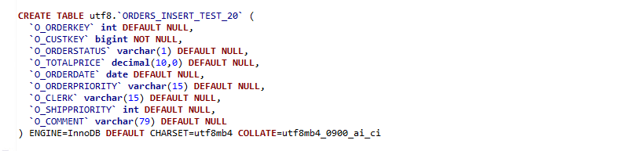
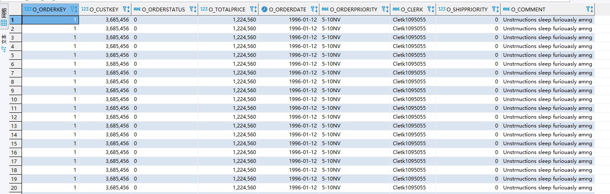

## insert   反向

（10w条数据， 一个insert一个事务，也就是有20w个record）

### 采集性能

| 从源库采集到数据的时间 |
| ---------------------- |
| 15332                  |
| 16107                  |
| 13436                  |
| 15432                  |
| 15651                  |
| 17933                  |
| 14856                  |
| 13479                  |
| 14478                  |
| 12633                  |

| 从源库采集到数据->发送至kafka的时间 |
| ----------------------------------- |
| 47192                               |
| 47175                               |
| 45792                               |
| 45874                               |
| 51790                               |
| 43119                               |
| 51553                               |
| 52509                               |

### 应用性能

| 从kafka 读数据 至 队列 |
| ---------------------- |
| 18150                  |
| 15603                  |
| 17135                  |
| 16201                  |
| 17553                  |
| 17972                  |
| 17887                  |
| 18292                  |
| 18825                  |
| 19372                  |

| 从kakfa 读数据至 目标库 |
| ----------------------- |
| 37174                   |
| 31273                   |
| 31869                   |
| 39320                   |
| 26943                   |
| 33268                   |

| 从队列至 目标库 |
| --------------- |
| 25511           |
| 21904           |
| 18767           |
| 28278           |
| 20512           |
| 36578           |

### 整体时间

| 整体时间(ms) |
| ------------ |
| 89875        |
| 46437        |
| 67846        |
| 72958        |
| 63266        |
| 65005        |
| 60297        |

---

## insert   正向

（10w条数据， 一个insert一个事务，也就是有20w个record）

##### 表结构

##### 表数据示例

### 采集性能

| 从源库采集到数据的时间 |
| ---------------------- |
| 12334                  |
| 12421                  |
| 13094                  |
| 12821                  |
| 12591                  |
| 14700                  |
| 14190                  |
| 11275                  |
| 9735                   |
| 13464                  |

| 从源库采集到数据的时间 | 数据序列化开始到完成 |
| ---------------------- | -------------------- |
| 16240                  | 16669                |
| 15983                  | 18283                |
| 18985                  | 19988                |
| 29346                  | 30012                |
| 12405                  | 12861                |
| 10982                  | 11381                |

| 单独序列化10w行（20wRecord） |
| ---------------------------- |
| 7422                         |
| 7283                         |
| 11849                        |
| 9191                         |
| 5409                         |
| 7257                         |
| 5828                         |

| 从源库采集到数据->发送至kafka的时间（注释掉发送到kafka和更新scn） |
| ------------------------------------------------------------ |
| 14718                                                        |
| 16536                                                        |
| 13316                                                        |
| 16417                                                        |
| 16819                                                        |
| 12985                                                        |
| 12164                                                        |
| 6242                                                         |
| 10920                                                        |
| 11073                                                        |

| 从源库采集到数据->发送至kafka的时间 |
| ----------------------------------- |
| 56296                               |
| 57496                               |
| 58934                               |
| 58611                               |

| 从源库采集到数据->发送至kafka的时间(注释掉发送到kafka) |
| ------------------------------------------------------ |
| 35674                                                  |
| 30498                                                  |
| 32384                                                  |
| 39888                                                  |
| 36417                                                  |
| 36374                                                  |

| 从源库采集到数据->发送至kafka的时间(注释掉更新scn) |
| -------------------------------------------------- |
| 20096                                              |
| 23295                                              |
| 16289                                              |
| 20808                                              |
| 18157                                              |

| 从源库采集到数据->发送至kafka的时间(send_batch_size加倍) |
| -------------------------------------------------------- |
| 31322                                                    |
| 32015                                                    |
| 30600                                                    |
| 28416                                                    |
| 35843                                                    |

| 从源库采集到数据->发送至kafka的时间(update新开线程) |
| --------------------------------------------------- |
| 21230                                               |
| 32895                                               |
| 30389                                               |
| 23927                                               |
| 21446                                               |

### 应用性能

| 从kafka 读数据 至 队列 |
| ---------------------- |
| 19007                  |
| 16198                  |
| 16982                  |
| 15495                  |
| 16260                  |
| 16467                  |
| 16176                  |
| 15898                  |
| 16729                  |

| 从kakfa 读数据至 目标库 |
| ----------------------- |
| 41645                   |
| 31216                   |
| 31906                   |
| 32892                   |
| 33292                   |
| 27555                   |
| 33782                   |
| 34457                   |
| 34109                   |

| 从队列至 目标库 |
| --------------- |
| 24444           |
| 25038           |
| 26243           |
| 25809           |
| 22181           |
| 22115           |

### 整体时间

| 整体时间(ms) |
| ------------ |
| 110304       |
| 258744       |
| 92979        |
| 91214        |
| 103524       |
| 67950        |
| 96668        |

