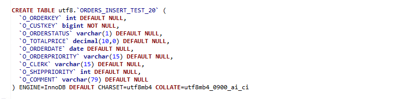
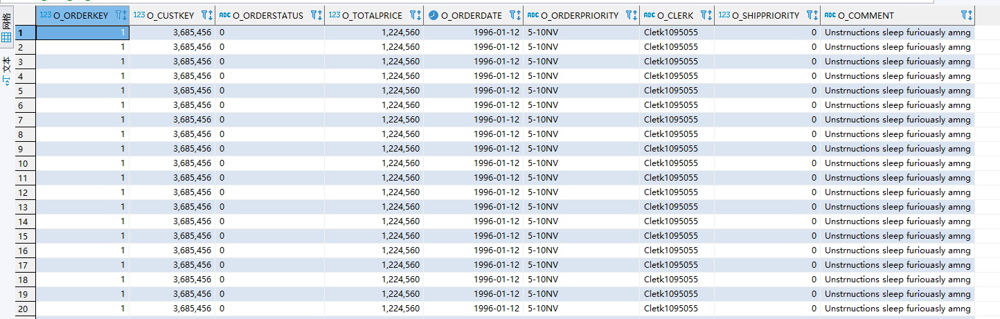
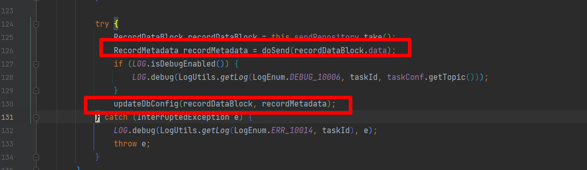
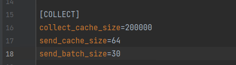
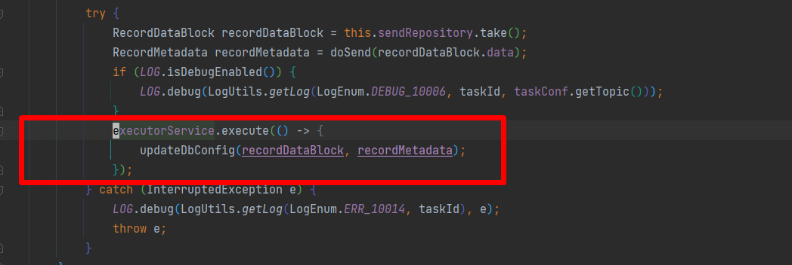

### insert   正向

（10w条数据， 一个insert一个事务，也就是有20w个record）

##### 表结构

##### 表数据示例

### 采集性能

从源数据库采集到第一条数据到第10w条数据的时间

| 从源库采集到数据的时间 |
| ---------------------- |
| 12334                  |
| 12421                  |
| 13094                  |
| 12821                  |
| 12591                  |
| 14700                  |
| 14190                  |
| 11275                  |
| 9735                   |
| 13464                  |

两条线程一起启动，一边读一边序列化

| 从源库采集到数据的时间 | 数据序列化开始到完成 |
| ---------------------- | -------------------- |
| 16240                  | 16669                |
| 15983                  | 18283                |
| 18985                  | 19988                |
| 29346                  | 30012                |
| 12405                  | 12861                |
| 10982                  | 11381                |

先从源库读取10w条数据放到阻塞队列，等待数据全部放到阻塞队列后， 序列化线程开始从阻塞队列读取数据进行序列化

| 单独序列化10w行（20wRecord） |
| ---------------------------- |
| 7422                         |
| 7283                         |
| 11849                        |
| 9191                         |
| 5409                         |
| 7257                         |
| 5828                         |

从读取到第一天数据到所有数据发送到kafka的时间

| 从源库采集到数据->发送至kafka的时间 |
| ----------------------------------- |
| 56296                               |
| 57496                               |
| 58934                               |
| 58611                               |

由上面的测试数据出发，经过排查发现性能瓶颈在下面标记代码处。

**于是增加下面的测试环节**

| 从源库采集到数据->发送至kafka的时间（注释掉发送到kafka和更新scn） |
| ------------------------------------------------------------ |
| 14718                                                        |
| 16536                                                        |
| 13316                                                        |
| 16417                                                        |
| 16819                                                        |
| 12985                                                        |
| 12164                                                        |
| 6242                                                         |
| 10920                                                        |
| 11073                                                        |

| 从源库采集到数据->发送至kafka的时间(注释掉发送到kafka) |
| ------------------------------------------------------ |
| 35674                                                  |
| 30498                                                  |
| 32384                                                  |
| 39888                                                  |
| 36417                                                  |
| 36374                                                  |

| 从源库采集到数据->发送至kafka的时间(注释掉更新scn) |
| -------------------------------------------------- |
| 20096                                              |
| 23295                                              |
| 16289                                              |
| 20808                                              |
| 18157                                              |

从上面的测试结果，想出下面两种提升性能的办法

1、send_batch_size加倍， 30  --> 60

2、把update这个过程放到另一个线程里面去

下面是对应方法的测试数据

| 从源库采集到数据->发送至kafka的时间(send_batch_size加倍) |
| -------------------------------------------------------- |
| 31322                                                    |
| 32015                                                    |
| 30600                                                    |
| 28416                                                    |
| 35843                                                    |

| 从源库采集到数据->发送至kafka的时间(update新开线程) |
| --------------------------------------------------- |
| 21230                                               |
| 32895                                               |
| 30389                                               |
| 23927                                               |
| 21446                                               |

后面发现数据已经发送到kafka了，但是updatescn到数据库的线程还需要等待十来秒才完成，这种情况下如果不是重新拉起作业其实没有什么应该，十来秒后就同步过去了，即使重新拉起作业也没有什么影响，kafka里面会有一小段重复数据，但是这个重复数据在应用端会被过滤。

总的来看 ，还是应该尽量减少update的次数，两种方法可以一起用。

下面附上两种方法一起用的测试数据

| 从源库采集到数据->发送至kafka的时间 | update完成时间 |
| ----------------------------------- | -------------- |
| 16721                               | 30861          |
| 19323                               | 26954          |
| 19458                               | 28475          |
| 13317                               | 33132          |
| 17120                               | 24954          |

**结论**：

1、把send_batch_size加倍后采集10w 数据由原来需要58秒 提升到 30多秒，采集性能提升了将近一倍，

2、把update新开一个线程后采集10w 数据由原来需要58秒 提升到 20多秒，采集性能提升了将近两倍，

3、两个方法一起使用，10w 数据由原来需要58秒 提升到 10多秒，采集性能提升了四到五倍

ps：增量服务是在本地运行的，跑服务的时候CPU100%，感觉电脑性能上去了采集性能应该可以提升到差不多1w一秒